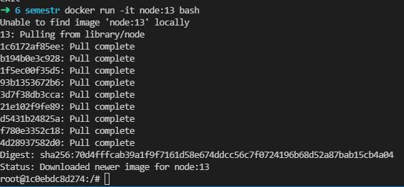
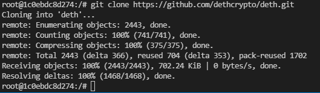
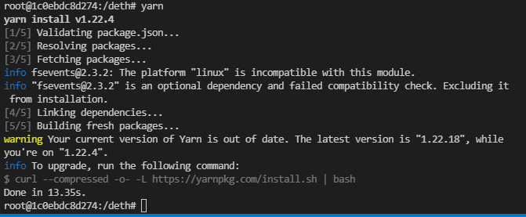
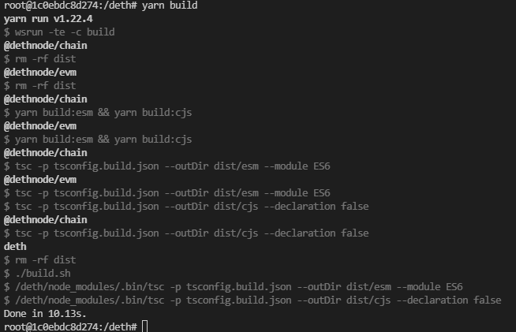
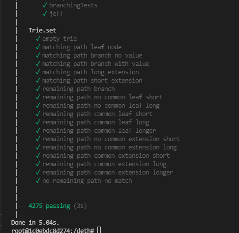
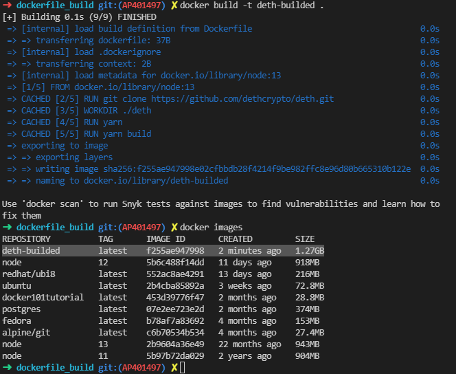
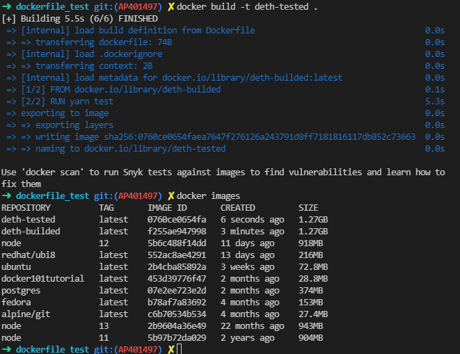
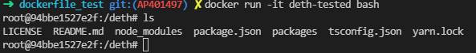
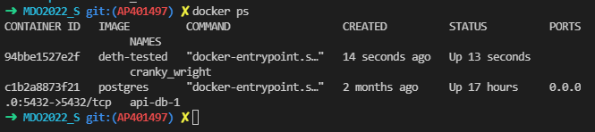
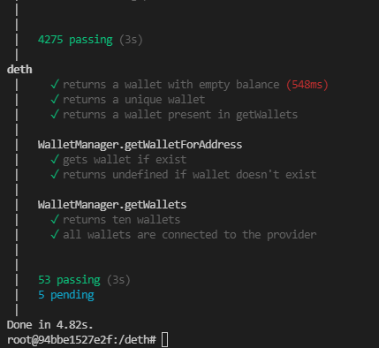

# Lab 3 - Sprawozdanie
## Adrian Pabiniak

## 1. Wykonanie buildu i test wewnątrz wybranego konternera bazowego.

 ### Uruchomienie kontenera
  > docker run -it node:13 bash

  

 ### Klonowanie repozytorium
  > git clone https://github.com/dethcrypto/deth.git

  

 ### Wejście do sklonowanego projektu
  > cd deth

 ### Instalacja dependency
  > yarn
 
 
 
 ### Buildowanie aplikacji
  > yarn build
 
  
 
 ### Testowanie aplikacji
  > yarn test

  
 
## 2. Dockerfile
 
 ### Utworzenie dockerfile, który będzie buildował aplikację
  ```
  FROM node:13
  
  RUN git clone https://github.com/dethcrypto/deth.git
  WORKDIR ./deth
  RUN yarn
  RUN yarn build
  
  ```

 ### Zbudowanie obrazu

  

 ### Utworzenie dockerfile, który będzie testował aplikację
  ```
  FROM deth-builded

  RUN yarn test
  
  ```

 ### Zbudowanie obrazu

  

## 3. Wykazanie prawidłowości działania kontenera

 ### Uruchomienie kontenera w trybie interaktywnym

  

 ### Wykazanie istnienia aktywnego kontenera

  

 ### Uruchomienie testów w aktywnym kontenerze
 
  

 


