# Lab 3 - Sprawozdanie
## Adrian Pabiniak

## 1. Zachowywanie stanu

 ### Przygotuj woluminy wejściowy i wyjściowy, o dowolnych nazwach, i podłącz je do kontenera bazowego, z którego rozpoczynano poprzednio pracę
  > docker volume create

  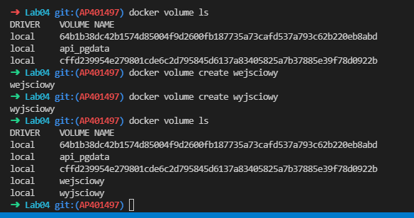

 ### Uruchom kontener
  > docker run -it -v "wejsciowy:/wejsciowy" -v "wyjsciowy:/wyjsciowy" node:13 bash

  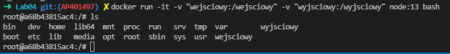

 ### Sklonuj repozytorium na wolumin wejściowy
  
  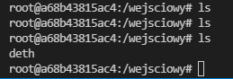

 ### Uruchom build w kontenerze
  > yarn build
 
 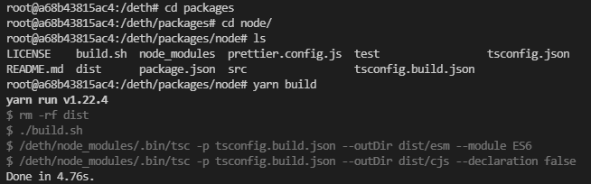
 
 ### Zapisz powstałe/zbudowane pliki na woluminie wyjściowym
  > cp -r packages/node/dist ../wyjsciowy
 
  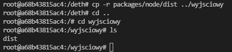

 
## 2. Eksponowanie portu
 
 ### Uruchom wewnątrz kontenera serwer iperf (iperf3)
  Uruchomienie kontenera

  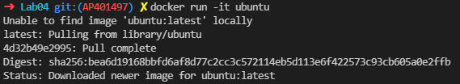

  Aktualizacja
  
  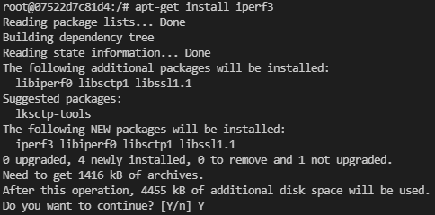

  Instalacja iperf i net-tools
  
  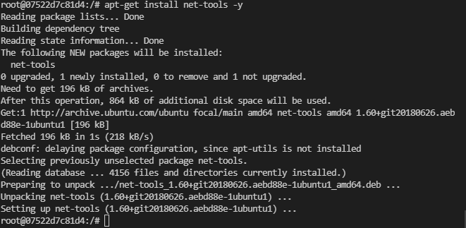

  Uruchomienie serwera
  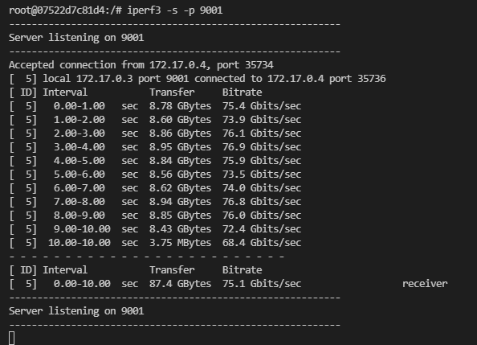

 ### Połącz się z nim z drugiego kontenera, zbadaj ruch

  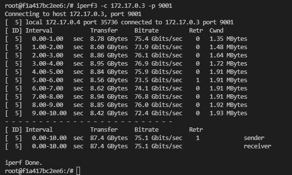

 ### Połącz się spoza kontenera z hosta 

  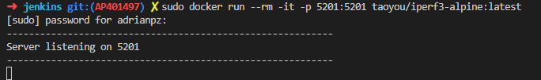

  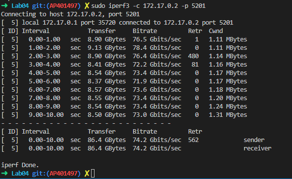

 ### Połącz się spoza kontenera z spoza hosta

  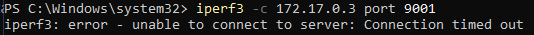

  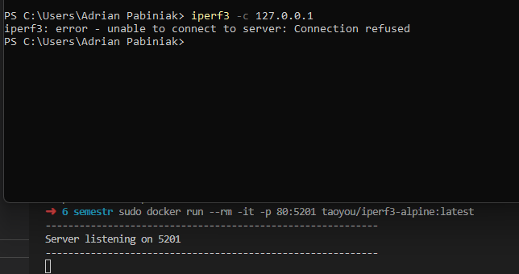

 ### Przedstaw przepustowość komunikacji 
  Najszybsza komunikacja odbywała się między hostem a kontenerem, 
  natomiast wolniejsza pomiędzy kontenerami

## 3. Instancja Jenkins

 ### Przeprowadź instalację skonteneryzowanej instancji Jenkinsa z pomocnikiem DIND

  Utworzenie sieci dla Jenkinsa oraz uruchomienie kontenera

  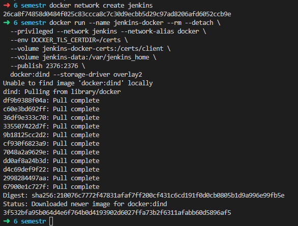

  Zbudowanie obrazu z dockerfile

  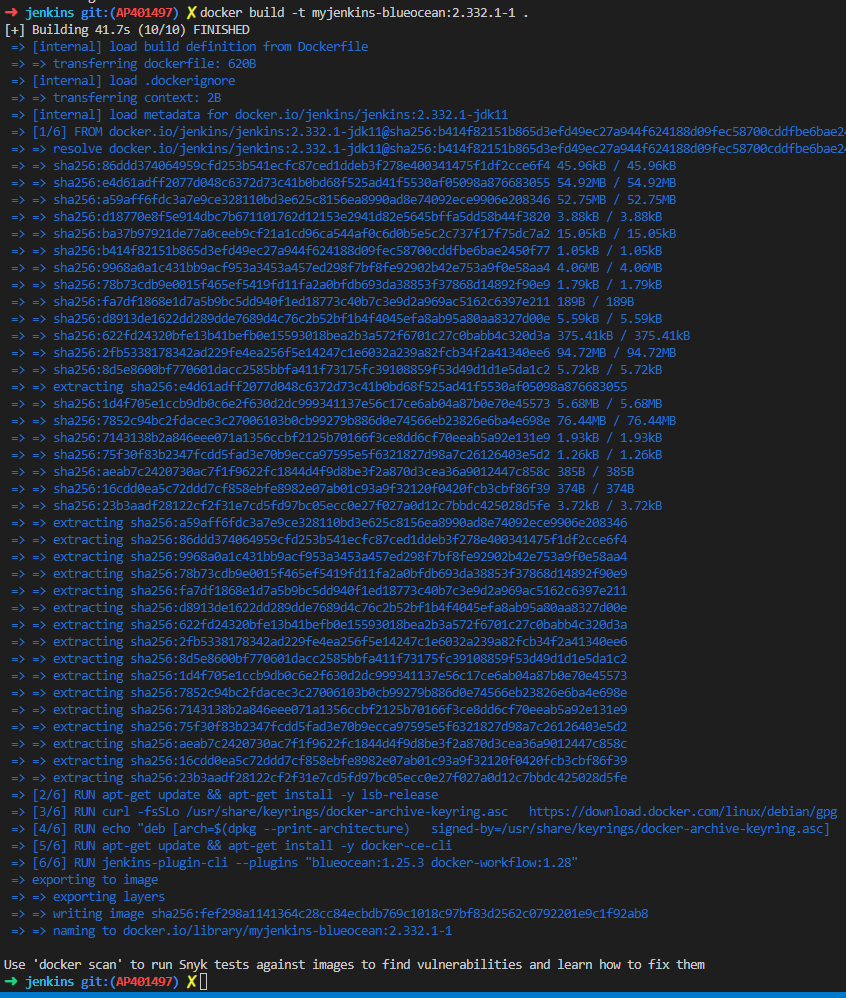

  Uruchomienie kontenera z utworzonego obrazu

  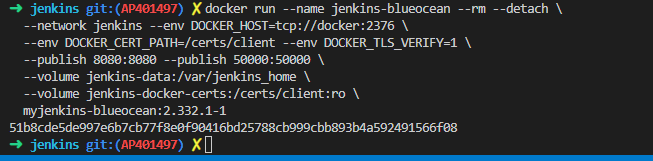

 ### Zainicjalizuj instację, wykaż działające kontenery, pokaż ekran logowania

  Zczytanie hasła z logów

  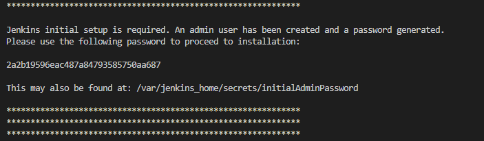

  Odblokowanie Jenkinsa

  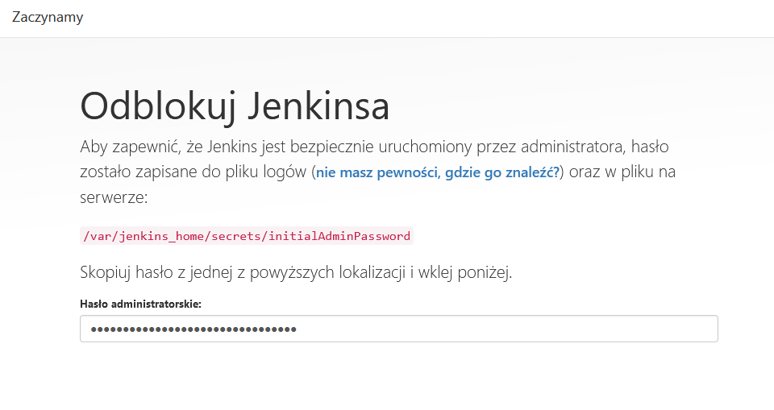

  Instalacja wtyczek

  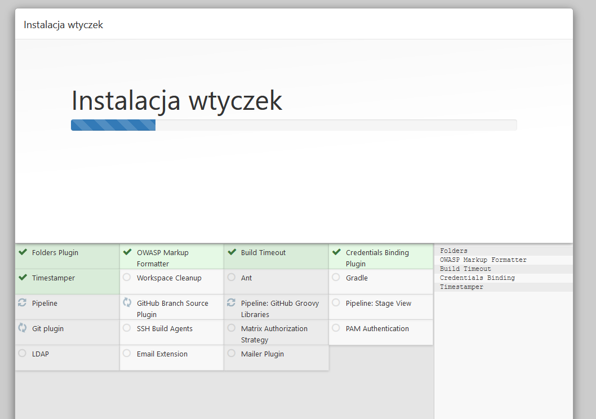

  Ekran powitalny Jenkinsa

  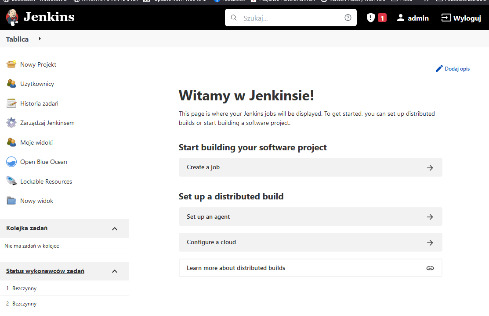

  Wykazanie działających kontenerów

  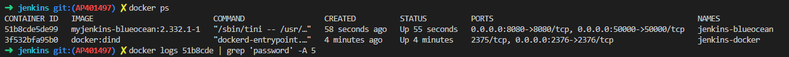

 

