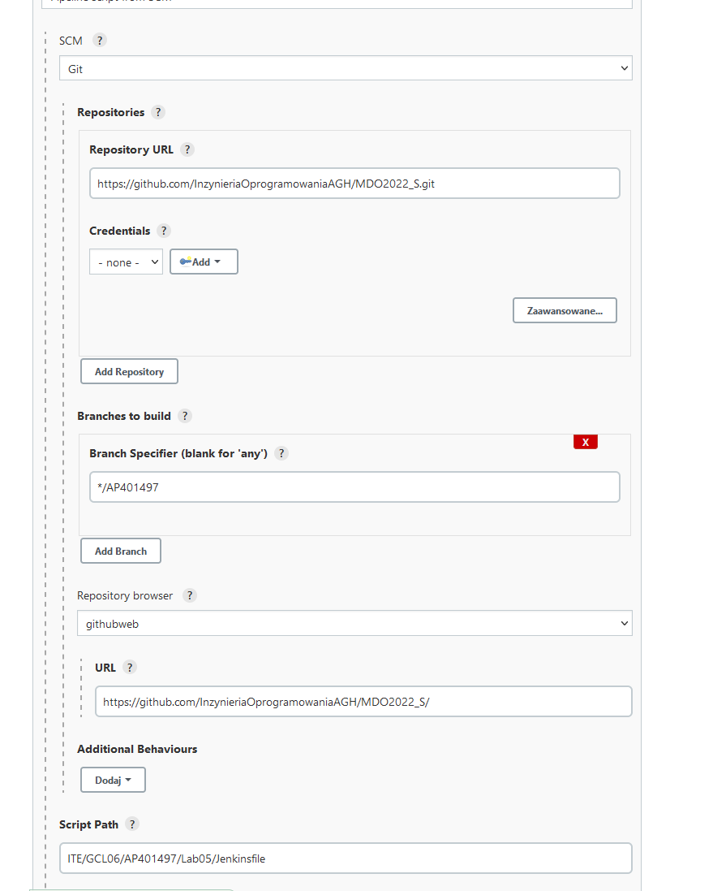
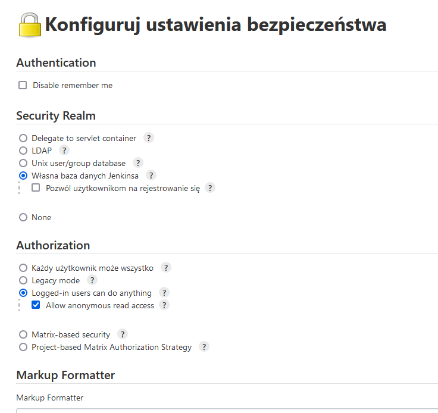
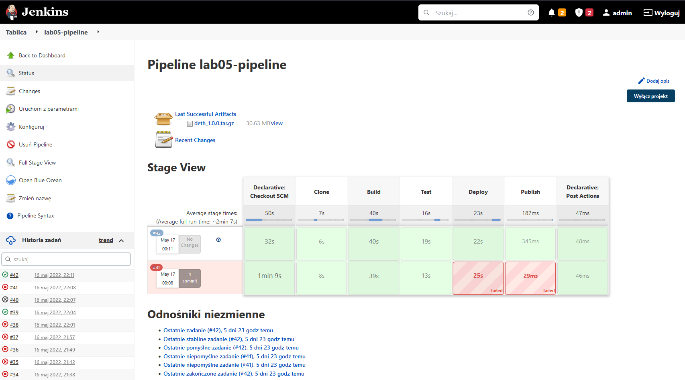
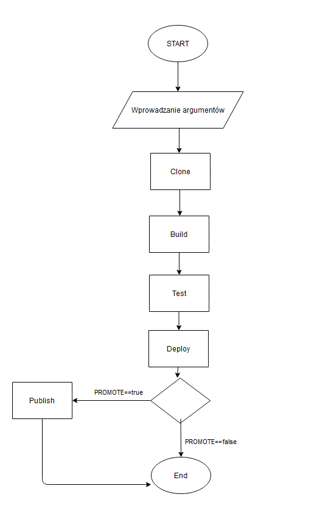
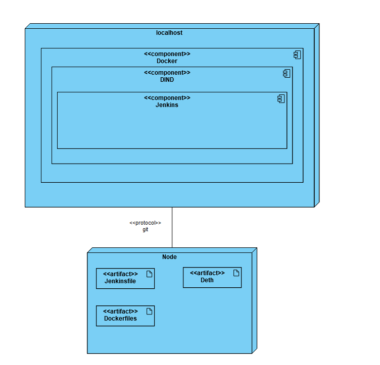

# Lab05

## Cel

Stworzenie środowiska do autmatyzacji procesu i wdrażania oprogramowania za pomocą Jenkinsa.

## Streszczenie

W projekcie stworzony został pipeline przy użyciu serwera Jenkins uruchomionego lokalnie za pomocą dockera. Efektem projektu jest z klonowanie repozytorium z GitHuba i zbudowanie aplikacji. W kolejnych krokach następują testy. Jeżeli wszystko przebiegnie pomyślnie aplikacja jest deployowana oraz publikowana.
Projekt zawiera plik jenkinsfile oraz cztery dockerfile.

## Wykonanie

1.  Przęd rozpoczęciem pracy z jenkinsem należało najpierw odpowiednio skonfigurować nasze środowisko pracy. W tym celu podjęto nastepujące kroki:

    - Podłączenie repozytorium oraz określenie lokalizacji jenkinsfile:
        Konfiguruj -> Advanced Project Options -> Pipeline script from SCM
        

    - Ustawienie dostępu do artefaktu dla osoby niezalogowanej:
        Zarządzaj Jenkinsem -> Konfiguruj ustawienia bezpieczeństwa -> Authorization -> Allow anonymous read access
        

2.  Stworzenie parametrów, określanych przy budowanie naszego pipeline:
    
    Korzystamy z dinda, więc nie ustalamy wymagań dla agenta. Następnie konfigurujemy prametry wejściowego, które będzie można określić przy uruchomianiu pipeline.
    Nasze parametry to BRANCH pozwalające wybrać z jakiej gałęzi zostaną pobrane pliki projektu. VERSION pozwalający określić wersję naszego builda. Domyślnie 1.0.0 jeżeli artefakt jest tworzony pierwszy raz. Oraz parametr PROMOTE pozwalający określić czy artefakt ma zostać opublikowany.

        pipeline {
            agent any
            parameters {
                string(name: 'BRANCH', defaultValue: 'master', description: '')
                string(name: 'VERSION', defaultValue: '1.0.0', description: '')
                booleanParam(name: 'PROMOTE', defaultValue: false, description: '')
                }
    

3.  Clone

    Początkowo czyścimy środowisko poprzez usunięcie starych kontenerów i wolumenów. Następnie tworzony jest wolumen, który będzie przechowywał sklonowane repozytorium oraz wolumen na którym przechowywany będzie build aplikacji. Kolejny etap to stworzenie obrazu za pomocą dockerfile, który sklonuje nam nasz projekt na przypisany wolumen. Na końcu uruchamiany jest wcześniej zbuilodwany obraz z wartością BRANCH, którą posiadamy z parametrów.

    Jenkinsfile:

        stage("Clone"){
            steps {
            sh 'docker container prune -f'
            sh 'docker volume prune -f'
            sh 'docker volume  create --name repo_vol'
            sh 'docker volume  create --name build_vol'
            sh "docker build -t dethclone . -f ITE/GCL06/AP401497/Lab05/Clone/Dockerfile"
            sh "docker run -e BRANCH=${BRANCH} -v repo_vol:/deth dethclone"
                }
            }

    Dockerfile:

        FROM node:13
        CMD git clone --branch ${BRANCH} https://github.com/dethcrypto/deth.git

    Użyty obraz to node w wersji 13. Korzystając z tego obrazu nie będzie potrzebne w późniejszym etapie pobieranie nowego obrazu, gdyż przy tej wersji będzie buildowana i testowana aplikacja ze względu na aplikację napisaną w node. Obraz posiada również już zainstalowane narzędzie Git.

4.  Build

    W tym kroku będziemy budować aplikację. W tym celu korzystając z dockerfile tworzymy obraz, który to zrobi.

        FROM node:13

        WORKDIR ./deth
        CMD sh -c "yarn && yarn build && cd .. && cp -r deth public && tar -czf deth.tar.gz /deth && cp deth.tar.gz /public"

    Ponownie używamy node w wersji 13 a następnie określamy katalog roboczy. Aktualizujemy yarn projektu. Następnie buildujemy aplikacje i tworzymy artefakt który umieszczany jest w katalogu /public.

        stage("Build") {
            steps {
                sh 'docker build -t dethbuild . -f ITE/GCL06/AP401497/Lab05/Build/Dockerfile'
                sh 'docker run -v repo_vol:/deth -v ${PWD}:/public dethbuild'            
            }
        }

5.  Test

    W tym stagu ponownie za pomocą dockerfile testujemy wcześniej zbuildowaną aplikację. Jako obraz używamy wcześniej stworzonego obrazu przekazując jego nazwę przez argument "--build-arg image=dethbuild". 

        stage("Test") {
            steps {
                sh 'docker build -t dethtest . -f ITE/GCL06/AP401497/Lab05/Test/Dockerfile --build-arg image=dethbuild'
                sh 'docker run  -v repo_vol:/deth dethtest'
            }
        }

    W kontenerze tworzymy nowy folder testing, kopiujemy do niego naszą już zbudowaną aplikację i uruchomiamy testy. Jeżeli wszystko przejdzie pomyślnie to przejdziemy do stagu Deploy.

        ARG image
        FROM $image
        CMD sh -c "cd .. && mkdir testing && cp -r /deth /testing && cd testing/deth && yarn test"

6.  Deploy

    W tym etapie zamiast już testować aplikacje uruchamiamy ją już w wyjściowym środowisku. 
        
        stage("Deploy") {
                    steps {
                        sh 'docker build -t deploydeth . -f ITE/GCL06/AP401497/Lab05/Deploy/Dockerfile'
                        sh 'docker run  -v repo_vol:/deth  deploydeth'
                    }
                }

    Ze względu na to, że moja aplikacja to serwer i uruchomienie jej nigdy by się nie zakończyło skorzystałem z wcześniej przygotowanej przez aplikację komendy yarn prepublishOnly, która rozpocznie nasz prawidłowy Deploy.

        FROM node:13

        WORKDIR deth/packages/node
        CMD sh -c "yarn prepublishOnly"

7.  Publish

    Jako serwer dla naszego artefakt posłuży nam Jenkins. W tym celu podczas stage publish najpierw sprawdzamy warunek czy artykuł w ogóle powinien zostać opublikowany. Jeżeli tak to ustawiamy wersję naszej aplikacji a następnie za pomocą archiveArtifacts archiwizujemy nasz artefakt. 
    
    Wersjonowanie pozwoli nam zapobiec nadpisaniu naszego archiwum. A warunek PROMOTE pozwoli nam na uniknięcie sytuacji gdzie przypadkowo wystawiamy nowy artefakt

        stage("Publish") {
            when {
                    environment name: 'PROMOTE', value: "true"
                }
                steps {
                    sh "mv deth.tar.gz deth_${VERSION}.tar.gz"
                    archiveArtifacts "deth_${VERSION}.tar.gz"
                }
            }

8.  Uruchomienie pipelina

    Podczas uruchominenia naszego pipeline możemy przeglądać logi poprzez wybranie naszego buildu a następnie Console Output. W głównym oknie projektu możemy zobaczyć również poprzednie próby buildu oraz dostępne artefakty

    

9. Diagram Aktywności

    

10. Diagram Wdrożenia

    