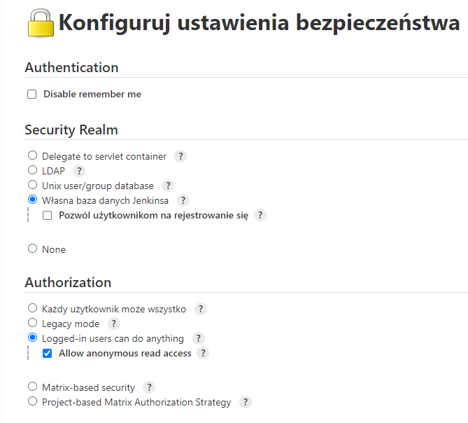
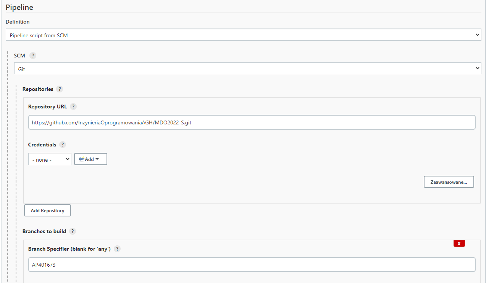
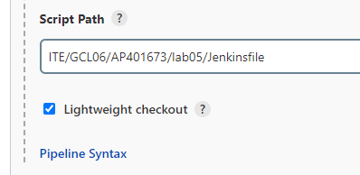
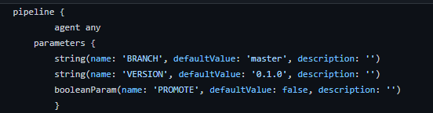
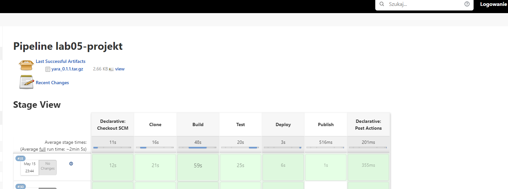

# Sprawozdanie projekt

## Cel

Celem projektu było stworzenie pipeline’u który pozwala na automatyczne budowanie projektu, następnie testowanie i wdrażanie, a na końcu publikowanie programu yara służącego do pomocy w identyfikowaniu klasyfikowaniu złośliwego oprogramowania.

## Streszczenie

W pipelinie wykorzystano 4 dockerfile na bazie ubuntu w wersji bionic. Każdy z dockerfile odpowiadał kolejnemu kroku działania. W pierwszym korku obraz klonuje repozytorium i umieszcza je na wejściowym woluminie. W następnym kroku następuje build w którym program   jest budowany zgodnie z [dokumentacją](https://yara.readthedocs.io/en/stable/gettingstarted.html#compiling-and-installing-yara)        programu i zostaje zapisany na woluminie wyjściowym. Następnie uruchamiane są testy które znajdują się w pobranym repozytorium. Wdrożenie przebiega poprzez zainstalowanie programu, w kontenerze z minimalnymi dependencjami, utworzenie prostej reguły i jej uruchomienie na samej sobie co oznacza, że program działa. Ostatni krok publikacji polega na spakowaniu programu jako paczki tar.gz i oznaczeniu jej wersją i uzyskanie artefaktu.

**Inne repozytorium**
Podczas tworzeniu pipeline'u zaobserwowano pewne problemy podczas korzystania z repozytorium przedmiotowego. Dla kroku test polecenie make check przestawało działać, a w sforkowanym repozytorium działało bez zarzutu, dlatego pipepline jest podpięty do sforkowanego repozytorium z programem w którym dodano katalog z jenkinsfilem oraz dockerfilami. Link do tego repozytorium [tutaj](https://github.com/kolols/yara).

## Wykonanie

1. Konfiguracja Jenkinsa
 Pierwszym wykonanym krokiem było odpowiednie skonfigurowanie  Jenkinsa. 
 W ustawieniach Zarządzaj Jenkinsem > Konfiguruj ustawienia bezpieczeństwa zaznaczono dostęp do odczytu dla osób niezalogowanych aby mogły pobrać utworzono artefakt

Utworzono projekt i podpięto go do naszego repozytorium tak aby Jenkins pracował na Jenkisfile umieszczonym w osobistym branchu. W tym celu w definicji wybrano Pipeline script from SCM, w SCM wybrano Git. Dalej podano link do naszego repozytorium, jako branch ustawiono na własny oraz na końcu podano ścieżkę do Jenkinsfile.

2. Parametry 
Dla działanie pipeline'u ustawiono parę parametrów. Ustawiono parametr Version aby móc nadawać tworzonemu artefaktowi wersje. Kolejnym parametrem jest parametr Promote gdy jest on ustawiony na true pipeline wykona krok Publish w którym utworzy nową wersje artefaktu w przeciwnym przypadku pominie ten krok. Dodatkowo ustawiono parametr branch który pozwala na klonowanie z wybranego brancha.

3.  Klonowanie repozytorium
Stage clone. 

W tym kroku najpierw usuwane są niewykorzystywane wolumin i kontenery, które mogły zostać po poprzednim uruchomieniu. Następnie jest tworzony wolumin wejściowy. Zostaje zbudowany obraz clone_yara, posiada on zainstalowanego gita aby móc pobrać repozytorium. Po zbudowaniu zostaje on uruchomiony wraz z zamontowaniem woluminu wejściowego, w wyniku czego no podany wolumin zostaje pobrane repozytorium.

     stage("Clone"){    
    steps {
    sh 'docker container prune -f'    
    sh 'docker volume prune -f'    
    sh 'docker volume create --name repo_vol'    
    sh "docker build -t clone_yara . -f ITE/GCL06/AP401673/lab05/Dockerfile_clone"    
    sh "docker run -e BRANCH=${BRANCH} -v repo_vol:/yara clone_yara"    
	    }    
    }
    
 Zawartość dockerfile klonującego posiada on doinstalowanego gita aby móc pobrać repozytorium.

    FROM ubuntu:bionic    
    RUN apt-get update && apt-get install -y git    
    CMD git clone --branch ${BRANCH} https://github.com/VirusTotal/yara.git

4. Budowanie projektu
Stage build
W tym kroku korzystam z obrazu który posiada wszystkie potrzebne dependencje, obraz ten jest najpierw budowany a następnie uruchamiany z podłączonymi woluminami wejściowym i wyjściowym. W wyniku uruchomienia obrazu program się buduje i jest kopiowany na wolumin wyjściowy.

       stage("Build") {    
        steps {    
        sh 'docker build -t build_yara . -f ITE/GCL06/AP401673/lab05/Dockerfile_build'    
        sh 'docker run -v repo_vol:/yara -v ${PWD}:/public build_yara'    
	        }
        }
     Dockerfile posiada sporo doinstalowanych dependencji jednak są one wymagane przez twórcę oprogramowania.
 

        FROM ubuntu:bionic  
        RUN apt-get update && apt-get install -y \
        automake \
        libtool \
        make \
        gcc \
        pkg-config \
        git
        WORKDIR yara
        CMD sh -c "./bootstrap.sh && ./configure && make && cd .. && cp -r yara/. public"

5. Testowanie
Stage test
Aby przetestować zbudowany program używane są testy zawarte w repozytorium. Dlatego oparto obraz testów na obrazie builda aby posiadał takie same dependecje . Obraz ten zostaje zbudowane i uruchomionu w wyniku czego zostają uruchomione testy. Ponieważ testy tworzą dużo nowych plików najpierw kod jest kopiowany do nowo stworzonego folderu a dopiero następnie zostają one uruchomione.

        stage("Test") {
            steps {
            sh 'docker build -t test_yara . -f ITE/GCL06/AP401673/lab05/Dockerfile_test --build-arg image=build_yara'
            sh 'docker run -v repo_vol:/yara test_yara'
            }
	            }
	            
Dockefile dla testów

    ARG image
    FROM $image
    CMD sh -c "cd .. && mkdir testing && cp -r /yara /testing && cd testing/yara && make check"

6.  Wdrożenie
Stage Deploy
W tym kroku jest sprawdzane czy zbudowany kod można uruchomić. W tym celu stworzono nowy obraz który posiada zainstalowane tylko gcc oraz make, które są potrzebne aby móc poprawnie zainstalować program. Obraz ten jest budowany i uruchamiany z podpięciem woluminu wyjściowego. Uruchomiony kontener najpierw wykona polecenie make install w celu instalacji programu następnie zostają wykonane polecenie które naprawiają dostęp do pliku libyara. Błąd ten został opisany przez autora oprogramowani oraz podał on sposób na jego naprawę. Uruchomienie programu zostaje wykonane ponownie według opisu dokumentacji dla pierwszego uruchomienia. Przebiega ona na utworzeniu roli a następnie wykonania jej na samej sobie.

        stage("Deploy") {
            steps {
                sh 'docker build -t deploy_yara . -f ITE/GCL06/AP401673/lab05/Dockerfile_deploy'
                sh 'docker run -v ${PWD}:/yara deploy_yara'
	                }
                }
Zawartość pliku Dockerfile dla deploy

    FROM ubuntu:bionic RUN apt-get update && apt-get install -y \
     gcc \ 
     make 
     WORKDIR yara CMD sh -c "make install && echo "/usr/local/lib" >> /etc/ld.so.conf && ldconfig && echo rule dummy { condition: true } > my_first_rule && yara my_first_rule my_first_rule"

7. Publikacja
Stage publish

Ten etap jest opcjonalny, nawet gdy wszystkie inne kroki przebiegną poprawnie. Dzieje się tak ponieważ nie zawsze chcemy publikować artefakt a potrzebujemy sprawdzić wprowadzone zmiany.  Opcjonalność stage jest wprowadzana za pomocą polecenia when i parametru PROMOTE.  W tym kroku następuje spakowanie uzyskanych plików w plik o rozszerzeniu tar.gz oraz nadanie mu wersji więc końcowy plik będzie wyglądał przykładowo yara_0.1.0.tar.gz.

    stage("Publish") {
    when {
    environment name: 'PROMOTE', value: "true"
    }
    steps {
    sh "tar -czvf yara_${VERSION}.tar.gz yara"
    archiveArtifacts "yara_${VERSION}.tar.gz"
	    }
    }
8. Działanie
Zdjęcie przedstawia pomyślnie uruchomiony pipeline wraz z utworzonym artefaktem dostępnym dla osoby która nie jest zalogowana.

9.  Diagram aktywności

 
