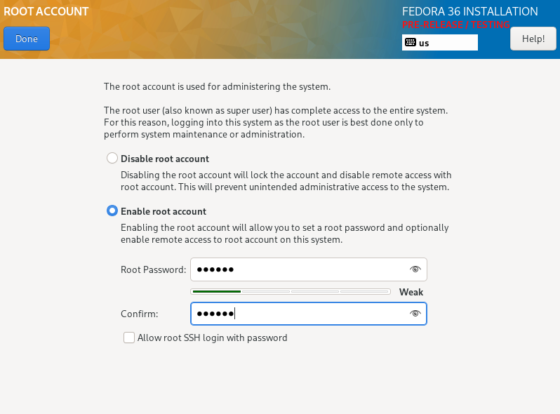

# Sprawozdanie lab 09

## Instalacja fedory

Na początku pobrano ISO fedory, a następnie dokonano jej instalacji w virtual box.

Screeny przedstawiają proces instalacji fedory

Zalogowanie po udanej instalacji

Następnie dokonano instalacji drugiej fedory która ma za zadanie służyć jako serwer

Następnie podłączono filezile do fedory

Zainstalowano serwer http

Uruchomiony serwer 

Umieszczono artefakt w serwerze

Następnie pobrano plik odpowiedzi i umieszczono go na repozytorium i próbowano dokonać instalacji tekstowej za pomocą pliku anaconda-ks.cfg niestety maszyna wirtualna nie jest wstanie  pobrać pliku z githuba, mimo wielu różnych prób naprawy tego stanu rzeczy nie udało się rozwiązać tego problemu.
komenda za pomocą wywoływano instalację

    inst.ks=https://raw.githubusercontent.com/InzynieriaOprogramowaniaAGH/MDO2022_S/AP401673/ITE/GCL06/AP401673/lab09/anaconda-ks.cfg

Screeny nie udanej instalacji 

