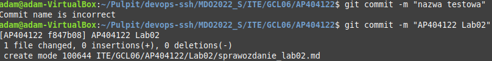
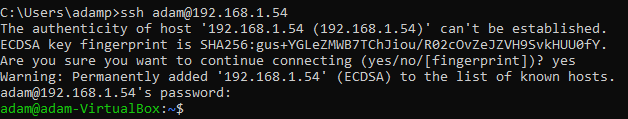
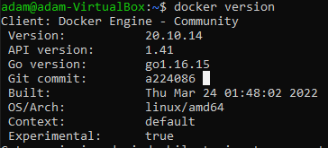
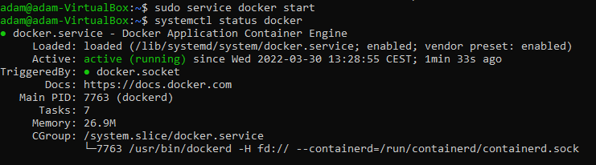
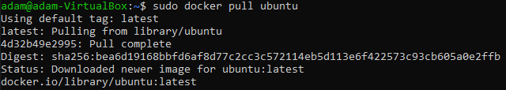
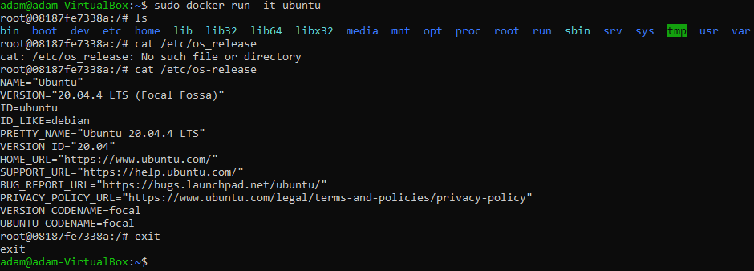

* Przygotuj git hook
```bash
#!/bin/bash

INPUT="$(cat $1)"

if [[ $INPUT != *"AP404122"* ]];
then
	echo "Commit name is incorrect"
	exit 1
fi

if [[ "$INPUT" != *"Lab02"* ]];
then
	echo "Lab number is incorrect"
	exit 1
fi
```
* Sprawdzenie dzialania hook'a

* Podłączenie się do maszyny wirtualnej za pomocą OpenSSH

* Docker został wcześniej zainstalowany. Pokazanie, że został poprawnie zainstalowany i działa.


* Pobranie obrazu Ubuntu\

* Uruchomienie obrazu Ubuntu i wyświetelnie jego wersji

* Założenie konta na DockerHub\
