### Dominik Mrówka, 21.03.2022, gr 06
## Sprawozdanie z lab02

 - Połączono się z maszyną wirtualną przez klienta ssh (sposób opisano w poprzednim sprawozdaniu)
 - Przy pomocy programu filezilla ściągnięto z maszyny wirtualnej plik commit-msg.sample i otwarto go przy pomocy VSCode na maszynie lokalniej (użyto pliku sample, aby nie edytować uprawnień pliku)
 - Napisano hook w pythonie sprawdzający czy temat (pierwsza linijka) commita to "DM401055", oraz czy w treści występuje numer laboratorium (tutaj '2').
 
 ```
#!/usr/bin/env python

import sys
import subprocess

def  main():
	with  open(sys.argv[1], "r") as  file:
		file_content = file.readlines()

		for lines in file_content:
			if lines.strip() == "# ------------------------ >8 ------------------------":
				break
			if lines[0] == '#':
				continue

		if(file_content[0]!= "DM401055\n"):
			print("commit title must be DM401055 \n")
			sys.exit(1)

  

		for line in file_content:
			if("2"  in line):
				print("succesfully commited \n")
				sys.exit(0)
	print("missing lab number \n")
	sys.exit(1)

if  __name__ =="__main__":
	main()
```

 - Sprawdzono działanie hook'a dla przykładowych commitów
 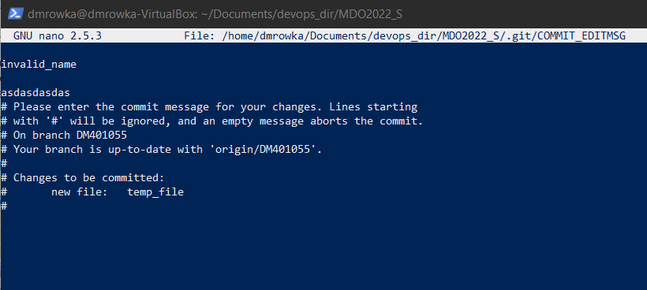
 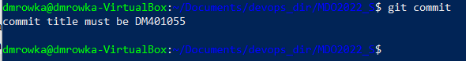
 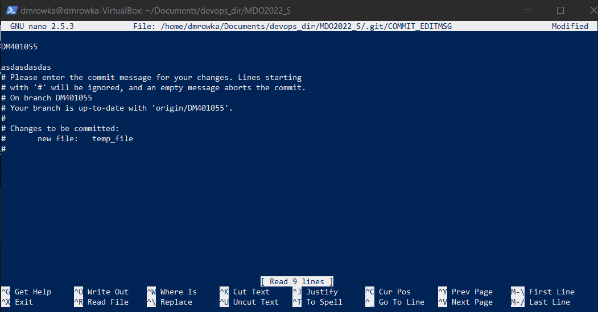
 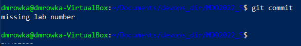
 
 - Po przetestowaniu poprawnego działania hook'a, odwrócono zmiany i scommitowano ponownie, aby stworzyć odpowiedni folder Lab02
 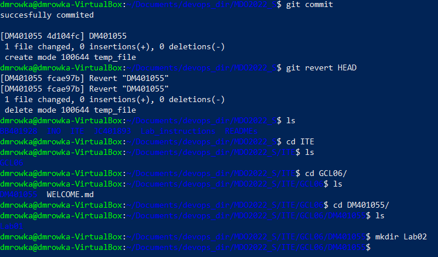
 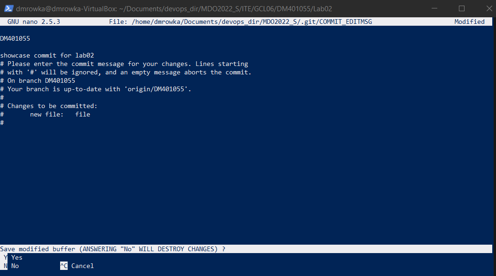
 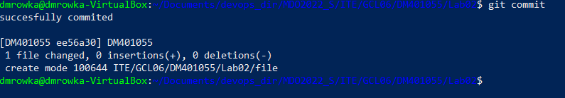
 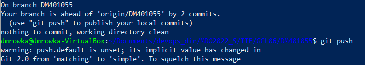
 - Zainstalowano Dockera z repozytorium, według tutoriala zawartego w dokumentacji
 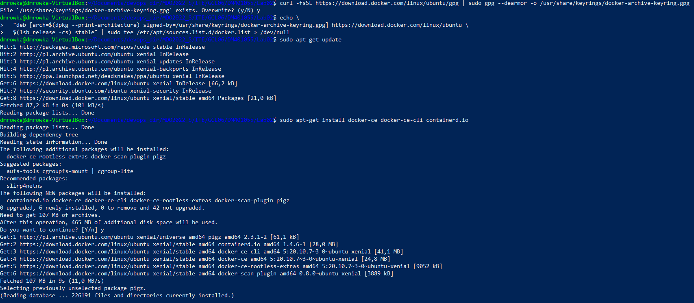
 - Przetestowano jego działanie
 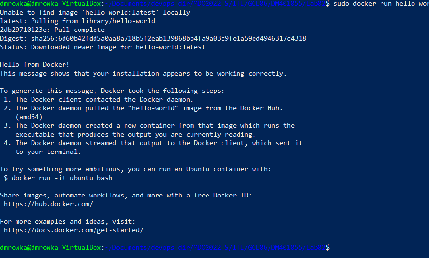
 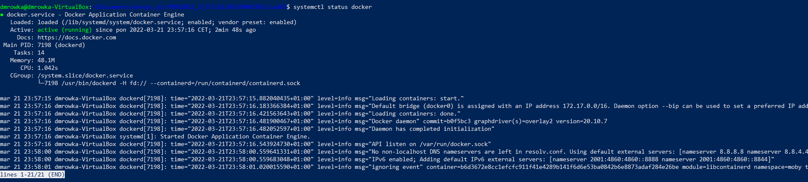
 - Pobrano obraz dystrybucji ubuntu i przetestowano jego działanie
 
 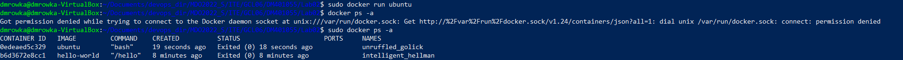
 - Założono konto na DockerHub
 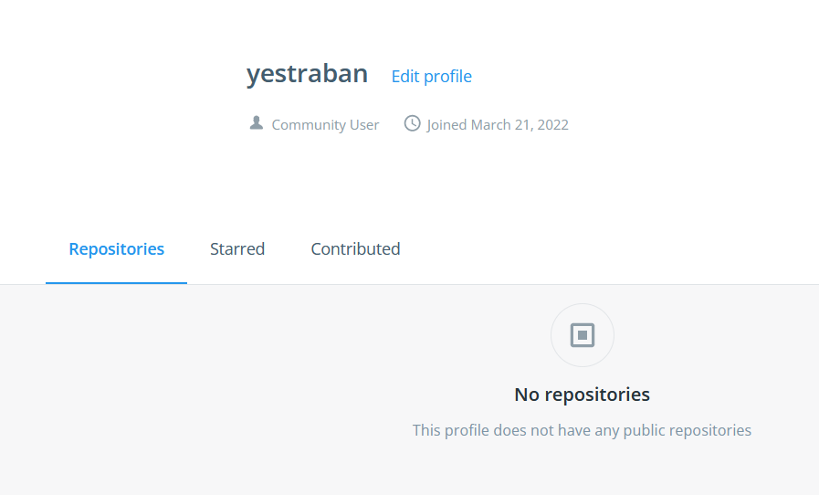