### Dominik Mrówka, 21.03.2022, gr 06
## Sprawozdanie z lab03

- Znaleziono repozytorium z aplikacją stworzoną przy pomocy JHipster o open-source'owej licencji (Apache 2.0) i z zestawem testów. Aplikacja ta potrzebuje do działania Node oraz Javy, muszą więc one zostać zainstalowane w kontenerze (https://github.com/jhipster/jhipster-sample-app)

- Sklonowano repozytorium przez ssh, zbudowano i przetestowano aplikację na maszynie wirtualnej. 

 
 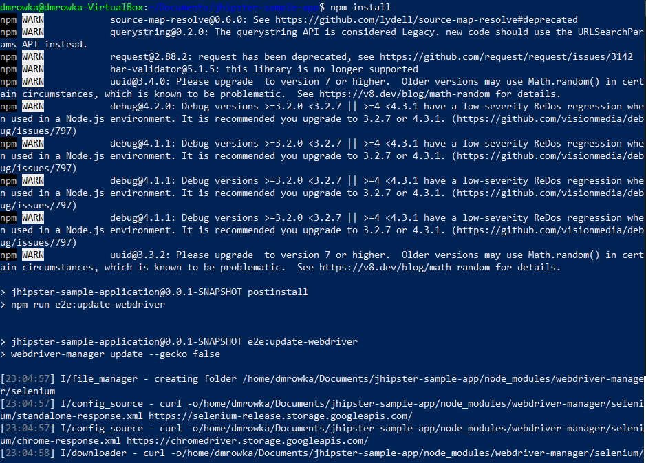
 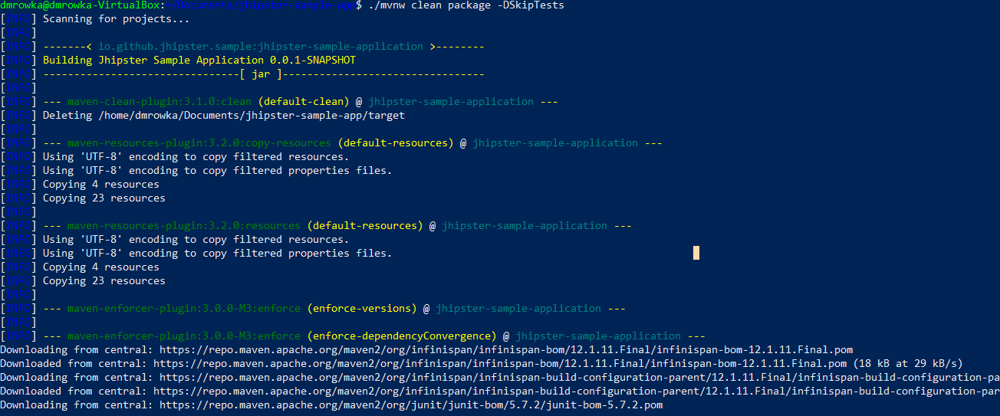
 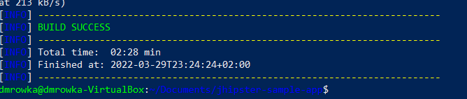
 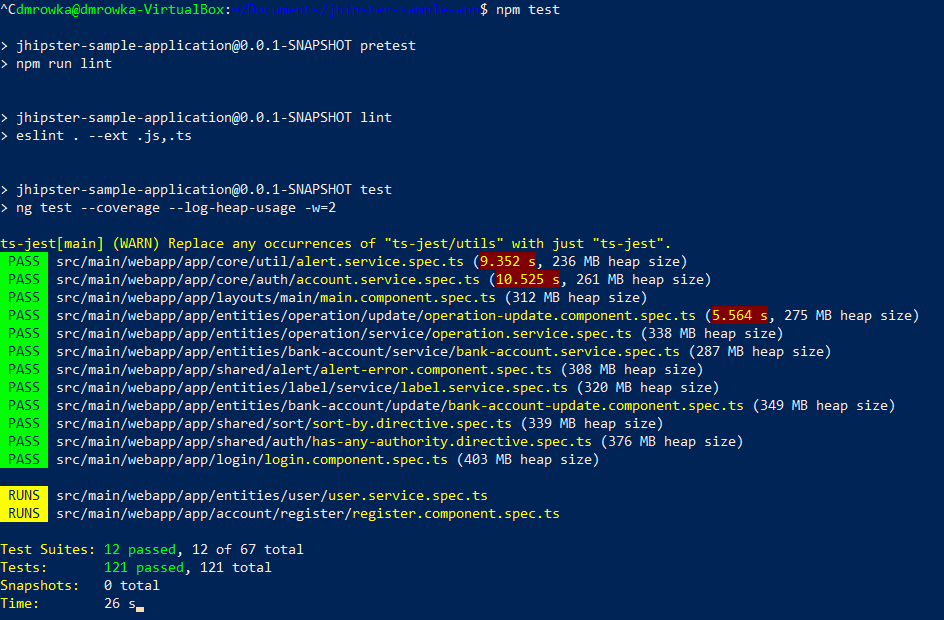
 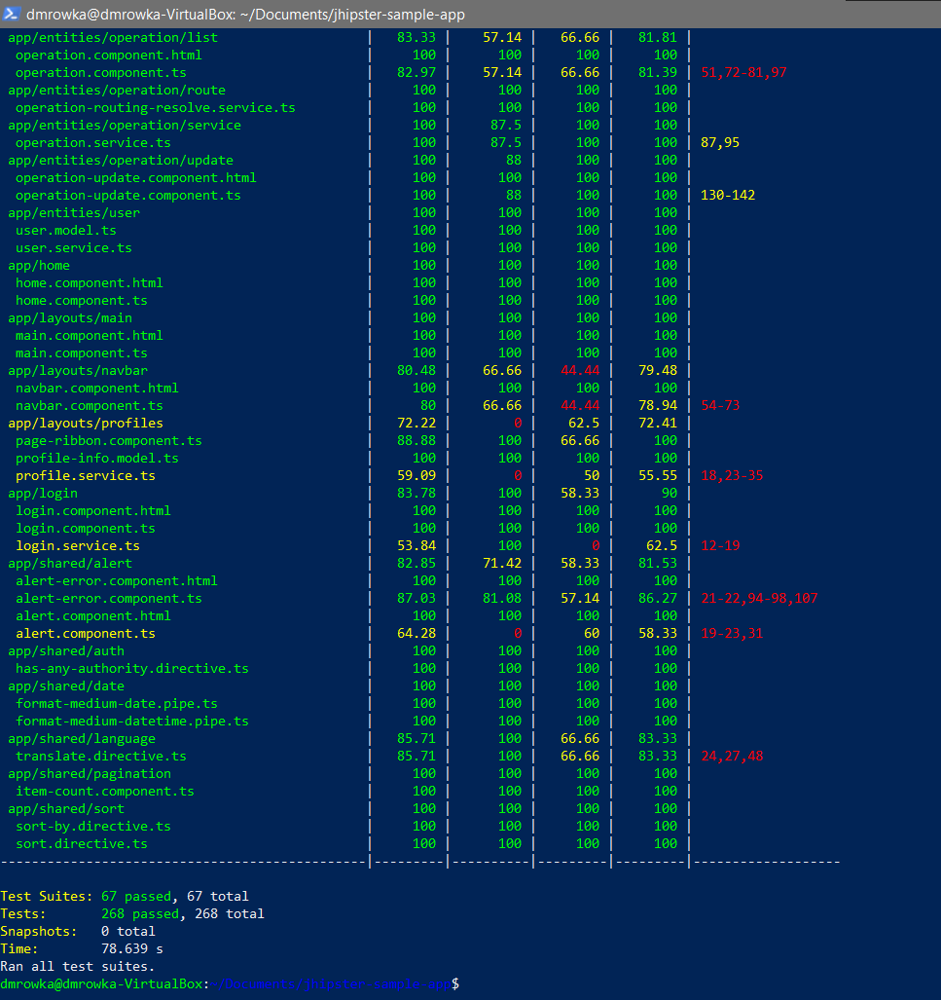

- Po zainstalowaniu i uruchomieniu obrazu dockera z zainstalowanym Node oraz wersją linuxa Alpine, podjęto próbę sklonowania repozytorium, jednak okazało się to niemożliwe ze względu na brak miejsca na dysku maszyny wirtualnej. Z tej części i prób naprawy nie zrobiono screenów, ze względu na brak dostępu do maszyny wirtualnej (wyjaśnienie w kolejnych krokach)

- Aby naprawić ten błąd, przeniesiono dysk maszyny wirtualnej na dysk zewnętrzny oraz zwiększono w opcjach VirtualBox ilość maksymalnego miejsca dla dysku dynamicznego. Ze względu na missclick, pomyłkowo przydzielono 3TB miejsca zamiast 30GB. Spowodowało jeszcze większe problemy, ponieważ nie jest możliwe utworzenie partycji dla większej ilości pamięci niż 2TB, co spowodowało że maszyna sama przestała przydzielać sobie dynamicznie miejsce na dysku. Podjęto następujące próby rozwiązania tego problemu:

    - Przydzielono maszynie nowy disk wirtualny o rozmiarze 30GB, nie rozwiązało to problemów z brakiem miejsca, ponieważ maszyna nie widziała go jako osobnej partycji a zaliczyła go jako kolejne "wolne miejsce"

    - Podjęto próbę zwolnienia pamięci z dysku wg tutorialu (https://www.howtogeek.com/312883/how-to-shrink-a-virtualbox-virtual-machine-and-free-up-disk-space/), jednak przy próbie instalacji zerofree, skończyło się miejsce na dysku i nie było to możliwe. Maszyna przestała odpowiadać, a próba ponownego uruchomienia nie powiodła się.

    - W takiej sytuacji, konieczne było ponowne stworzenie nowej maszyny wirtualnej oraz powtórzenie przygotowania środowiska- Powtórzenie kroków z poprzednich laboratoriów; instalacja git, dockera i konfiguracja nowego klucza ssh.

    - Ponieważ sieć akademika pozwala na rejerstrowanie skończonej ilości urządzeń, nie było możliwości zarejerstrować kolejnej maszyny wirtualnej i konieczne było skonfigurowanie karty sieciowej przez NAT (poprzednia maszyna ustawiona była jako mostkowana) i ustalenie reguły przekierowania portów. Pozwoliło to na połączenie się przez ssh na serwerze localhost.
    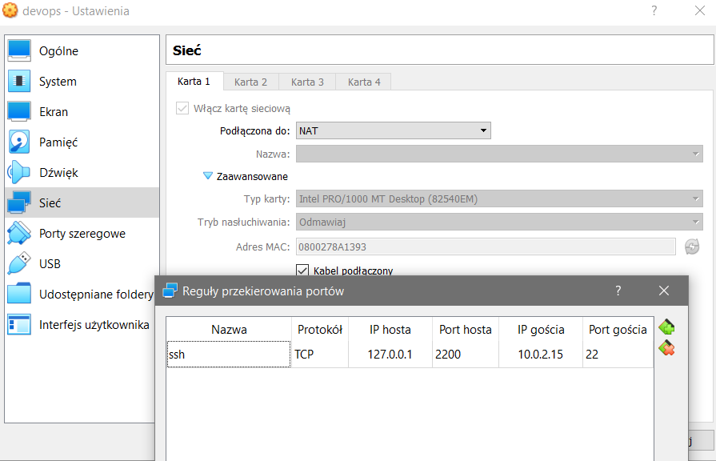
    - Pominięto klonowanie repozytorium aplikacji na maszynę wirtualną, ponieważ wykazano to wcześniej, i po sklonowaniu repozytorium zajęć przystąpiono do konfiguracji obrazu dockera

- Pobrano obraz dockera (node:17-alpine) i uruchomiono go w trybie interaktywnym przyłączając do niego konsolę shell
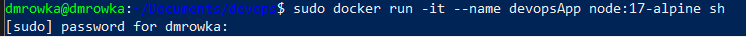
- Zainstalowano wewnątrz kontenera funkcjonalności potrzebne do poprawnej pracy kontenera następującymi komendami:
    - `apk add git` - instalacja gita aby móc sklonować repo
    - `apk add maven` - wybrana aplikacja dostarcza możliwości budowania z wykorzystaniem mavena
    - `apk add openjdk11` - do funkcjonowania aplikacji potrzebne jest środowisko dla javy w wersji 11 lub wyższej
    - `apk add bash` - konsola bash nie jest domyślnie zainstalowana w kontenerze, a polecenia dostarczone przez aplikację wykorzystują komendy bashowe

- Sklonowano repozytorium i zbudowano je z pominęciem testów używając mavena
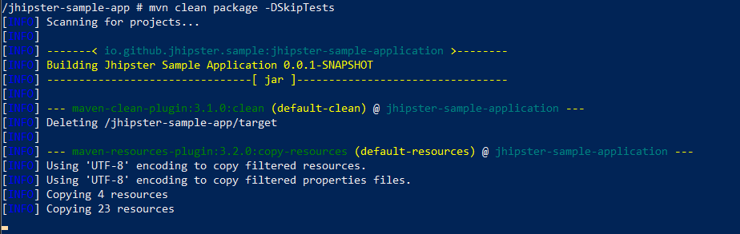
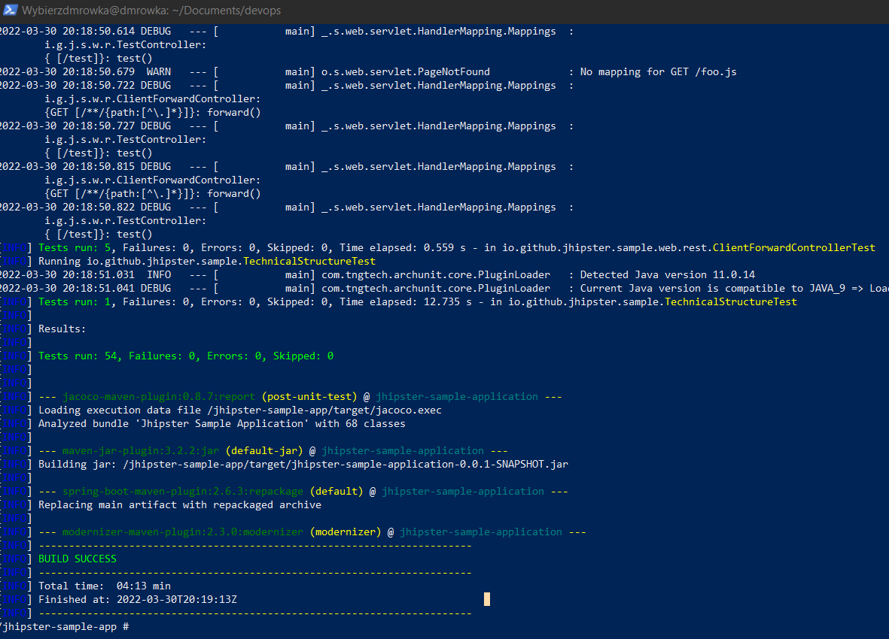
- Uruchomiono testy jednostkowe przy pomocy `npm test`
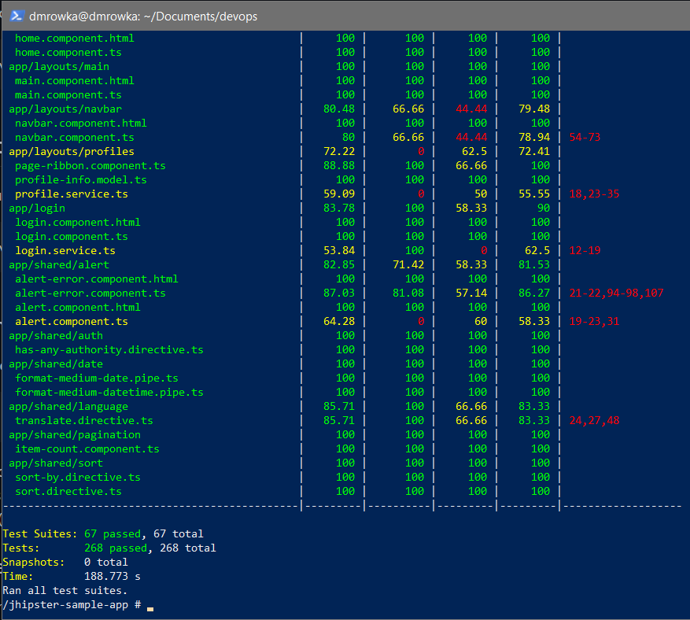

- Stworzono dwa pliki dockerfile pozwalające na automatyczne stworzenie kontenerów wykonujące powyższe polecenia
    - "devopsTests.dockerfile" - Uruchamia testy bez budowania projektu
    - "devopsBuild.dockerfile" - Buduje projekt bez uruchamiania testów

- Uruchomiono nowe kontenery przy pomocy stworzonych dockerfile i potwierdzono ich poprawne działanie
    - Testy:
    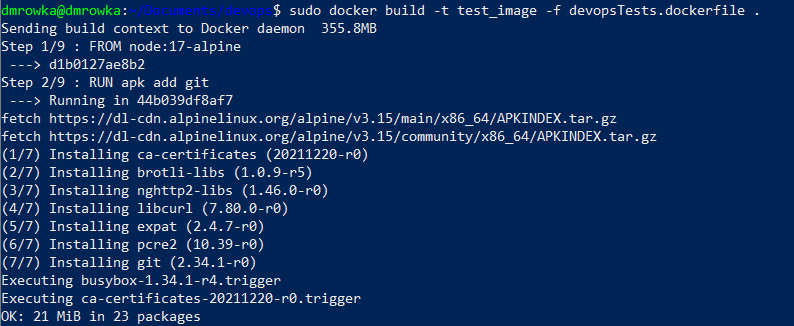
    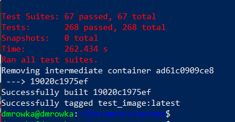
    - Build:
    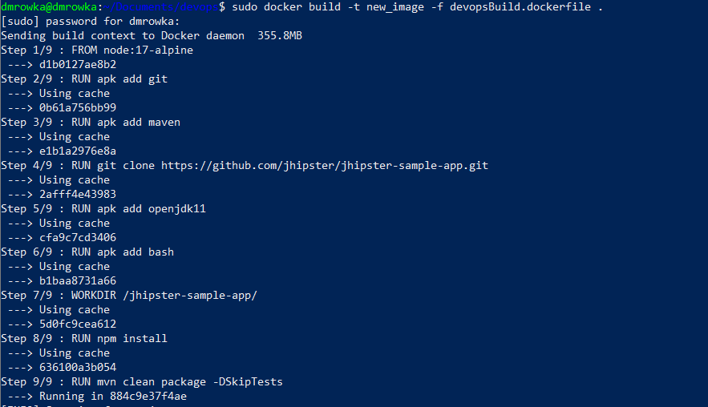
    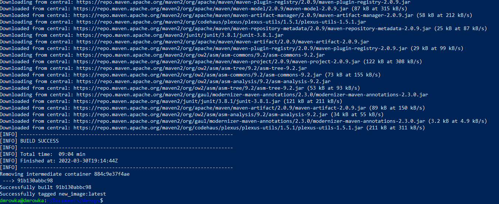
    
