### Dominik Mrówka, 04.04.2022, gr 06
## Sprawozdanie z lab04

- Zalogowano się na maszynę wirtualną przez połączenie ssh

- Stworzono dwa woluminy dockerowe; 'devopsin' i 'devopsout'

- Stworzono nowy kontener na podstawie obrazu używanego w poprzednim laboratorium, tzn. `node:17-alpine` podpinając do niego stworzone woluminy 
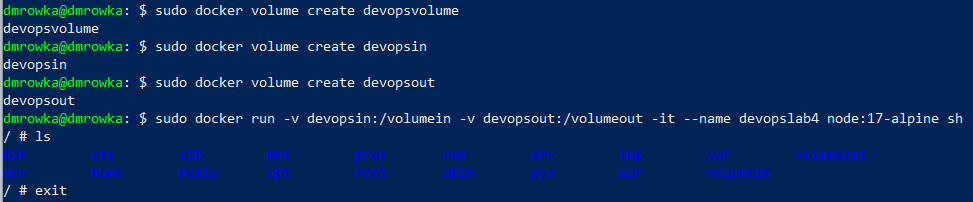
- Sprawdzono lokalizację woluminu wejściowego, i użyto linuxowego superusera aby dostać się do ukrytego folderu w którym był on zamontowany
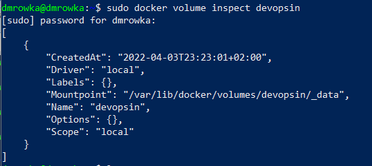
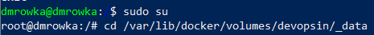
- Sklonowano repozytorium do woluminu wejściowego 
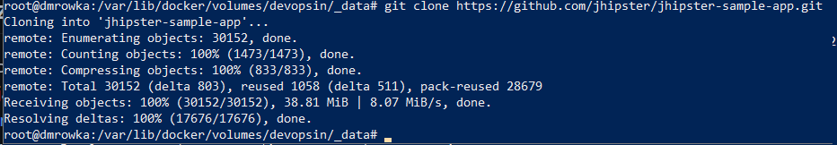
- Uruchomiono utworzony wcześniej kontener

- Zainstalowano na nim zależności potrzebne do działania aplikacji wg. poprzedniego laboratorium poleceniami:
    - `apk add openjdk17`
    - `apk add bash`
    - `apk add maven`

- Aplikacja zmieniła się od poprzedniego laboratorium, i wymaga teraz mavena w wersji 3.8.4 lub wyższej, natomiast komendy `apk update maven` i `apk upgrade maven` aktualizują go do wersji 3.8.3, więc konieczne było zainstalowanie manualne wersji 3.8.5.
    - Usunięto obecną instalację mavena przy pomocy `apk rm maven`
    - Pobrano pliki instalacyjne mavena z mirror linka i rozpakowano je
    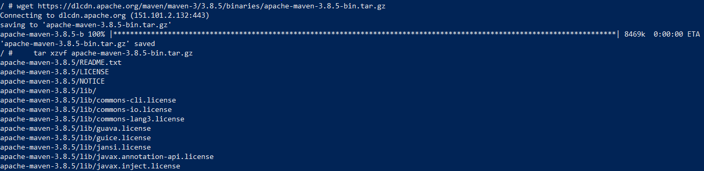
    - Zaktualizowano wartość zmiennej PATH
    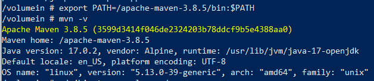
- Zaktualizowano pliki dockerfile z poprzedniego laboratorium, aby realizowały powyższe kroki

- Zbudowano projekt i pzekopiowano stworzony folder `target` do lokalizacji woluminu wyjściowego
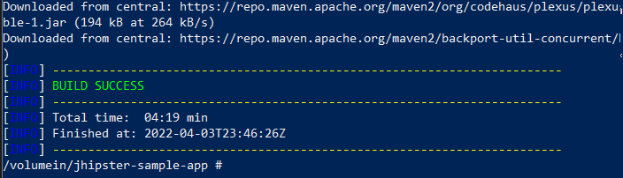
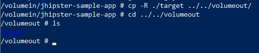
- Stworzono kontener na bazie gotowego obrazu z serwerem iperf3
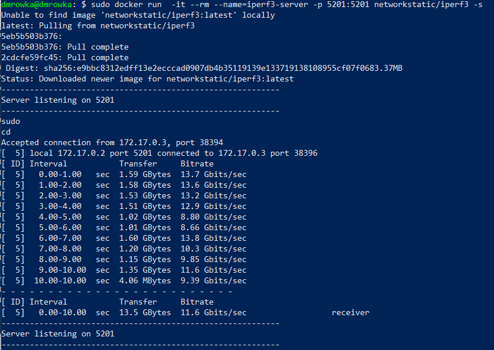
- W nowym oknie konsoli sprawdzono adres, na jakim serwer nasłuchuje

- Połączono się z serwerem przez kontener z iperf3 uruchomionym jako klient i zbadano przepływ sieciowy pomiędzy kontenerami
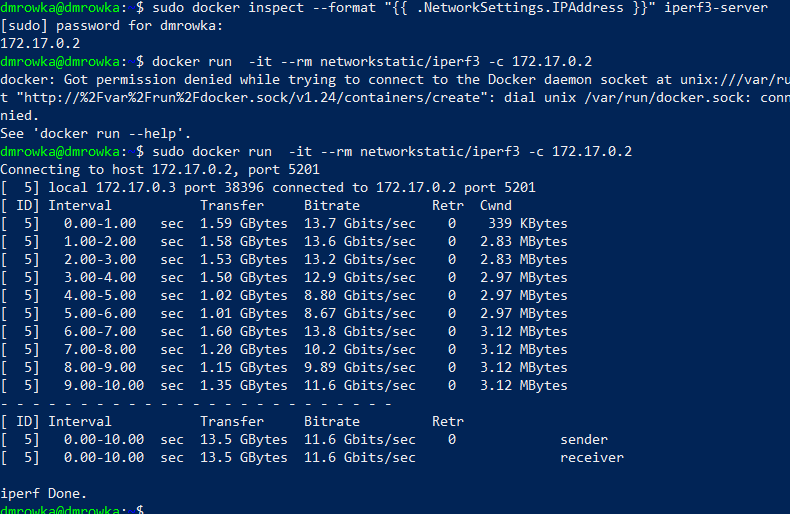
- Zainstalowano na maszynie wirtualnej serwis iperf3, połączono się do serwera w kontenerze i zbadano przepływ sieciowy
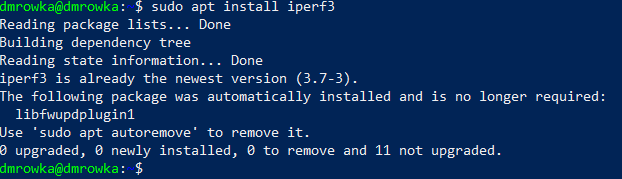
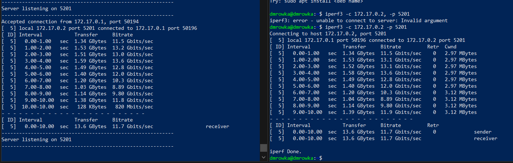
- Zainstalowano iperf3 na środowisku lokalnym (windows) i podjęto próbę podłączenia się do serwera, jednak zakończyła się ona niepowodzeniem
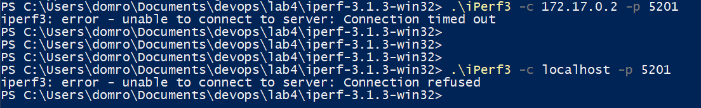
- W celu wyciągnięcia logów z kontenera uruchomiono serwer ponownie, tym razem bez usuwania go po zakończeniu pracy, powtórzono komunikację z drugiego konetenera oraz maszyny wirtualnej.
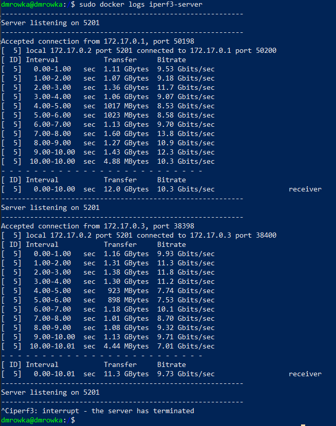
- Przeprowadzono instalację skonteneryzowanego Jenkinsa wg instrukcji podanej w poleceniu
    - Pobrano i uruchomiono obraz `docker:dind`
    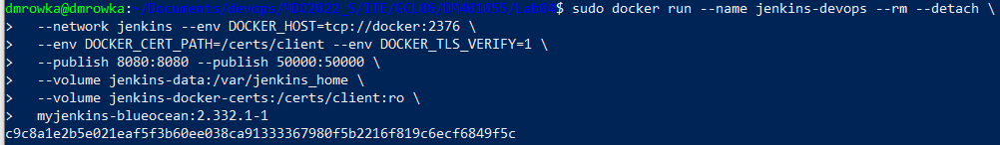
    - Stworzono Dockerfile do budowania kontenerów z Jenkinsem

    ```
    FROM jenkins/jenkins:2.332.1-jdk11
    USER root
    RUN apt-get update && apt-get install -y lsb-release
    RUN curl -fsSLo /usr/share/keyrings/docker-archive-keyring.asc \
    https://download.docker.com/linux/debian/gpg
    RUN echo "deb [arch=$(dpkg --print-architecture) \
    signed-by=/usr/share/keyrings/docker-archive-keyring.asc] \
    https://download.docker.com/linux/debian \
    $(lsb_release -cs) stable" > /etc/apt/sources.list.d/docker.list
    RUN apt-get update && apt-get install -y docker-ce-cli
    USER jenkins
    RUN jenkins-plugin-cli --plugins "blueocean:1.25.3 docker-workflow:1.28"
    ```

    -  Zbudowano i uruchomiono obraz
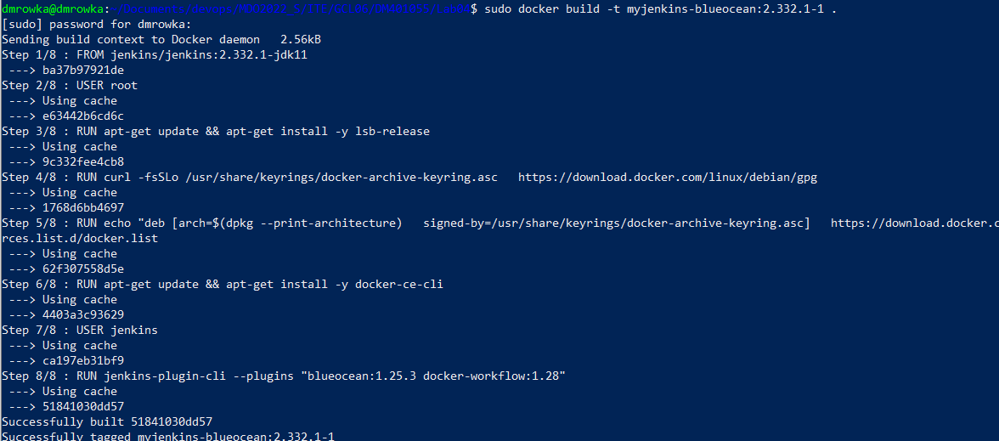
- W ustawieniach maszyny wirtualnej ustawiono przekierowanie portu 8080, aby dostęp do Jenkinsa możliwy był z hosta
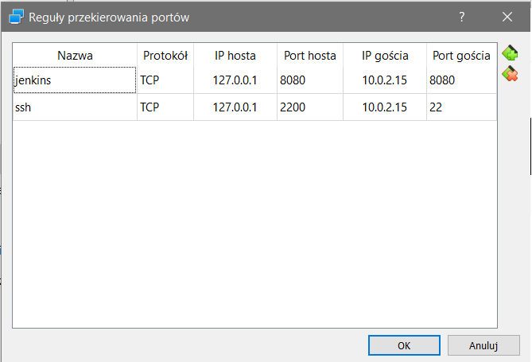
- Połączono się przez przeglądarkę do portu 8080 i skopiowano hasło otrzymane z logów kontenera Jenkinsa.
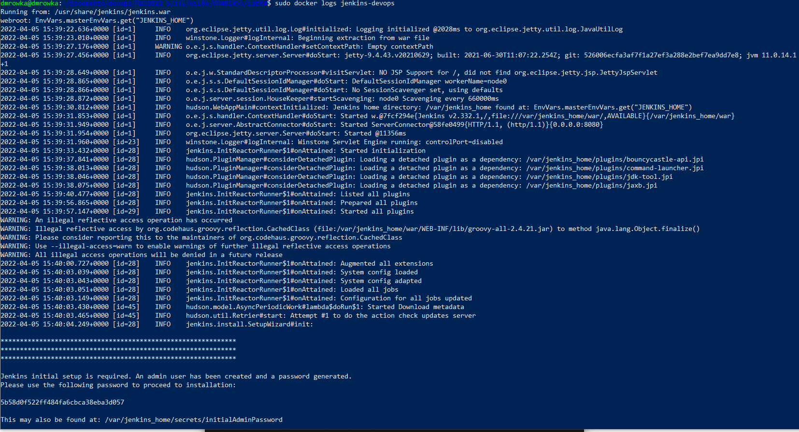
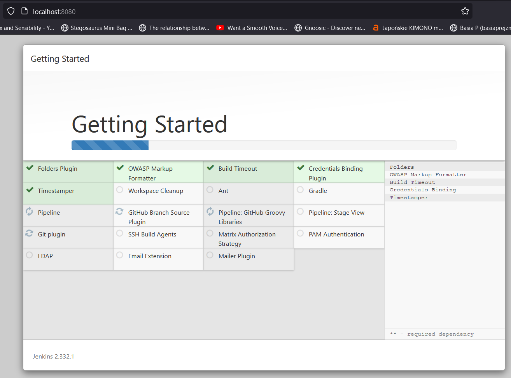

- Uruchomiono instalację i zalogowano się jako admin
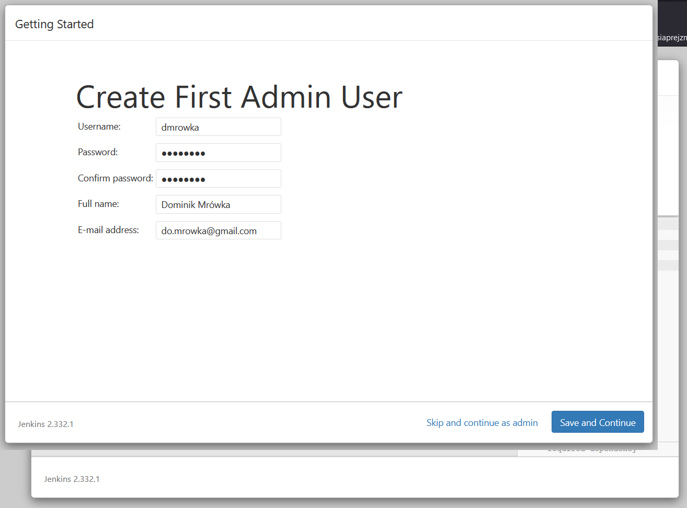
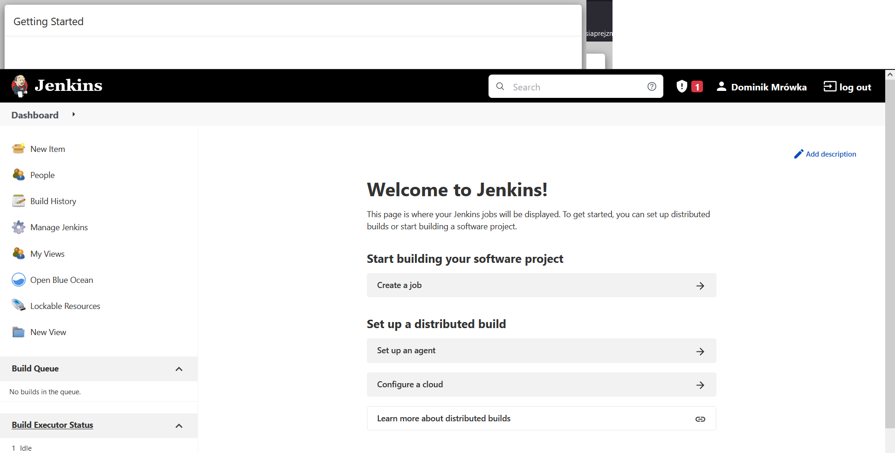