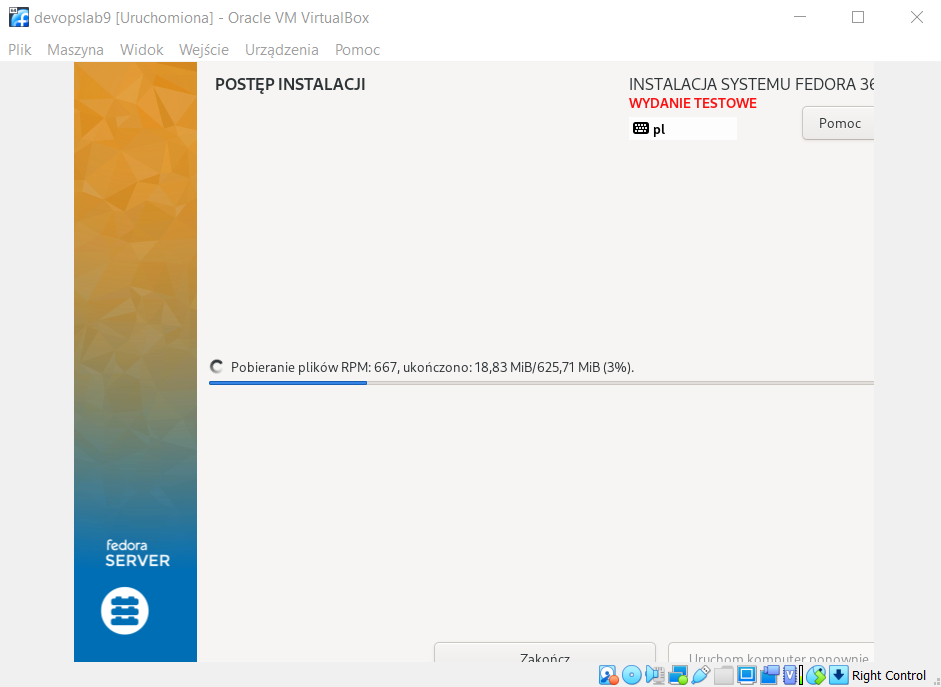
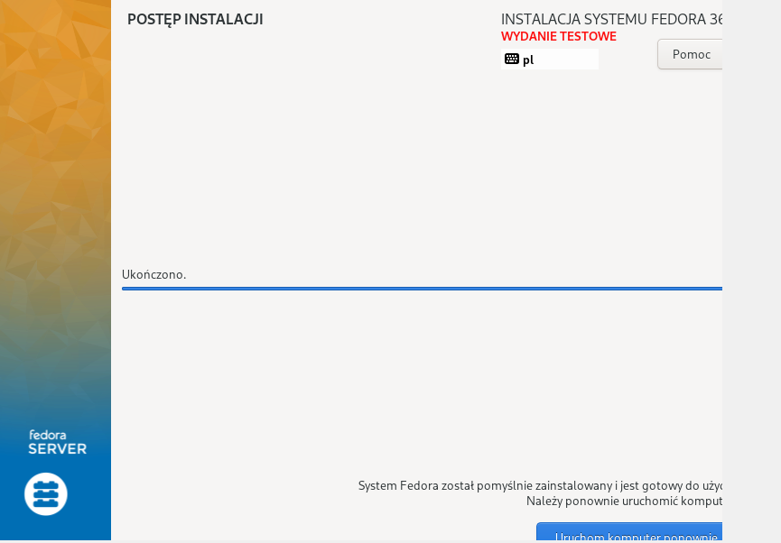
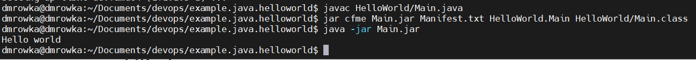
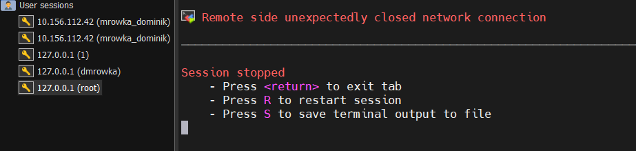
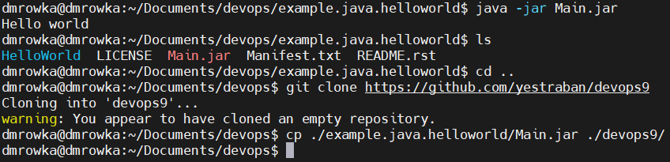
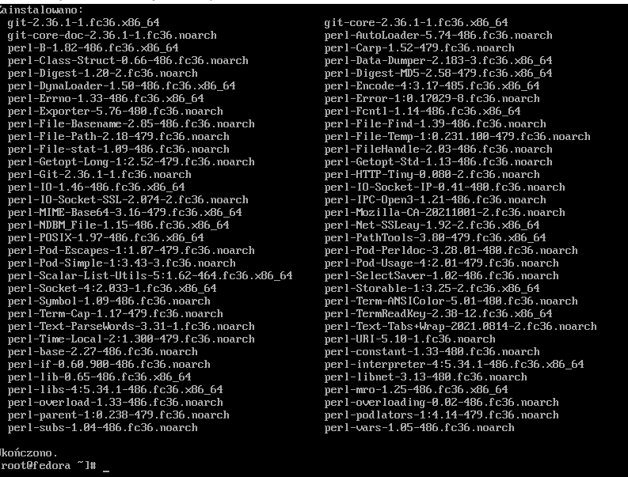

### Dominik Mrówka, 08.06.2022, gr 06
## Sprawozdanie z lab09

- Zainstalowano system fedora 36 server na maszynie wirtualnej i uruchomiono go, skonfigurowango użytkownika "root" z hasłem "root".


- Ponieważ projekt nie działał, pobrano i spakowano do .jar projekt Hello World (https://github.com/macagua/example.java.helloworld) poleceniami: 

```
javac HelloWorld/Main.java
jar cfme Main.jar Manifest.txt HelloWorld.Main HelloWorld/Main.class
```


- Podjęto próbę przesłania pliku jar na serwer fedory przez ssh, jednak nie udało się nawiązać połączenia (skonfigurowano ssh na fedorze, aktywowano usługę ssh, ustawiono przekierowanie portów na VM)



- Skopiowano plik do nowego repozytorium (https://github.com/yestraban/devops9) i pobrano to repozytorium na serwerze




- Zainstalowano i skonfigurowano serwer http

- Zlokalizowano i dodano do pliku odpowiedzi z instalacji dependencje

- Zdefiniowano repozytoria

- Dodano proces pobierania artefaktu

- Umieszczono plik odpowiedzi w repozytorium

- Połączono plik odpowiedzi z ISO instalacyjnym
