# Sprawozdanie z projektu DevOps
### Dominik Mrówka

Zrealizowany projekt polegał na uruchomieniu aplikacji JhipsterSampleApp prezentującej funkcjonalność narzędzia Jhipster. Celem projektu jest uruchomienie aplikacji działającej na serwerze, i dostanie się na jej główną stronę.  
Kod aplikacji zforkowano z repozytorium: https://github.com/jhipster/jhipster-sample-app  
Jak można przeczytać w pliku readme, autor aplikacji przygotował narzędzia docker-compose umożliwiające pominięcie większości kroków podjętych poniżej, jednak nie korzystano z tego rozwiązania ponieważ mijałoby się to z edukacyjnym celem realizacji projektu.  
 
Projekt zrealizowano przy pomocy Pipeline napisanego z wykorzystaniem Jenkinsa, którego konfiguracja została opisana w poprzednim sprawozdaniu. Aby umożliwić efektywne wprowadzanie zmian, stworzono dodatkowe repozytorium (dostępne pod adresem https://github.com/yestraban/jenkinsRepo) w którym przesłane zostały pliki dockerfile oraz jenkinsfile, przez które realizowany jest projekt. Obiekt pipeline skonfigurowano w interface Jenkinsa w taki sposób, aby wybierał skrypt jenkinsfile z repozytorium z katalogu `/jk`.
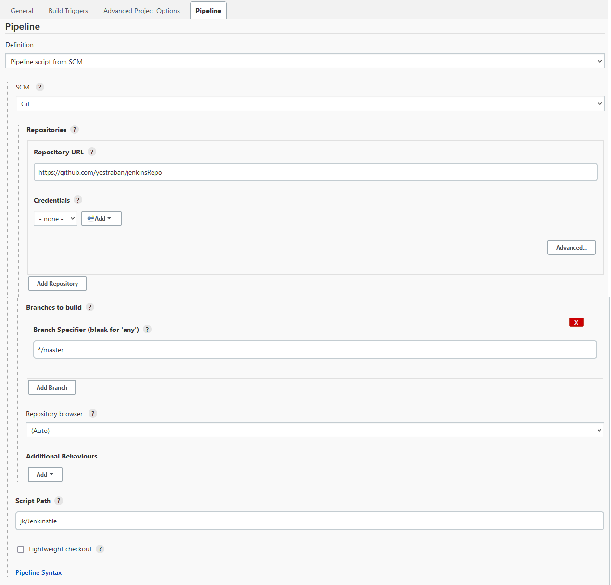
<ul>
<li>Przy korzystaniu w taki sposób z zewnętrznego repozytorium napotkano problem: wtyczka jenkinsowa nie widzi plików dockerfile używanych do budowania kontenerów, jeżeli nie znajdują się one w głównym katalogu repozytorium. Nie jest jasne dlaczego tak się dzieje, ale jedynym rozwiązaniem tego problemu okazało się być przeniesienie wszystkich znaczących plików do katalogu głównego.</li>
</ul>
 
Plik `Jenkinsfile` dostępny jest w repozytorium pod adresem https://github.com/yestraban/jenkinsRepo/blob/master/jk/Jenkinsfile
   

## Dependencies ##
Pierwszym krokiem projektu, było przygotowanie obrazu kontenera zawierającego wszystkie zależności potrzebne do zbudowania i developmentu aplikacji. Zapisano je w pliku 'devopsDependencies.dockerfile':
<pre><code>FROM node:18-bullseye
RUN apt install git
RUN git clone https://github.com/yestraban/jhipster-sample-app
RUN apt update && apt upgrade -y
RUN apt install openjdk-17-jdk -y
RUN apt install bash -y
RUN apt install maven -y
RUN mvn -v
WORKDIR /jhipster-sample-app/
RUN npm install
</code></pre>
 
<ul>
<li>Jako bazowy obraz wykorzystano `node` w wersji 18, ponieważ jest to najnowsza wersja wspierana przez aplikację. Wykorzystanie tego obrazu pozwoli pominąć dodatkowy krok instalacji. Wybrano kontener z dołączonym systemem debian/bullseye, aby możliwy był dostęp do kontenera z poziomu maszyny hosta. Początkowo używano obrazu z systemem alpine, ale zmieniono go ze względu na problemy z uruchomieniem aplikacji (więcej informacji w sekcji 'build'). </li>
<li>Następnie instalowany jest git oraz pobierane repozytorium zawierające kod aplikacji. </li>
<li>W następnej kolejności aktualizowane są repozytoria i pobierane jest środowisko openjdk-17. Ponownie, wykorzystano tę wersje ponieważ jest to najnowsza wersja wspierana przez aplikację.</li>
<li>Instalowane są narzędzia `bash` oraz `maven`</li>
<li>Wybierane jest środowisko pracy, oraz uruchamiane jest instalowanie zależności projektu.</li>
 

## Build ##
Krok ten buduje aplikację i pakuje ją do pliku .jar. Nie korzystano w projekcie z wolumenów, zamiast tego budowano nowe kontenery na podstawie obrazów stworzonych w poprzednich krokach. Wykorzystany został w tym kroku plik devopsProjectBuild.dockerfile:

<pre><code>FROM jenkins-dependencies:latest
WORKDIR /jhipster-sample-app/
RUN ./mvnw -Pprod clean verify
</code></pre>
 
Jednym z poważniejszych problemów napotkanych w trakcie tworzenia produkcji była instalacja Mavena - przy uruchomieniu budowania aplikacji poleceniem `mvn package -DSkipTests`, aplikacja informuje że potrzebna jest wersja mavena przynajmniej 3.8.5, co sprawia problemy ze względu na to że najnowsza wersja dostarczana przez `apt install` to 3.8.3 . Próbowano rozwiązać ten problem na kilka sposobów:
    <li> Pobrano paczkę pożądanej wersji mavena z mirror linka, i przeprowadzono manualną instalację (rozpakowanie i ustawienie zmiennych środowiskowych) - system nie rozpoznawał wtedy polecenia mvn.
    <li> Podejrzewano że problem może leżeć w systemie (ostatnia aktualizacja repozytorium mavena dla alpine to 3.6.3)
    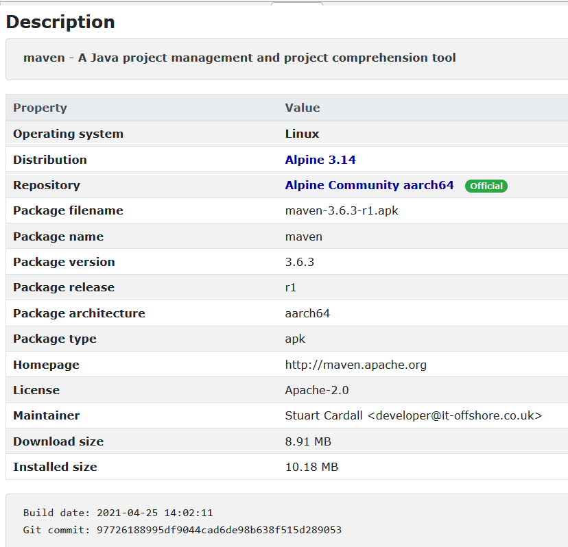
     
    Zamieniono więc bazowy system na debian bullseye i ponowiono próby instalacji.</li>
    <li> Żadna z prób nie powiodła się sukcesem, dlatego zdecydowano się wykorzystać do budowania aplikacji dostępne w projekcie polecenie 
        `./mvnw -Pprod clean verify`  
    Unikano wcześniej używania tego polecenia ze względu na dwa czynniki- polecenie projektu wskazuje na to, aby samemu przeprowadzić instalację zależności, a także dlatego nie jest możliwe wtedy pominięcie testów. Polecenie to pozwala uniknąć błędów ponieważ automatycznie pobiera wymagany wrapper mavena; z pliku `./mvnw`:

<pre><code>##########################################################################################
# Extension to allow automatically downloading the maven-wrapper.jar from Maven-central
# This allows using the maven wrapper in projects that prohibit checking in binary data.
##########################################################################################`
</code></pre>
<li>UWAGA: pomimo tego że przemigrowanie systemu na debian/bullseye nie rozwiązało problemu z budowaniem aplikacji, rozwiązał się mimowolnie problem przy kroku 'Tests', gdzie aplikacja również zgłaszała problemy z mavenem. Dlatego w kroku 'Dependencies' i tak instalowana jest najnowsza wersja mavena, pomimo nie wykorzystywania jej przy budowaniu. <i>Eksperymentalna wersja pliku dockerfile z manualną instalacją mavena 3.8.5, dostępna jest do wglądu pod adresem: https://github.com/yestraban/jenkinsRepo/blob/master/devopsTests.dockerfile</i> </li>  
</ul>

## Tests ##
Krok ten sprowadza się do wykorzystania obrazu z kroku 'Dependencies' do przeprowadzenia testów poleceniem `npm install`. Wykorzystywany plik devopsProjectTests.dockerfile:
<pre><code>FROM jenkins-dependencies
WORKDIR /jhipster-sample-app/
RUN npm test
</code></pre>
Problem napotkany w tym kroku (związany z mavenem) przybliżony został w poprzeniej sekcji.
 

## Deploy ##
W tym kroku tworzony jest obraz kontenera w którym powinna działać aplikacja. Jest to krok podczas którego napotkano najwięcej problemów ze względu na wymaganie podłączenia bazy danych postgresql do projektu.  
Przed napisaniem pipeline, przeprowadzano testy na lokalnie stworzonym kontenerze z obrazu stworzonego w kroku "Dependencies" (`docker run -it jenkins-dependencies:latest`). Niestety nie wyprowadzono portu z kontenera, dlatego dostęp do programu z maszyny hosta nie jest możliwy.
 
Ponieważ aplikacja do działania potrzebuje bazy danych postawionej z wykorzystaniem postgresql, dlatego konieczne było zainstalowanie i uruchomienie takiej bazy danych. Podjęto następujące kroki:  
<i>Z tej części w większości brakuje screenshotów ze względu na to, że intencją podejmowanych działań było "będę próbować różnych rzeczy dopóki nie zadziała".</i>
<ul>
<li>Pobrano i zainstalowano usługę przez `apt install postgresql-13`; dwukrotnie, ponieważ za pierwszym razem repozytoria nie były uaktualnione, wuzupełnione polecenia:
<pre><code>
apt install curl ca-certificates gnupg
curl https://www.postgresql.org/media/keys/ACCC4CF8.asc \
| gpg --dearmor \
| tee /etc/apt/trusted.gpg.d/apt.postgresql.org.gpg >/dev/null
sh -c 'echo "deb http://apt.postgresql.org/pub/repos/apt/ bullseye-pgdg main" \
> /etc/apt/sources.list.d/postgresql.list'
apt update
apt upgrade
</code></pre></li>
<li>Podjęto próbę połączenia- usługa była nieaktywna. Sprawdzono status przy pomocy `systemct status postgresql` . Status wykazał że usługa jest "inactive" oraz "disabled". Wywołano więc polecenia `systemctl enable postgresql` oraz `systemctl start postgresql`. Efekt: 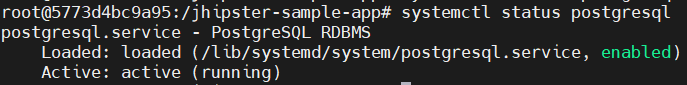</li>
<li>Uruchomiono serwer postgres poleceniem `service postgresql start`
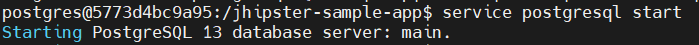 </li>
<li>W tym momencie, aplikacja przestała raportować brak dostępu do usługi, natomiast pojawił się problem z autoryzacją. </li>
<li>Fragment pliku konfiguracyjnego aplikacji (`/src/main/resources/config/application-prod.yml`) wyglądał domyślnie w następujący sposób: 

<pre><code>datasource:
    type: com.zaxxer.hikari.HikariDataSource
    url: jdbc:postgresql://localhost:5432/jhipsterSampleApplication
    username: jhipsterSampleApplication
    password:
</code></pre>
</li>
<li>Dostęp do administracji bazą postgres odbywała się przez panel psql, do którego dostać się można poleceniami `su postgres`, `psql`. Tam wywołano polecenie stworzenia bazy danych: `CREATE DATABASE jhipsterSampleApplication`. Ponieważ baza danych stworzyła się z pominięciem dużych liter, wymagana była zmiana w pliku konfiguracyjnym url bazy danych na `url: jdbc:postgresql://localhost:5432/jhipster` i stworzenie bazy danych o nazwie "jhipster". Przebudowano aplikację. 
<i>Warto zauważyć, że każdy build aplikacji do pliku .jar trwał ok. 10-15 min, a każda zmiana w pliku konfiguracyjnym wymagała <u>nowego przebudowania aplikacji</u></i>
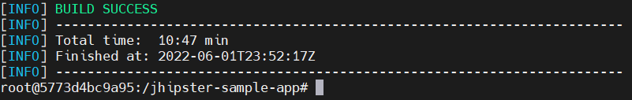</li>
<li>Dalej zachodziła odmowa dostępu, więc stworzono nowego użytkownika z konsoli psql: `CREATE ROLE jhipsterSampleApplication WITH LOGIN SUPERUSER PASSWORD 'test';`. Hasło nie mogło być puste, więc zaktualizowano plik konfiguracyjny o hasło i przebudowano aplikację. Podjęto jeszcze kilka prób zamiany hasła i nazwy użytkownika, m.in na `username: postgres`, `password: `. Nie pomogło to na odmowę dostępu.</li>
<li>Rozwiązano problem poprzez zmianę pliku konfiguracyjnego `/etc/postgresql/13/main/pg_hba.conf`- w kolumnie "METHOD" zamieniono wartości w 3 pierwszych wierszach na "trust": </li>
<pre><code># DO NOT DISABLE!
# If you change this first entry you will need to make sure that the
# database superuser can access the database using some other method.
# Noninteractive access to all databases is required during automatic
# maintenance (custom daily cronjobs, replication, and similar tasks).
#
# Database administrative login by Unix domain socket
local   all             postgres                                peer

# TYPE  DATABASE        USER            ADDRESS                 METHOD

# "local" is for Unix domain socket connections only
local   all             all                                     trust
# IPv4 local connections:
host    all             all             127.0.0.1/32            trust
# IPv6 local connections:
host    all             all             ::1/128                 trust
# Allow replication connections from localhost, by a user with the
# replication privilege.
local   replication     all                                     peer
host    replication     all             127.0.0.1/32            md5
host    replication     all             ::1/128                 md5
</code></pre>
<li>Dopiero po tej zmianie, i po powróceniu do pierwotnego `username: jhipsterSampleApplication` i `password: test` udało się połączyć do bazy danych.</li>
</ul>
Po tych próbach udało się uruchomić aplikację, ale ze wspomnianego powodu wcześniej, nie udało się dostać do strony domowej z maszyny hosta. Na konsultacjach otrzymano plik index.html z poziomu innego kontenera, więc problem ustalono jako brak obnażonego portu z kontenera w którym działała aplikacja.  
Dalej podjęto próbę stworzenia kroku "Deploy" w pipeline Jenkinsa. Pierwotny plik devopsProjectDeploy.dockerfile wyglądał w następujący sposób:
<pre><code>from jenkins-build:latest
EXPOSE 8079
RUN apt install curl ca-certificates gnupg
RUN curl https://www.postgresql.org/media/keys/ACCC4CF8.asc \
| gpg --dearmor \
| tee /etc/apt/trusted.gpg.d/apt.postgresql.org.gpg >/dev/null
RUN sh -c 'echo "deb http://apt.postgresql.org/pub/repos/apt/ bullseye-pgdg main" \
> /etc/apt/sources.list.d/postgresql.list'
RUN apt update
RUN apt upgrade -y
RUN apt install systemctl
RUN apt install postgresql-13 -y
RUN systemctl enable postgresql
RUN mv -f ./pg_hba.conf /etc/postgresql/13/main/
RUN systemctl start postgresql
RUN service postgresql start
RUN su postgres
RUN psql
RUN CREATE ROLE jhipsterSampleApplication WITH LOGIN SUPERUSER PASSWORD 'test';
RUN CREATE DATABASE jhipster;
RUN \q
RUN exit
RUN java -jar target/*.jar
</code></pre>
Plik "pg_hba.conf" dodany został do katalogu głównego zforkowanego repozytorium aplikacji, dlatego dostępny był już w obrazie jenkins-dependencies. 
<ul>
<li>Po uruchomieniu pipeline, przerwany został z następującym błędem: 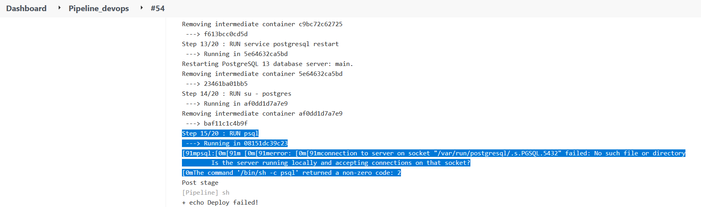</li>
<li>Zmieniono sposób tworzenia użytkownika: 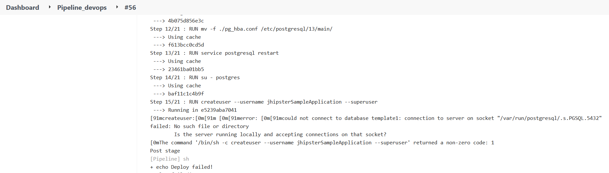 </li>
<li>Podjęto kilka kolejnych prób z restartowaniem postgresq: 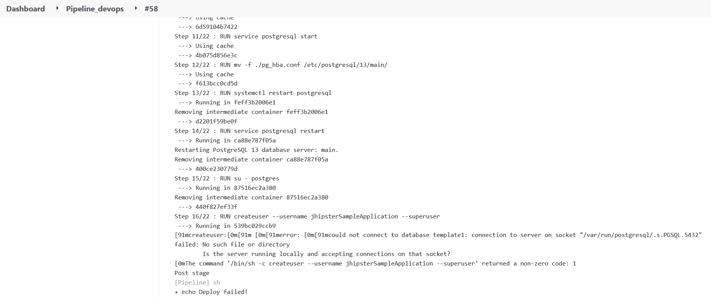</li>
<li>Sprowdzono status usługi postgresql po restartach: 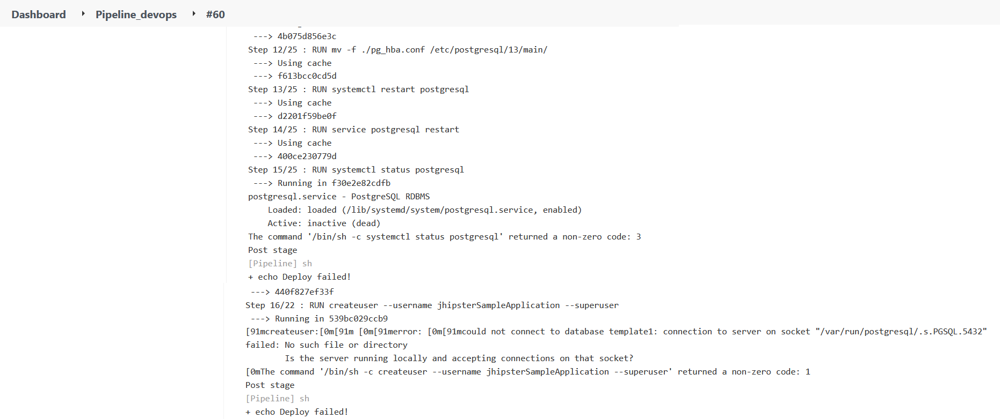</li>
<li>Sprawdzono, że nie ma uruchomionego procesu postgresql: 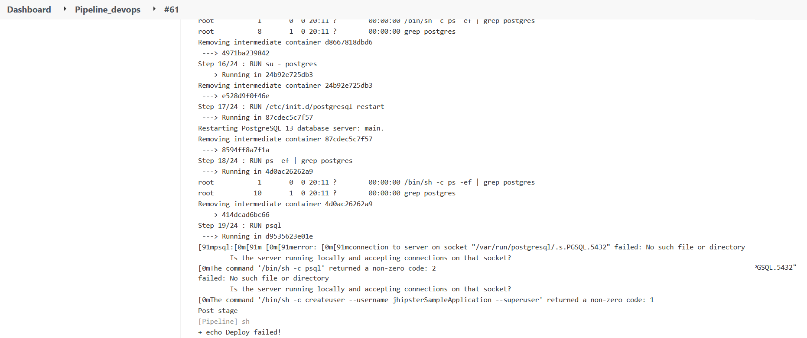</li>
<li>Wypisano logi postgresql: 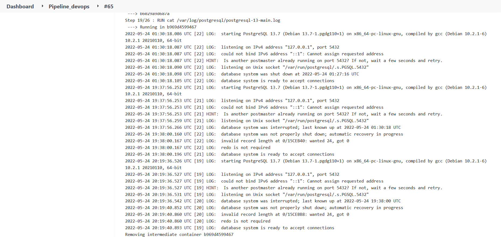</li>
<li>Spróbowano alternatywnych sposobów uruchomienia postgresql: 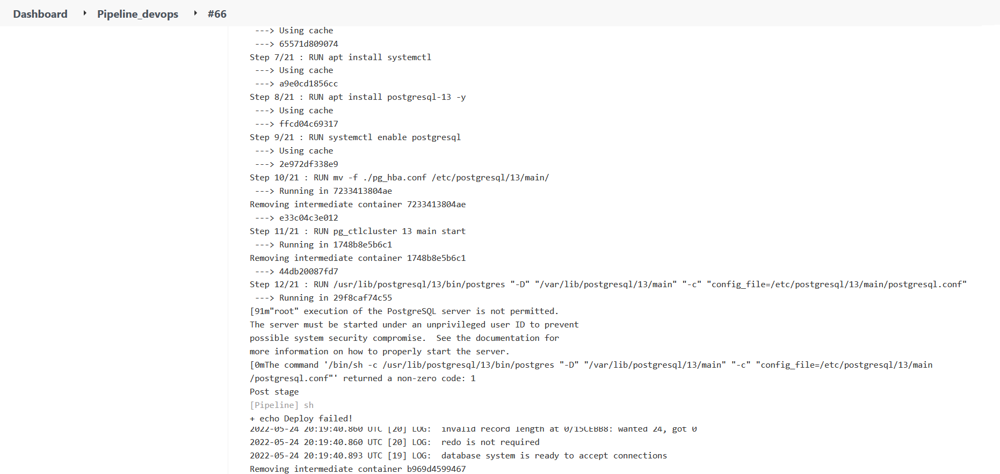</li>
<li>W tym przypadku, pipeline zawiesił się i nie kontyuował pracy przez dłuższy czas, więc wymuszono jego zakończenie: 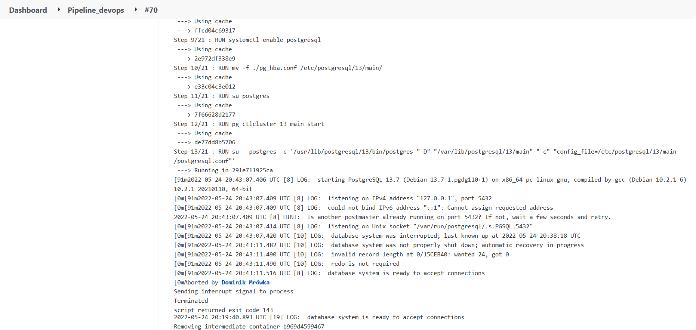</li>
<li>Podjęto próbę sprawdzenia połączeń z bazą danych: 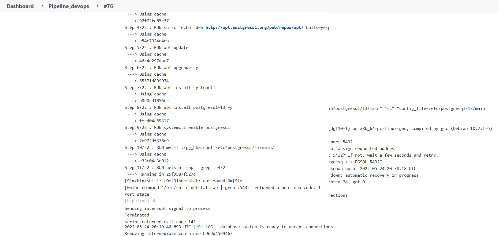</li>
</ul>
Na tym etapie na konsulatacjach, prowadzący zasugerował postawienie osobnego kontenera z bazą danych i połączenie się do niego z aplikacji. Podjęto próbę postawienia kontenera z portem 5432, jednak docker zwrócił informację że port ten jest zajęty, dlatego skonfigurowano aplikację na port 5431.
<li> Na początku użyto obrazu postgres:14-bullseye, ale w środku tego kontenera nie było dostępu do konsoli psql, więc zbudowano go z tagu :latest wg poradnika (https://www.optimadata.nl/blogs/1/n8dyr5-how-to-run-postgres-on-docker-part-1). 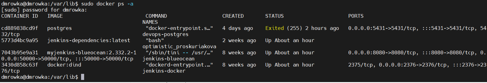</li>
<li> Dostano się do tego kontenera poprzez `sudo docker exec -it devops-postgres bash` i przez psql stworzono użytkownika oraz bazę danych (te same polecenia co powyżej)</li>
<li>Zamieniono url w pliku konfiguracyjnym aplikacji: `url: 127.0.0.1:5431/jhipster`. Po przebudowaniu, aplikacja zgłosiła błąd że url musi zaczynać się od 'jdbc:', dlatego poprawiono go na `url: jdbc:postgresql://127.0.0.1:5431/jhipster`. Po kilku niudanych próbach alternatywnych url (0.0.0.0, localhost) i przebudowywaniu aplikacji za każdym razem, dalej zwracany był błąd: 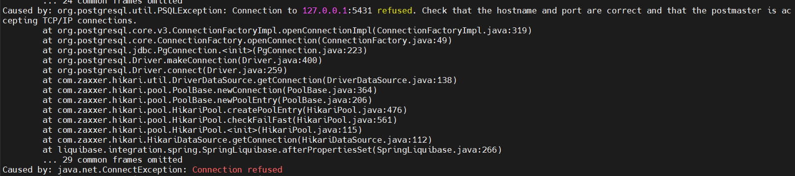</li>
</ul>
W tym momencie, za pozwoleniem prowadzącego, porzucono pracę nad projektem ze względu na nieproporcjonalny czas spędzony nad nim, aby możliwe było nadrobienie zaległości z kolejnych laboratoriów.