# Sprawozdanie z laboratorium 1

## Cel ćwiczenia
Celem laboratorium było wprowadzenie do obsługi serwisu GitHub - zapoznanie się z jego podstawowymi funkcjonalnościami, budową (gałęzie), a także możliwościami połączenia się z nim (m.in. za pośrednictwem kluczy SSH).

## Wykonanie
W ramach zajęć zrealizowano następujące kroki:
1. Instalacja klienta Git oraz obsługi kluczy SSH:
- Instalacja klienta Git za pomocą polecenia `sudo apt-get install git`, a następnie skorzystanie z komendy `git --version` w celu sprawdzenia zainstalowanej wersji;

    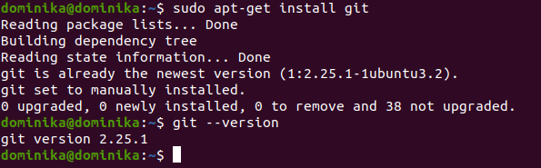
- Instalacja usługi SSH;

    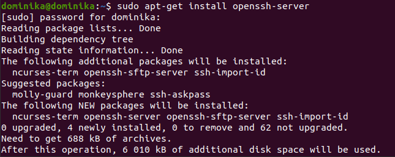
2. Sklonowanie repozytorium za pomocą HTTPS poleceniem `git clone https://github.com/InzynieriaOprogramowaniaAGH/MDO2022_S.git`;

    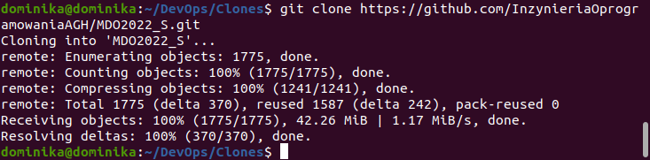
3. Sklonowanie repozytorium za pomocą klucza SSH:
- Utworzenie pary kluczy SSH (publicznego oraz prywatnego), z czego jeden został dodatkowo zabezpieczony hasłem;

    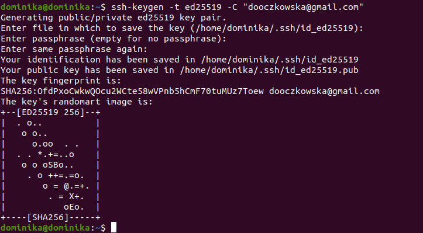
- Powiązanie klucza SSH z kontem na platformie GitHub w zakładce *SSH and GPG keys* znajdującej się w *Settings*;
- Sklonowanie repozytorium z wykorzystaniem protokołu SSH za pomocą polecenia `git clone git@github.com:InzynieriaOprogramowaniaAGH/MDO2022_S.git`;

    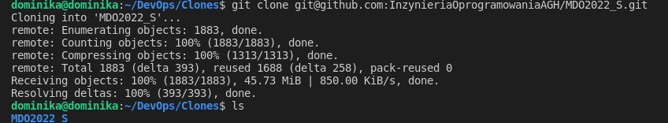
4. Przejście do gałęzi *main*, a następnie do gałęzi odpowiedniej grupy ćwiczeniowej (*ITE-GCL06*) kolejno poleceniami `cd MDO2022_S`, `git checkout main` i `git checkout ITE-GCL06`;

    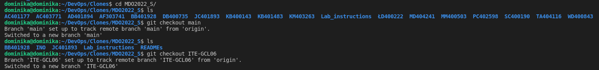
5. Utworzenie gałęzi o nazwie składającej się z moich inicjałów i numeru indeksu (tu: *DO304189*) za pomocą komendy `git checkout -b DO304189` (poleceniem `git status` można m.in. zweryfikować aktualną gałąź - można w tym celu wykorzystać również komendę `git branch`);

    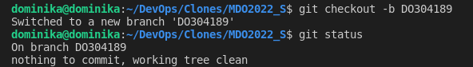
    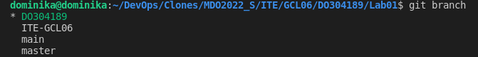
6. Praca na nowej gałęzi:
- Zmiana katalogu na katalog odpowiedniej grupy laboratoryjnej poleceniem `cd` oraz utworzenie nowego katalogu o nazwie, podobnie, jak nazwa gałęzi, składającej się z moich inicjałów i numeru indeksu (*DO304189*) komendą `mkdir`;
    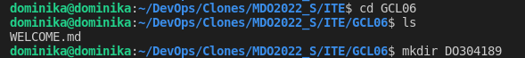
- Przejście do nowo utworzonego katalogu i utworzenie w nim kolejnego katalogu o nazwie *Lab1*;
- Dodanie w nowym katalogu pliku *Sprawozdanie.md*, będącego plikiem, w którym zostanie umieszczone sprawozdanie z zajęć - polecenie `code Sprawozdanie.md` nie tylko tworzy nowy plik, jeżeli nie istnieje już plik o danej nazwie, ale również otwiera go w edytorze aplikacji Visual Studio Code;
    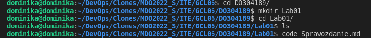
- Praca nad sprawozdaniem z zajęć - dodawanie kolejnych commitów za pośrednictwem komend `git add .` oraz `git commit -m "nazwa commitu"`;
    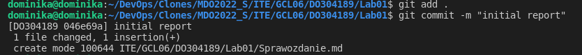
    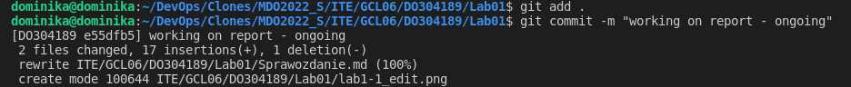
    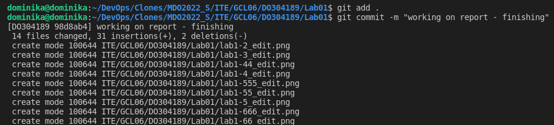
    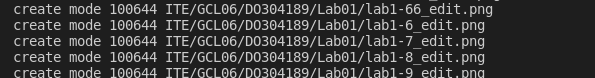
7. Zaktualizowanie wprowadzonych zmian poleceniami kolejno `git pull` oraz `git push --set-upstream origin DO304189`;
    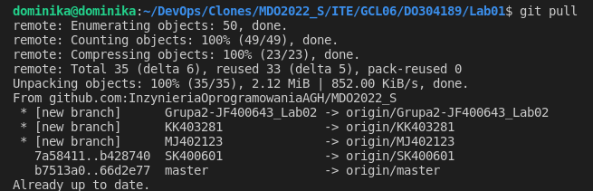
    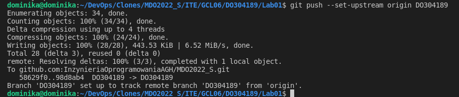
## Wnioski
Środowisko GitHub ma specyficzną budowę, na którą składają się gałęzie - gałąź główna, *main*, oraz wychodząca od niej dowolna ilość pozostałych gałęzi. Nowe gałęzie może tworzyć każdy użytkownik, któremu został udzielony dostęp do danego repozytorium. Mimo że korzystanie z serwera GitHub może wydawać się pozornie skomplikowane, warto je opanować - poszczególne gałęzie pozwalają na uporządkowaną pracę nad wieloma elementami danego projektu jednocześnie, w tym również przez wielu użytkowników, ponieważ, z racji operowania w osobnej "odnodze" repozytorium, zostaje wyeliminowania możliwość przeszkadzania we wzajemnej pracy. Ponadto, dzięki możliwości dodawania tzw. commitów, czyli wgrywania do repozytorium postępu pracy, można śledzić jej postęp u poszczególnych użytkowników, a także zostawiać pozostałym osobom informację o zmianach wprowadzonych przez samego siebie.