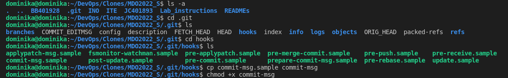
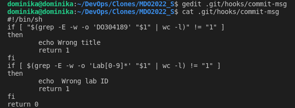
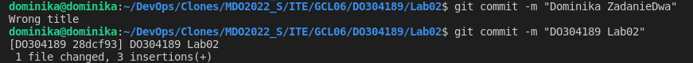
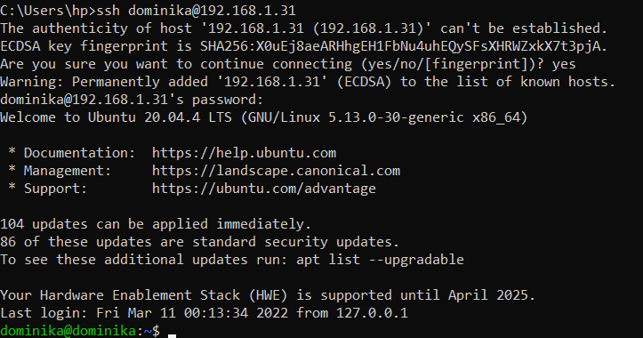
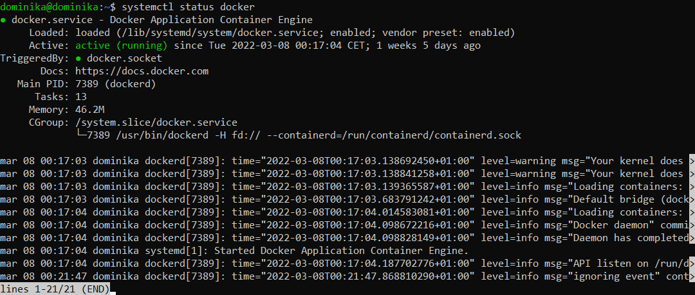
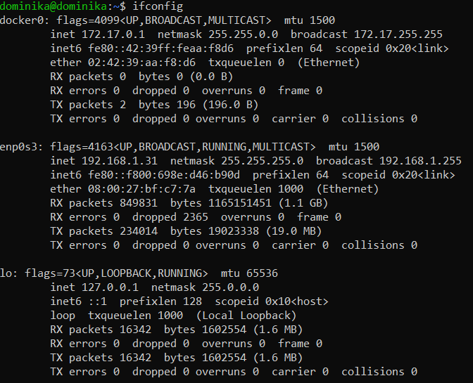
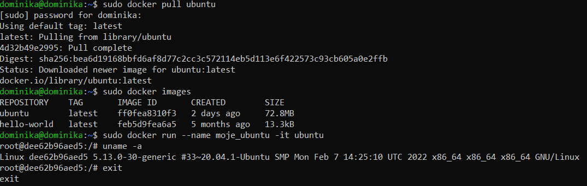
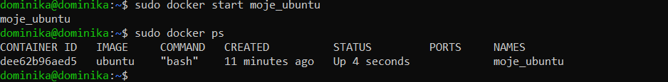
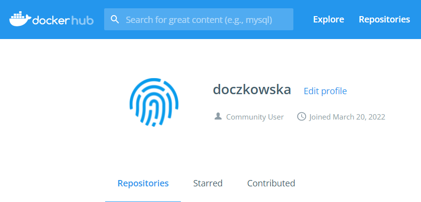

# Sprawozdanie z laboratorium 2


## Cel ćwiczenia
Celem laboratorium było opracowanie Git hooka rozwiązującego problemy związane z porządkowaniem commitów oraz przygotowanie środowiska do pracy z programem Docker.

## Wykonanie
W ramach zajęć zrealizowano następujące kroki:

1. Przygotowanie hooka sprawdzającego, czy tytuł commita odpowiada moim inicjałom i numerowi indeksu oraz czy w jego treści pada numer laboratorium zgodny z numerem wykonywanego zadania:
- Stworzenie pliku będącego kopią *commit-msg.sample* - podczas kopowiowania zostaje usunięte rozszerzenie .sample, tak, aby umożliwić późniejsze wykonanie się jego zawartości;
- Zmiana uprawnień za pomocą polecenia `chmod` na plik wykonywalny;

    
- Otwarcie pliku w edytorze tekstowym poleceniem `gedit` i edycja skryptu:
```bash
#!/bin/sh
if [ "$(grep -E -w -o 'DO304189' "$1" | wc -l)" != "1" ]
then
    echo Wrong title
    return 1
fi
if [ $(grep -E -w -o 'Lab[0-9]*' "$1" | wc -l) != "1" ]
then
    echo  Wrong lab ID
    return 1
fi
return 0
```

- Przetestowanie działania hooka poprzez celowe wprowadzenie najpierw błędnej, a następnie poprawnej treści komentarza do commita;

    

2. Przygotowanie środowiska Dockerowego:
- Zapewnienie dostępu do maszyny wirtualnej przez zdalny terminal, łącząc się z nią za pośrednictwem usługi SSH;

    
- Instalacja programu Docker (Docker został już wcześniej zainstalowany, co obrazuje poniższy zrzut ekranu);

    
3. Wykazanie działania środowiska Dockerowego z definicji:
- Komenda `systemctl status docker` informuje o statusie serwisu Docker - jest on aktywny, co oznacza, że w chwili obecnej jest uruchomiony i pracuje poprawnie;

    
- Polecenie `ifconfig` wyświetla istniejące interfejsy sieciowe, w tym interfejs Dockera;

    
4. Wykazanie działania środowiska Dockerowego z własności:
- Pobranie obrazu systemu Ubuntu za pomocą komendy `sudo docker pull ubuntu`;
- Wyświetlenie istniejących obrazów poleceniem `sudo docker images` w celu sprawdzenia, czy obraz został poprawnie zapisany;
- Utworzenie i uruchomienie kontenera o nazwie *moje_ubuntu* za pomocą polecenia `sudo docker run --name moje_ubuntu -it ubuntu` oraz wyświetlenie wersji systemu za pomocą komendy `uname -a`;

    
- Wyjście z kontenera i sprawdzenie poprawności jego działania poprzez wprowadzenie komendy `sudo docker start moje_ubuntu` oraz skontrolowanie istniejących kontenerów za pomocą `sudo docker ps`;

    
5. Utworzenie konta w serwisie DockerHub;

    