# Sprawozdanie z laboratorium 3

## Cel ćwiczenia
Celem laboratorium było znalezienie i sklonowanie repozytorium dowolnego oprogramowania dysponującego otwartą licencją i posiadającego narzędzia do budowania oraz testy, a następnie utworzenie plików Dockerfile automatyzujących budowanie programu i przeprowadzanie jego testów.

## Wykonanie
W ramach zajęć zrealizowano następujące kroki:

1. Wybranie odpowiedniego repozytorium zawierającego oprogramowanie oprogramowanie typu *open source*: [https://github.com/node-red/node-red](https://github.com/node-red/node-red);
2. Sklonowanie repozytorium za pośrednictwem protokołu SSH;

    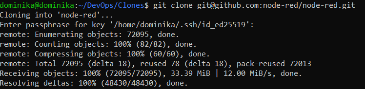

3. Zainstalowanie odpowiednich zależności, wymaganych do poprawnego uruchomienia programu zawartego w sklonowanym repozytorium, wprowadzając komendę `npm install`;

    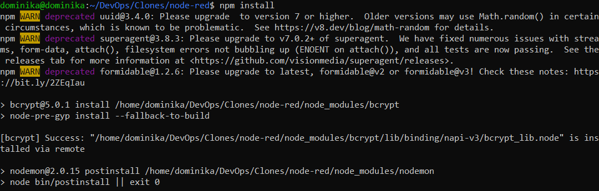

4. Zbudowanie programu za pomocą polecenia `npm run build`;

    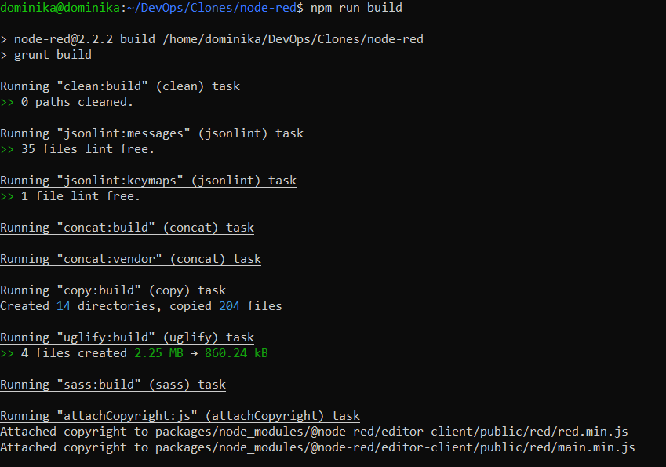

5. Uruchomienie testów jednostkowych komendą `npm test`;

    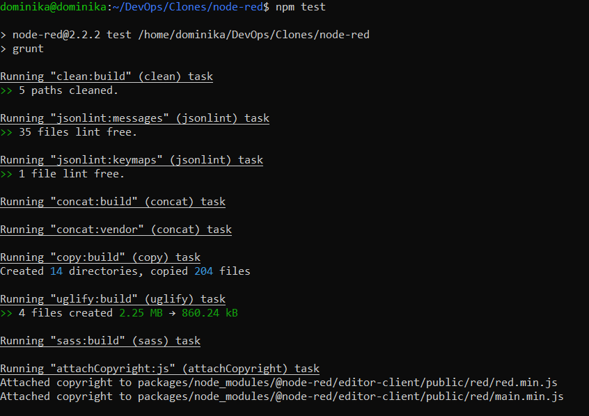

6. Pobranie obrazu Ubuntu dla środowiska Dockerowego, posługując się poleceniem `sudo docker pull ubuntu`;

    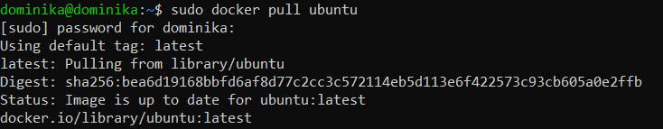

7. Utworzenie i uruchomienie nowego kontenera o nazwie *moje_nodered* za pomocą komendy `sudo docker run --name moje_nodered -it ubuntu`;

    

8. Sklonowanie repozytorium za pośrednictwem protokołu HTTPS;

    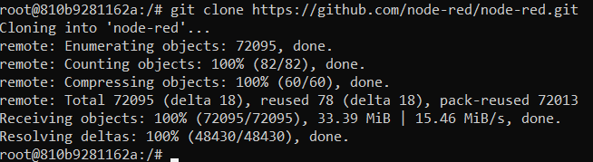

9. Zainstalowanie wymaganych zależności poleceniem `npm install`, po wcześniejszym pobraniu pakietu npm (`apt-get install npm`);

    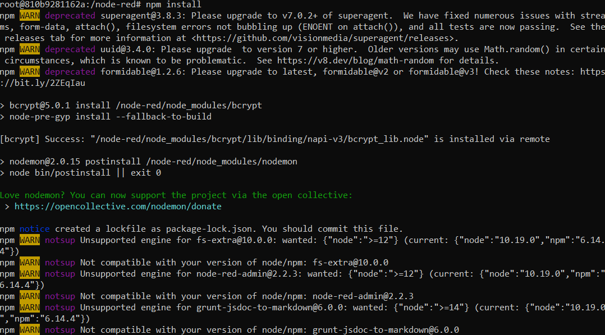

10. Zbudowanie programu za pomocą komendy `npm run build`;

    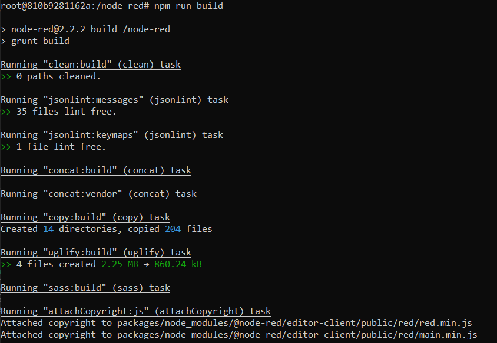

11. Uruchomienie testów jednostkowych poleceniem `npm test`;

    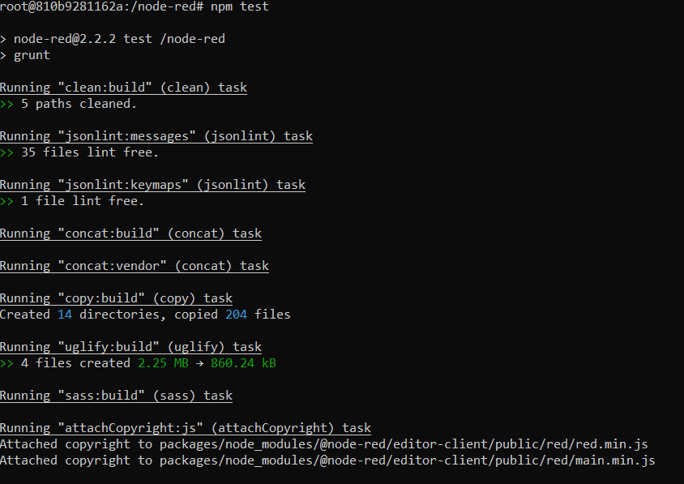

12. Utworzenie dwóch plików typu dockerfile automatyzujących powyższe kroki:
- Stworzenie pliku o nazwie *dockerfile_build*, przeprowadzającego wszystkie kroki począwszy od sklonowania repozytorium, a skończywszy na zbudowaniu programu komendą `touch dockerfile_build`;

    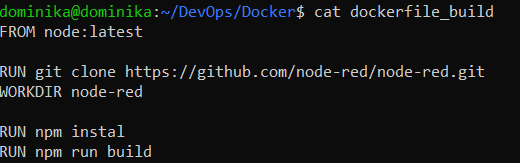

- Stworzenie pliku o nazwie *dockerfile_test* w sposób analogiczny;

    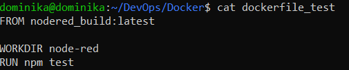

13. Wykazanie poprawności wdrożenia i pracy kontenerów:
- Uruchomienie pliku budującego program poleceniem `sudo docker build . -f dockerfile_build -t nodered_build`;

    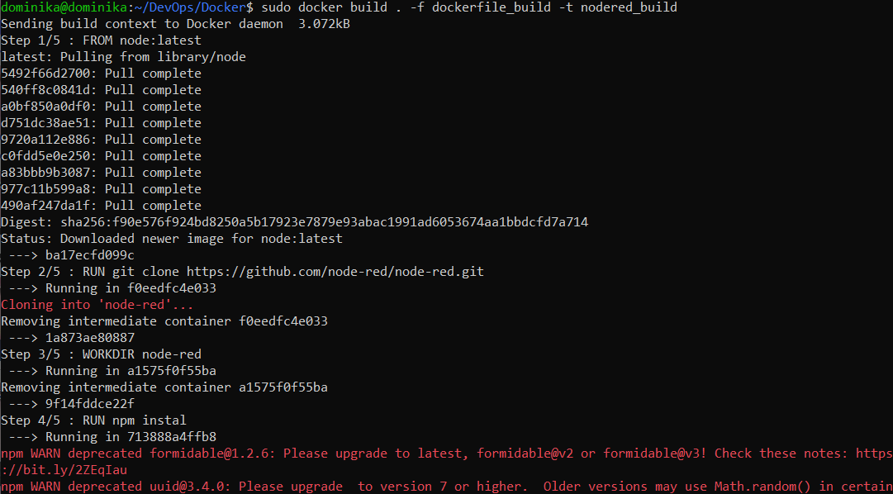

- Uruchomienie pliku przeprowadzającego testy poleceniem `sudo docker build . -f dockerfile_test -t nodered_test`;

    

- Wyświetlenie powstałych obrazów za pośrednictwem komendy `docker images`;

    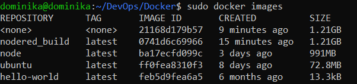

- Uruchomienie nowego obrazu poleceniem `sudo docker run -it --name nodrered_build nodered_build`;

    

## Wnioski
Program Docker umożliwia stworzenie wyizolowanego środowiska - konteneru - bazującego na obrazie, który zawiera narzędzia niezbędne do uruchomienia aplikacji. Aplikacja nie zostaje jednak uruchomiona wraz z otwarciem kontenera - w danym przypadku włącza się Node.js, ponieważ na tym oprogramowaniu jest oparty jego obraz, wykonujący pracę.

Pliki typu dockerfile umożliwiają umieszczenie w swoim wnętrzu odpowiednich skryptów automatyzujących, co znacznie przyspiesza i ułatwia pracę z Dockerem.