# Sprawozdanie z laboratorium 2

## Cel ćwiczenia
Celem laboratorium była dalsza praca z kontenerami w środowisku Dockerowym oraz stworzenie instancji dostosowanej do niego wersji aplikacji Jenkins.

## Wykonanie
W ramach zajęć zrealizowano następujące kroki:

1. Przygotowanie dwóch woluminów: wyjściowego i wejściowego poprzez skorzystanie z polecenia `sudo docker volume create` i sprawdzenie poprawności ich połączenia z kontenerem bazowym przy pomocy `sudo docker inspect`;

    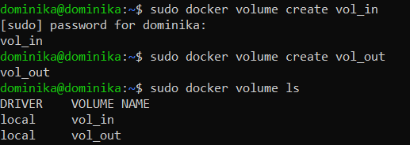
    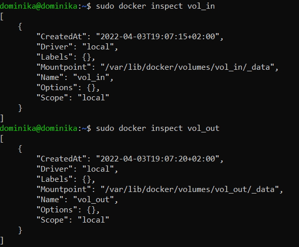

2. Uruchomienie kontenera z jednoczesnym podłączeniem woluminów procedurą `sudo docker run -it --name node_volumes -v vol_in:/vol_in -v vol_out:/vol_out node:latest bash`;

    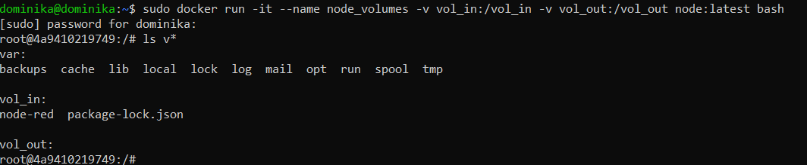

3. Brak konieczności instalacji wymagań wstępnych - używana w chwili obecnej wersja obrazu (Node w wersji slim) nie posiada takich narzędzi, jak m.in. usługa git. Do poprawnego uruchomienia klonowanego w kolejnym kroku repozytorium, używanego również na poprzednich zajęciach wystarczające będzie polecenie `npm install`;
4. Sklonowanie repozytorium [https://github.com/node-red/node-red](https://github.com/node-red/node-red) na wolumin wejściowy;

    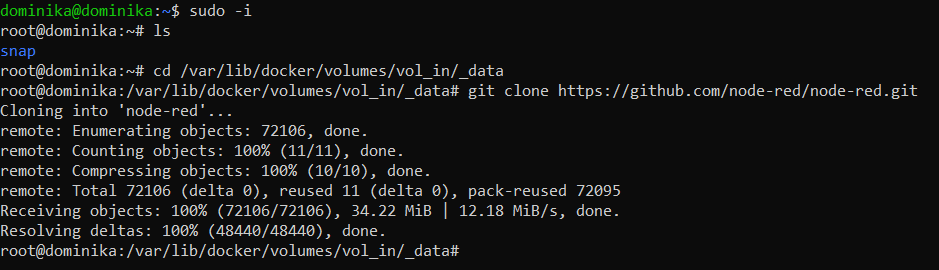

5. Skopiowanie katalogu ze sklonowanym repozytorium bezpośrednio na kontener;

    

6. Instalacja wymaganych zależności i zbudowanie programu odpowiednio komendami `npm install` oraz `npm run build`;

    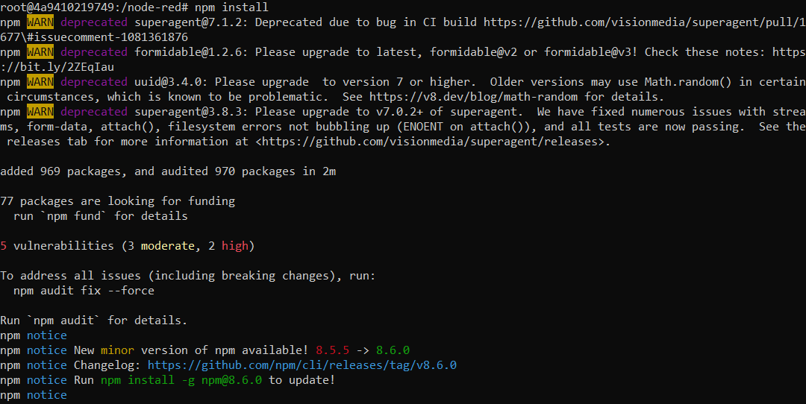
    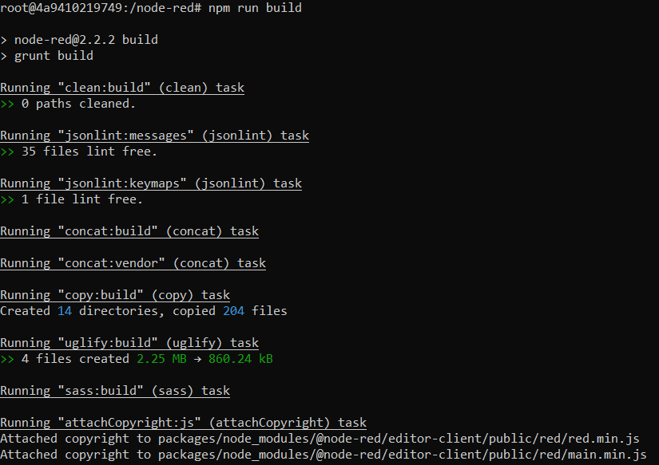

7. Skopiowanie folderu z plikami powstałymi w trakcie budowania na woluminie wyjściowym;

    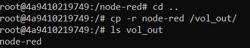

8. Uruchomienie wewnątrz kontenera serwera iPerf - wykorzystany zostaje do tego obraz dystrybuowany przez taoyou z wbudowanym iPerf3;

    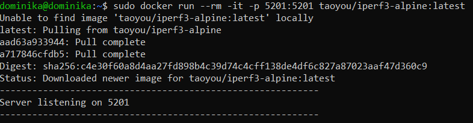

9. Werfyikacja nasłuchujących portów za pośrednictwem komendy `netstat`;

    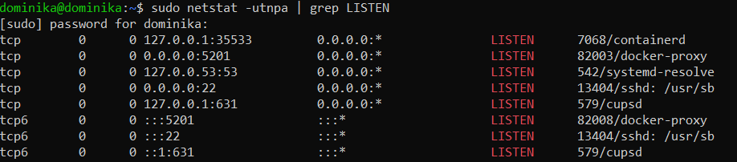

10. Połączenie się z poziomu drugiego kontenera przy pomocy `sudo docker run --rm -it taoyou/iperf3-alpine:latest -c 172.17.0.1 --time 10`. Adnotacja `-c` pozwala na działanie z poziomu klienta, a `--time` na ustawienie czasu połączenia (tu wynoszącego dziesięć sekund). Połączenie zostaje nawiązane, co obrazuje załączony zrzut ekranu;

    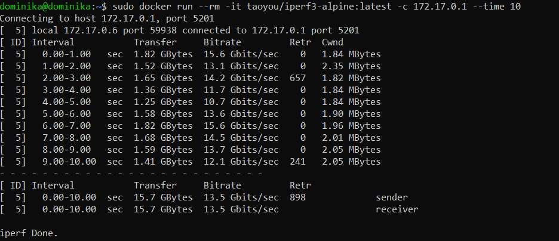

11. Sprawdzenie połączenia z poziomu hosta;

    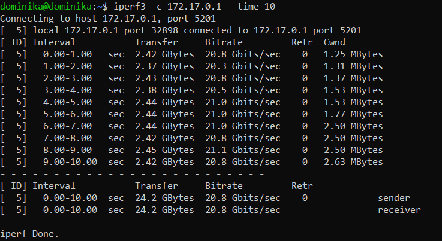

12. Próba nawiązania połączenia z poziomu komputera zewnętrznego, którego natywnym systemem jest Windows - w odpowiedzi na wprowadzenie procedury `telnet 192.168.1.31 5201` wyświetla puste okno dialogowe, co oznacza, iż połączenie zostaje nawiązane (wynika to z wcześniejszego dodania przy tworzeniu kontenera andotacji `-p`, upubliczniającej port);

    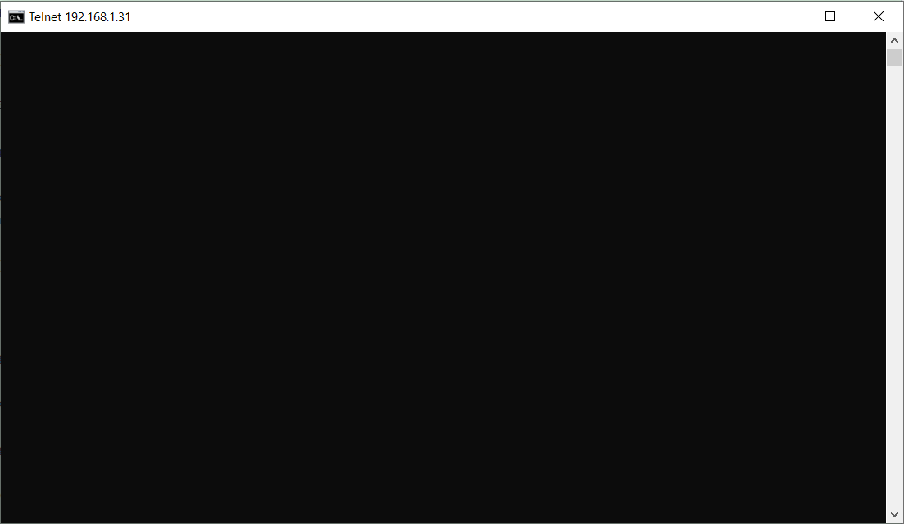

13. Pobranie logów z kontenera poleceniem `sudo docker logs`;

    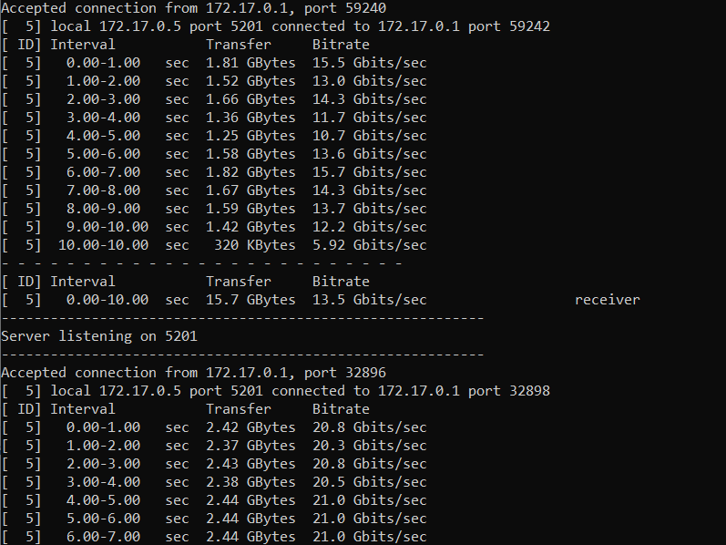
    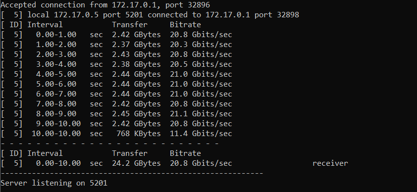

14. Utworzenie nowej sieci Dockerowej komendą `sudo docker network create` o nazwie *jenkins*;

    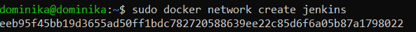

15. Pobranie i uruchomienie obrazu DIND;

    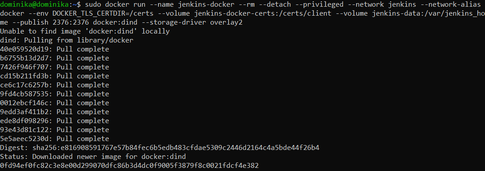

16. Utworzenie pliku dockerfile w celu późniejszego przeprowadzenia budowania programu;

    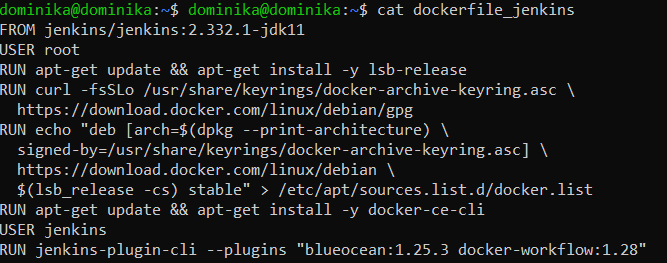

17. Zbudowanie programu przy pomocy procedury `sudo docker build . -f dockerfile_jenkins -t myjenkins-blueocean:2.332.1-1`;

    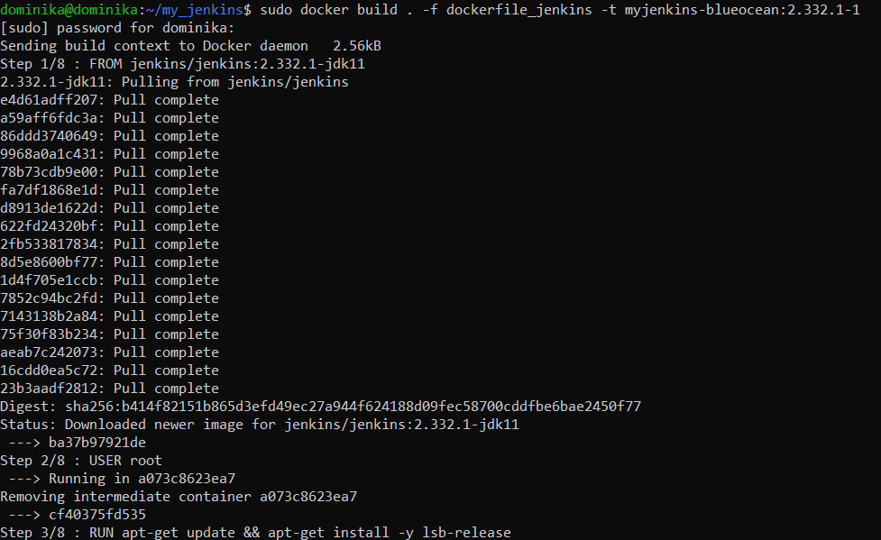

18. Uruchomienie utworzonego obrazu;

    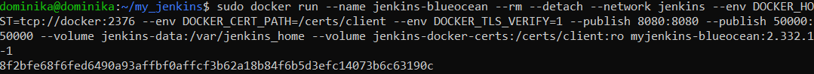

19. Odblokowanie aplikacji Jenkins poprzez wejście na adres wskazany w instrukcji ([http://localhost:8080](http://localhost:8080)), pod którym wyświetlany jest ekran powitalny;

    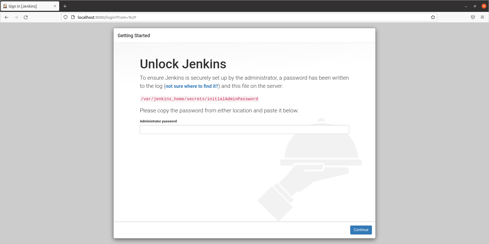

20. Odszukanie i wprowadzenie hasła administratora;

    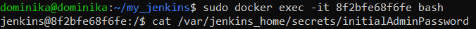

21. Instalacja sugerowanych wtyczek;

    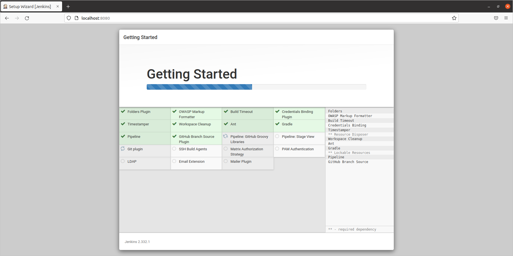

22. Stworzenie pierwszego nowego użytkownika;

    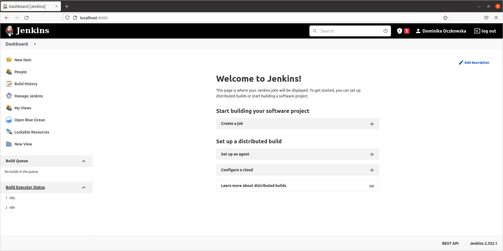

23. Wykazanie działającego konteneru;

    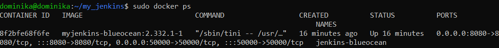

24. Pokazanie ekranu logowania;

    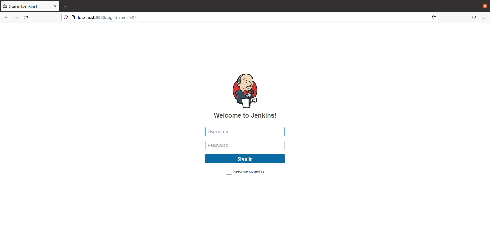

## Wnioski
Połączenie z kontenerem z poziomu hosta jest szybsze niż połączenie pomiędzy dwoma kontenerami (zmierzona prędkość transmisji w przypadku pierwszego rodzaju połączenia była równa 20,8 Gbit/s, a w przypadku drugiego - 13,5 Gbit/s). Różnica ta wynika z faktu, iż w przypadku połączenia między kontenerami występuje pośrednik w postaci maszyny wirtualnej.