# Sprawozdanie z laboratorium 9

## Cel ćwiczenia
Celem ćwiczenia było przygotowanie oraz przeprowadzenie wdrożenia nienadzorowanego dla platformy posiadającej pełne oprogramowanie.

## Wykonanie
1. Instalacja systemu Fedora:
- Wybór instalacji środowiska z podstawowymi funkcjonalnościami (instalacja minimalna - *Minimal Install*);
    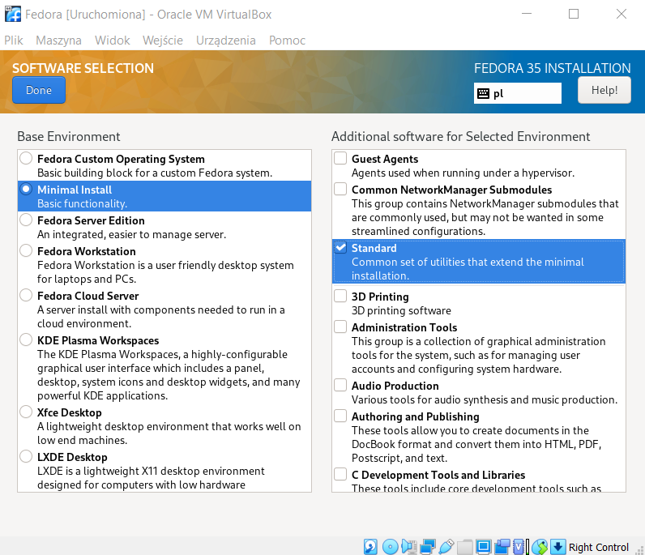

- Zmiana nazwy hosta na *devops-lab9*;
    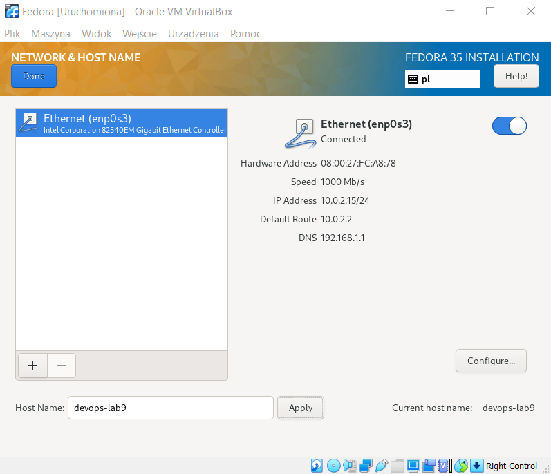

- Konfiguracja konta roota;
    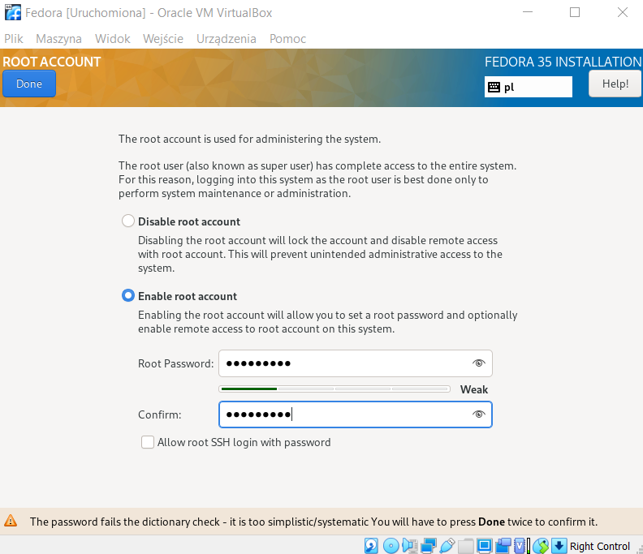

- Stworzenie użytkownika z uprawnieniami administratora;
    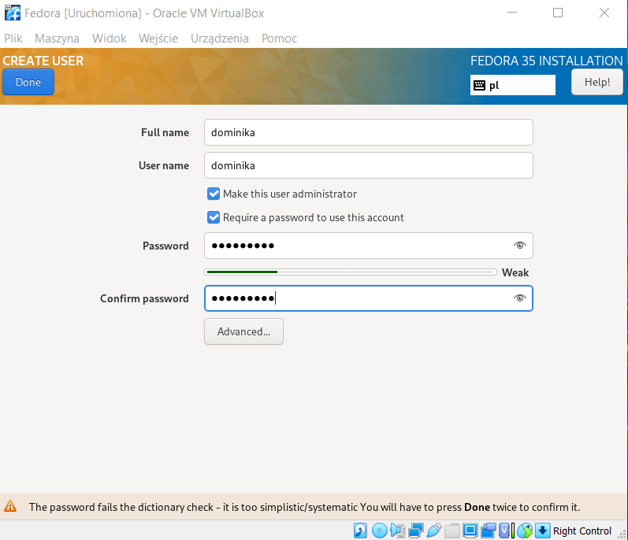

- Rozpoczęcie instalacji;
    

2. Zalogowanie się na konto użytkownika w celu sprawdzenia poprawności procesu instalacji;
    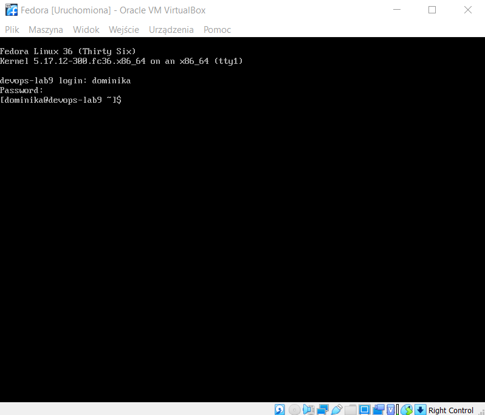

3. Instalacja usługi HTTPD z poziomu roota za pomocą polecenia `sudo dnf -y install httpd`;
    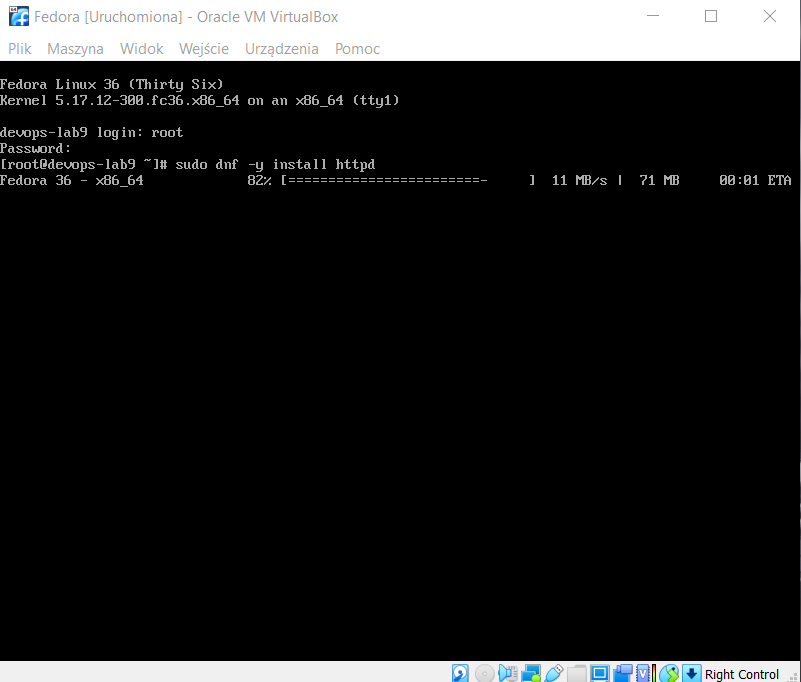

4. Zmiana uprawnień zapory ogniowej (*firewall*) serwera HTTPD oraz jego przeładowanie w celu wczytania wprowadzonych zmian;
    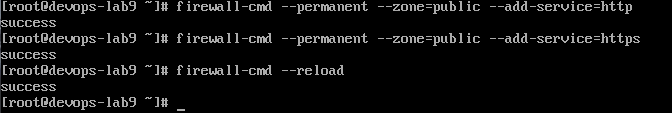

5. Uruchomienie serwera komendą `systemctl enable httpd --now` oraz wyświetlenie jego statusu przy pomocy `systemctl status httpd`;
    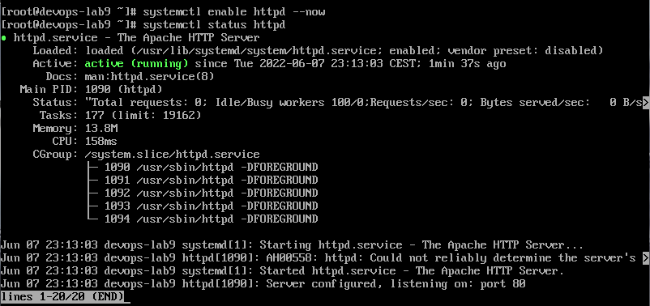

6. Umieszczenie artefaktów w maszynie wirtualnym za pomocą programu FileZilla w nowo utworzonym do ich przechowania katalogu *nodered*, będącym częścią serweru HTTPD, a następnie przesłanie ich na serwer;
    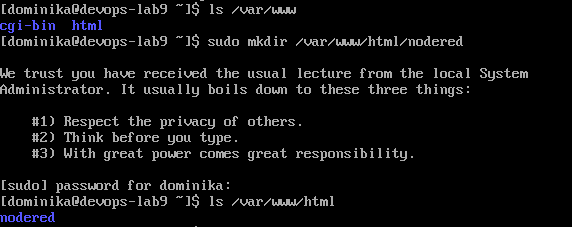
    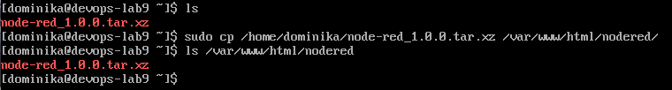
    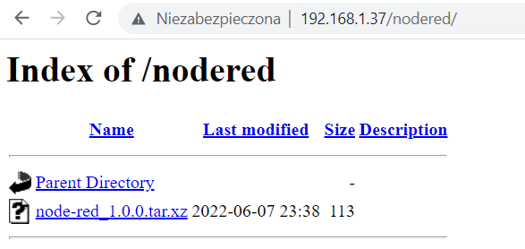

7. Utworzenie nowej maszyny wirtualnej oraz pobranie na nią artefaktu z utworzonego serwera HTTPD poleceniem `wget 192.168.1.37/nodered/node-red_1.0.0.tar.xz`;
    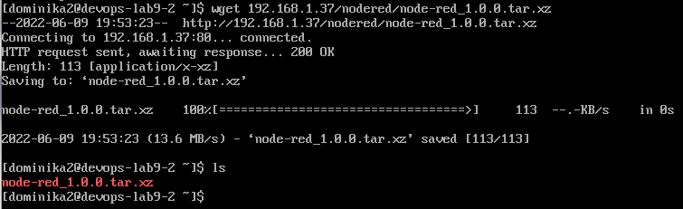

8. Wydobycie z maszyny wirtualnej z poziomu roota pliku z odpowiedziami *anaconda-ks.cfg*, a następnie wprowadzenie w nim odpowiednic zmian:

    `...`

    `# Repo`

    `url --mirrorlist=http://mirrors.fedoraproject.org/mirrorlist?repo=fedora-$releasever&arch=x86_64`

    `repo --name=updates --mirrorlist=http://mirrors.fedoraproject.org/mirrorlist?repo=updates-released-f$releasever&arch=x86_64`

    `%packages`

    `@^minimal-environment`

    `wget`

    `%end`

    `...`

    `%post`

    `mkdir nodered`

    `wget http://192.168.1.37/nodered/node-red_1.0.0.tar.xz`

    `%end`

9. Umieszczenie zmodyfikowanego pliku z odpowiedziami w repozytorium na serwerze GitHub;
10. Utworzenie kolejnej maszyny wirtualnej w celu przeprowadzenia na niej instalacji nienadzorowanej;
11. Uruchomienie nowej maszyny oraz wybranie innej opcji instalacji poniższym poleceniem:
    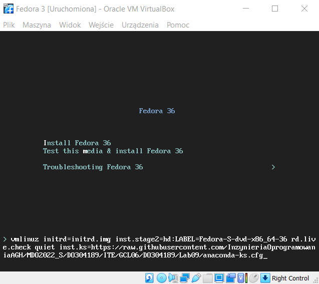

12. Rozpoczęcie procesu instalacji;
    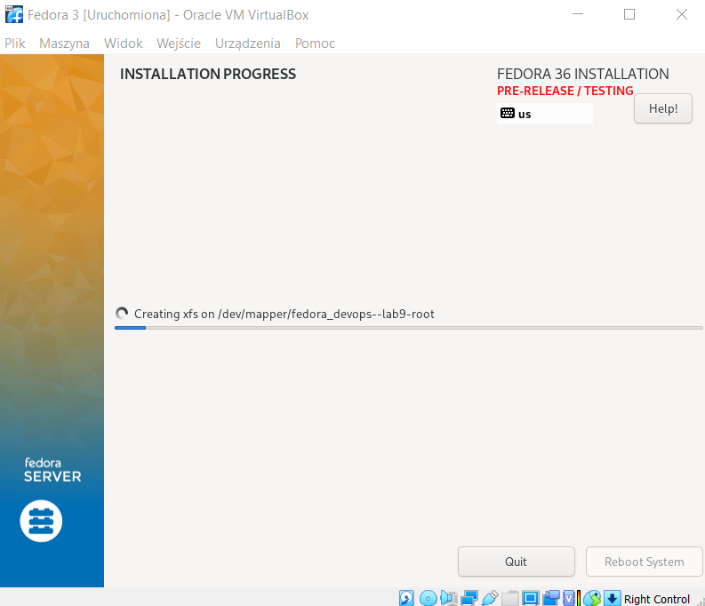

13. Po zakończeniu instalacji, zamiast klikania na przycisk z opcją *Reboot System* wyłączono maszynę w standardowy sposób, po czym odłączono plik *.iso z napędem optycznym. Kolejnym krokiem było ponowne uruchomienie maszyny, w której znajdował się już pobrany plik z artefaktami;
    

## Wnioski
Wdrożenia nienadzorowane pozwalają na personalizację instalowanego środowiska oraz, odpowiednio skonfigurowane, mogą znacznie zautomatyzować cały proces instalacji.