# Sprawozdanie z laboratorium 11

## Cel ćwiczenia
Celem laboratorium było wdrożenie opracowywanego w ramach wcześniejszych zajęć projektu na kontener zarządzalny przy pomocy narzędzi oferowanych przez środowisko Kubernetes.

## Wykonanie
W ramach zajęć zrealizowano następujące kroki:

1. Instalacja klastra Kubernetes:
 - Instalacja i konfiguracja środowiska Minikube przy pomocy poleceń zawartych w jego dokumentacji;
    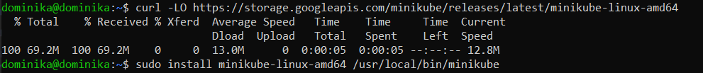
 - Zaopatrzenie się w polecenie *kubectl* przy pomocy procedury `alias kubectl="minikube kubectl --"`;
    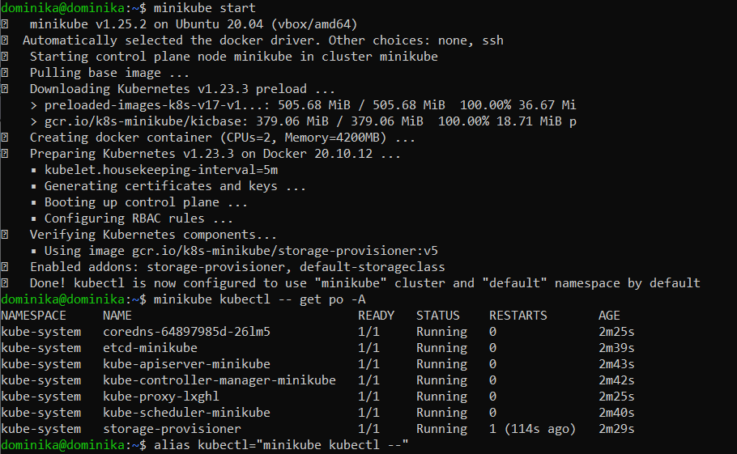
 - Uruchomienie Dashboarda i otwarcie go w przeglądarce;
    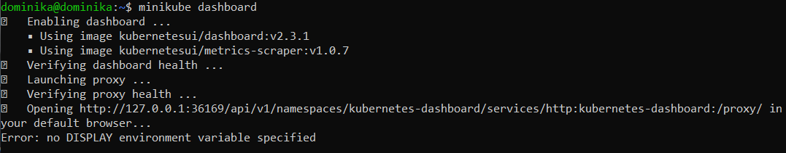
    

2. Analiza posiadanego kontenera:
- Wybór innej aplikacji - Nginx ([https://www.nginx.com/](https://www.nginx.com/)) - na potrzeby danego ćwiczenia, ponieważ oprogramowanie Node-Red nie wyprowadza żadnych portów;
- Uruchomienie kontenera z obrazem z wybraną aplikacją za pośrednictwem komendy `sudo docker run --name my_nginx_app -p 80:80 -d nginx`;
    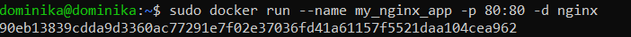

3. Uruchamianie oprogramowania:
- Uruchomienie kontenera jako poda poleceniem `minikube kubectl run -- my-nginx-app --image=nginx --port=80 --labels app=my_nginx_app` oraz wykazanie jego działania poprzez `kubectl get pods`;
    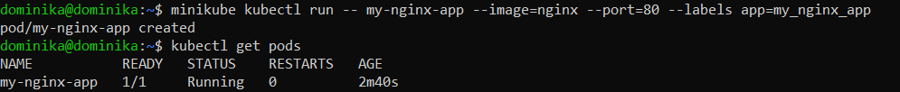
- Wyprowadzenie portu oraz przetestowanie działania aplikacji za pośrednictwem komendy `kubectl port-forward my-nginx-app 2222:80`;
    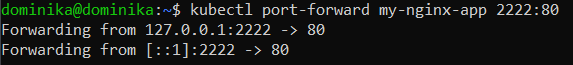
    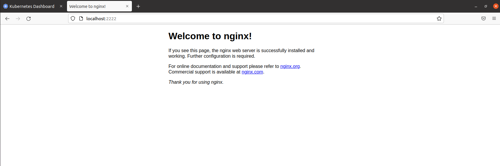

4. Przekształcenie wdrożenia manualnego w plik wdrożenia:
- Utworzenie pliku *deploy.yaml* realizującego operację wdrożenia;
    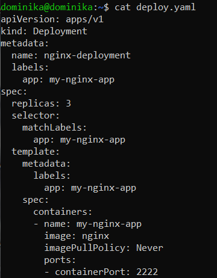
- Zaaplikowanie wprowadzonych zmian przy pomocy polecenia `kubectl apply -f deploy.yaml`;
    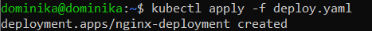
- Sprawdzenie poprawności wdrożenia zmian za pośrednictwem `kubectl get pods -o wide`;
    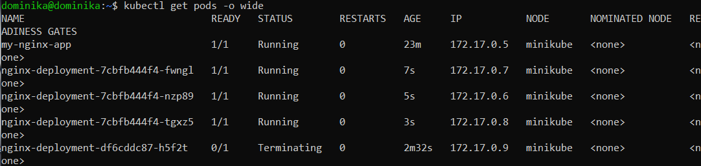
    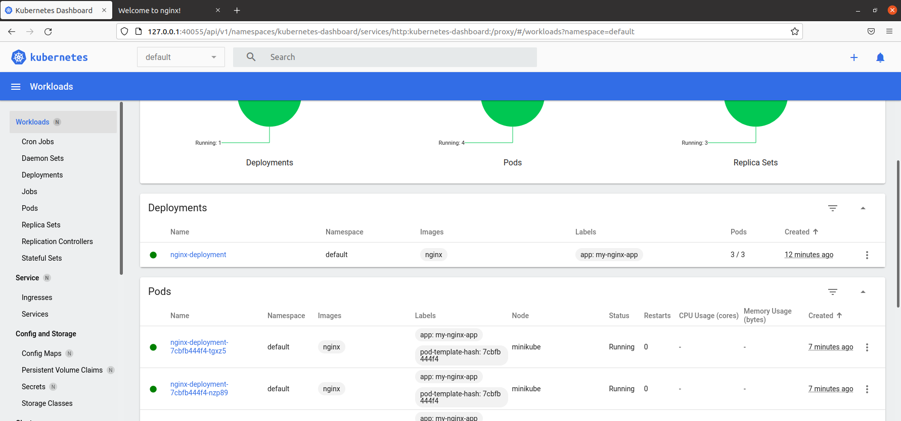

## Wnioski
Korzystanie ze środowiska Kubernetes pozwala na znaczną automatyzację pracy z wdrażaniem oprogramowania oraz wygodne zarządzanie projektem. Minikube jest lokalnym odpowiednikiem Kubernetesa. Może pracować na kontenerach Dockerowskich i pozwala na łatwe opanowanie oferowanych przez niego narzędzi w celu przygotowania się do dalszej i bardziej zaawansowanej pracy z aplikacją.