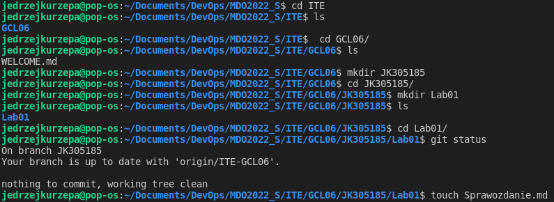
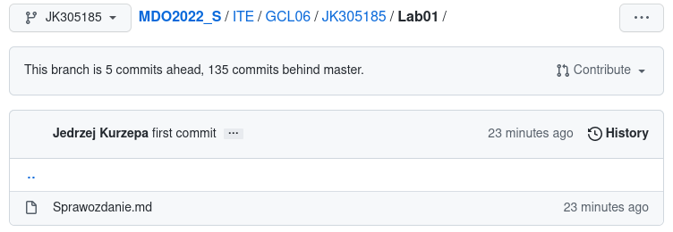

# Sprawozdanie Lab01
### Jędrzej Kurzępa IT Gr06

1. W pierwszym korku wykorzystano natywnie zaistalowanego klienta Git oraz skonfigurowano obsługę kluczy SSH.
Prywatny klucz SSH zabezpieczony hsałem dodano jako metodę dostępu do GitHuba z poziomu aplikacji.


1. Sklonowano repozytorium wykorzystując komendę (SSH): 
**git clone git@github.com:InzynieriaOprogramowaniaAGH/MDO2022_S.git**

3. Przełączono się na gałąź main przy pomocy komendy **git checkout main**, a następnie na gałąż grupy 6. 
4. Nasępnie utworzono gałąź o zadanej nazwie (JK305185), w niej katalog, a w nim kolejny katalog Lab_1, zawierajacy plik o rozszerzeniu .md oraz wykorzystawanego przez niego screenshoty dokumentujące pracę. 
   

5. Wykorzstując komendę **git commit** oraz **git push origin HEAD** przesłano zmiany do zdalnego źródła zweryfikowano w przeglądarce czy działania powiodły się. 
6. Dodano zauktualizowną werję sprawozdania.

### Terminal history
```
   50  git branch
   51  git branch main
   52  git branch 
   53  git checkout main
   54  git checkout -b JK305185 origin/ITE-GCL06
   55  ls
   56  cd ITE
   57  ls
   58  mkdir JK305185 
   59  cd JK305185/
   60  mkdir Lab01
   61  ls
   62  cd Lab01/
   63  git status
   64  touch Sprawozdanie.md
   65  ls
   66  git status
   67  git add .
   68  ls
   69  git commit -m "first commit"
   70  git push origin HEAD 
   71  git branch
   72  git add .
   73  ls
   74  git push origin HEAD 
   75  ls
   76  git commit -m "second commit"
   77  git push origin HEAD 
   78  git add .
   79  git commit -m "third commit"
   80  git push origin HEAD 
   81  git add .
   82  git commit -m "third commit"
   83  git push origin HEAD 
   84  ls -al
   85  history

   ```