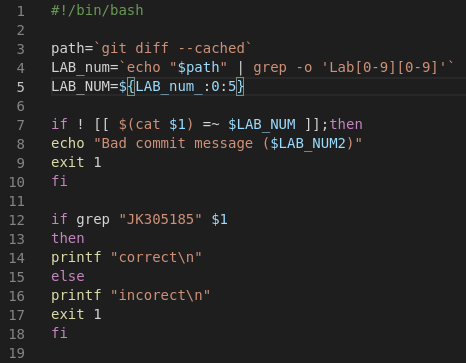
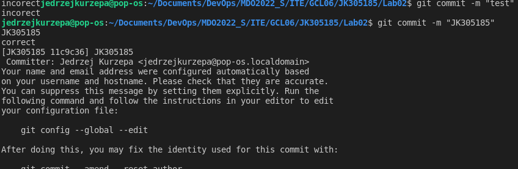
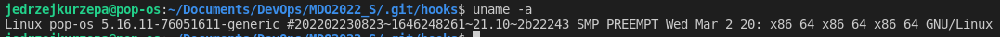
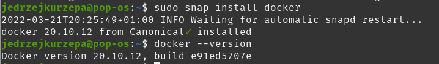
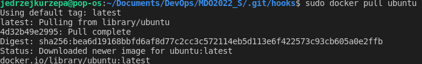
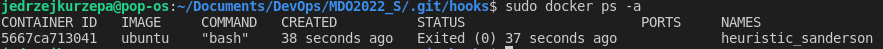
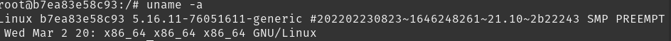

# Sprawozdanie Lab01
### Jędrzej Kurzępa IT Gr06

1. Wejście do ukrytego folderu .git zawierającego folder hooks. Następnie modyfikowany plik *commit-msg.sample* tj. skopowiono oraz zmodyfikowano zawartość, na koniec zapisano jako commit-msg. Do pliku commit.msg przypisano uprawnienia 744, aby mógł być plikiem wykonywalnym. 




2. Podczas wykonywania zadań, nie wykorzystywano maszyn wirtualnych, a natywanie zaistalowanego systemu PopOS (bazującego na ubutnu). 


3. Następnie wykorzystując manager pakietów "snap" zaisntalowano Dockera w wersji 20.10.12. 
4. Wykorzystując komendę sudo docker pull ubuntu zainstalowano system ubuntu w kontenerze.
5. Interaktywnie połączono się z kontenerem docera, wcześniej nazywanym moje_ubuntu i wypisano wersję systemu.
6. Pomyślnie arejestrowano się na stronie dockerHub. 
   

### Terminal history
```
  132  sudo snap install docker
  133  docker --version
  134  sudo docker run --name moje_ubuntu -it ubuntu 
  139  touch Sprawozdanie.md
  140  ls
  141  git branch 
  142  ls -l
  143  cd ..
  144  ls -l
  145  ls -la
  146  ls -l .git
  147  ls -l .git/hooks
  148  code commit-msg.sample
  149  gedit commit-msg.sample
  150  cd .git/hooks
  151  gedit commit-msg.sample
  152  cp commit-msg.sample commit-msg
  153  ls
  154  gedit commit-msg.sample
  155  gedit commit-msg
  156  gedit commit-msg.sample
  157  gedit commit-msg
  158  ks
  159  ls
  160  chmod 744 commit-msg
  161  ;s
  162  ls
  163  gedit commit-msg
  164  version
  165  whoami
  166  uname
  167  uname -a
  168  gedit commit-msg
  169  sudo systemctl status Docker
  170* 
  171  sudo systemctl status docker
  172  gedit commit-msg
  173  sudo docker pull ubuntu
  174  sudo docker ps
  175  sudo docker status
  176  sudo docker images
  177  sudo docker run ububtu
  178  sudo docker run ubuntu
  179  sudo docker ps -a

   ```