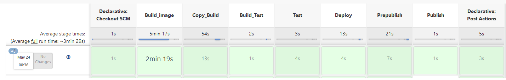

# Sprawozdanie Lab05
## Jędrzej Kurzępa, Informatyka Techniczna 
### Realizacja laboratorium

1. Pierwszym etapem było uruchomienie jenkinsa (analogicznie do poprzedniego laboratorium). Poprzednie laboartoria był rozwiązywane wykorzystując natwyny system PopOS!, jednak przez liczne problemy z instalacją Jenkinsa wykrozystano WSL, Docker na Windows oraz system Ubuntu.

```
docker run \
  --name jenkins-docker \
  --detach \
  --privileged \
  --network jenkins \
  --network-alias docker \
  --env DOCKER_TLS_CERTDIR=/certs \
  --volume jenkins-docker-certs:/certs/client \
  --volume jenkins-data:/var/jenkins_home \
  --publish 2376:2376 \
  docker:dind \
  --storage-driver overlay2
```
2. Repozytorium źródłowe zforkowano, oraz dodano do niego elementy związane z cmake. (https://github.com/kurzepajedrzej/calculator.git)
3. Stworzono dwa pliki Dockerfile-b oraz Dockerfile-t.

Dockerfile-b:
```
FROM ubuntu:latest

RUN apt-get update && apt-get -y install cmake
RUN apt-get -y install git
RUN apt-get -y install gfortran 
RUN git clone https://github.com/kurzepajedrzej/calculator.git
RUN apt-get -y install gcc
RUN apt -y install build-essential

WORKDIR "/calculator"
RUN cmake .
RUN make 
```
Dockerfile-t:
```
FROM appbuildimage:latest

RUN make test

```
4. ruchomiono kontener z Jenkinsem oraz zalogowano się i zainstalowano dodatkowe wtyczki.

5. Stworzono odpowiedni Jenkinsfile

```
pipeline {
    agent any
    parameters{
        booleanParam(name: 'PROMOTE', defaultValue: false, description: 'should publish')
    }
    stages {
        stage('Build_image') {
            steps {
                script {    
                    env.GIT_COMMIT_REV = sh(returnStdout: true, script: "git log -n 1 --pretty=format:'%h'").trim()
                }
                sh "docker build --file Dockerfile-b --tag appbuildimage:latest ."
                sh "docker volume create invol"
                sh "docker volume create outvol"
            }     
        }
        stage('Copy_Build') {
            agent {
                docker {
                    image'appbuildimage:latest'
                    args '-v invol:/input  -v outvol:/output  --user root'
                    reuseNode true
                    }
                }
            steps {
                sh 'rm -rf /input/*'
                sh 'rm -rf /output/*'
                sh 'cp -r /calculator/*  /input/'
                sh 'cp -r  /calculator/src /output/'   
                sh 'cp -r  /calculator/test /output/'
                sh 'cp -r  /calculator/CMakeLists.txt /output/'
                sh 'cp -r  /calculator/bin /output/'
                sh 'cp -r  /calculator/CMakeFiles /output/'
                sh 'cp -r  /calculator/Makefile /output/'
                sh 'cp -r  /calculator/CTestTestfile.cmake /output/'
                sh 'cp -r  /calculator/lib /output/'
               // sh 'cp -r  /calculator/instruction.txt /output/'
            }
        }
        stage('Build_Test') {
        
            steps {
                sh "docker build --file Dockerfile-t --tag apptestimage:latest ."
            }
        }
        stage('Test') {
             agent {
                docker {
                    image'apptestimage:latest'
                    args '-v invol:/input  -v outvol:/output  --user root'
                    reuseNode true
                    }
                }
            steps {
                sh 'cd /output && make test' 
     
            }
        }
        stage('Deploy') {
             agent {
                docker {
                    image'apptestimage:latest'
                    args '-v outvol:/output  --user root'
                    reuseNode true
                    }
                }
            steps {
                sh 'cd /output/bin &&  ./calculator.x' 
            }
        }
         stage('Prepublish') {
             agent {
                docker {
                    image'apptestimage:latest'
                    args '-v invol:/input  -v outvol:/output  --user root'
                    reuseNode true
                    }
                }
            steps {
                sh 'rm -rf publish_folder'
                sh 'rm -rf checksum.txt'
                sh 'mkdir  publish_folder'
                sh 'rm -f publish_folder*.tar.gz'
                sh 'cp -r /output/src ./publish_folder/' 
                sh 'cp /output/CMakeLists.txt ./publish_folder/'
                sh 'cp /output/Makefile ./publish_folder'
            }
        }
         stage('Publish') {
             when{
                 environment name: 'PROMOTE', value: 'true'
             }
            steps {

                sh 'tar -zcvf publish_folder${GIT_COMMIT_REV}.tar.gz ./publish_folder'
                sh 'cat publish_folder${GIT_COMMIT_REV}.tar.gz | sha512sum > checksum.txt'
                archiveArtifacts artifacts: 'publish_folder*.tar.gz', fingerprint: true   
                archiveArtifacts artifacts: 'checksum.txt', fingerprint: true      
            }
        }
    }
    post{
        always{
           
            sh 'docker rmi appbuildimage'   
            sh 'docker rmi apptestimage'
        }
    }
}

```

6. Przygotowano projekt wykorzystując Jenkinsfile oraz opcję  `pipeline from scm`. Ponadto dodano link do repozytorium uzupełnione Jenkinsfile oraz dwa Dockerfile opisane powyżej.

7. Pomyślnie udało się stworzyć paczkę(wystąpił poprzednio jeden błąd jednak udało się go poprawić) `.tar.gz`.
   



8. Dodano także krótką instrukcję obsługi.

```
Należy mieć pobrane narzędzie Cmake, kompilator c, kompilator Fortran oraz paczkę build-essential.

sudo apt install build-essential 
sudo apt install fortran
sudo apt install cmake
 
Następnie usunąć z pliku Makefile elementu odpowiedzialny za przeprowadzanie testów (optymalnie wykomnetować) aby make zaczęło działać

Następnie uruchmoić make

```


