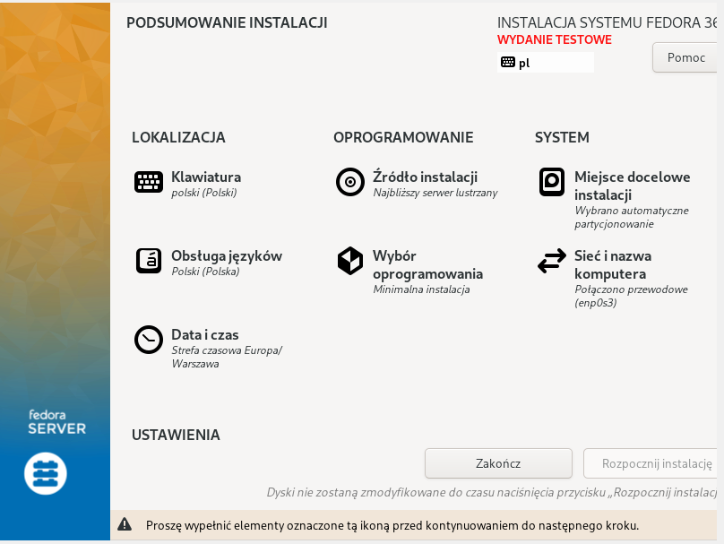
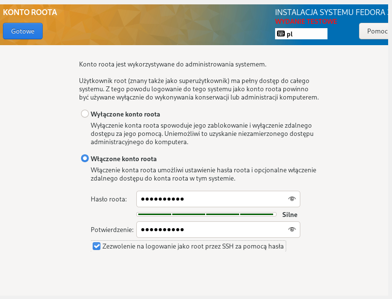
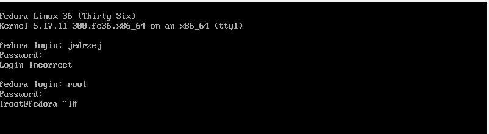
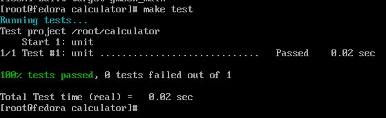
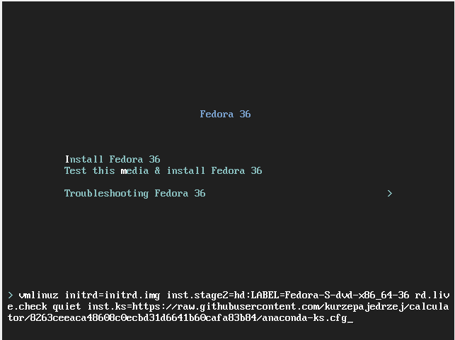
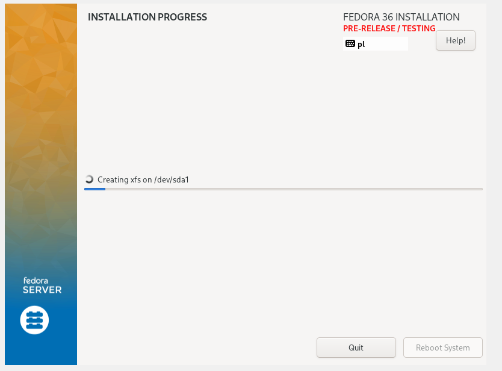
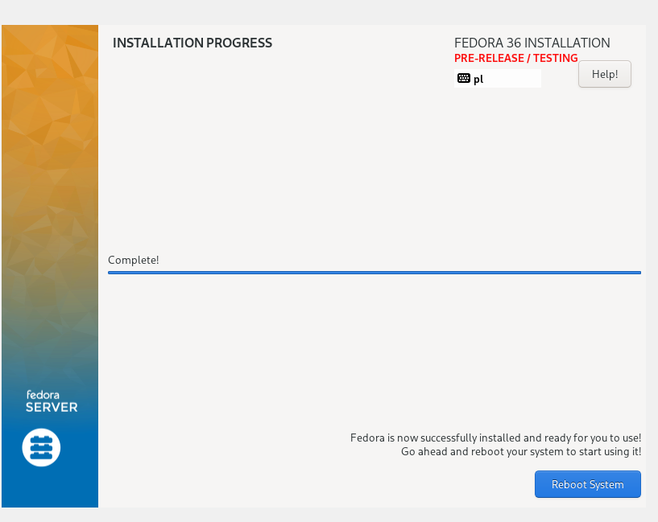
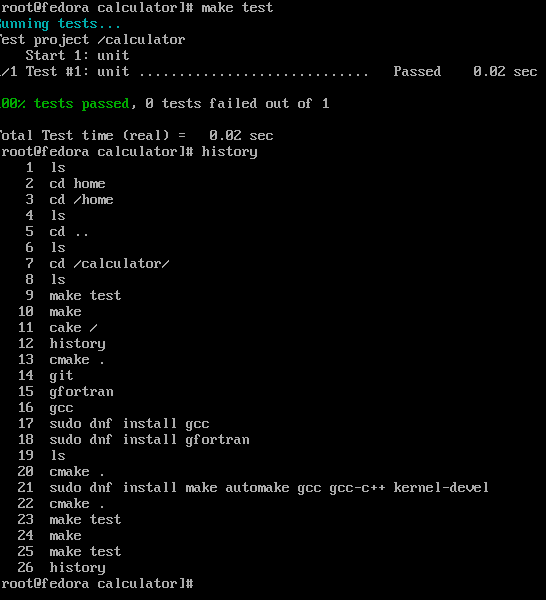

# Sprawozdanie lab09
## Jędrzej Kurzępa IT GR06

### Instalacja ręczna
1.  W pierwszym kroku pobrano plik iso zawierający obraz najnowszej wersji systemu Fedora.
2. Rozpoczęto tworzenie wirtualnej maszyny oraz instalacje system.    
3. Po instalacji systemu zainstalowano git, cmake, gfortran oraz build-essential. 	
```
sudo dnf -y update
sudo dnf -y install git
sudo dnf -y install gfortran
sudo dnf -y install cmake
sudo dnf install make automake gcc gcc-c++ kernel-devel
```
4. Sklonowano repozytorium:
  ``` https://github.com/kurzepajedrzej/calculator```
5. Następnie wykorzystano następujące komendy do zbuildowania, uruchomienia oraz przetestowania aplickacji.
```
cmake. 
make
make test
```
6. Poprawne przejście testu



### Instalacja automatyczna

1. Do instalacji wykorzystano plik .cfg z poprzeniej instalacji. Podczas uruchamiania maszyny, należy nacisnąć tab oraz dodać po quiet scieżkę inst.ks=link_do_anaconda-ks.cfg, plik został dodany do repozytorium na github. 





2. Treść pliku anaconda-ks.cfg
  
```
# Generated by Anaconda 36.16.2
# Generated by pykickstart v3.36
#version=F36
# Use graphical install
graphical

# Keyboard layouts
keyboard --vckeymap=pl --xlayouts='pl'
# System language
lang en_US.UTF-8

%packages
@^minimal-environment

%end

# Run the Setup Agent on first boot
firstboot --enable

# Generated using Blivet version 3.4.3
ignoredisk --only-use=sda
autopart
# Partition clearing information
clearpart --none --initlabel

# System timezone
timezone Europe/Warsaw --utc

# Root password
rootpw --iscrypted $y$j9T$M3YweO2zB0DNShqUQYZAkLuf$Gbz8v3QBdrLX3TMaXOgkkC1/vqcxLemvBncHA7bgdB8

# Repo
url --mirrorlist=http://mirrors.fedoraproject.org/mirrorlist?repo=fedora-$releasever&arch=x86_64
repo --name=updates --mirrorlist=http://mirrors.fedoraproject.org/mirrorlist?repo=updates-released-f$releasever&arch=x86_64

%post

	# Change to a vt to see progress

	exec < /dev/tty3 > /dev/tty3
    sudo dnf -y update
    sudo dnf -y install git
    sudo dnf -y install gfortran
    sudo dnf -y install cmake
    sudo dnf install make automake gcc gcc-c++ kernel-devel
    cd ..
    cd home
    git clone https://github.com/kurzepajedrzej/calculator.git
    cd calculator 
    cmake .
    make
    make test
	
%end

```
3. Instalacjia automaczyna przebiegła pomyślnie jednak, przez mały błąd aplikacja nie została pmyślnie zbuildowana. Błędę był brak komendy "sudo dnf install make automake gcc gcc-c++ kernel-devel". Po uruchomieniu tej komendy wszystko zostało pomyślnie zbuildowane oraz uruchomione. Nie przeprowadzano instalacji po raz drugi, ponieważ błąd został znaleziony oraz skorygowany. Plik anaconda-ks.cfg zamieszczony w sprawozdaniu jest plikiem poprawionym oraz komplentym. 
4. Elementem, który można uznać za niezgodny z instrukcją jest stworzenie tylko użytkownika root ( przypadkowe pominięcie podczas instalacji).

