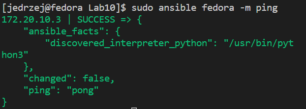
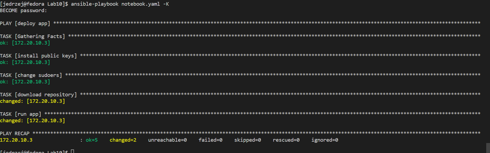
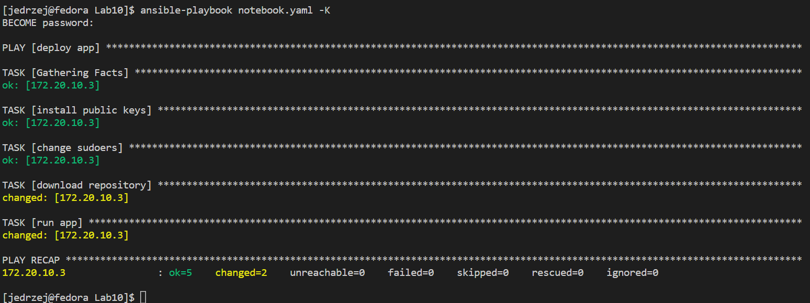

# Sprawozdanie lab10
## Jędrzej Kurzępa IT GR06

### Ansible bez klucza ssh
1. Laboratorium zostało wykonane na dwóch uprzednio utworzonych oraz skonfigurowanych maszynach wirtualnych z systemem Fedora. Maszyny posiadały komponenty potrzebne do zbudowania oraz uruchomienia programów. 
2. Przetestowano działanie połączenie z drugą maszyną wirtualną poprzez komendę
   `ping 172.20.10.3`
Po pozytywnym wyniku połączenia wykonano następne kroki.
3. Zainstalowano Ansible.
`sudo dnf install ansible`
4. Stworzono plik konfiguracyjny ansible.cfg
```
[defaults]
inventory=inventory
host_key_checking=False
```
5. Stworzono plik inventory zawierający informacje o docelowych hostach.
```
[fedora]
172.20.10.3

[fedora:vars]
ansible_ssh_user=jedrzej
ansible_ssh_pass=kloaka150
```
6. Następnie wykonano ping do hosta, wykorzystując ansible przy użyciu następującej komendy.
   ` ansible fedora -m ping`
   
7. Utworzono playbook o nazwie `notebook.yaml`, z zawartością taką jak poniżej(utworzony notebook był uniwersalny dla metody bez klucza ssh oraz tej z kluczem ssh(klucz ssh wygenerowano wcześniej)): 
``` 
   ---

- name: deploy app
  hosts: fedora
  become: yes
  tasks:
    - name: install public keys
      ansible.posix.authorized_key:
        user: jedrzej
        state: present
        key: "{{  lookup('file', '/home/jedrzej/.ssh/id_rsa.pub') }}"
    - name: change sudoers
      ansible.builtin.lineinfile:
        path: /etc/sudoers
        state: present
        regexp: '^%sudo'
        line: '%sudo ALL=(ALL) NOPASSWD: ALL'
        validate: /usr/sbin/visudo -cf %s
    - name: download repository
      shell:
        cmd: rm -rf lab_ansible && git clone https://github.com/kurzepajedrzej/lab_ansible.git && cd lab_ansible && unzip publish_folder00b12e9.zip
        chdir: /home
    - name: run app
      shell:
        cmd: cmake . && make && cd bin && ./calculator.x
        chdir: /home/lab_ansible/publish_folder00b12e9/publish_folder
```
8. Objaśnienie notebooka: Na github w nowym repozytorium dodano paczkę .zip zawierającą odpowiednie pliki (wygenerowane przez Jenkinsa). W przedostatnim kroku pobierane i wypakowywany jest program oraz w ostatnim kroku jest uruchamiany. Na poniższym screenshocie widać pomyślne przejście wyszystkich tasków. 



### Ansible z kluczem ssh

1. Aby wykonać ten krok, z uprzednio przygotowanym notebookiem (był uniwesalny ponieważ dwa pierwsze kroki odnosiły się do opcji z wykorzystaniem klucza ssh oraz usunięcia potrzeby używania sudo ponieważ przy połączeniu przy użyciu klucza nie używa się hasła)oraz wygenerowanym kluczem ssh, wystarczyło delikatenie zmodyfikować plik inventory(poniżej zmodyfikowany inventory).
```
[fedora]
172.20.10.3

[fedora:vars]
ansible_ssh_user=jedrzej
ansible_ssh_private_key_file=/home/jedrzej/.ssh/id_rsa
```

Wiersz zawierający hasło zastąpiono wierszem prowadzącym do ścieżki zawierającej klucz ssh. Poniżej wykonanie play booka 



2. Treść pliku anaconda-ks.cfg
  
```
# Generated by Anaconda 36.16.2
# Generated by pykickstart v3.36
#version=F36
# Use graphical install
graphical

# Keyboard layouts
keyboard --vckeymap=pl --xlayouts='pl'
# System language
lang en_US.UTF-8

%packages
@^minimal-environment

%end

# Run the Setup Agent on first boot
firstboot --enable

# Generated using Blivet version 3.4.3
ignoredisk --only-use=sda
autopart
# Partition clearing information
clearpart --none --initlabel

# System timezone
timezone Europe/Warsaw --utc

# Root password
rootpw --iscrypted $y$j9T$M3YweO2zB0DNShqUQYZAkLuf$Gbz8v3QBdrLX3TMaXOgkkC1/vqcxLemvBncHA7bgdB8

# Repo
url --mirrorlist=http://mirrors.fedoraproject.org/mirrorlist?repo=fedora-$releasever&arch=x86_64
repo --name=updates --mirrorlist=http://mirrors.fedoraproject.org/mirrorlist?repo=updates-released-f$releasever&arch=x86_64

%post

	# Change to a vt to see progress

	exec < /dev/tty3 > /dev/tty3
    sudo dnf -y update
    sudo dnf -y install git
    sudo dnf -y install gfortran
    sudo dnf -y install cmake
    sudo dnf install make automake gcc gcc-c++ kernel-devel
    cd ..
    cd home
    git clone https://github.com/kurzepajedrzej/calculator.git
    cd calculator 
    cmake .
    make
    make test
	
%end

```
3. Instalacjia automaczyna przebiegła pomyślnie jednak, przez mały błąd aplikacja nie została pmyślnie zbuildowana. Błędę był brak komendy "sudo dnf install make automake gcc gcc-c++ kernel-devel". Po uruchomieniu tej komendy wszystko zostało pomyślnie zbuildowane oraz uruchomione. Nie przeprowadzano instalacji po raz drugi, ponieważ błąd został znaleziony oraz skorygowany. Plik anaconda-ks.cfg zamieszczony w sprawozdaniu jest plikiem poprawionym oraz komplentym. 
4. Elementem, który można uznać za niezgodny z instrukcją jest stworzenie tylko użytkownika root ( przypadkowe pominięcie podczas instalacji).


