# Sprawozdanie Lab_01 Kacper Nosarzewski

## 1. Cel cwiczenia

Celem laboratorium byo wprowadzenie do obsugi serwisu GitHub zbudowanie gałęzi a takze polaczenie sie z nim za posrednictwem kluczy SSH

## 2. Wykonanie cwiczenia
1. Instalacja uslugi Git poleceniem sudo apt-get install git i sprawdzenie zainstalowanej wersji poleceniem git --version

* Instalacja git

 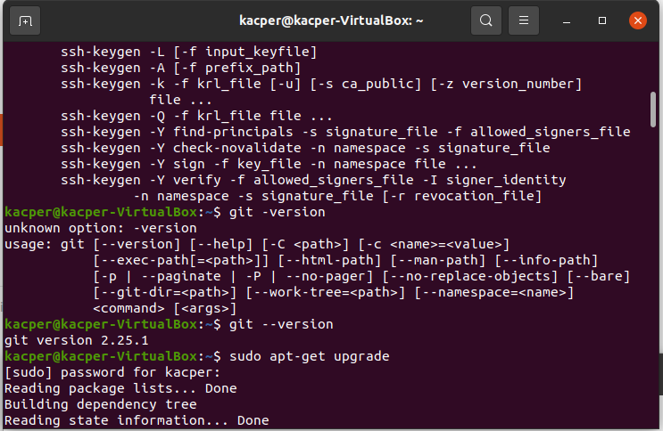

* Sprawdzenie wersji

 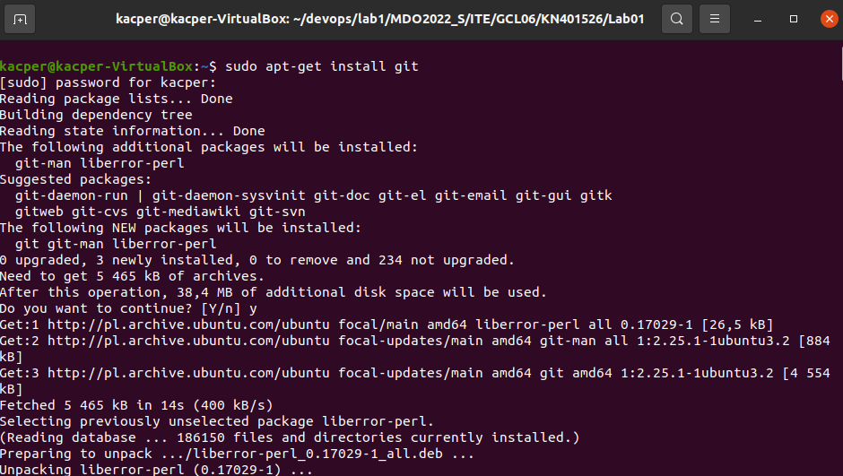

2. Instalacja uslugi ssh poleceniem sudo apt-get install openssh-server

 * Instalacja uslugi ssh

 

 3. Skolonowanie repozytorium za pomoca HTTPS poleceniem git clone https://github.com/InzynieriaOprogramowaniaAGH/MDO2022.git

 * Klonowanie

  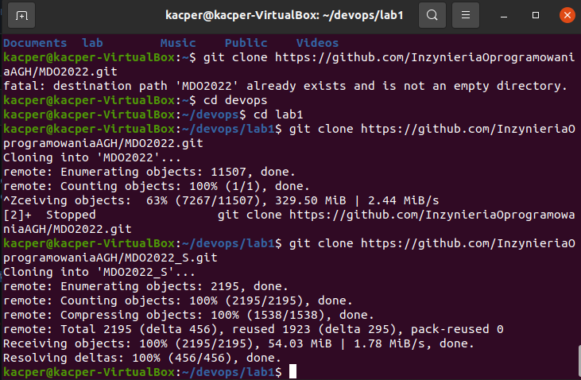
 
 4. Sklonowanie repozytorium za pomoca kluczy SSH

 * Stworzenie kluczy SSH poleceniem ssh-keygen -t ed25519 -C "kacper60nosek@wp.pl" gdzie jeden z nich zostal zabiezpieczony haslem

 
 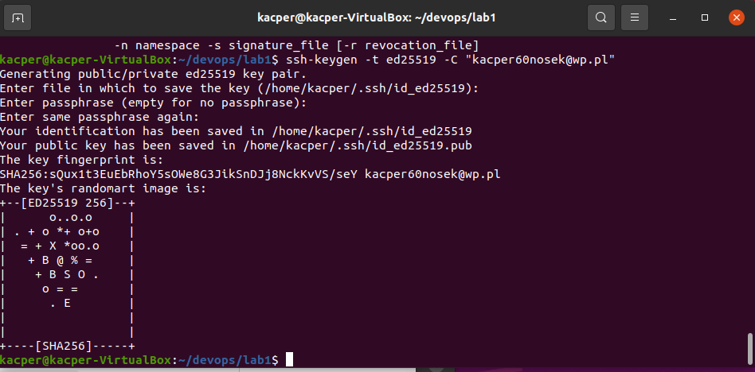

 * Wyswietlenie klucza publicznego poleceniem cat /home/kacper/.ssh/id_ed25519.pub

 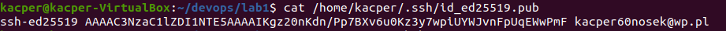

 * Skonfigurowanie klucza w celu sklonowania repozytorium za pomoca SSH

 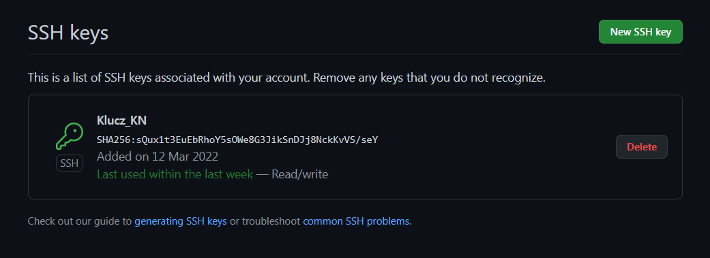

 * Sklonowanie repozytorium za pomoca SSH poleceniem git clone git@github.com:InzynieriaOprogramowaniaAGH/MDO2022_S.git

  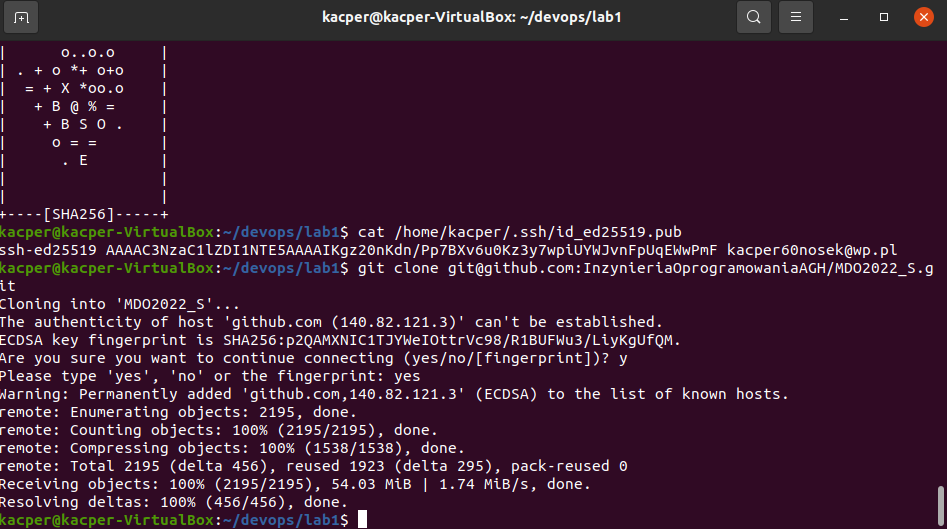

  5. Przejscie z galezi mastrer do main poleceniem git checkout main

  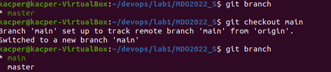

  6. Przejscie z galezi main do cwiczeniowej ITE-GCL06 poleceniem git checkout ITE-GCL06

  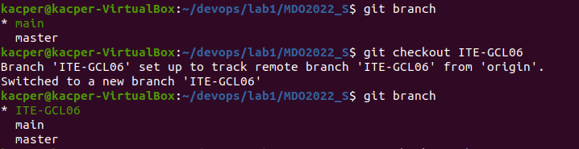

  7. Stworzenie galezi KN401526 i przejscie z main na ta galaz poleceniem git checkout -b KN401526

  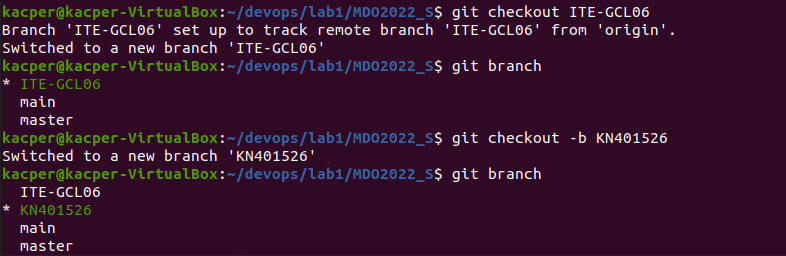

  8. Stworzenie katalogu Lab01 

  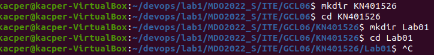

  9. Stworzenie pliku sprawozdanie.md poleceniem code sprawozdanie.md w ktorym zostanie umieszczone sproawozdanie z wykonanego cwiczenia 

  

  10. Praca ze sprawozdaniem aktualizowanie za pomaca polecen git add . oraz git commit -m " "

   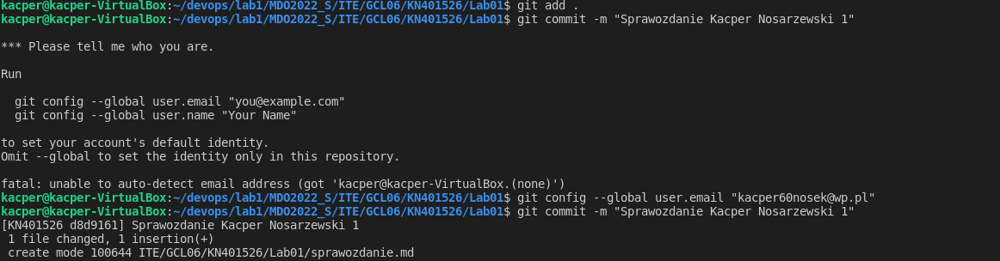
 
  11. Zauktalizowanie zmian poleceniami git pull oraz git push --set-upstream origin KN401526 

   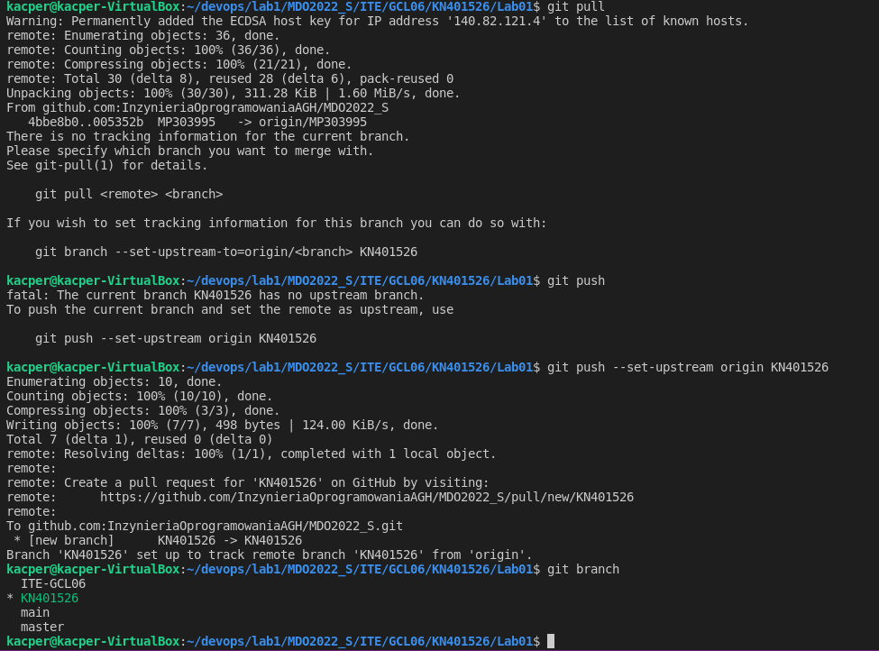

