# Sprawozdanie Lab_2 Kacper Nosarzewski
## 1. Cel cwiczenia

Celem laboratorium bylo przygotowanie srodowiska Dockerowego i zapoznanie sie z jego dzialaniem

## 2. Wykonanie cwiczenia

1. Przygotowanie git hooka rozwiazujacego problemy z commitami 

* Przygotowanie skryptu, poleceniem `cp commit-msg.sample commit-msg`
  zostaje stworzona kopia commit-msg.sample bez rozszerzenia .sample i zmiana uprawnien na plik wykonywalny poleceniem `chmod +x commit-msg`
   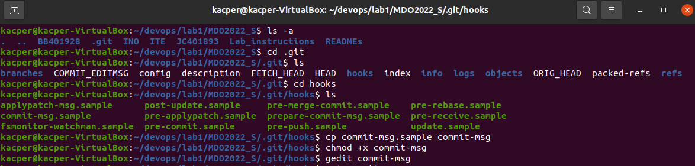

```bash
#!/bin/sh
if [ "$(grep -E -w -o 'KN401526' "$1" | wc -l)" != "1" ]
then
    echo WRONG_COMMIT_NAME
    return 1
fi
if [ $(grep -E -w -o 'Lab[0-20]*' "$1" | wc -l) != "1" ]
then
    echo  ERROR_WRONG_LAB_ID
    return 1
fi
return 0
```
  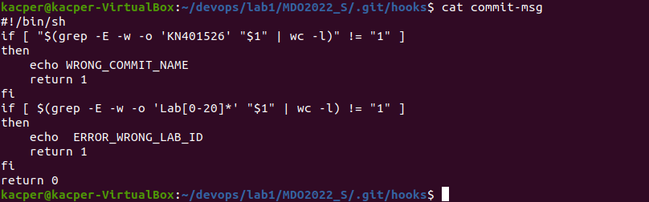
 * Dzialanie git hooka przedstawione poprzez wpisanie zlej wiadomosci w git commit poprawnej jak i zlego Lab_ID

 
  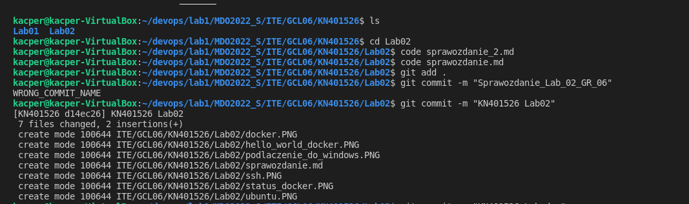
  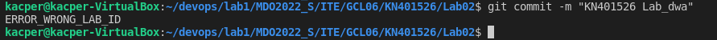

  2. Instalacja i sprawdzenie dzialania Dockera

   * Docker zostal wczesniej zainstalowany co wykazuje polecenie      
  `docker --version`

  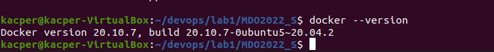
   
   * Sprawdzenie statusu Dockera poleceniem `sysemctl status docker`
   
     Jak widac na ponizszym zrzucie ekranu jest on uruchomiony i dziala poprawnie 

  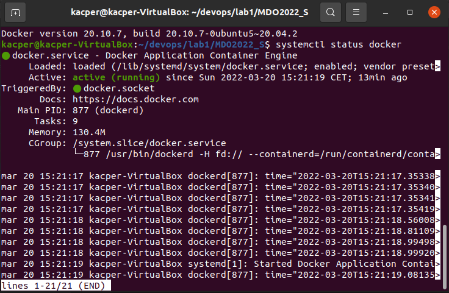

  * Wyswietlenie interfejsu sieciowego poleceniem `ifconfig` w celu nawiaznia polaczenia z Windowsem odbywac sie ono bedzie za pomaca aplikacji putty ze wzgledu na warunki sprzetowe

   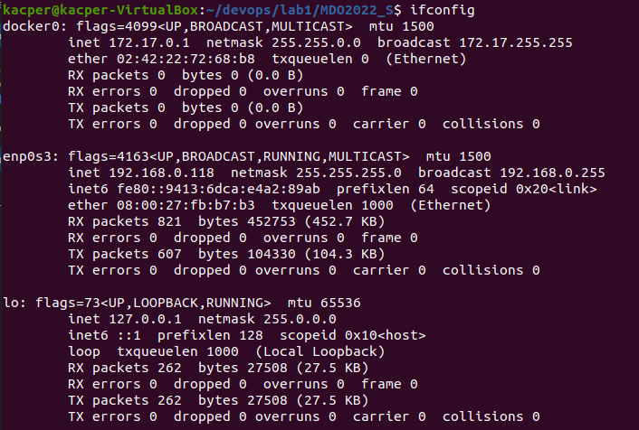
   
   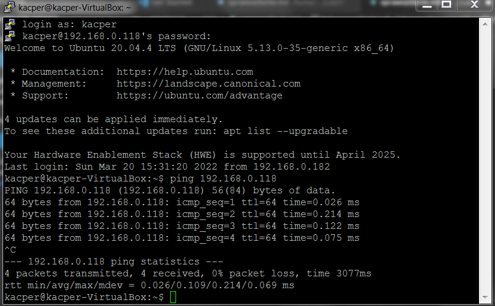

   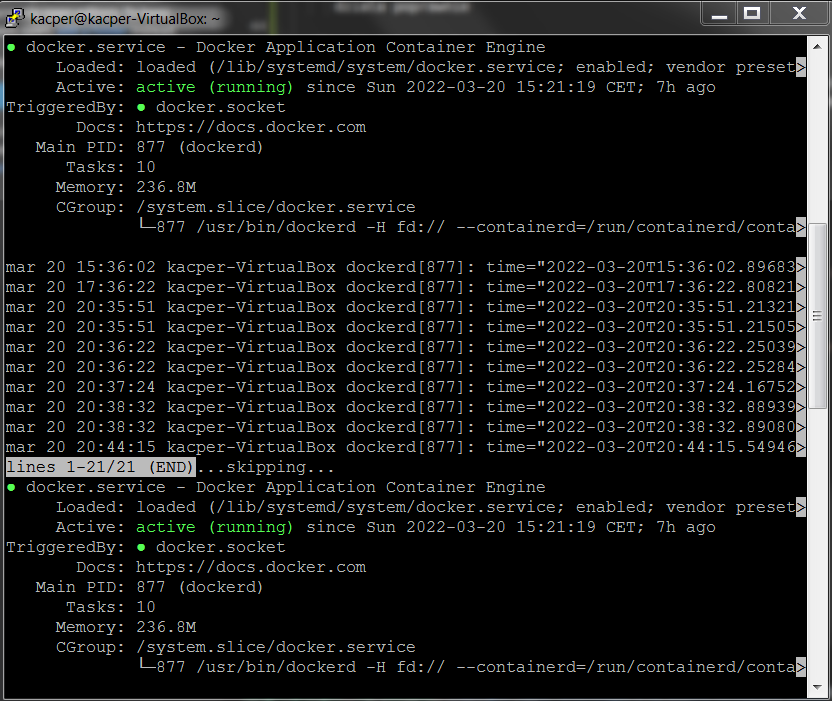
  
   3. Sprawdzenie poprawnosci dzialania srodowiska Dockera
    
 * Pobranie obrazu Ubuntu za pomoca polecenia `sudo docker pull ubuntu`

     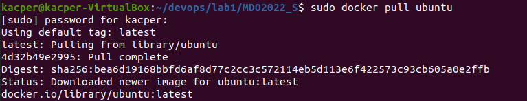

  * Wyswietlenie istniejacych obrazow poleceniem `sudo docker images`

  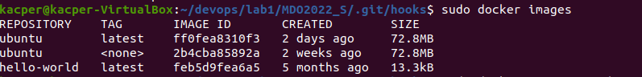

  * Uzywajac polecenia `sudo docker run --name kn_ubuntu -it ubuntu` zostaje stworzony i uruchomiony kontner `kn_ubuntu` oraz sprawdzona zostaje wersja poleceniem `uname -a`

  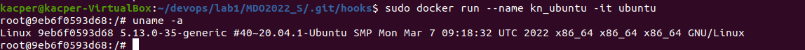

  * Wyjscie z kontenera i sprawdzenie poprawnosci jego dzialnia poleceniem ` sudo docker start kn_ubuntu` oraz sprawdzenie istniejacych kontenerow poleceniem `sudo docker ps`

  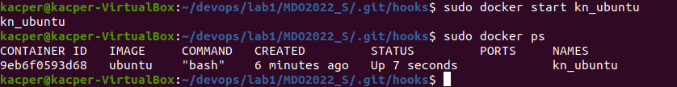

  * Stworzenie konta i zalogowanie sie w serwisie Docker Hub

   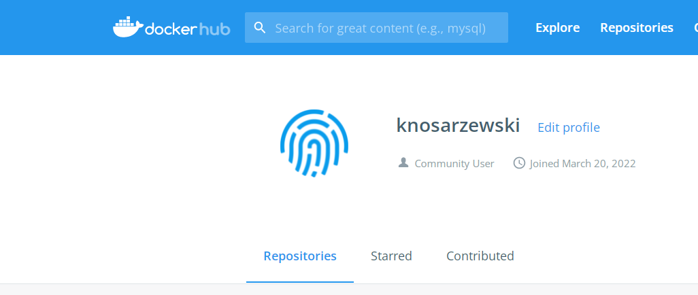