# Sprawozdanie Lab_03 Kacper Nosarzewski

## 1. Cel cwiczenia

Celem laboratorium byo znalezienie repozytorium z licencja open source i przeprowadzenie buildu w kontenerze 

## 2. Wykonanie cwiczenia
1. Wybranie repozytorium typu open source https://github.com/mongo-express/mongo-express
2. Sklonowanie repozytorium za pomoca klucza ssh poleceniem `git clone git@github.com:mongo-express/mongo-express.git`
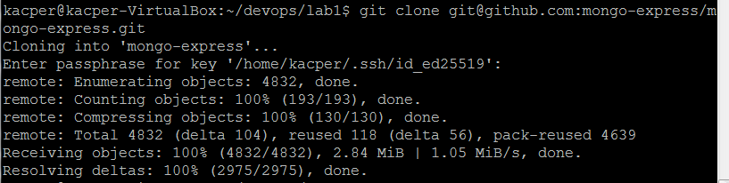
3. Zainstalowanie odpowiednich zaleznosc poleceniem `npm install`
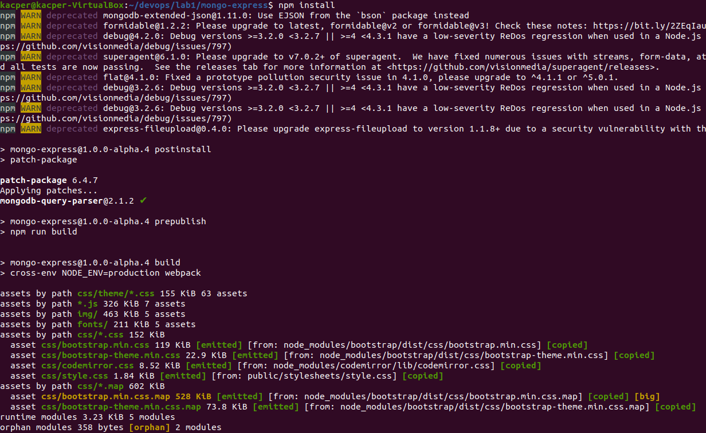
4. Budowanie programu poleceniem `npm run build`
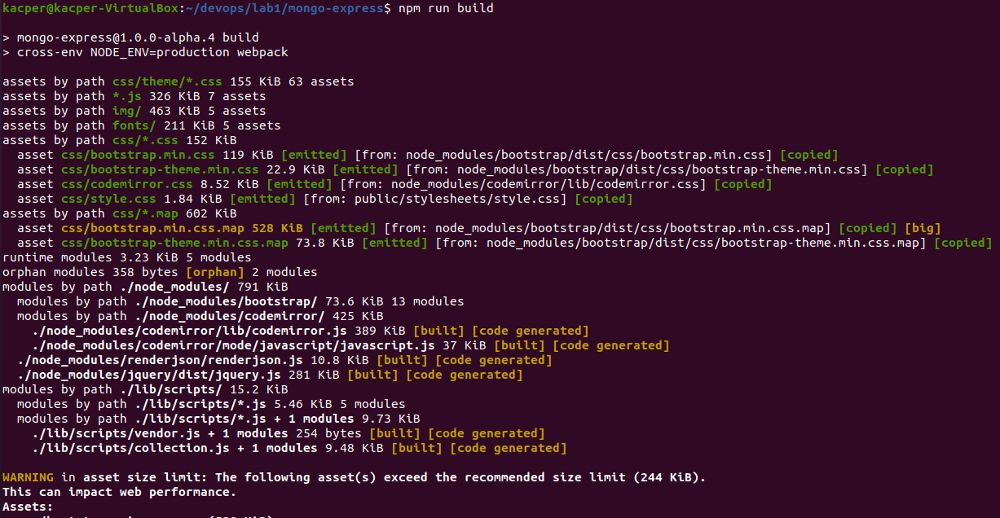
5. Uruchomienie testow poleceniem `npm test`

6. Obraz ubuntu byl juz pobrany na urzadzenie co wykazuje polecenie `sudo docker images`
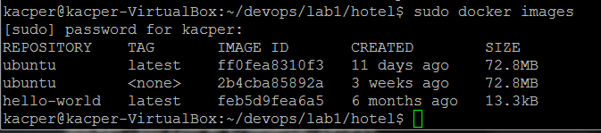
7. Utworzenie i uruchomienie kontenera poleceniem `sudo docker --name KN_node -it ubuntu`
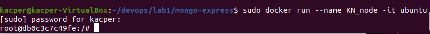
8. Sklonowanie repozytorium po HTTPS do stworzonego kontenera poleceniem `git clone https://github.com/mongo-express/mongo-express.git`
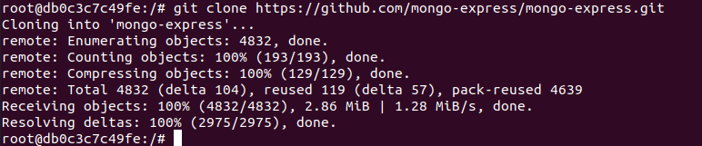
9. Pobranie odpwiednich zaleznosci w kontenerze poleceniem `npm install` po wczesniejszej instalacji pakietu npm poleceniem `apt-get install npm`
 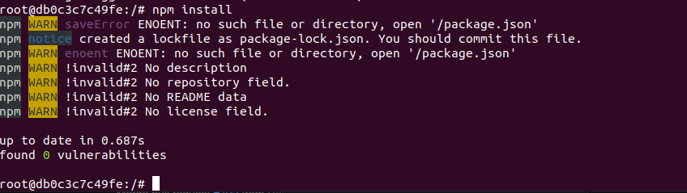
10. Zbudowanie programu w kontenerze poleceniem `npm run build`
 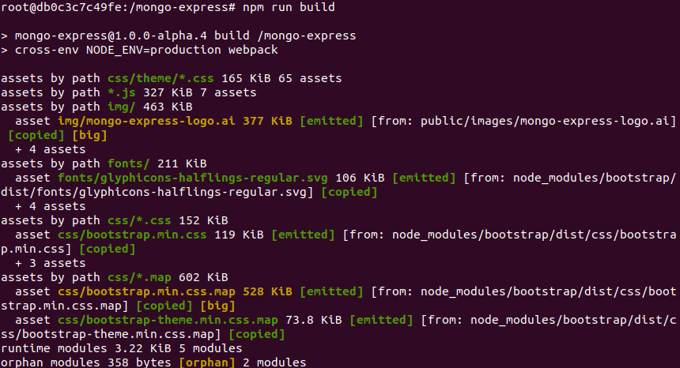
11. Uruchimienie testow w stworzonym kontenerze poleceniem `npm test`
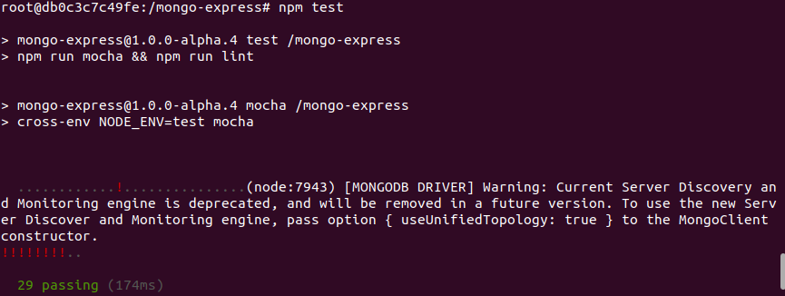
12. Stworzenie pliku Dockerfile1 ktory zawiera polecenia od sklonowania repozytorium do zbudowania programu
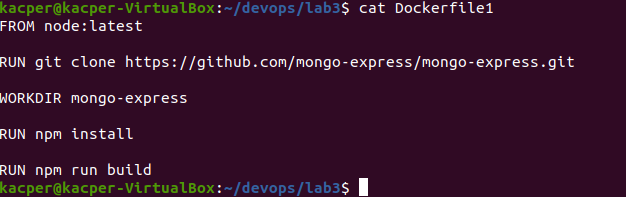
```
FROM node:latest

RUN git clone https://github.com/mongo-express/mongo-express.git

WORKDIR mongo-express

RUN npm install

RUN npm run build

```
12. Stworzenie pliku Dockerfile2 zawierajacego polecenia do testow
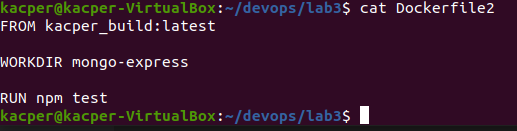

```
FROM kacper_build:latest

WORKDIR mongo-express

RUN npm test

```
13. Uruchomienie pliku do zbudowania programu poleceniem `sudo docker build . -f Dockerfile1 -t kacper_build `
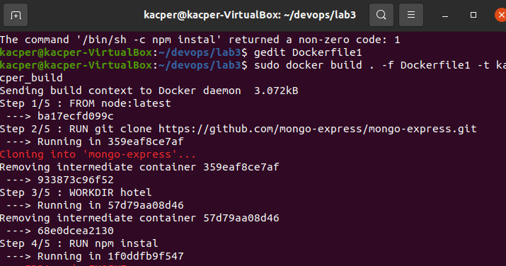
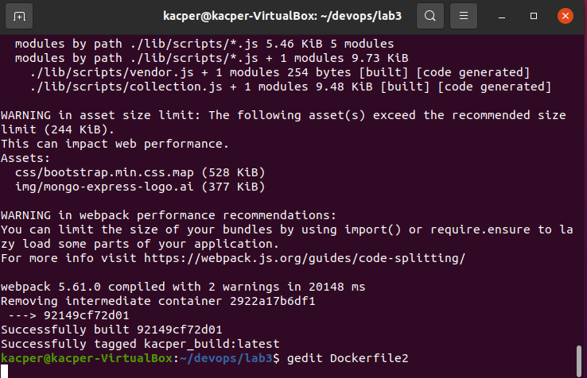
14. ruchomienie pliku do testow poleceniem `sudo docker build . -f Dockerfile2 -t kacper_test`
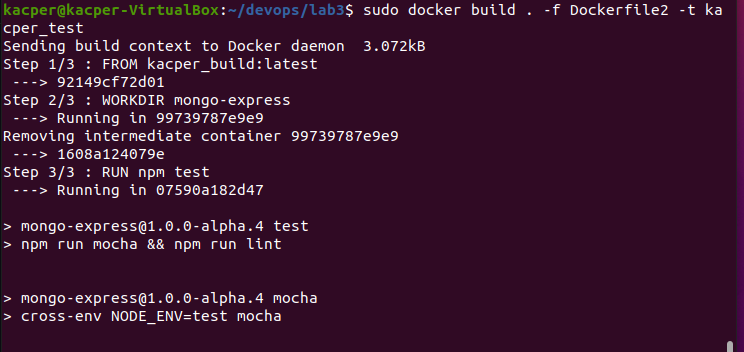
15. Wyswietlenie powstalych obrazow komenda `sudo docker images`
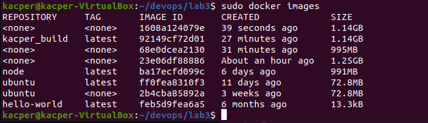
16. Uruchomienie nowego obrazu poleceniem ` sudo docker run -it --name kacper_build kacper_build`
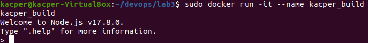