# Sprawozdanie Lab_04 Kacper Nosarzewski
## 1. Cel cwiczenia
Celem labolatorium byla dalsza praca ze srodowiskiem Dockerowym oraz zapoznanie sie z aplikacja Jenkins

## 2. Wykonanie cwicznenia

1. Utworzenie woluminu wejscia i wyjscia poleceniem `sudo docker volume create kacper_in/kacper_out` i sprawdzenie czy sie utworzyly poleceniem `sudo docker volume ls` 
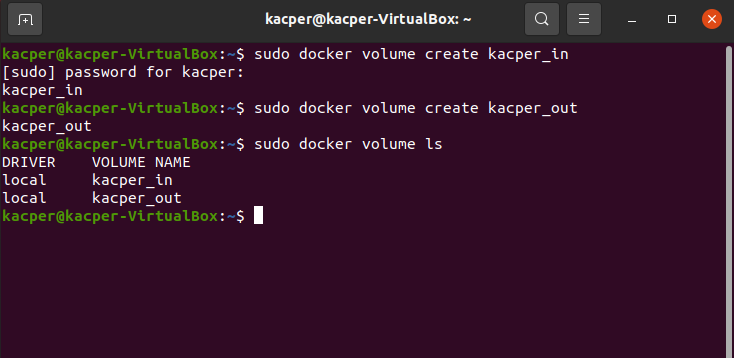 
2. Wyswietlenie szczegolowych informacji voluminu wejsciowego poleceniem `sudo docker inspect kacper_in`
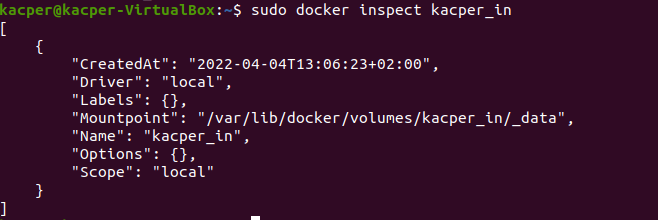
3. Wyswietlenie szczegolowych informacji voluminu wyjsciowego poleceniem `sudo docker inspect kacper_out`
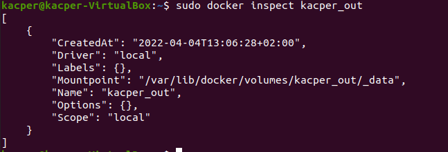
4. Stworzenie i uruchomienie kontenera wraz z podlaczonymi voluminami poleceniem 

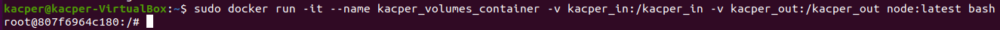

5. Sklonowanie repzytorium uzytego w poprzednim labolatorium `https://github.com/mongo-express/mongo-express`
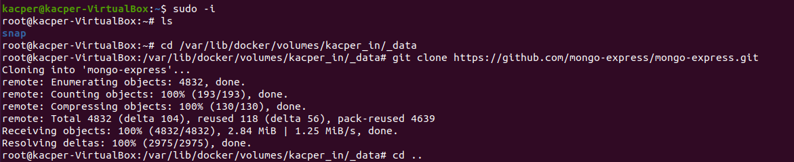

6. Skopiowanie katalogu z repozytorium do kontenera poleceniem `cp kacper_in/mongo-express/ mongo-express -r` 

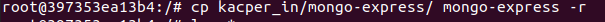
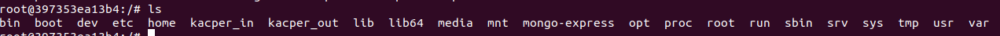
7. Instalacja wymaganych zaleznosci poleceniem `npm install`

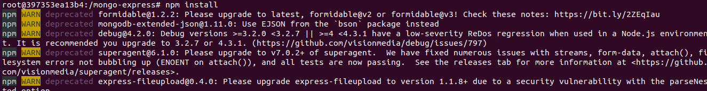
8. Zbudowanie programu poleceniem `npm run build`
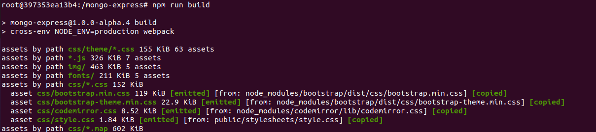
9. Skopiowanie powstalych plikow do voluminu wyjsciowego poleceniem `cp -r mongo-express /kacper_out/`

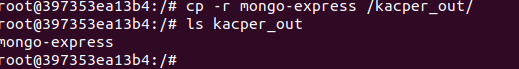

10. Uruchomienie serwera iPerf poleceniem  `sudo docker run -rm -it -p 5201:5201 taoyou/iperf3-alpine:latest`

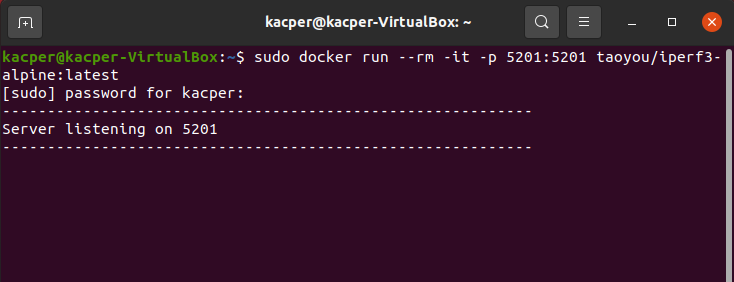

11. Sprawdzenie ip kontenera
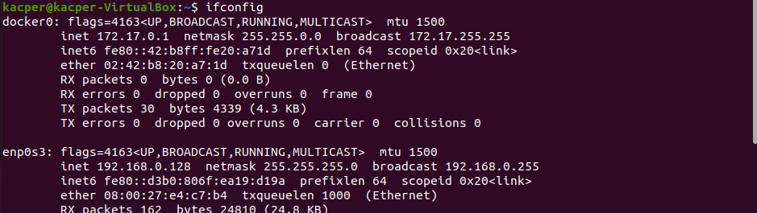

12. Nawiazanie polaczenia kontener-kontener
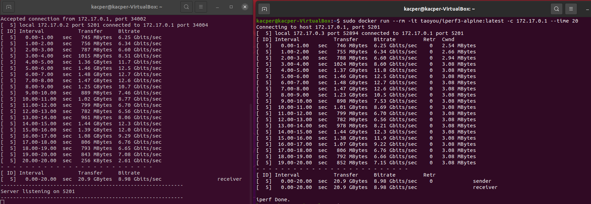

13. Nawiazanie polaczenia host-kontener
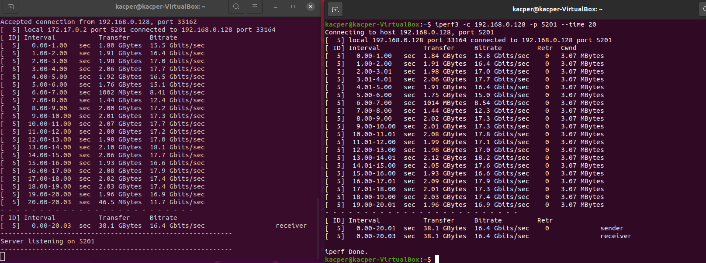
14. Nawiazanie polaczeia z poza hosta
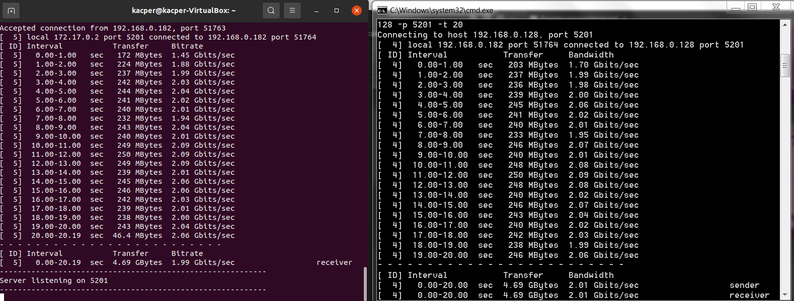
15. Przepustowosc komunikacji Analiza
Analizujac uzyskane dane przepustowosci mozna zauwazyc ze najlepsza przepustowosc ma przesyl z windowsa o wartosci 2.01 Gbits/sec troche wieksza przepustowowcia wykazuje przesyl kontener kontener o wartosci 8.98 Gbits/sec najdluzszym czasem przepustowosci odznacza sie przesyl host kontener z czasem 16.4 Gbits/sec
16. Utworzenie Jenkinsa w w Dockerze poleceniem `sudo docker network create jenkins`
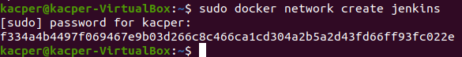
17. Pobranie i uruchomienie obrazu docker:dind
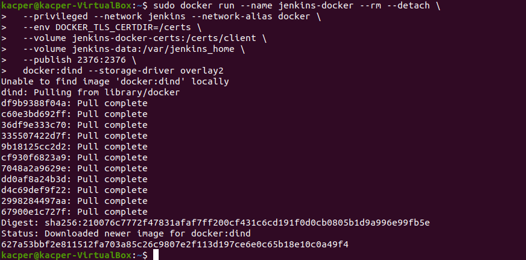
18. Wyswietlenie stworzonego kontenra jenkinsa `sudo docker network ls` i `sudo docker ps`
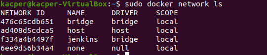

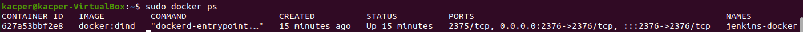
19. Zbudowanie obrazu uzywajac dockerfile Jenkins_Dockerfile
poleceniem `sudo docker build . -f Jenkins_Dockerfile -t myjenkins-blueocean:2.332.1-1`

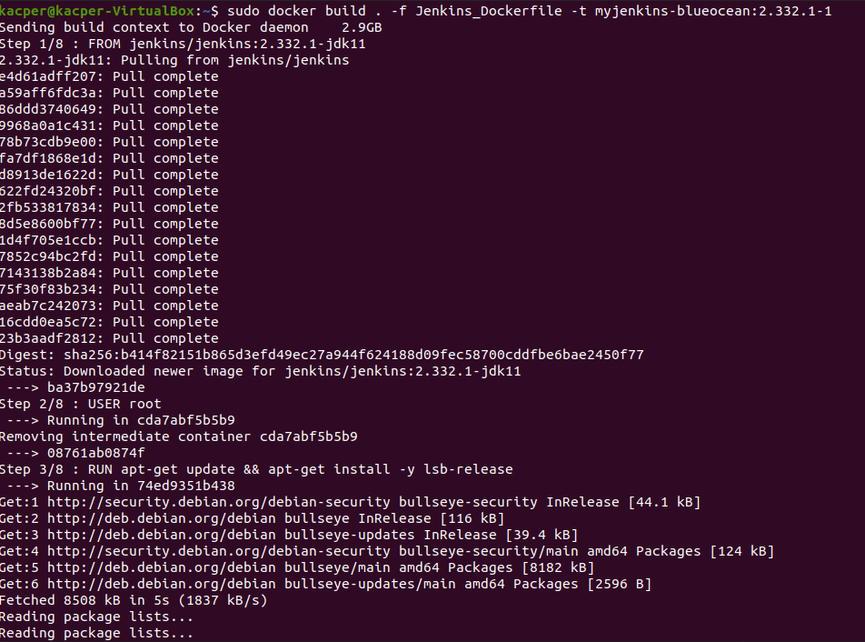
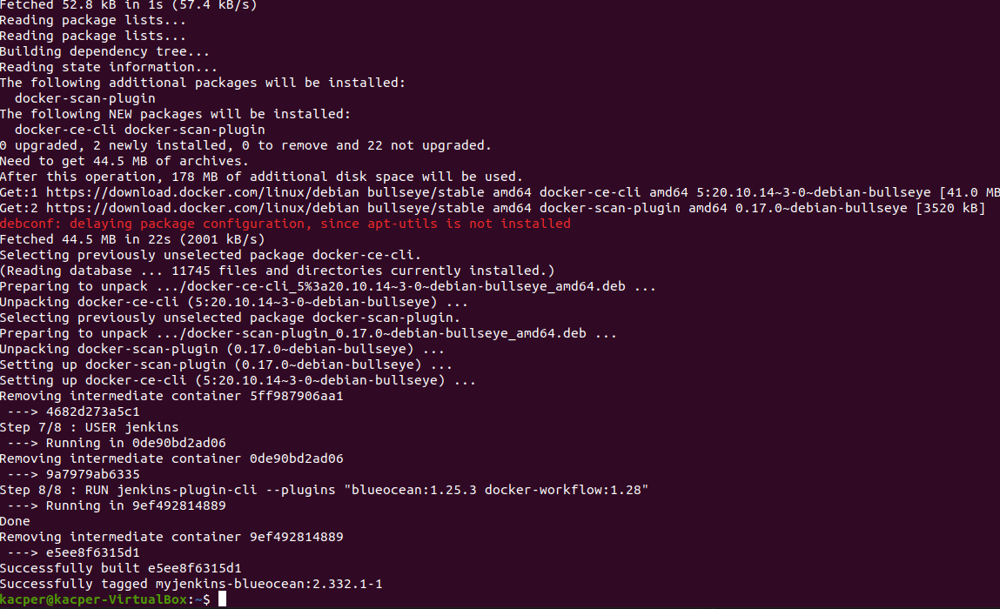
20. Uruchomienie wlasnego obrazu jako kontener

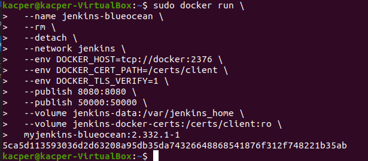

21. Odblokowywanie jenkinsa 
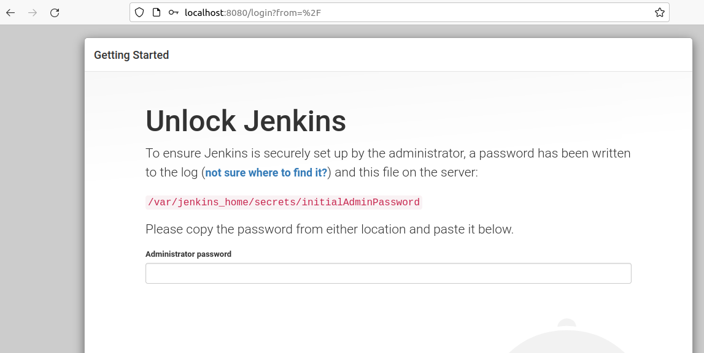
22. Wyswietlenie hasla do odblokowania jenkinsa
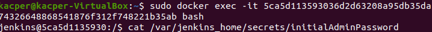
23. Instalacja wymaganych wtyczek
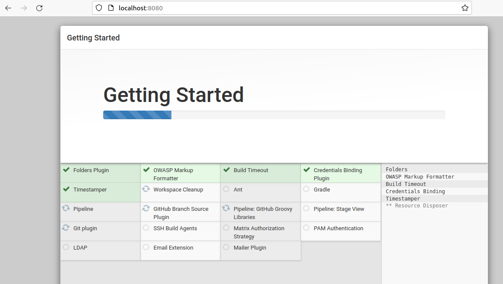
24. Tworzenie nowego uzytkownika
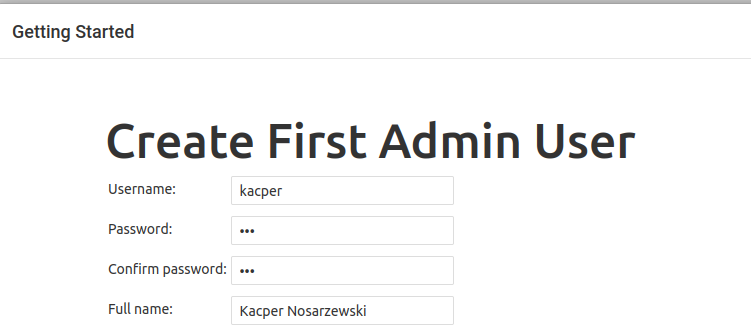

25. Udane utworzenie nowego uzytkownika

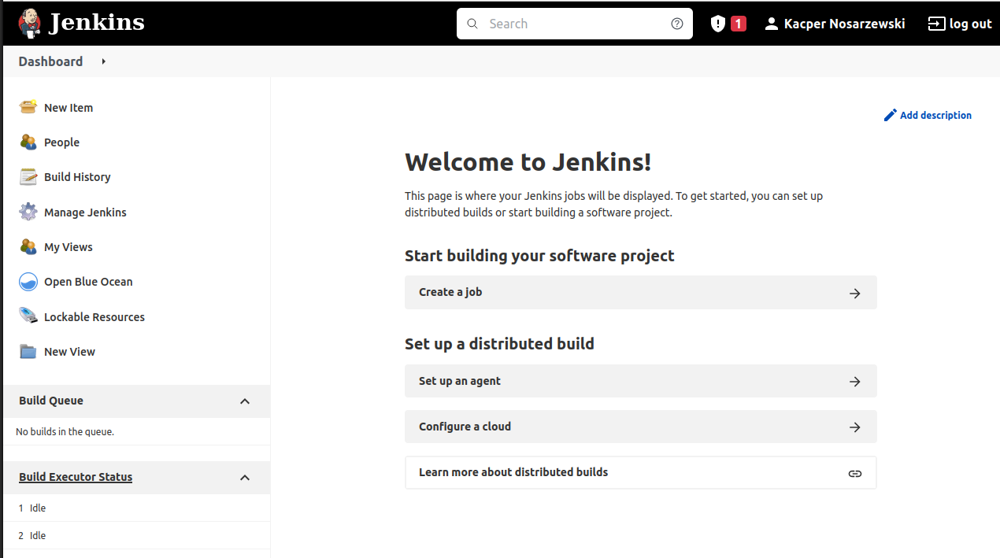

