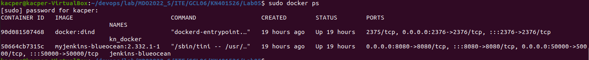
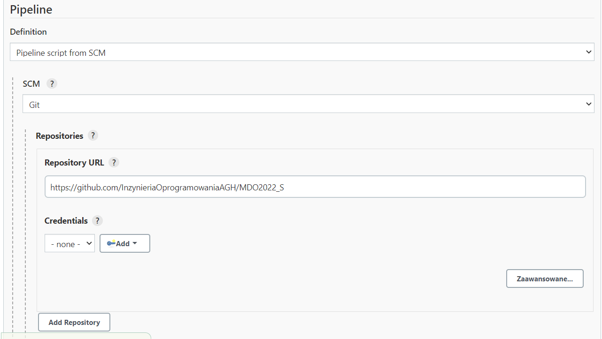
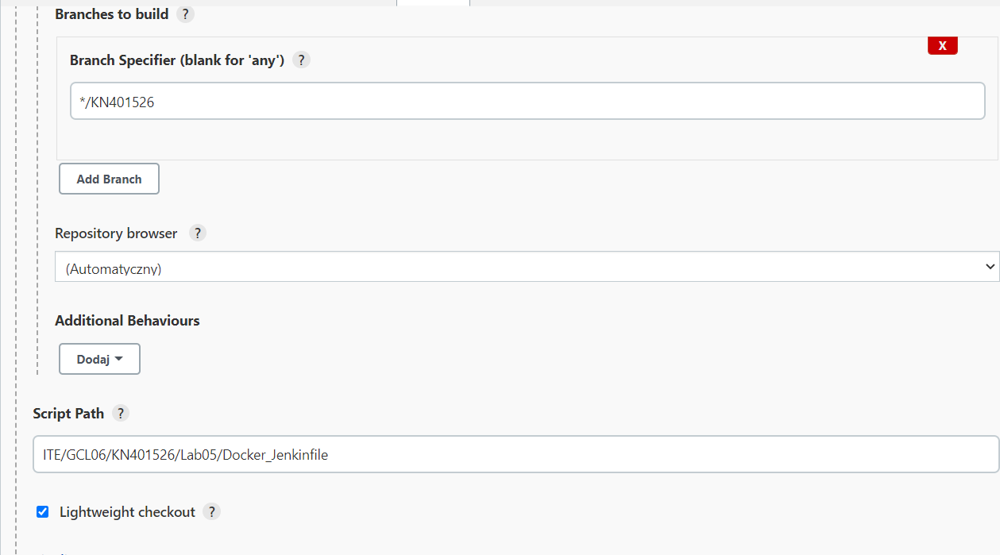
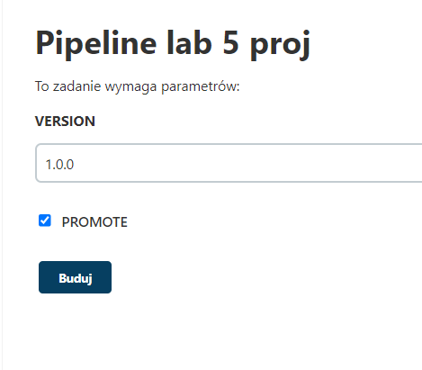
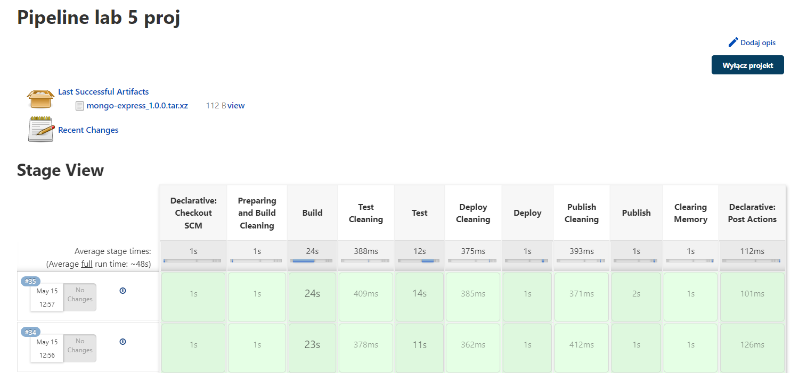

# Sprawozdanie Lab_5 Kacper Nosarzewski
## 1. Cel cwiczenia
Celem laboratorium bylo przygotowanie projektu z moliwoscia automatycznego wykonania czynnosci wykonanych na poprzednich labolatoriach takich jak budowanie i testowania oraz wdrozenia i publikowania 

## 2. Opis projektu
W celu wykonania projektu zostaly stworzone dwa Dockerfile.
 Dockerfile1 zawiera polecenia potrzebne do sklonowania repozytorium `https://github.com/knosarzewski/mongo-express` zainstalowania potrzebnych zaleznosci jak i zbudowanie programu. 
 Dockerfile2 zawiera polecenia uruchomiajace testy przeprowadzone dla wybranego repozytorium.
 Deploy zostal przeprowadzony wewnatrz kontenera wykorzystujac obraz Node.
 W kroku publish ze zbudowanego programu zostala stworzona paczka tar.tgz

## 3. Wykonanie cwiczenia

  1. Przygotowanie kontenerow

 

Opis:

Zostaly przygotowane dwa kontenery kontener zawierajacy Jenkins o nazwie jenkins-blueocean a takze kontener wykonawczy z obrazem DIND kn_docker.
Polecenia potrzebne do uruchomienia tych kontenerow znajduja sie w dokumentacji Jenkinsa znajdujacej sie pod linkiem 
`https://www.jenkins.io/doc/book/installing/docker/` w razie wystapienia problemow pod linkiem `https://github.com/InzynieriaOprogramowaniaAGH/MDO2022_S/tree/KN401526/ITE/GCL06/KN401526/Lab04` gdzie zostaje przedstawione jak sa one tworzone
aby sprawdzic czy kontenery zostaly poprawnie utworzorne mozna to zrobic za pomoca polecenia `sudo docker ps`

 2. Konfiguracja Pipline

    

Opis:

W celu prawidloweo skonfigurowania pipline nalezy
 utworzyc nowy projekt pipline nastepnie wybrac 
 Definition `Pipline script from SCM` w zakladce `SCM` 
 nalezy wybrac opcje `Git` nastepnie nalezy 
 skopiowac link do repozytorium w ktorym znajduja sie potrzebne pliki
`https://github.com/InzynieriaOprogramowaniaAGH/MDO2022_S`
 
 3. Dalsza konfiguracja

  


Opis:

W polu `Branch Specifier` nalezy wpisac `KN401526` nastepnie przechodzac do pola `Script Path` nalezy skopiowac sciezke do pliku 
Docker_Jenkinfile `TE/GCL06/KN401526/Lab05/Docker_Jenkinfile` w ktorym znajduja sie poszczegolnie kroki przeprowadzenia projektu

 4. Dockerfile1-Sklonowanie i zbudowanie repozytorium

 ```
 FROM node:latest

RUN git clone https://github.com/knosarzewski/mongo-express.git

WORKDIR mongo-express

RUN npm install

RUN npm run build
 ```
 Opis:

Powyzszy Dockerfile odpowiada za wykonanie polecenia git clone w celu sklonowania repozytorium mongo-express jak i zainstalowanie potrzebnych zaleznosci w celu pozniejszego przeprowadzenia budowy aplikacji 

5. Dockerfile2-Testowanie repozytorium

```
FROM kacper_build:latest

WORKDIR mongo-express

RUN npm test
```

Opis:

Powyzszy Dockerfile odpowiada za przeprowadzenie testow znajdujacych sie w repozytorium mongo-express

6. Jenkinsfile

    1. Parametry

    ```
    parameters
    {
        string(name: 'VERSION', defaultValue: '1.0.0', description: '')
        booleanParam(name: 'PROMOTE', defaultValue: true, description: '')
    }

    agent any
    ```
    Opis:

    W powyzszym fragmencie zostaly pokazane parametry jak i ustawnie `agent` na `any` co umozliwia uruchomie zadania na dowolnym wezle aktualnie dostepnym. Wykonywany Pipline zostal obarczony dwama parametrami `VERSION` okreslajaca wersje programu jak i `PROMOTE` ktora okreslala czy publish sie wykona

    2. Preparing and Cleaning
    ```
    stage('Preparing and Build Cleaning')
     	{
     	  steps
     	  {
     	    sh 'docker volume create kacper_in'
            sh 'docker volume create kacper_out'
            sh 'docker rm -f kacper_build || true'
            sh 'docker volume prune -f'
     	  }
     	}
    ```

    Opis:

    Powyzszy fragment odpowiada za stworzenie dwoch voluminow wejsciowego i wyjsciowego jak i przeprowadzenia czyszczenia kontenerow uzytych w kroku budowania programu jak i usuniecia wszystkich nieaktywnych voluminow
    
    3. Build
    ```
    stage('Build') 
        {
            steps 
            {
              
              sh 'docker build . -f ./ITE/GCL06/KN401526/Lab05/Dockerfile1 -t kacper_build'
  	          sh 'docker run --mount type=volume,src="kacper_build",dst=/kacper_in kacper_build:latest bash -c "cd .. && cp -r /mongo-express /kacper_in && cp -r /kacper_in /kacper_out && ls ./kacper_in && ls ./kacper_out"'
            
            }
        }
    ```  

    Opis:

    Wykonujac ten krok na poczatku zostanie wykonane sklonowanie i zbudowanie programu uzywajac wyzej opisanego `Dockerfile1` ktore zostanie wykonane w kontenerze `kacper_build`
    nastepnie zostanie on uruchomiony z podpientym voluminem wejsciowym kacper_in na ktory zostaje skopiowana zawartosc kontenera `kacper_build` ze zbudowanym programem po czym z kontenra wejsciowego zawartosc zostaje skopiowana na volumin wyjsciowy na koniec zostaja wyswietlone zawartosci obu voluminow w celu sprawzenia czy kopiowanie przebieglo pomyslnie

    4. Cleaning Test

    ```
     stage('Test Cleaning')
        {
        steps
         {
          sh 'docker rm -f kacper_test || true'
         }
        }
    ```

    Opis:

    Powyzszy fragment kodu odpowiada za usuwanie jesli istnieje kontener na ktorym sa uruchomiane testy dla repozytorium mongo-express
   
    5. Test

    ```
     stage('Test') 
        {
            steps 
            {
              
              sh 'docker build . -f ./ITE/GCL06/KN401526/Lab05/Dockerfile2 -t kacper_test'
              sh "docker run --name kn_test --rm --mount source=kacper_test,target=/kacper_in kacper_test:latest"
              
            }
        }
    ```

    Opis:

    Powyzszy krok odpowiada za przeprowadzenie testow poczatkowo zostaje one przeprowadzone uzywajac wczesniej opisanego `Dockerfile2` w ktorym zostaja zawarte polecenia potrzebne do uruchomienia testow, zostaja one uruchomione na kontenerze `kacper_test` gdzie jako bazowy zostaje uzyty kontener `kacper_build` nastepnie zostaje uruchomiony kontener testowy `kn_test` z podpietym voluminem `kacper_in`

    6. Deploy Cleaning

    ```
      stage('Deploy Cleaning')
        {
        steps
         {
          sh 'docker rm -f kacper_deploy || true'
         }
        }
    ```

    Opis:

    Powyzszy fragment kodu odpowiada za usuwanie jesli istnieje kontenra na ktorym jest przeprowadzony deploy

    6. Deploy

    ```
      stage('Deploy')
        {
            steps
            {
                
                sh 'docker run -dit --name kacper_deploy --mount type=volume,src="kacper_out",dst=/kn_proj node'
                sh 'exit $(docker inspect kacper_deploy --format="{{.State.ExitCode}}")'
            }
        }
        
    ```
    Opis:

    W powyzszym fragmencie kodu zostaje utworzony kontener `kacper_deploy` sluzacy do przeprowadzenia wdrozenia z podpietym voluminem wyjsciowym w ktorym znajduje sie skopiowane z voluinu wejsciowego repozytorium 
    nastepnie zostaje sprawdzony exit code ktory jesli wykonal sie poprawnie, kolejne kroki sa wykonywane w pozniejszym etapie kontener zostaje usuwany

    7. Publish Cleaning
    ```
    stage('Publish Cleaning')
        {
         steps
         {
          sh 'rm -rf /var/jenkins_home/workspace/kacper_artifacts'
          sh 'docker rm -f kacper_publish || true'
         }
        }
    ```

    Opis:

    Powyzszy fragment kodu odpowiada za usuwaniecie folderu zawierajacego artefakty jak i jesli istnieje zostaje usuniety kontener wykorzystany do kroku publish

    8. Publish
    ```
        stage ('Publish')
        {
            when
            {
                expression {return params.PROMOTE}
            }
            steps
            {
                
                sh 'mkdir /var/jenkins_home/workspace/kacper_artifacts'
                sh 'docker run -d --name kacper_publish --mount type=volume,src="kacper_out",dst=/usr/local/kn_proj --mount type=bind,source=/var/jenkins_home/workspace/kacper_artifacts,target=/usr/local/kn_copy node bash -c "chmod -R 777 /usr/local/kn_proj && cp -R /usr/local/kn_proj/. /usr/local/kn_copy"'
                sh "tar -zcvf mongo-express_${params.VERSION}.tar.xz -C /var/jenkins_home/workspace/kacper_artifacts ."
                archiveArtifacts artifacts: "mongo-express_${params.VERSION}.tar.xz"
                
            }
        } 
    ```

    Opis:

    Pierwsza rzecza jaka zostaje sprawdzona w powyzszym kodzie 
    jest wartosc parametru `PROMOTE` jesli wynosi on true to zostaja
    wykonane polecenia znajdujace sie obrzarze steps gdzie zostaje 
    tworzony artefakt jesli wartosc `PROMOTE` bedzie wynosila false to 
    artefakty nie utworza sie w obszarze zostaje stworzony 
    folder w ktorym beda zapisywane 
    artefakty gdzie zostaja mu nadane uprawnienia 777 dajac wszystkim uzytkownikom wszystkie uprawnienia nastepnie zostaje stworzony kontener `kacper_publish` z podpietym voluminem wyjsciowym `kacper_out`. Artefakty zostaja zapakowane do pliku `tar.xz` z 
    nadana wersja z parametru `VERSION` 

    9. Cleaning Memory
    ```
       stage ('Clearing Memory')
        {
        	steps
        	{
        	    sh 'docker rm -f kacper_build || true'
                sh 'docker rm -f kacper_test || true'
                sh 'docker rm -f kacper_deploy || true'
                sh 'docker rm -f kacper_publish || true'
                }
        }
    ```

    Opis:

    Powyzszy fragment kodu przedstawia usuwanie powstalych kontenerow podczas wykonywania poszczegolnych krokow Pipline

    10. Succes or Error 
    ```
      post
      {
   	   success
          {
   		echo 'You successfully ended Pipline'
   	      }
   	   failure
   	   {
   		echo 'ERROR'
   	   }
   } 
    ```
    Opis:

    Powyzszy fragment kodu odpowiada za wyswietlenie wiadomosci o udanym zakonczeniu Pipline lub ERROR jesli wystapil blad

    11. Przykladowe uruchmienie

    

    Opis:

    Uruchomiajac Pipline mozna wybrac wersje, domyslnie ten parametr jest ustawiony na wersje 1.0.0
    
    

    Opis:

    Powyzszy zrzut ekranu przedstawia przykladowe uruchomienie napisanego Piplina jak widac na powyzszym zrzucie wszystkie etapy zakonczyly sie sukcesem i mozn zaobserwowoac stworzenie sie starowanego pliku z artefaktami
    parametr `Promote` w kazdym uruchomieniu zostaje domyslne zaznaczone
    
    12. Diagram

      


    Opis:

    Diagram zostal stworzony w aplikacji `Draw.io` aby otworzyc plik znajdujacy sie na githubie nalezy wejsc na ponizszy link i otworzyc plik aplikacja
    
    `https://app.diagrams.net/`
    


