# Sprawozdanie Lab_9 Kacper Nosarzewski
## 1. Cel cwiczenia
Celem labolatorium bylo przygotownie wdrozen nienadzorowanych

## 2. Wykonanie cwiczenia

1. Instalacja Fedory

    * Wybranie opcji oprogramowanie z minimalnymi funkcjami
    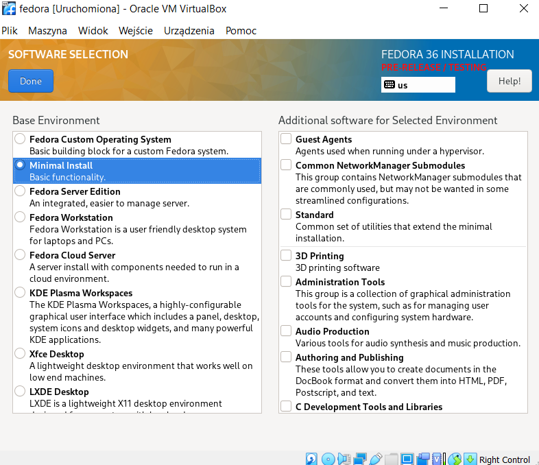

    * Ustawienie nazwy hosta na `template-lab09.agh` 
    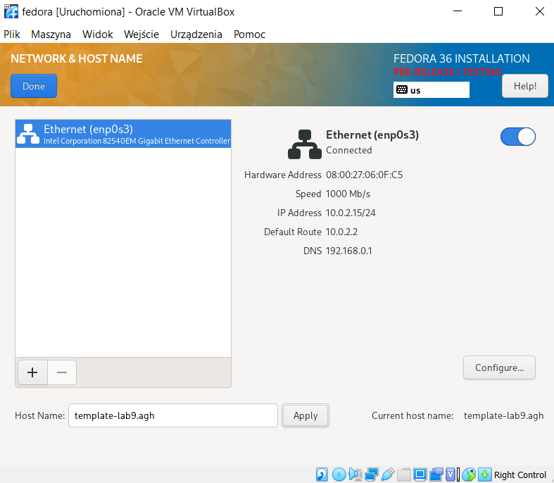

    * Skonfigurowanie roota 
    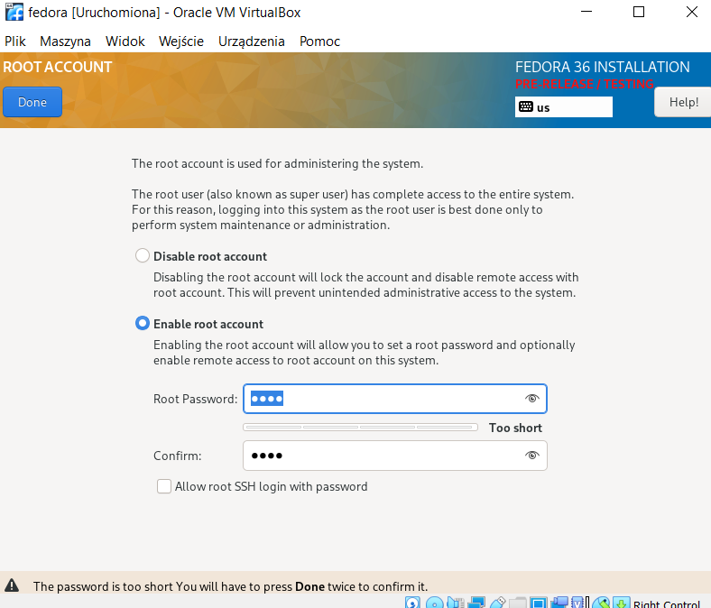

    * Stworzenie uytkownika
    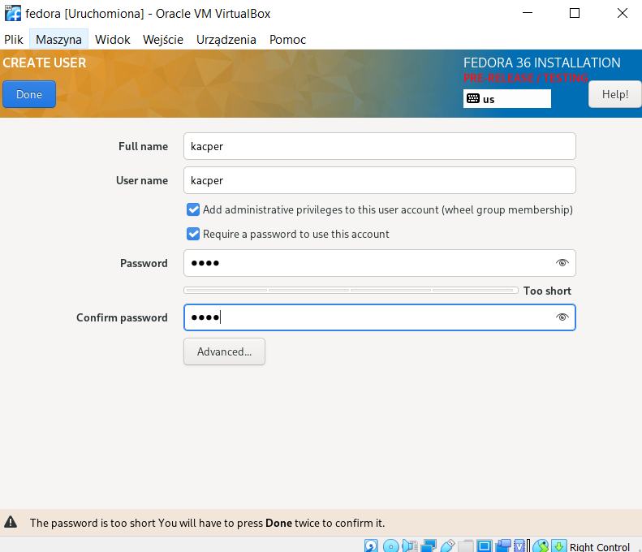

    * Rozpoczecie instalacji
    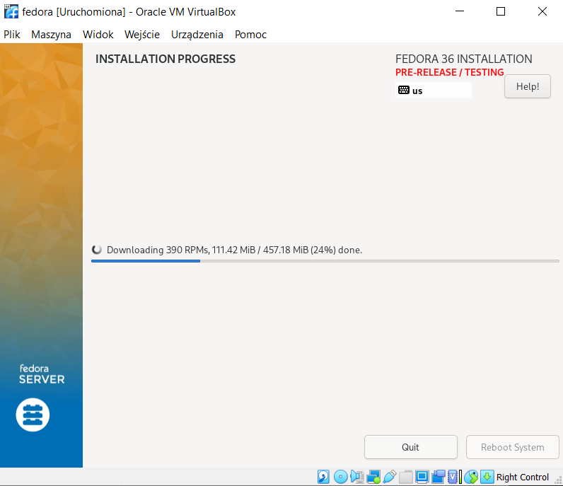

    * Zalogowanie sie na stworzonego uzytkownika
    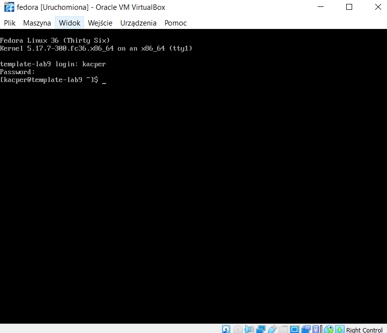

Instalcja usugi httpd poleceniem ` sudo dnf -y install httpd`

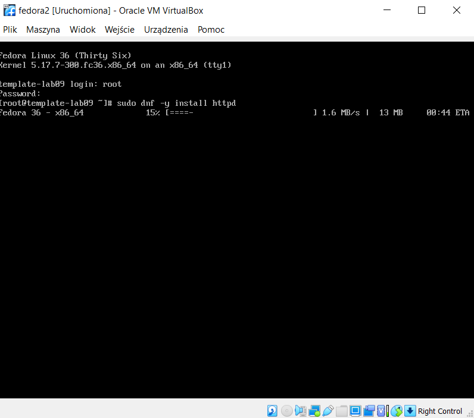

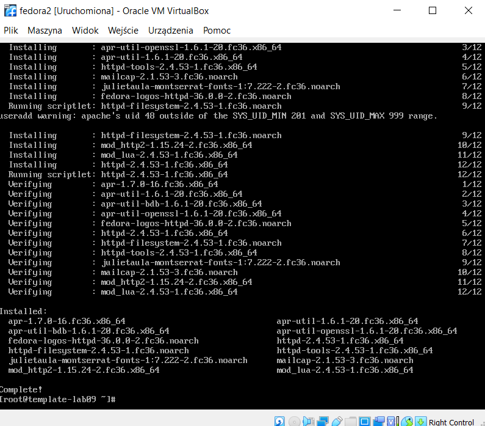

W celu dzialanie na serverze zostaly zmienione uprawinienia firewall

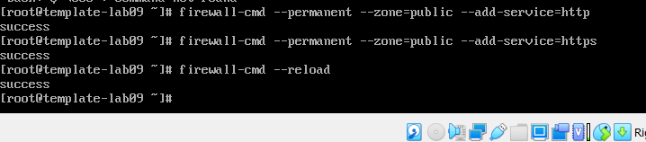

Natepnie sever zostaje uruchomiony poleceniem `systemctl enable httpd --now` i wyswietlono jego statusu poleceniem `systemctl status httpd`

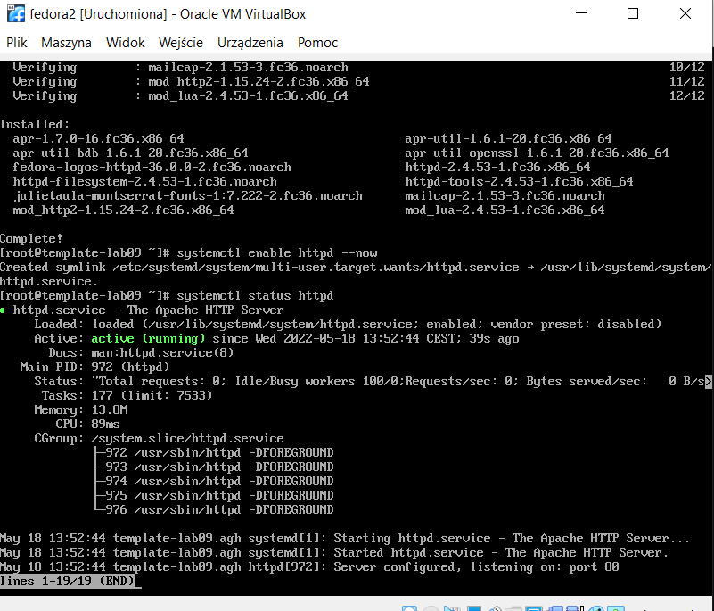

Urzywajac Filezilli artefakty zostaly umieszczone na maszynie wirtualniej a nastepnie wyslane na server `http://192.168.0.189/mongo-express`

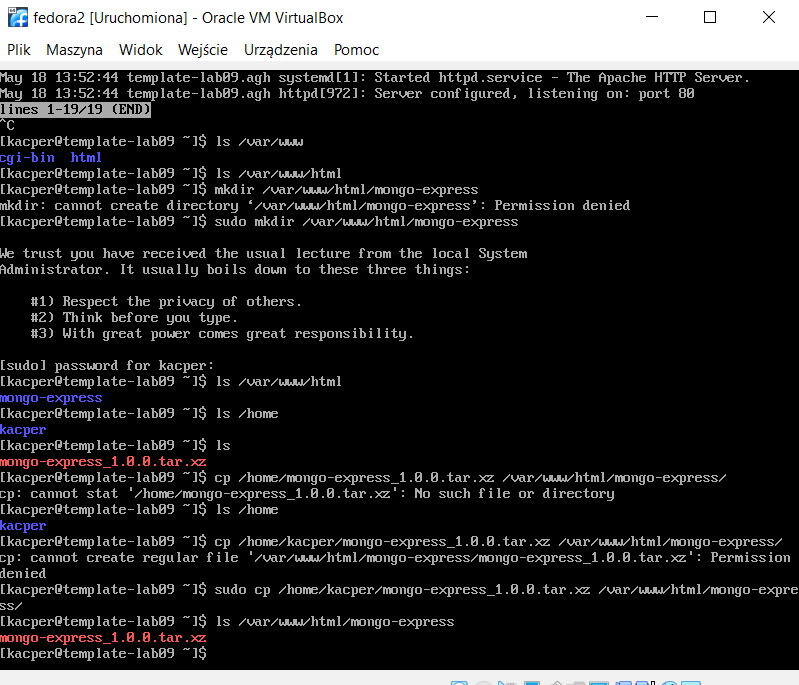

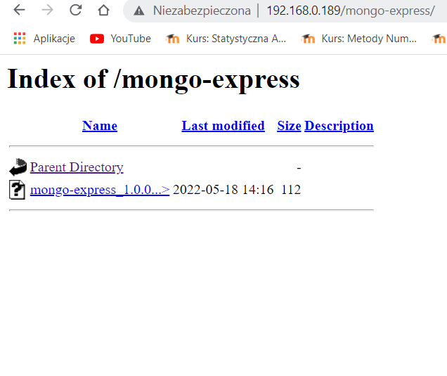

Na drugiej maszynie virtualnej z servera zostaly pobrane artefakty poleceniem `wget 192.168.0.189/mongo-express/mongo-express_1.0.0.tar.xz`

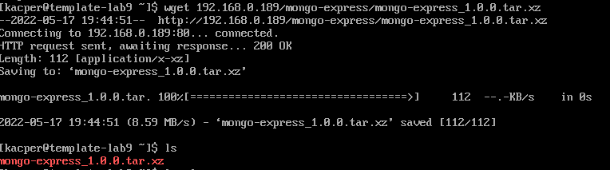

 2. Instalacja nienadzorowana

Uzywajac Filezilli z Fedora zostal przeslany pliku z odpowiedziami `anaconda-ks.sfg`

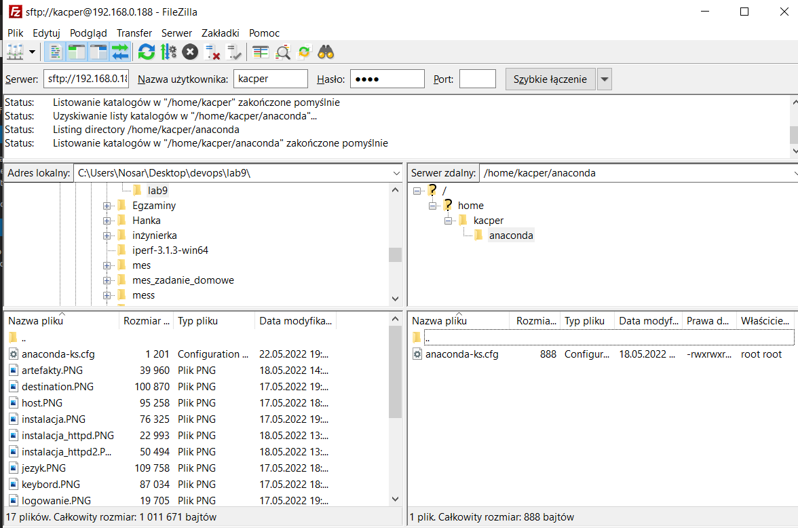

Do pliku `anaconda-ks.sfg` zosatly wprowadzone ponizsze zmiany

```
# Use graphical install
#graphical
text

# Repo
url --mirrorlist=http://mirrors.fedoraproject.org/mirrorlist?repo=fedora-$releasever&arch=x86_64
repo --name=updates --mirrorlist=http://mirrors.fedoraproject.org/mirrorlist?repo=updates-released-f$releasever&arch=x86_64

%packages
@^minimal-environment
wget

%post
mkdir mongo-express
wget 192.168.0.188/mongo-express/mongo-express_1.0.0.tar.xz
%end

```


