# Sprawozdanie Lab_11 Kacper Nosarzewski
## 1. Cel cwiczenia
Wdrażanie na zarządzalne kontenery: Kubernetes

## 2. Wykonanie cwiczenia

Instalacja minikube poleceniami zawartymi w dokumentacji https://minikube.sigs.k8s.io/docs/start/

`curl -LO https://storage.googleapis.com/minikube/releases/latest/minikube-linux-amd64`

`sudo install minikube-linux-amd64 /usr/local/bin/minikube`

Nastepnie uzyto polecenia `minikube start` w celu uruchomienia minikuba nalezy tez sprawdzic czy na maszynie wirualniej sa dostepne min 2 rdzenie w przeciwnym razie polecenie nie zadziala 


 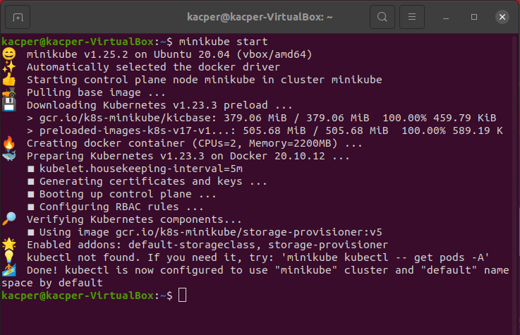

 Nalezy dodac polecenie kubectl uywajac do tego polecenia `alias kubectl="minikube kubectl --"`

 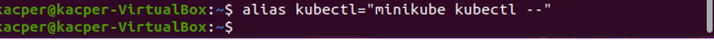

 Po poprawnym instalacji zostaje uruchomiony Dashboard poleceniem `minikub dashboard` i uruchomienie w przegladarce

 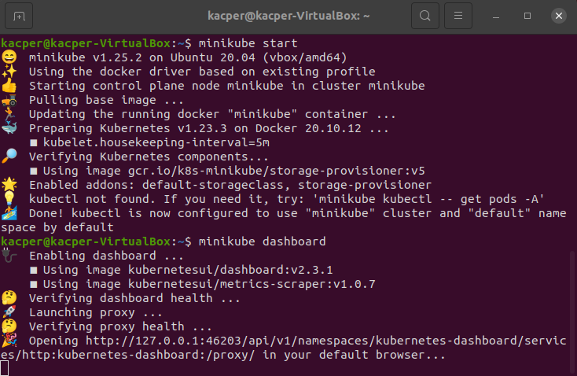

 


Jako ze aplikacja mongo-express uzywana w poprzednich cwiczeniach nie wyprowadza portow uzyto aplkacji nginx

Nastepuje uruchomienie kontenera z aplikacja nginx poleceniem `docker run --name kn_nginx1 -p 80:80 -d nginx`

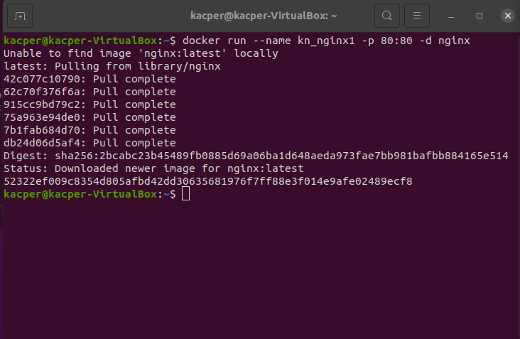

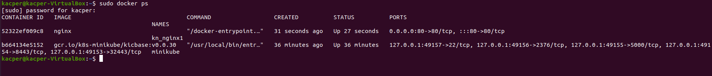

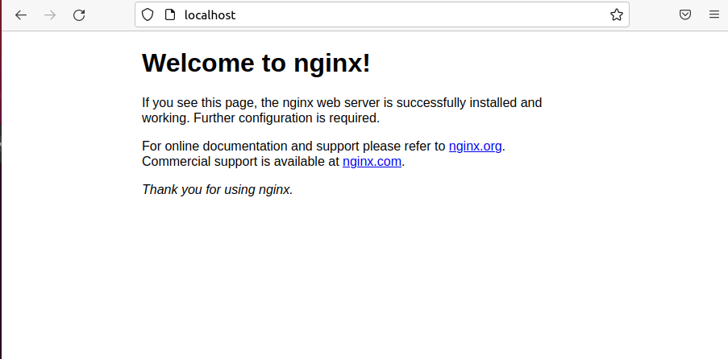

Zostaje uruchomiony kontener w minikubie ktory jest juz zaopatrzony w poda poleceniem `minikube kubectl run -- knnginx1 --image=nginx --port=80 --labels app=knnginx1` nazwa kontenra zostala zmieniona z kn_nginx1 na knnginx1 poniewaz podczas uruchomiana kontenera otrzymano blad nazwy

 
Bledne uruchomienie


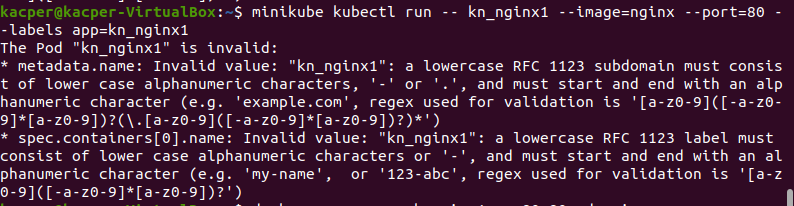

Wprowadzenie poprawnej nazwy


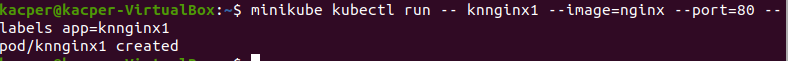

Sprawdzono takze poprawnosc jego dzialania poleceniem `kubectl get pods`

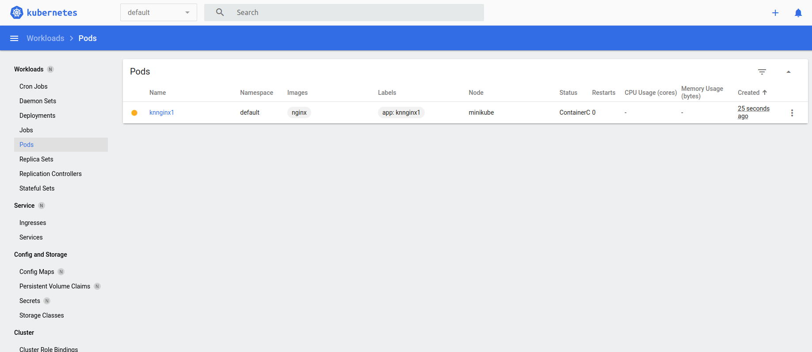

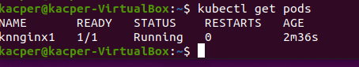


Nastepuje wyprowadzenie portow poleceniem `kubectl port-forward knnginx1 2222:80`

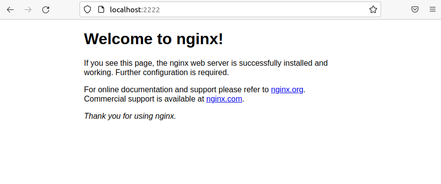

Zamienienie drozenia manualnego w plik wdrozenia uzywajac do tego stworzonego pliku deploy.yml

```
apiVersion: apps/v1
kind: Deployment
metadata:
  name: kn-nginx-deployment
  labels:
    app: knnginx1
spec:
  replicas: 3
  selector:
    matchLabels:
      app: knnginx1
  template:
    metadata:
      labels:
        app: knnginx1
    spec:
      containers:
      - name: knnginx1
        image: nginx
        imagePullPolicy: Never
        ports:
        - containerPort: 2222
```

Wprowadzenie wprowadzonych zmian poleceniem `kubectl apply-f deploy.yml`


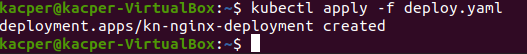


W celu sprawdzenia poprawnosc wdrozenia uzyto polecenia `kubectl get pods-o wide`


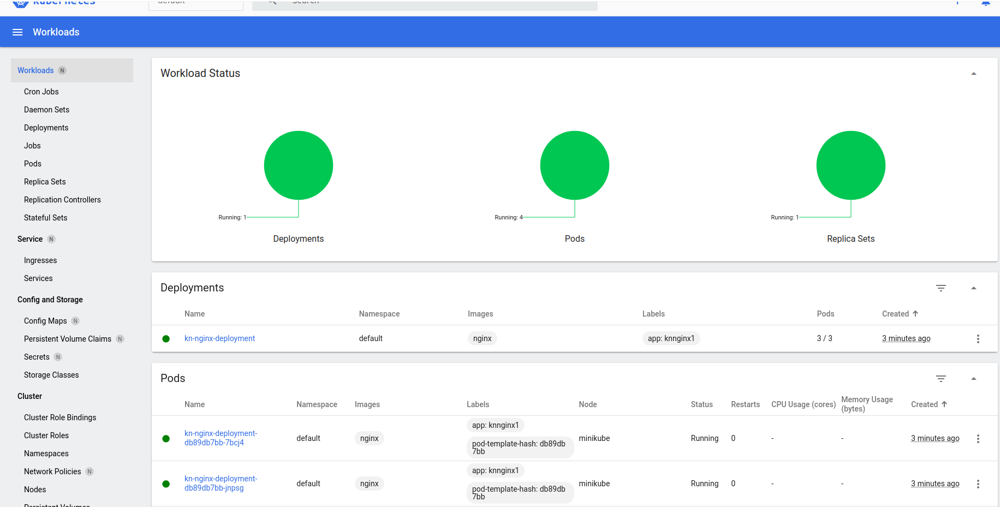

