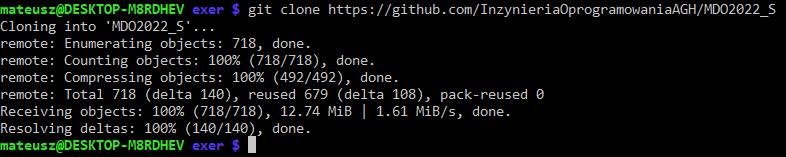
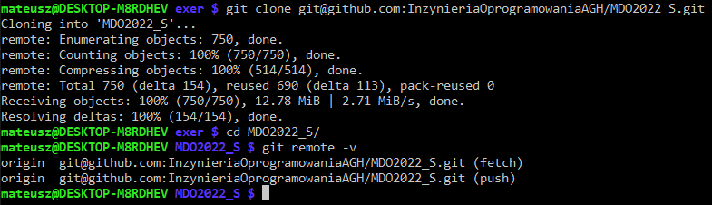
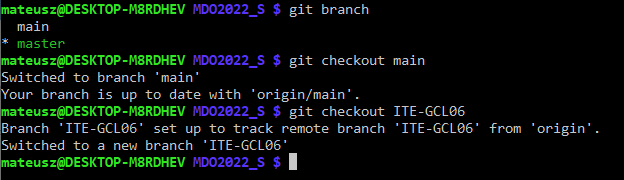
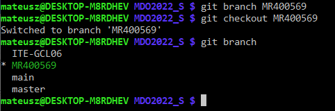
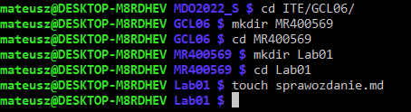

# Sprawozdanie z laboratoriów 01 wykonanych w dniu 09.03.2022

2. `git clone https://github.com/InzynieriaOprogramowaniaAGH/MDO2022_S.git`

3. `git clone git@github.com:InzynieriaOprogramowaniaAGH/MDO2022_S.git`
Wykazano komendą `git remote -v`, że remote origin jest ustawiony na URL wskazujący użycie SSH.
Ponieważ klucze SSH zostały dołączone do profilu GitHub przed zajęciami udowodnienie ich działania będzie wykonane poprzez `git push` bez potrzeby podawania hasła, który skończy się sukcesem.

4. `git checkout main ; git checkout ITE-GCL06`
Wykazano, że obecnie aktywna gałąź to master.
Przełączono się na branch main, następnie na branch odpowiadającej grupy ćwiczeniowej (ITE-GCL06).

5. `git branch MR400569 ; git checkout MR400569`
Pierwszą komendą stworzono nową gałąź, następnie sukcesywną komendą zmieniono obecną gałąź na świeżo stworzoną.

6. Stworzono odpowiadający folder, w którym będą znajdować się wszystkie pliki odnoszące się do laboratorium numer jeden.
Komendą `touch` stworzono pusty plik z końcówką `.md` co wskazuje na formatowanie typu Markdown tego pliku.

