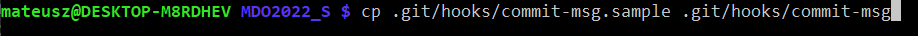
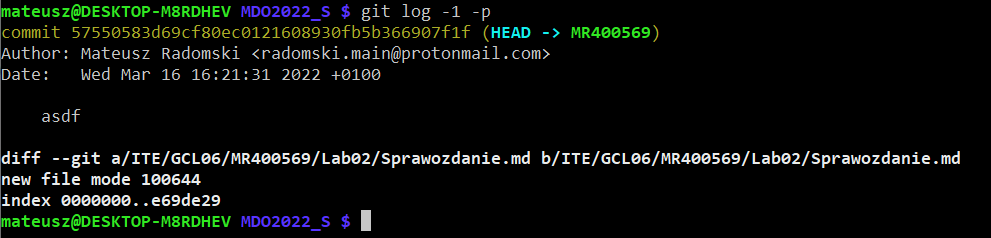
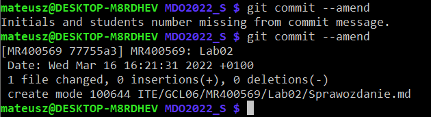
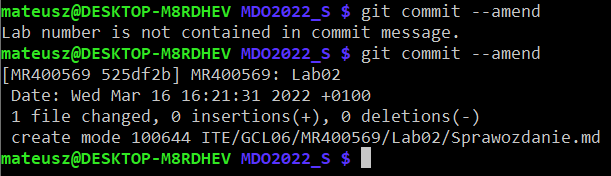
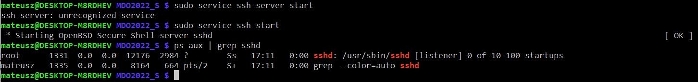
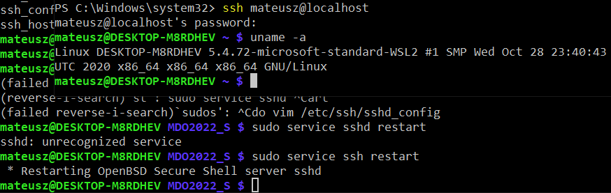
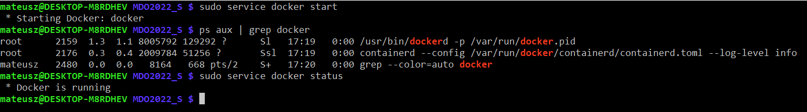
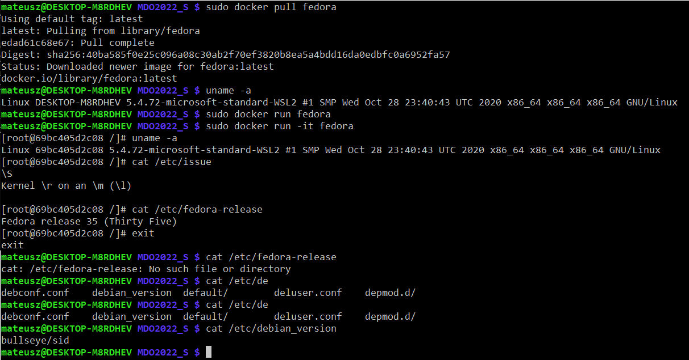
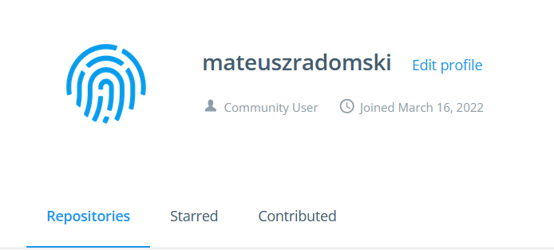

# Sprawozdanie z laboratoriów 02 wykonanych w dniu 16.03.2022

1. Stworzenie git hooka

Stworzenie pliku hooka, który jest kopią przykładu:



Obecna nazwa commita przed wykorzystaniem hook-ów:



Wykorzystanie pierwszej częsci hooka



Wykorzystanie drugiej częsci hooka



2. Treść `commit-msg`

```bash
#!/bin/sh

if [ -z "$(sed '/^#/d' "$1" | grep -w 'MR400569')" ]
then
    echo >&2 Initials and students number missing from commit message.
    exit 1 
fi

LAB_NUMBER="$(egrep -o 'Lab[0-9]*' "$1" | sort | uniq)"
if [ "$LAB_NUMBER" != "$(sed '/^#/d' "$1" | egrep -o 'Lab[0-9]*')" ]
then
    echo >&2 Lab number is not contained in commit message.
    exit 1
fi
```
3. Zapewnienie dostępu poprzez SSH i instalacja Dockera

W pliku `/etc/ssh/sshd_config` włączono możliowść logowania się przy użyciu hasła.
Następnie wystartowano serwer ssh:



Połączono się z systemem WSL poprzez komendę ssh.
Fakt, iż połączono się przez ssh wykazuje to, że przed połączeniem znajdujemy się w ścieżce `C:\Windows\system32` oraz po połączeniu nazwa kernela jest wariacją `microsoft-standard-WSL2`.



Na obecnym systemie posiadano już zainstalowany program Docker co wykazano niżej.

4. Wykazanie działanie środowiska Docker'a

Poprzez start serwisu, zobaczenie, że jego proces jest aktywny i pobranie statusu serwisu docker wykazano, że docker jest zainstalowany i działa. 



Poprzez pobranie obrazu Fedora i udowodnienie, że jest to osobny "namespace" wykazano, że docker działa z własności.



5. Założono konto na DockerHub


