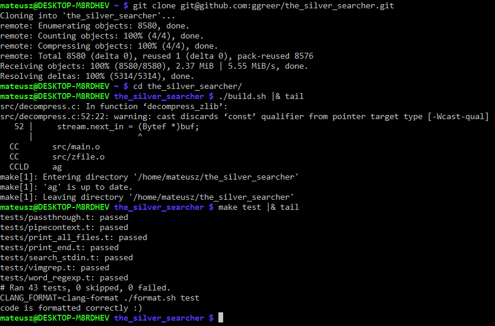
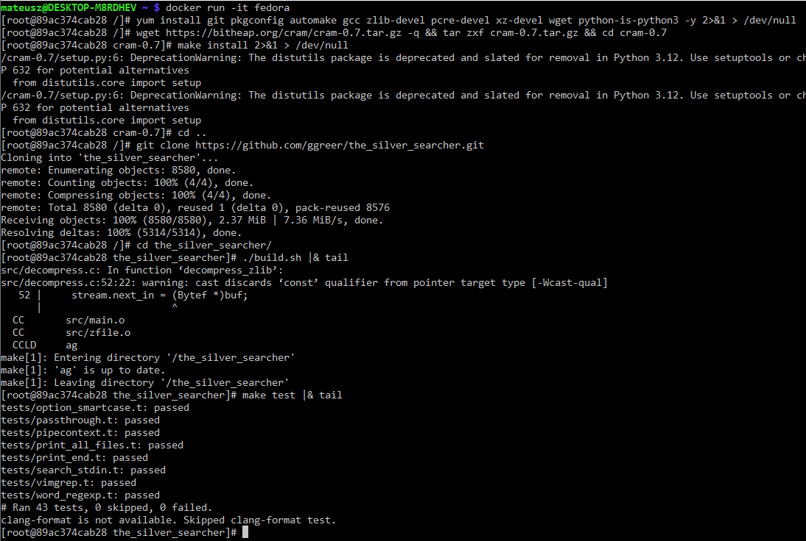
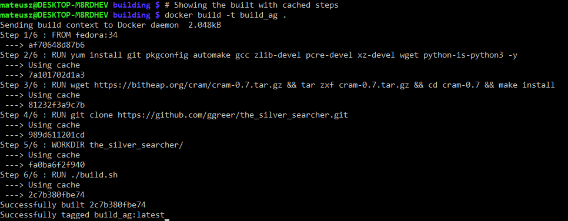
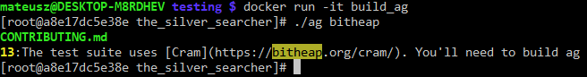
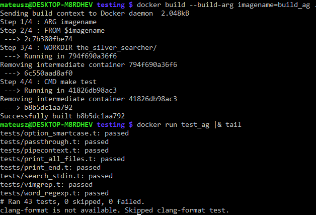
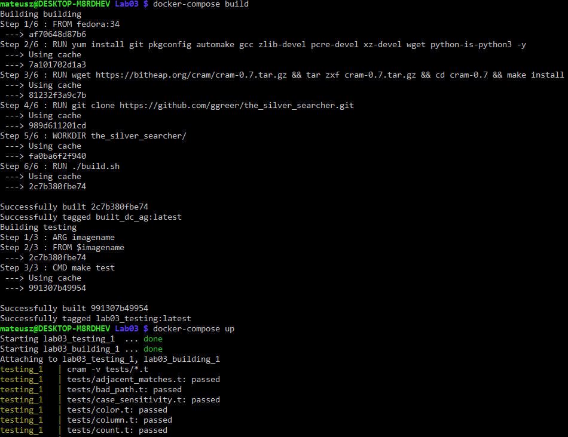

# Sprawozdanie z laboratoriów 03 z dnia 23.03.2022

## Zadanie pierwsze

### Podpunkt pierwszy

Wybrano projekt [the\_silver\_searcher](https://github.com/ggreer/the_silver_searcher), który jest wielowątkową alternatywną dla popularnego programu `grep`.
Projekt jest napisany w C, opisuje swoje wszystkie zależności oraz posiada testy.

### Podpunkt drugi i trzeci

Pobrano i sprawdzono czy wszystkie wymagane punkty zostają spełnione.
Wyniki działania komendy budującej - `build.sh` - i tentującej - `make test` - zostały skrócone do swoich ostatnich linii przez komendę `tail`.

## Zadanie drugie

### Podpunkt pierwszy

W nowym kontenerze `fedora` przeprowadzono wypunktowane w instrukcji kroki czego wynikiem było skompilowanie programu i uruchomienie testów.
Dla ścisłości sprawozdania wynik tekstowy większości komend został przycięty lub usunięty.

### Podpunkt drugi

Stworzono Dockerfile do budowania całego programu.
Dla przejrzystości nie dodano zawartości pliku _inline_, znajduje się on w folderze `building`.
Dockerfile odpowiedzialny za testowanie programu znajduje się w folderze `testing`.

### Podpunkt trzeci

Zbudowano obrazy z stworzonych plików Dockerfile.
Ponieważ ilość tekstu generowanego przy pierwszym budowaniu takiego obrazu jest ogromna a jego treść zbędna zademonstrowano budowanie na już "zcache'owanym" obrazie.

Uruchomienie kontenera na bazie tego obrazu, do którego dostęp otrzymano poprzez stworzenie procesu powłoki, którego katalog działania znajduje się we wcześniej ustalonym `WORKDIR`.
Z tego miejsca jest bezpośredni dostęp do stworzonego pliku binarnego programu.

Uruchomienie testów wykorzystuje argument do pliku Dockerfile, tak aby było wymagane znanie a priori oczekiwanej nazwy kontenera z budowaniem.
Stworzony kontener uruchomi komendę `make test`, tym samym uruchamiając testy bazując na podanym kontenerze.

## Zadanie trzecie

### Podpunkt pierwszy

Stworzono docker-compose.yml, który zbuduje oba obrazy i następnie pozwoli je uruchomić.
Budowanie obrazów wykonuje się podkomendą `build` a uruchamianie `up`.

### Podpunkt drugi

Ponieważ wybrano program, który jest wywoływany z poziomu terminala a jego wejściem są piliki bądź tekst a wyjściem również czysty tekst możliwe jest udostępnienie programu w formie kontenera.
Finalnie jednak artefakt powinien zostać wydany w innej postaci ze względu na fakt, iż kontenery nie mają bezpośredniego dostępu do hierarchii plików hosta.
Wymagałoby to montowanie wolumenów, które rozwiążą problem natomiast tworzy to duże tarcie pomiędzy użytkownikiem a programem.

### Podpunkt trzeci

Tak jak opisano w poprzednim podpunkcie wydanie tego programu w kontenerze jest możliwe natomiast niepożądane.
Jednak w przypadku wydawania tego programu w postaci kontenera należałoby pozbyć się wielu rzeczy, które sztucznie zwiększają rozmiar obrazu i nie są wymagane.
Są dwa podejścia wydania tego programu.
Zbudowanie go statycznie i wydanie go jako plik .zip.
Wymagałoby to jedynie prostego Dockerfile'a, który bazując na budowaniu wypisywałby jako swój rezultat zipowany program.
Współpracujący skrypt następnie przechwyciłby wynik kontenera i udostępniał plik .zip z samym plikiem binarnym.
Budowanie dynamiczne wymaga współpracy z menadżerem programów danej dystrybucji, tak aby zapewnił, że na systemie zainstalowane są używane biblioteki.
Przykładem będzie tutaj plik .deb dla dystrybucji bazujących na Debianie - bądź samym Debianie.
Tak jak w przypadku publikowania pliku .zip, tutaj za budowanie pliku .deb również odpowiedzialny byłby plik Dockerfile, który będzie tworzyć odpowiednią strukturę dla programu i pakować go do archiwum. 
