# Sprawozdanie z laboratoriów 04 z dnia 30.03.2022

## Zadanie pierwsze

### Podpunkt pierwszy

Stworzono dwa wolumeny.
Wejściowy `in_vol` i wyjściowy `out_vol`.

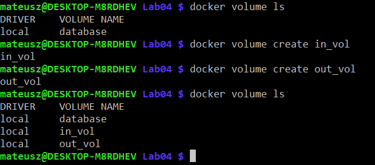

### Podpunkt drugi

Utworzono kontener na bazie obrazu fedora:34, podpięto do niego wolumeny przy pomocy opcji `-v`.
Wykazano, że foldery, które odpowiadają wolumenom znajdują się w korzeniu systemu plików.
Zainstalowano następnie wszystkie zależności potrzebne do zbudowania wybranego projektu.

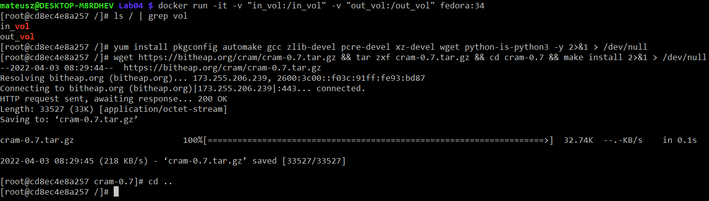

### Podpunkt trzeci

Do wolumenu wejściowego pobrano wybrany projekt z poziomu hosta.
Ścieżkę gdzie wolumen jest umiejscowiony na hoscie otrzymano wykorzystując podkomendne `inspect` w kontekście `docker volume`.
Pobrano tam repozytorium git'a, które po pobraniu jest dostępne dla kontenera.

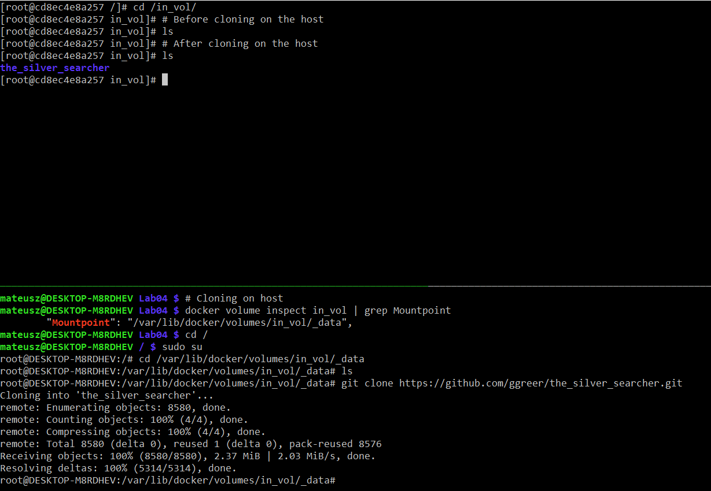

### Podpunkt czwarty

W kontenerze zbudowano projekt.

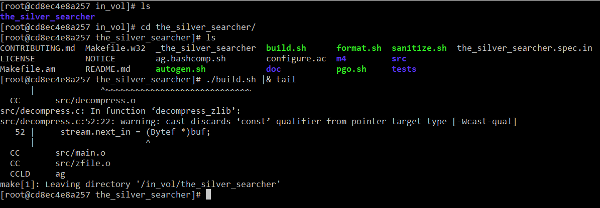

### Podpunkt piąty

Wynik kompilacji przeniesiono do wolumenu wyjściowego.
Natomiast jak pokazano korzystanie z tego programu na komputerze hosta jest niemożliwe ze względu na domyślne wykorzystanie bibliotek _dynamicznych_.
Skompilowanie tego programu jeszcze raz tym razem wykorzystując statyczne linkowanie tych bibliotek rozwiąże problem.

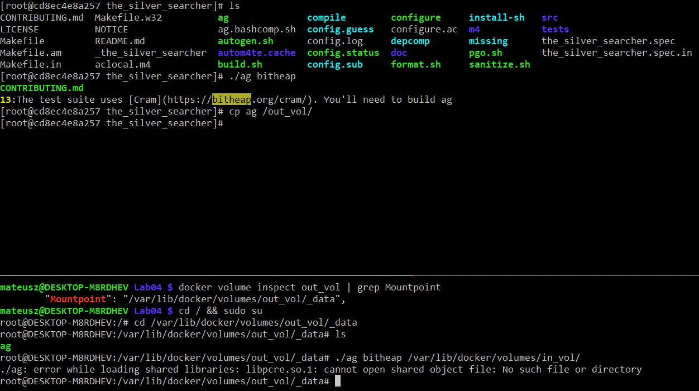

## Zadanie drugie

### Podpunkt pierwszy

Stworzono kontener na bazie obrazu Fedora.
Pobrano na niego program `iperf3` i `net-tools`.
Pierwszy pozwoli na sprawdzenie przepustowości sieci, natomiast drugi umożliwi łatwe pobranie adresu IP.

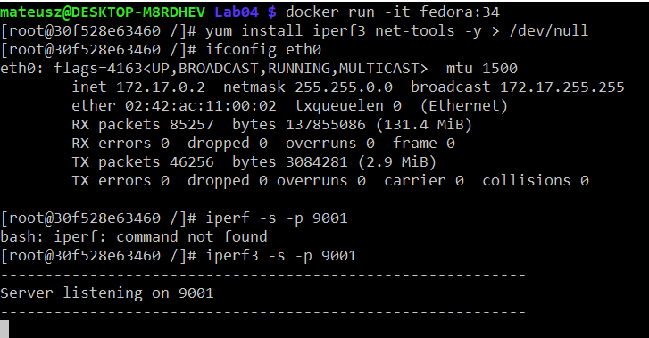

### Podpunkt drugi

Uruchomiono drugi identyczny kontener.
Lewy odpowiadał za serwer natomiast prawy za klienta.

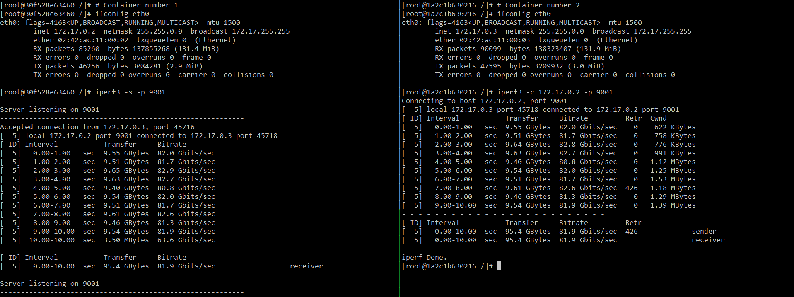

### Podpunkt trzeci

Do kontenera z serwerem iperf3 połączono się również z poziomu hosta (WSL).

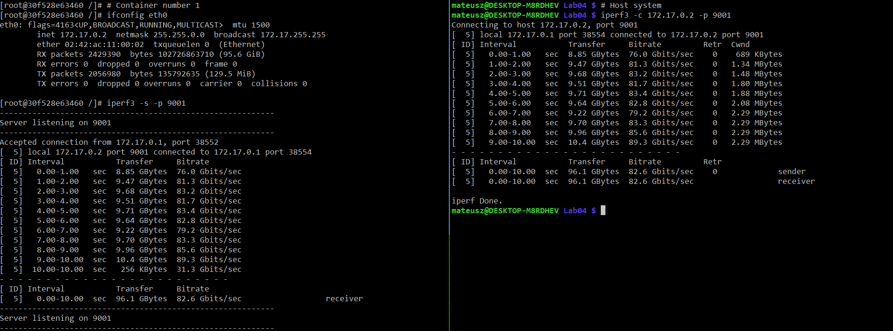

Z poziomu systemu Windows, na którym używany WSL działał.
Ponieważ port nie został opublikowany inne komputery w sieci nie widziały tego portu jako otwartego.

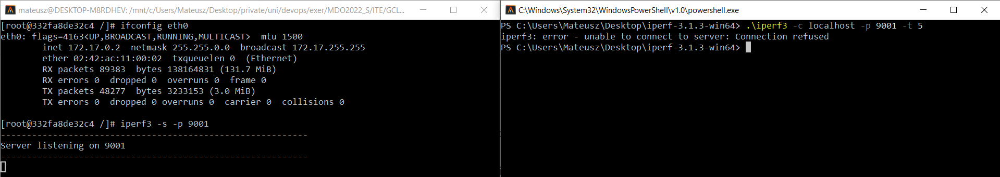

Rozwiązanie tego problemu to opublikowanie portu poprzez argument `-p` dodany podczas uruchomienia kontenera.
Opublikowano port 9001 z kontenera na port 9001 wewnątrz systemu WSL.

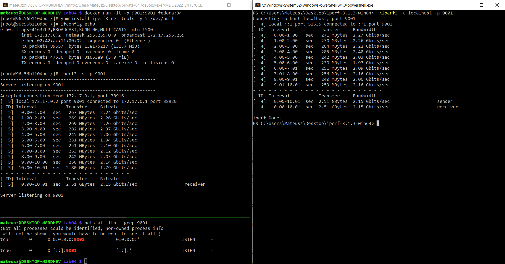

Dla testów wykonano również pomiar prędkości z innego urządzenia.
Przy użyciu telefonu z systemem Android i programu Termux pobrano iperf3.
Jest to test orientacyjny ponieważ jedyna możliwość uruchomienia serwera iperf3 była z poziomu systemu Windows.

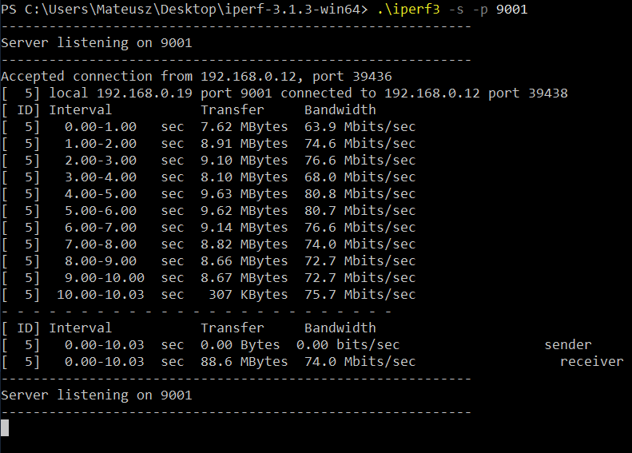

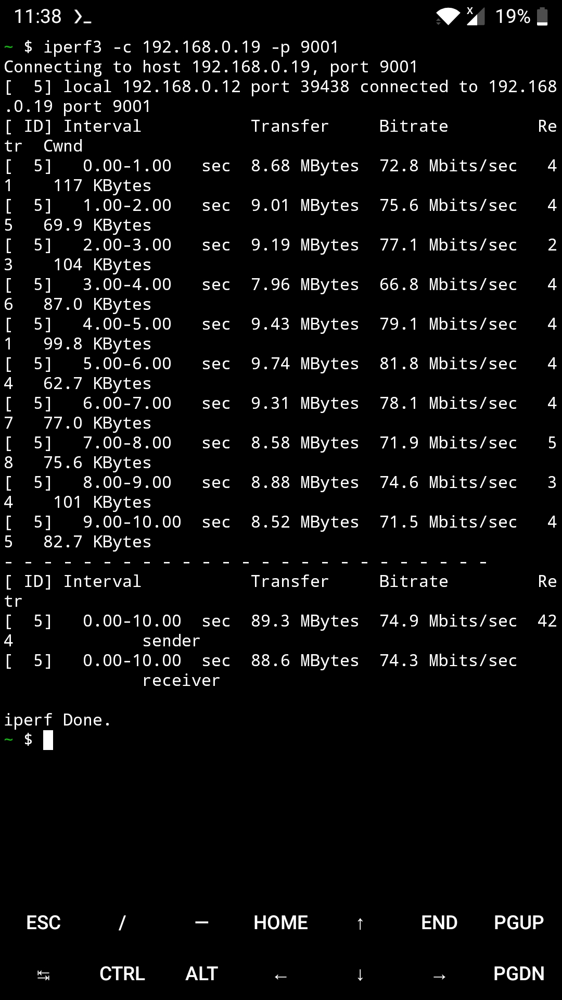

### Zebrane dane

```
|    Time | Container <- Container | Container <- Host(WSL) | Container <- Windows | Windows <- LAN Device |
|---------+------------------------+------------------------+----------------------+-----------------------|
|   0s-1s |              82.0 Gb/s |              76.0 Gb/s |            2.27 Gb/s |             63.9 Mb/s |
|   1s-2s |              81.7 Gb/s |              81.3 Gb/s |            2.26 Gb/s |             74.6 Mb/s |
|   2s-3s |              82.8 Gb/s |              83.2 Gb/s |            2.22 Gb/s |             76.6 Mb/s |
|   3s-4s |              82.7 Gb/s |              81.7 Gb/s |            2.40 Gb/s |             68.0 Mb/s |
|   4s-5s |              80.8 Gb/s |              83.4 Gb/s |            2.03 Gb/s |             80.8 Mb/s |
|   5s-6s |              82.0 Gb/s |              82.8 Gb/s |            1.93 Gb/s |             80.7 Mb/s |
|   6s-7s |              81.7 Gb/s |              79.2 Gb/s |            2.09 Gb/s |             76.6 Mb/s |
|   7s-8s |              82.6 Gb/s |              83.3 Gb/s |            2.16 Gb/s |             74.0 Mb/s |
|   8s-9s |              81.3 Gb/s |              85.6 Gb/s |            2.00 Gb/s |             72.7 Mb/s |
|  9s-10s |              81.9 Gb/s |              89.3 Gb/s |            2.16 Gb/s |             72.7 Mb/s |
|---------+------------------------+------------------------+----------------------+-----------------------|
| Average |              81.9 Gb/s |              82.6 Gb/s |            2.15 Gb/s |             74.0 Mb/s |
```

## Zadanie trzecie

### Podpunkt pierwszy

Stworzenie nowej sieci dla Jenkinsa.

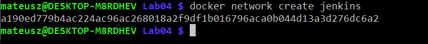

### Podpunkt drugi

Pobranie i uruchomienie obrazu docker:dind.

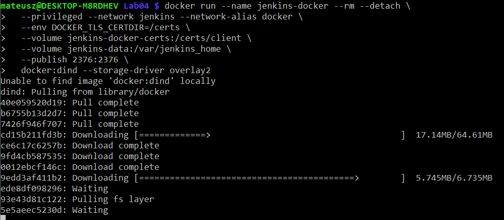

### Podpunkt trzeci

Stworzono sugerowany plik Dockerfile

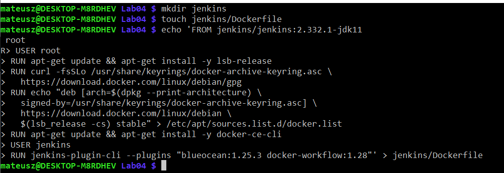

### Podpunkt czwarty

Zbudowanie obrazu z tego pliku.

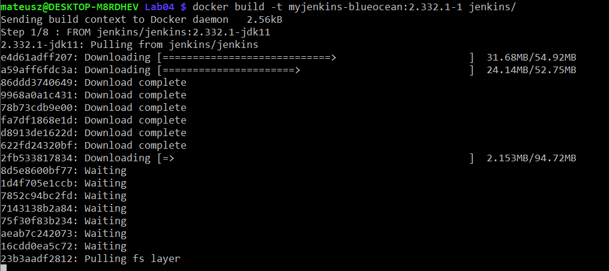

### Podpunkt piąty

Uruchomienie kontenera na podstawie zbudowanego obrazu.

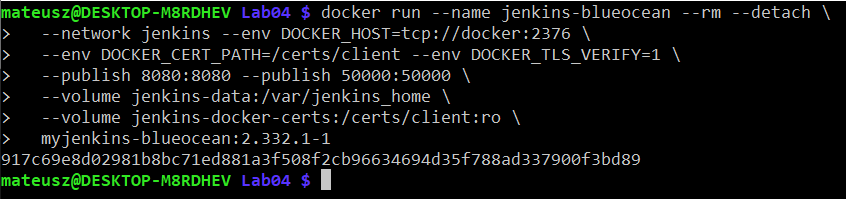

### Podpunkt szósty

Pobranie hasła z logów.


### Podpunkt siódmy

Uruchomienie strony Jenkinsa.

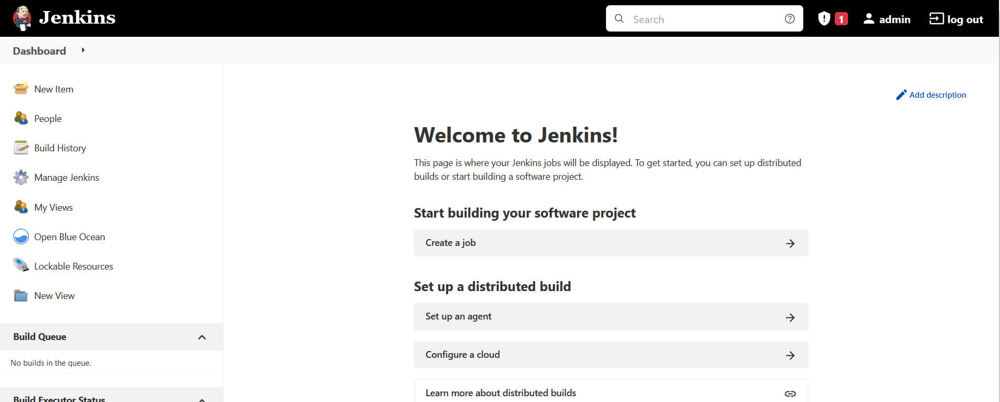
