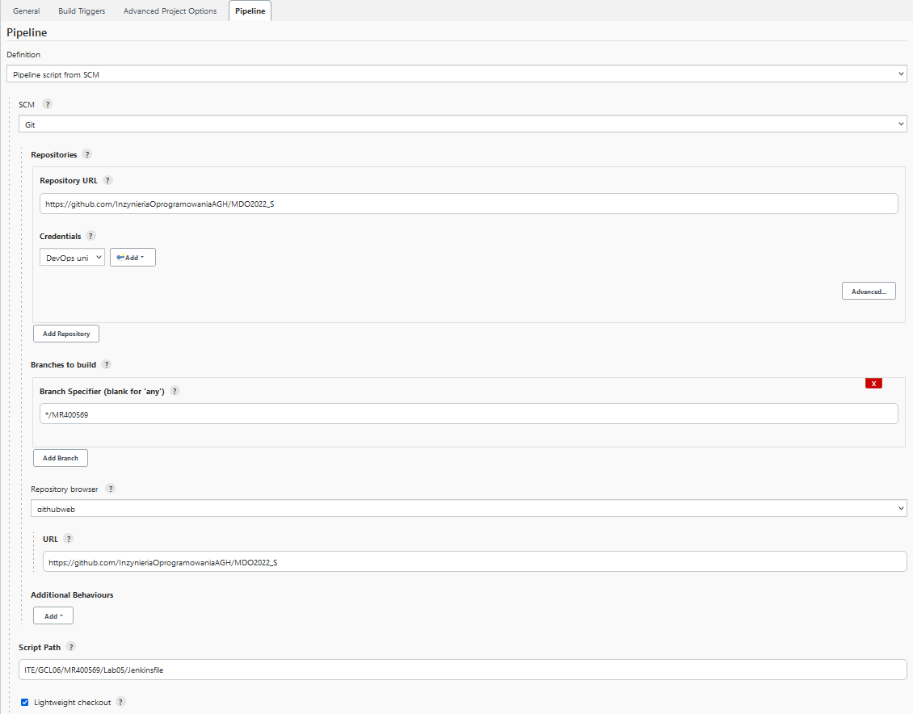
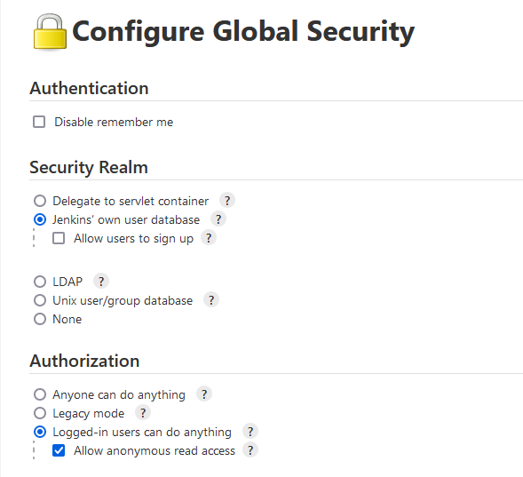
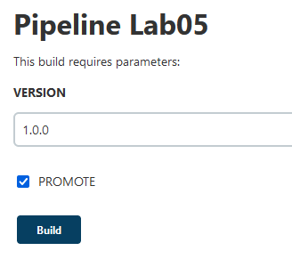
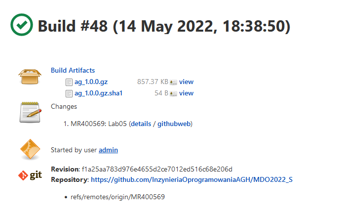
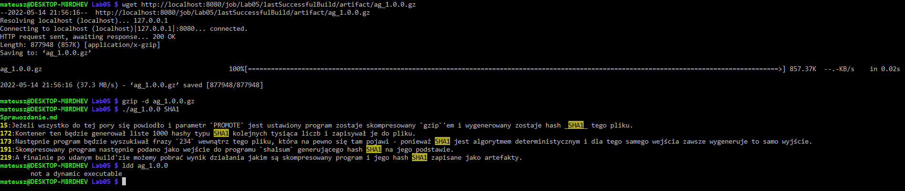
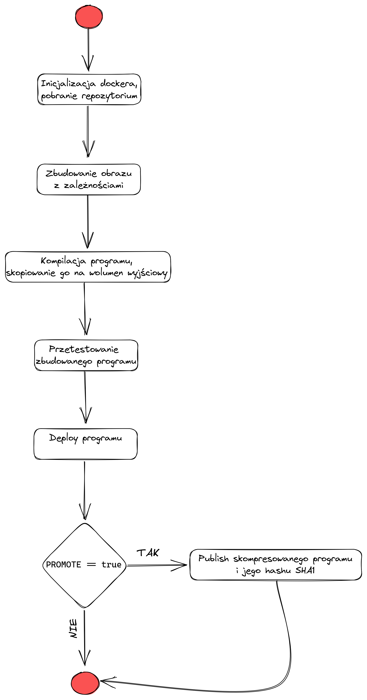
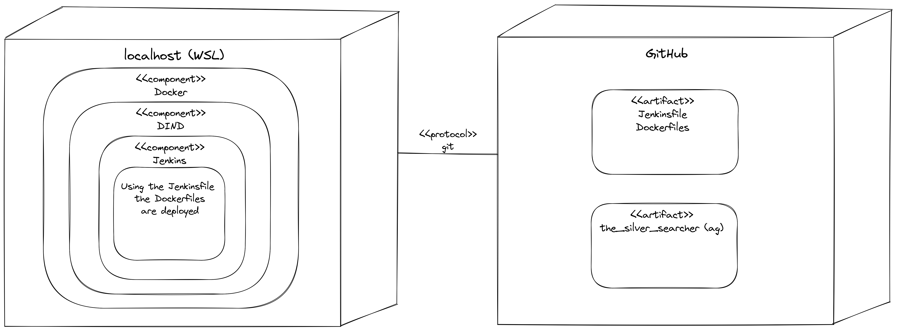

# Sprawozdanie z projektu stworzenia pipeline'a Jenkinsowego dla ag

## Cel

Celem stworzenia pipeline'u było umożliwienie automatycznego budowania, testowania, deploy'owania i ostatecznego publish'a programu do przeszukiwania kodu o nazwie `ag`.

## Projekt w paru słowach

Pipeline podzielony jest na pięć kroków, do czego wykorzystuje cztery wyspecjalizowane Dockerfile.
Jako pierwszy krok pobrane zostaje repozytorium na wolumin wejściowy.
Osobny plik Dockerfile (`deps_dockerfile`) służy do oddzielenia zależności dla budowania i testowania.
Program zostaje zbudowany statycznie i zapisany na wolumenie wyjściowym.
Po tym następuje testowanie kodu poprzez framework dostarczony przez program `cram`.
Deploy programu to stworzenie listy hashy 1000 liczb i wyszukanie frazy `234`.
Jeżeli wszystko do tej pory się powiodło i parametr `PROMOTE` jest ustawiony, program zostaje skompresowany `gzip`'em i wygenerowany zostaje hash _SHA1_ tego pliku.
Te dwie stają się artefaktami pomyślnego uruchomienia pipeline'u.

## Wykonanie

### Uruchomienie Jenkinsa za pomocą Dockera i jego konfiguracja

Postępując zgodnie z [instrukcjami dostarczanymi przez Jenkinsa](https://www.jenkins.io/doc/book/installing/docker/) stworzono dwa kontenery uruchamiające całego Jenkinsa.
Dla ułatwienia uruchamiana całości stworzono skrypt `start_jenkins.sh` uruchamiający oba kontenery i wyciągający hasło do panelu administratora.

Po stworzeniu projektu w zakładce `Configure` ustawiono źródło skryptu pipeline'u na "_SCM_".
Program kontroli wersji ustawiono na `Git` i adres repozytorium na to wykorzystywane do przeprowadzenia zajęć z przedmiotu DevOps.
Wymagane było dodanie kluczy SSH, które autoryzowały Jenkinsa do pobierania całego repozytorium.
Wybrano personalną gałąź i podano ścieżkę zawierającą skrypt `Jenkinsfile`.



Ponieważ dalsze ćwiczenia będą wymagały dostępu do stworzonych artefaktów przez osoby niezalogowane postanowiono umożliwić odczyt plików dla każdego.
Przechodząc do `Dashboard > Manage Jenkins > Configure Global Security` zaznaczono opcję `Allow anonymous read access`.



### Parametryzacja pipeline'u

Bazując na podstawowych skryptach dostarczonych przez Jenkinsa rozszerzono je do spełniania wymagań.
Pipeline był parametryzowany dwoma zmiennymi.
Pierwsza (`VERSION`) określała wersję programu, która była dodawana do nazwy końcowego artefaktu.
Druga (`PROMOTE`) dyktowała czy krok _publish_ ma się odbyć, tym samym zapisując artefakty.

``` groovy
parameters {
    string(name: 'VERSION', defaultValue: '1.0.0', description: '')
        booleanParam(name: 'PROMOTE', defaultValue: true, description: '')
}
```

### Etap przygotowania i klonowania

W etapie tym usunięte zostają wszystkie niedziałające kontenery jak i niewykorzystywane wolumeny mogące zalegać po poprzednim uruchomieniu pipeline'u.
Jako ostatni krok przygotowań stworzony zostaje wolumen wejściowy.

``` groovy
stages {
    stage('Clone') {
        steps {
            sh '''
                docker container prune -f
                docker volume prune -f
                docker volume create --name in_vol
                docker build -t clone_ag -f ITE/GCL06/MR400569/Lab05/clone_dockerfile .
                docker run -v "in_vol:/in_vol" clone_ag
            '''
        }
    }
```

Zbudowany zostaje obraz `clone_dockerfile` otagowany nazwą `clone_ag`.
Obraz ten polega na dystrybucji _alpine_ ze względu na swoją lekkość i szybkość instalowania nowych paczek.
Tym samym zostaje zainstalowana paczka z git'em.
Podczas uruchomienia tego obrazu podany zostaje wolumen wejściowy, na który podczas działania zostaje pobrane repozytorium z kodem `ag`.
Poniżej znajduje się zawartość tego Dockerfile'a.

``` dockerfile
FROM alpine
RUN apk update
RUN apk add git
CMD sh -c 'git clone https://github.com/ggreer/the_silver_searcher /in_vol/the_silver_searcher'
```

### Etap budowania programu z kodu źródłowego

Celem tego etapu jest zbudowanie programu do stanu pliku wykonywalnego, który następnie zostanie zapisany do wolumenu wyjściowego.
Zanim jednak zostanie zbudowany obraz pozwalający na budowanie programu tworzony jest obraz zawierający wszystkie dependencje i finalnie nazwany `deps_ag`.
Obraz budujący nazwano `build_ag`, a jego definicja zapisana jest w pliku `build_dockerfile`.
Uruchamiając wynikowy obraz w celu budowania projektu podłączane są dwa wolumeny: wejściowy z repozytorium kodu i wyjściowy, gdzie zostanie zapisany plik wykonywalny.

``` groovy
stage('Build') {
    steps {
        sh '''
            docker build -t deps_ag -f ITE/GCL06/MR400569/Lab05/deps_dockerfile .
            docker build -t build_ag -f ITE/GCL06/MR400569/Lab05/build_dockerfile .
            docker run -v "in_vol:/in_vol" -v "${PWD}:/out_vol" build_ag
        '''
    }
}
```

Skrypt instalujący wszystkie zależności opierał się na obrazie Fedory w wersji 34.
Instalował wszystkie potrzebne zależności do statycznej kompilacji kodu z repozytorium poprzez menadżer paczek `yum`.
Ponieważ framework `cram` nie znajduje się w repozytorium wymagane jest pobieranie archiwum z jego kodem oraz jego ręczna kompilacja i instalacja.

``` dockerfile
FROM fedora:34

RUN yum install git pkgconfig automake gcc zlib-devel pcre-devel xz-devel wget python-is-python3 zlib-static xz-static pcre-static glibc-static.x86_64 glibc-static.i686 -y
RUN wget https://bitheap.org/cram/cram-0.7.tar.gz && tar zxf cram-0.7.tar.gz && cd cram-0.7 && make install
```

Ponieważ wiele pracy zostało wykonane przed skryptem budującym, ten nie musi się niczym przejmować.
Opierając się na wyżej opisanym skrypcie, jego jedyne zadanie to odpowiednie ustawienie swojej ścieżki, w której pracuje.
Do tego podczas uruchomienia przesyła odpowiednie argumenty do skryptu budującego, a następnie kopiuje wynikowy program na wolumen wyjściowy.

``` dockerfile
FROM deps_ag

WORKDIR /in_vol/the_silver_searcher/
CMD sh -c 'PCRE_LIBS="-L /lib64/ -Wl,-Bstatic -lpcre" ./build.sh LDFLAGS=-static && cp -v ag /out_vol'
```

### Etap testowania

Etap testowania jest krótki i mało rzeczy się w nim dzieje.
Wszystko za sprawą bardzo uproszczonego interfejsu do testów jak i dużej ilości pracy wykonanej przedtem, pozwalającej zająć się tylko wywołaniem odpowiedniej komendy.
Budowany jest nowy obraz na bazie skryptu `test_dockerfile`, który następnie zostaje uruchomiony z podłączonym wolumenem wejściowym, gdzie znajduje się kod źródłowy i zbudowany program.

Dla przyszłych osób napotkano problem, w którym testy działają niedeterministycznie - raz przechodzą, a raz jeden się wykopyrtnie.
Nie jest to moja wina, tylko autora oprogramowania.

``` groovy
stage('Test') {
    steps {
        sh '''
            docker build -t test_ag -f ITE/GCL06/MR400569/Lab05/test_dockerfile .
            docker run -v "in_vol:/in_vol" test_ag
        '''
    }
}
```

Znowu bazujemy na obrazie dependencji.
Tak jak w przypadku budowania ustawiamy odpowiednią ścieżkę roboczą i podczas uruchomienia kontenera testy są puszczane komendą `make test`.

``` dockerfile
FROM deps_ag

WORKDIR /in_vol/the_silver_searcher/
CMD make test
```

### Etap deploy

Ponieważ deploy dla tak prostego programu jest praktycznie zerowy, etap ten jest tak naprawdę mini testem.
Sam etap w skrypcie dla Jenkinsa wygląda identycznie jak w poprzednich przypadkach.
Jedyna różnica to fakt, iż wykorzystywany program będzie tym razem tym, który został skopiowany na wolumen wyjściowy.

``` groovy
stage('Deploy') {
    steps {
        sh '''
            docker build -t deploy_ag -f ITE/GCL06/MR400569/Lab05/deploy_dockerfile .
            docker run -v "${PWD}:/in_vol" deploy_ag
        '''
    }
}
```

Kontener ten będzie generował liste hashy typu SHA1 kolejnych tysiąca liczb i zapisywał je do pliku.
Następnie program będzie wyszukiwał frazę `234` wewnątrz tego pliku, która na pewno się tam pojawi - ponieważ SHA1 jest algorytmem deterministycznym i dla tego samego wejścia zawsze wygeneruje to samo wyjście.

``` dockerfile
FROM fedora:34

WORKDIR /in_vol
CMD bash -c 'for i in {1..1000}; do echo $i | sha1sum; done > /tmp/file.txt && ./ag 234 /tmp/file.txt'
```

### Etap publish

Pierwszy etap gdzie dzieje się coś nowego.
Rzecz, która jest kompletnie inna od wszystkich innych etapów to fakt, iż etap ten jest opcjonalny nawet jeżeli wszystkie inne się powiodą.
W bloku oznaczonym przez słowo kluczowe `when` sprawdzamy czy wartość parametru `PROMOTE` jest ustawiona na `true`.
Jeżeli tak, przejdziemy do wykonywania poniżej opisanych kroków, jeżeli nie, to ta instancja budowania się zakończy bez generowania artefaktu.

W krokach tych skompresowany zostaje program przy użyciu programu `gzip`.
Wykorzystano przekazywanie pliku przez _pipe'y_, aby nie nadpisywać pliku z jego skompresowaną wersją.
Skompresowany program następnie podano jako wejście do programu `sha1sum` generującego hash SHA1 na jego podstawie.
Hash ten zapisano do pliku o takiej samej nazwie co skompresowany program z dopiskiem `.sha1`.
Takie nazewnictwo pozwala niektórym programom automatyczne sprawdzenie, czy program generuje ten sam hash bez potrzeby porównywania bajtów przez użytkownika. 
Do nazewnictwa wykorzystano również zmienną parametryczną `VERSION`.

Finalnie poprzez komendę `archiveArtifacts` oba pliki zostają oznaczone jako artefakty tego build'a.

``` groovy
stage("Publish") {
    when {
        environment name: 'PROMOTE', value: "true"
    }
    steps {
        sh '''
            gzip < ag > "ag_${VERSION}.gz"
            sha1sum "ag_${VERSION}.gz" > "ag_${VERSION}.gz.sha1"
        '''
        archiveArtifacts artifacts: "ag_${VERSION}.gz, ag_${VERSION}.gz.sha1"
    }
}
```

## Przykładowy build

Budowanie wymaga wprowadzenia parametrów



Finalnie po udanym build'zie możemy pobrać wynik działania, jakim jest skompresowany program i jego hash SHA1 zapisane jako artefakty.



Dla przykładu, jako niezalogowany użytkownik pobrano artefakt na poziom WSL, z którego przeprowadzane są zajęcia.
Przy okazji udowodniono, że program działa i jest skompilowany statycznie.



## Diagramy

### Diagram sekwencji



### Diagram wdrożenia

