# Sprawozdanie z laboratoriów 09 z dnia 04.05.2022

## Instalacja systemu Fedora w środowisku VirtualBox

Wykonano następujące kroki:

- Wybór języka
- Konfiguracja dysku i partycji
- Wybór minimalnej instalacji
- Ustawienie hasła konta `root`

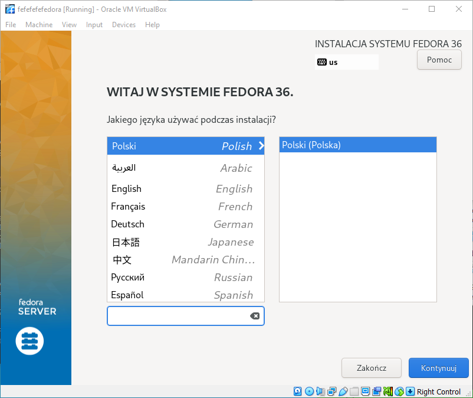

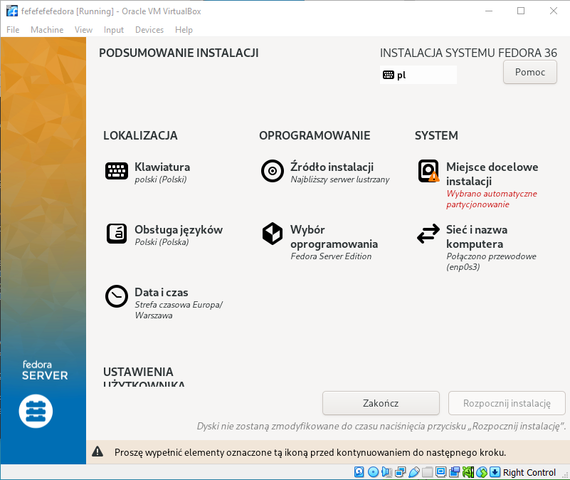

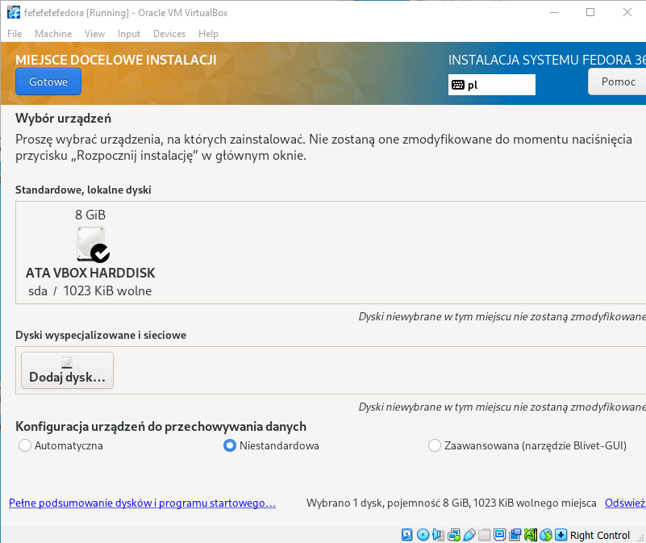

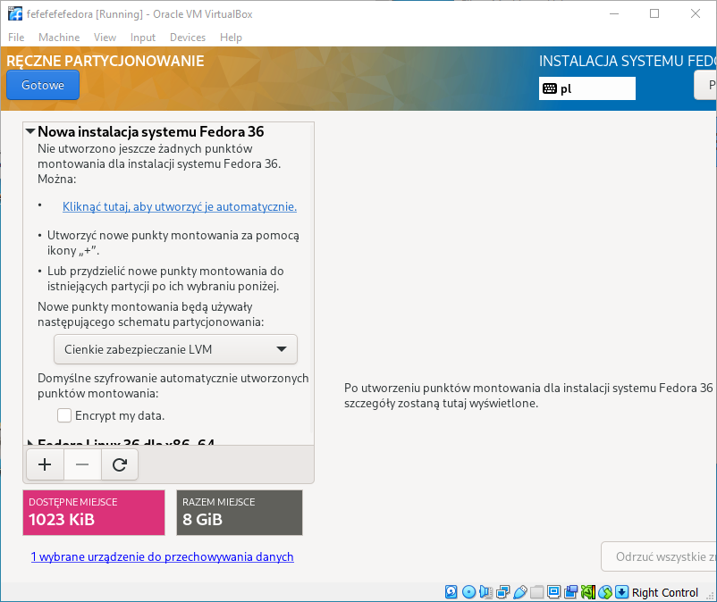

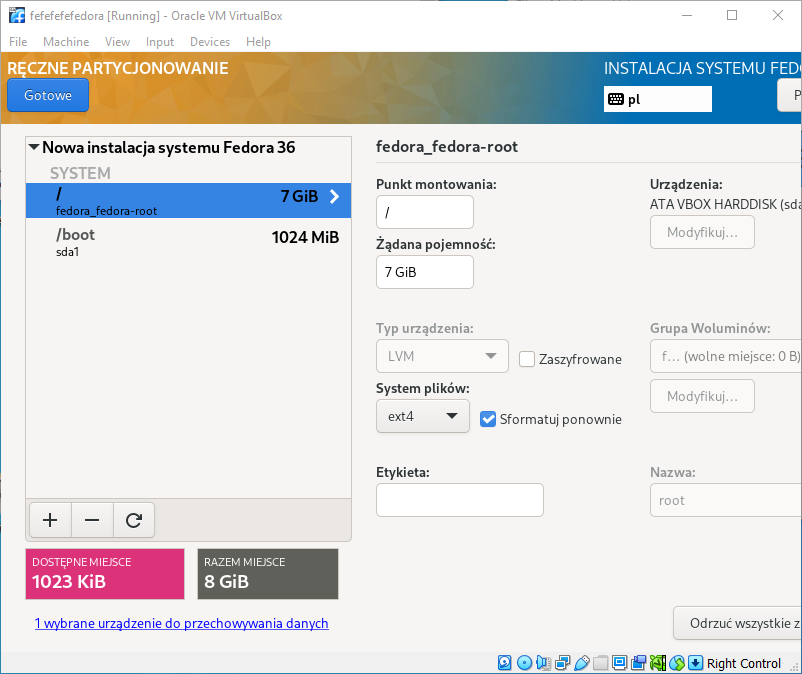

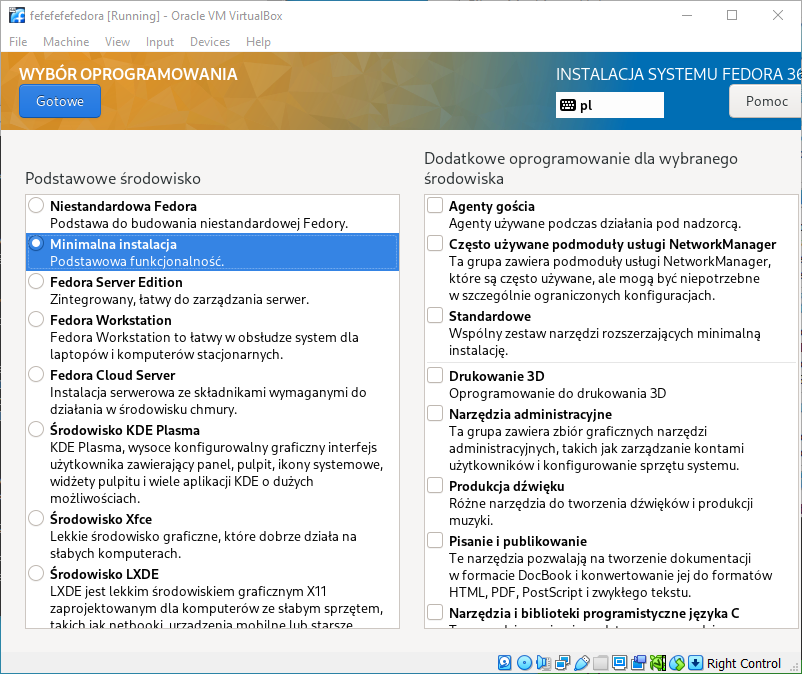

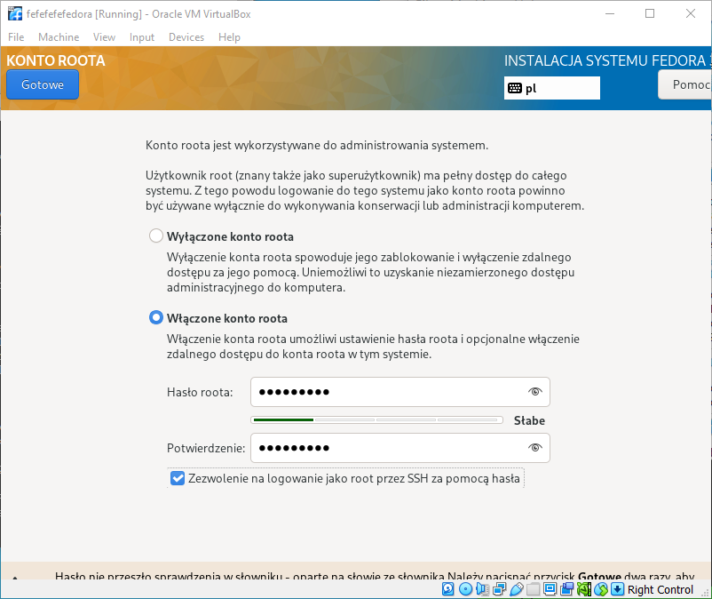

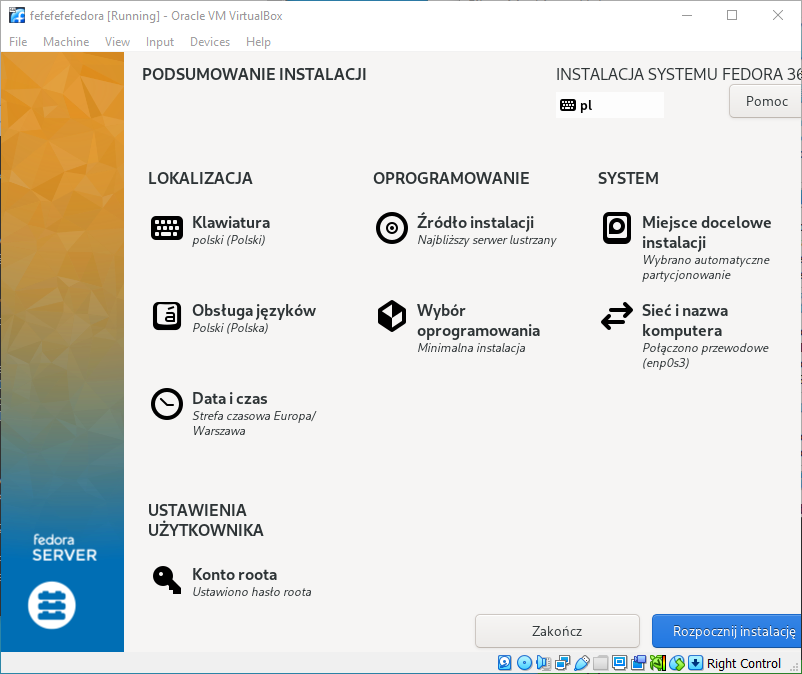

Dla pierwszej VM [pobrano ten plik](https://gist.githubusercontent.com/touilleMan/eb02ea40b93e52604938/raw/b5b9858a7210694c8a66ca78cfed0b9f6f8b0ce3/SimpleHTTPServerWithUpload.py).
Jest to prosty server plików z interfejsem HTTP.

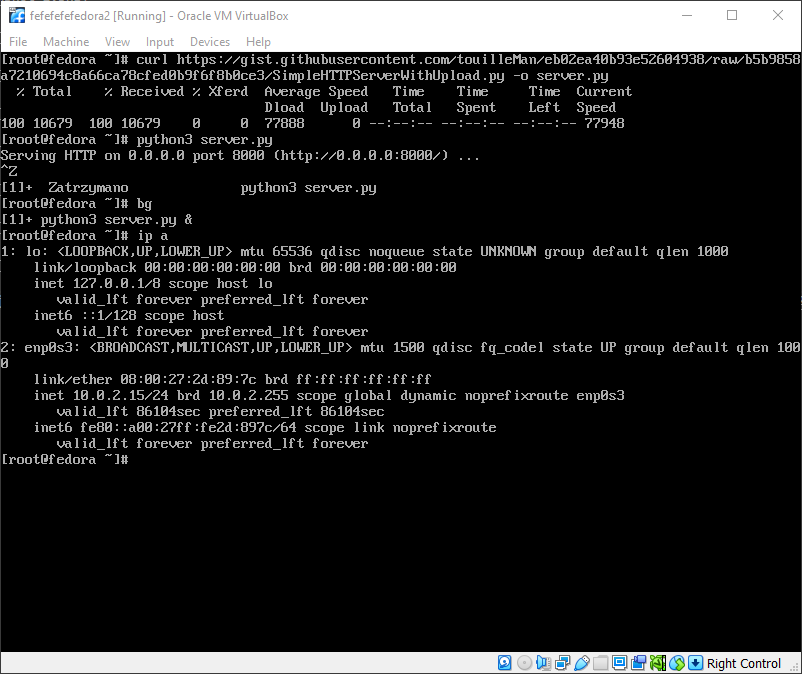

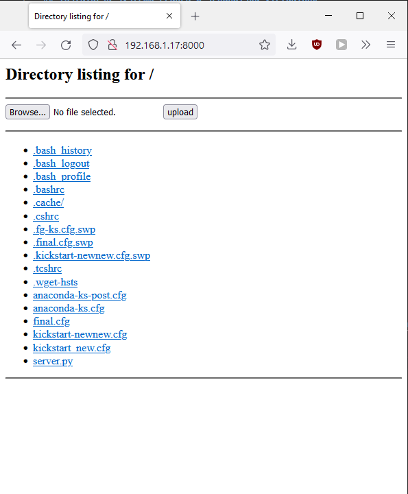

Serwer ten jest już w stanie działać jako dysk w sieci, do użytku podczas automatycznej instalacji.
W pliku kickstart zmieniono tryb instalacji na tekstowy, dodano link do repozytorium i dodano akcję wykonywaną po instalacji.
Akacja ta będzie pobierać artefakt z Jenkinsa.
Wynikowy diff z dodawania nowych rzeczy:

``` diff
--- final_diff.cfg	2022-05-18 10:42:28.934003061 +0200
+++ final.cfg	2022-05-18 11:32:04.846781336 +0200
@@ -2,13 +2,17 @@
 # Generated by pykickstart v3.36
 #version=F36
 # Use graphical install
-graphical
+text
 
 # Keyboard layouts
 keyboard --vckeymap=pl --xlayouts='pl'
 # System language
 lang pl_PL.UTF-8
 
+# Repo
+url --mirrorlist=http://mirrors.fedoraproject.org/mirrorlist?repo=fedora-$releasever&arch=x86_64
+repo --name=updates --mirrorlist=http://mirrors.fedoraproject.org/mirrorlist?repo=updates-released-f$releasever&arch=x86_64
+
 %packages
 @^minimal-environment
 
@@ -33,3 +37,9 @@
 
 # Root password
 rootpw --iscrypted $y$j9T$yA4M/l7Hs2guz8udmE5./LC/$VdWqA9eG/Xn6cZSLq77fQEsK9l6EWq1xtaOkGUm/ml7
+
+%post
+curl http://192.168.1.13:8080/job/Lab05/lastSuccessfulBuild/artifact/ag_1.0.0.gz -o ag_1.0.0.gz
+gzip -d ag_1.0.0.gz 
+chmod +x ag_1.0.0 
+%end
```

### Udostępnianie Jenkinsa dla VirtualBoxa

Ponieważ w życiu nic nie może być łatwe, przynajmniej taką mantrę przyjęli sobie ludzie w Microsoftcie, żeby uzyskać dostęp do Jenkinsa trzeba wyczarować proxy.
Rozdział w książce magii, który o tym mówi jest [tutaj](https://docs.microsoft.com/en-us/windows/wsl/networking).
Poniżej magiczna inkantacja, która sprawiła, że cały ruch sieciowy na Windowsie zostaje przekierowany na WSLa - przynajmniej ten na porcie 8080.
Trzeba również pamiętać, że gdy każdy z cyrku już wyjdzie należy zdjąć to zaklęcie.

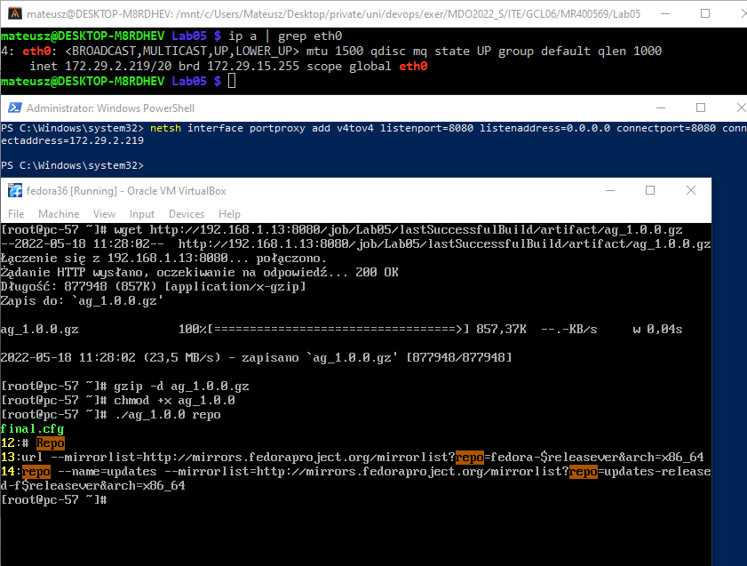

## Instalacja

Na ekranie wyboru podano argument `inst.ks=http://<adres serwera z kickstartem>/<ścieżka>`, w przypadku wykonywanego zadania było to: `inst.ks=http://192.168.1.17:8000/final.cfg`
Następnie widać jak instalacja przebiega automatycznie sama instalując wszystkie potrzebne rzeczy.
Finalnie po zrestartowaniu maszyny i odłączeniu obrazu od napędu DVD można zauważyć, że podczas instalacji został pobrany artefakt z Jenkinsa.
Udowodniono również, że artefakt ten jest gotowy do użytku bez potrzeby posiadania jakichkolwiek zależności zainstalowanych ze względu na statyczną kompilację.

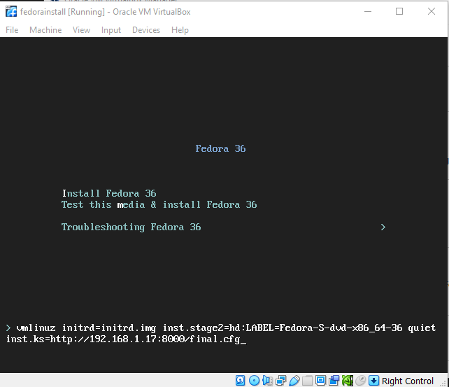

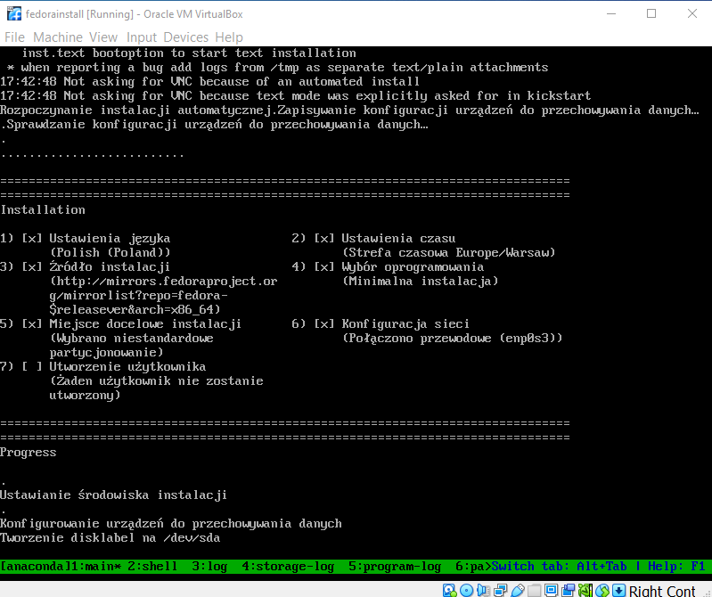

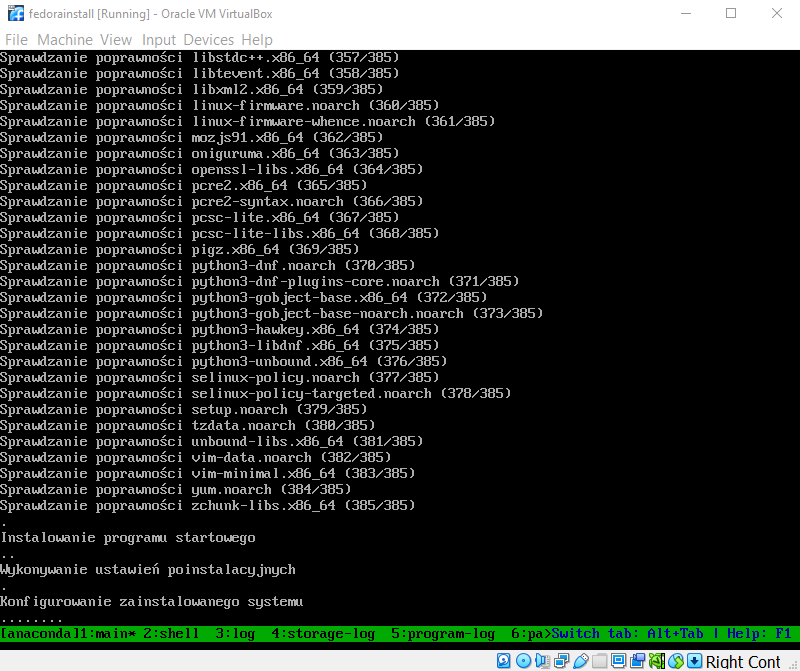

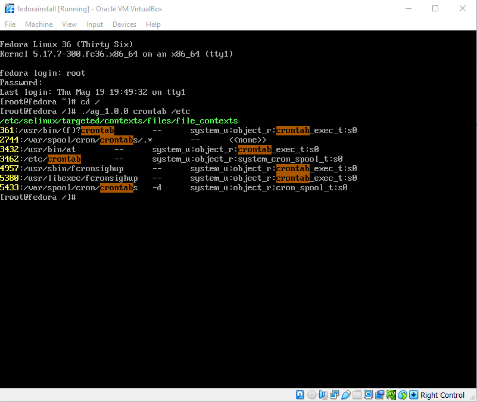

## Tworzenie pliku ISO

Wybrano wykorzystać VM fedory odpowiedzialny za bycie serwerem HTTP, żeby bez problemu mieć dostęp do pliku iso.
W opcjach maszyny wirtualnej do napędu optycznego podłączono instalacyjny plik wykorzystywany do tej pory do instalacji wszystkich maszyn.
Skopiowano jego zawartość poprzez zamountowanie go, następnie jego zawartość skopiowano do osobnego folderu, do którego dodawano wszystkie zmiany.

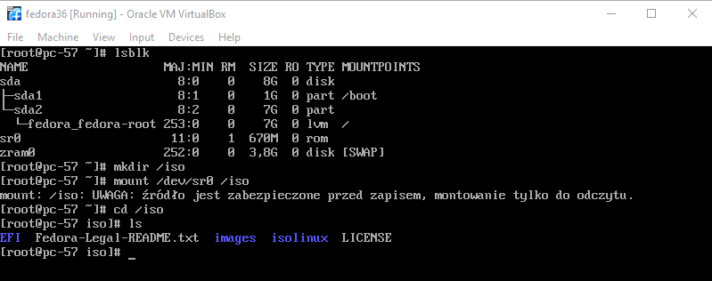

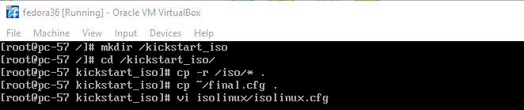

Po zaaplikowaniu następującego diffa do pliku `isolinux/isolinux.cfg` stworzono plik przy użyciu komendy `mkisofs` dostarczonej przez paczkę `genisoimage`.

```
--- /root/isolinux.cfg	2022-05-18 12:41:51.040946808 +0200
+++ isolinux/isolinux.cfg	2022-05-18 12:43:23.165545642 +0200
@@ -58,6 +58,12 @@
 menu separator # insert an empty line
 menu separator # insert an empty line
 
+label kickstart install
+  menu label ^Kickstart Install
+  menu default
+  kernel vmlinuz
+  append initrd=initrd.img inst.ks=cdrom:/final.cfg xdriver=vesa nomodeset
+
 label linux
   menu label ^Install Fedora 36
   kernel vmlinuz
@@ -65,7 +71,6 @@
 
 label check
   menu label Test this ^media & install Fedora 36
-  menu default
   kernel vmlinuz
   append initrd=initrd.img inst.stage2=hd:LABEL=Fedora-S-dvd-x86_64-36 rd.live.check quiet
```

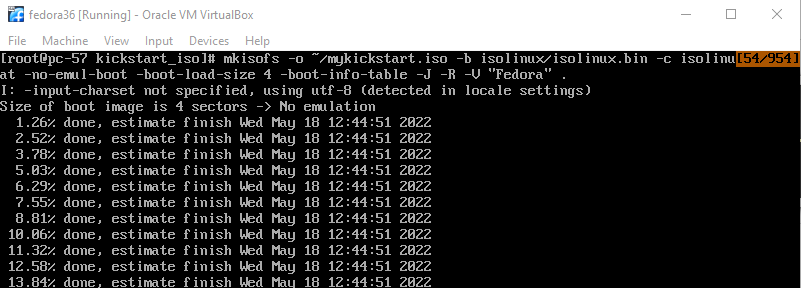

Pobrano plik .iso z serwera na komputer, stworzono nową maszynę, która umożliwia wybranie opcji `Kickstart Install`.

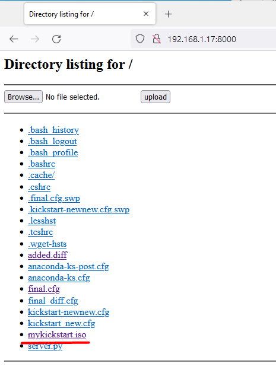

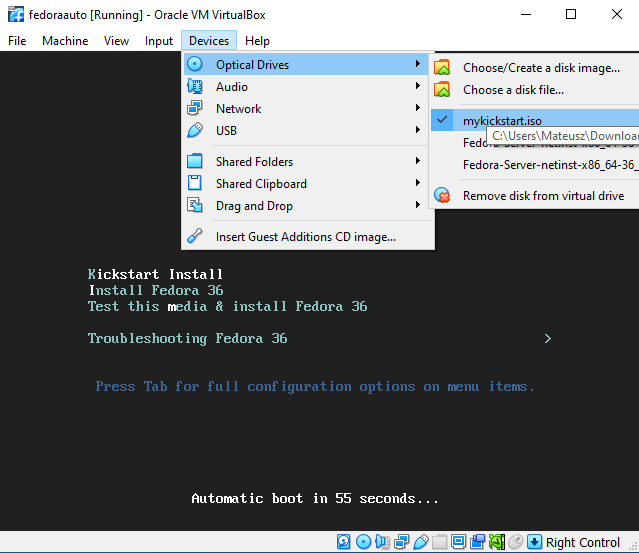

Po przejściu przez instalację finalnym rezultatem jest działający system z pobranym artefaktem.

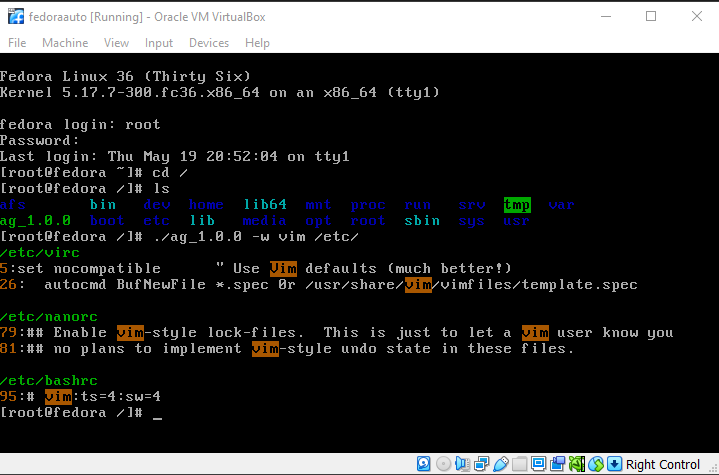
