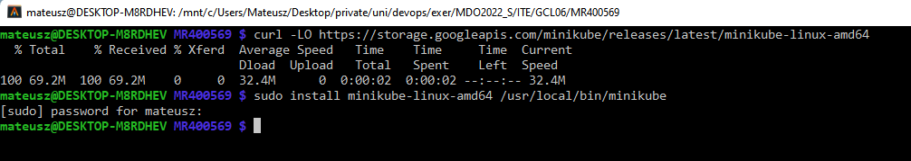
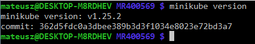
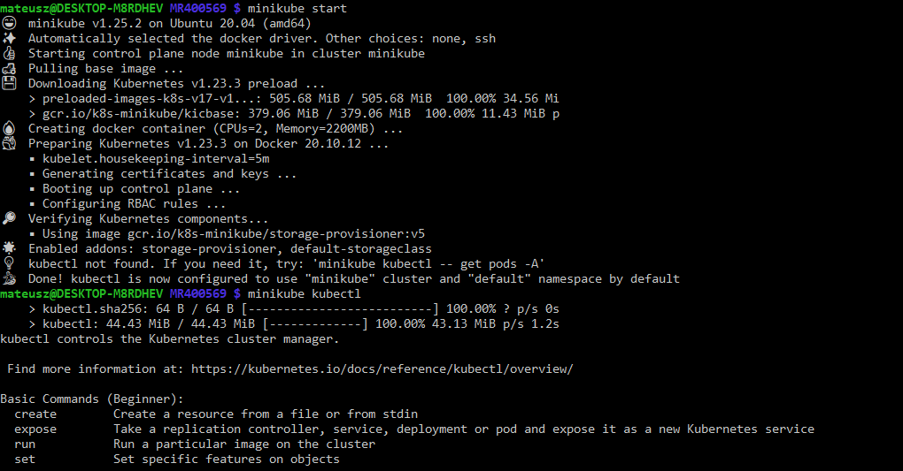
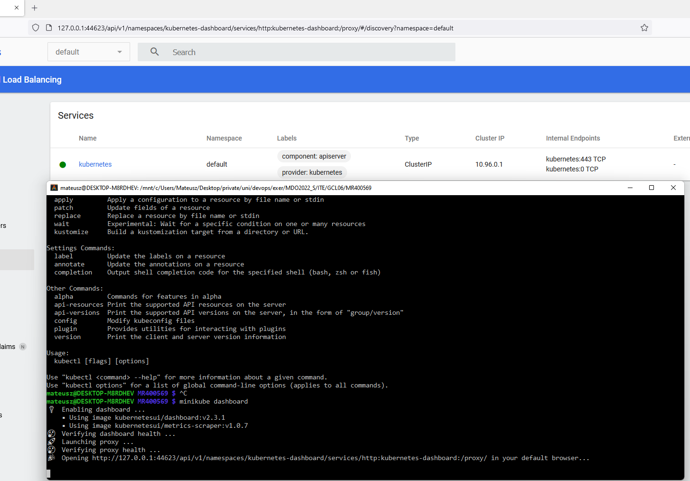
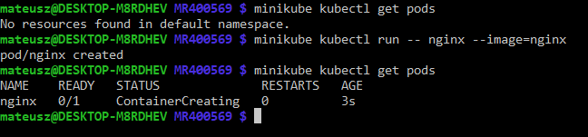
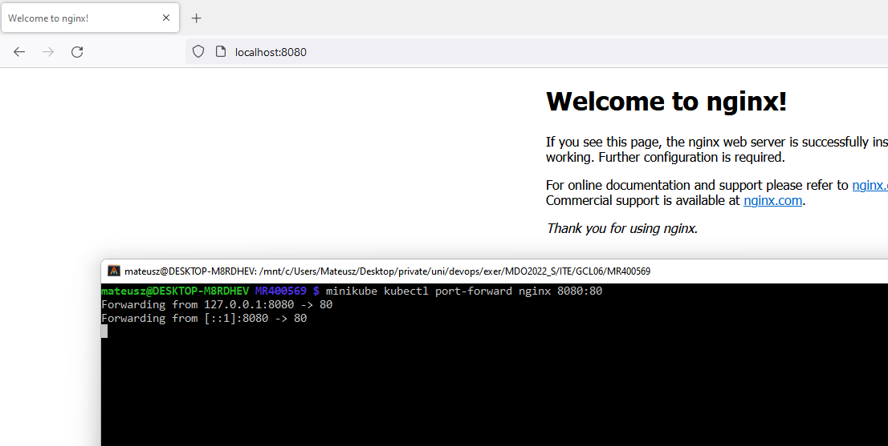
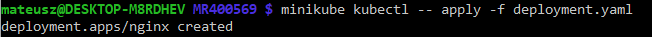

# Sprawozdanie z laboratoriów 09 z dnia 25.05.2022

## Instalacja programu minikube

Instalacja została przeprowadzona zgodnie z sugerowaną instalacją na [stronie programu minikube](https://minikube.sigs.k8s.io/docs/start/).
Wybrano wersję **stable**, dla **Linuxa** w architekturze **x86** oraz pobranie **binarki** zamiast paczki RPM lub DEB.
Ostateczne, dwie komendy, które wszystko instalowały to:

``` bash
curl -LO https://storage.googleapis.com/minikube/releases/latest/minikube-linux-amd64
sudo install minikube-linux-amd64 /usr/local/bin/minikube
```



Sprawdzenie czy `minikube` działa.



Mając działający `minikube` startuje kubernetes i pobieram `kubectl`.



Startuje _dashboard_ kubernetesa.



Jako pod uruchamiam obraz nginx'a i nazywam go "nginx".



Aby dostać się do strony startowej nginxa wykonuje port-fowarding z portu 80 na port 8080.



## Deployment opisany w pliku

W pliku YAML opisuje deployment 5 podów nginxa.

``` yaml
apiVersion: apps/v1
kind: Deployment
metadata:
  name: nginx
  labels:
    app: nginx
spec:
  replicas: 5
  selector:
    matchLabels:
      app: nginx
  template:
    metadata:
      labels:
        app: nginx
    spec:
      containers:
      - name: nginx
        image: nginx
        ports:
        - containerPort: 80
```

Przed uruchomieniem deploymentu usunięto poda utworzonego wcześniej komendą `minikube kubectl delete pod nginx`.
Po uruchomieniu deploymentu komendą `minikube kubectl apply` można zauważyć działający deployment w dashboardzie.



