# Sprawozdanie z laboratoriów 12 z dnia 01.06.2022

## Wdrożenie

Modyfikując plik wdrożenia YAML przygotowany na poprzednich zajęciach, zmieniono ilość replik z 5 na 4.

``` yaml
apiVersion: apps/v1
kind: Deployment
metadata:
  name: nginx
  labels:
    app: nginx
spec:
  replicas: 4
  selector:
    matchLabels:
      app: nginx
  template:
    metadata:
      labels:
        app: nginx
    spec:
      containers:
      - name: nginx
        image: nginx
        ports:
        - containerPort: 80
```

To samo jako _diff_ z plikiem użytym w poprzednich zajęciach.

``` diff
@@ -5,7 +5,7 @@
   labels:
     app: nginx
 spec:
-  replicas: 5
+  replicas: 4
   selector:
     matchLabels:
       app: nginx
```

Uruchomiono wdrożenie i sprawdzono jego status za pomocą komendy `minikube kubectl rollout status`.
Sprawdzono stan podów za pomocą `minikube kubectl get pods`.

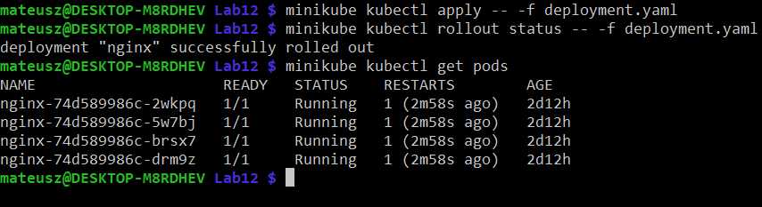

## Przygotowanie obrazów

Na bazie obrazu pythona przygotowano dwa obrazy, jeden, który będzie włączał prosty serwer HTTP i drugi, który próbuje zrobić to samo natomiast ma w sobie literówkę, która sprawia, że uruchomienie obrazu kończy się niepowodzeniem.
Ponieważ chcemy używać lokalnych obrazów musimy zbudować je w środowisku dockera minikube'a.
Możemy w nie wejść przez komendę `eval $(minikube docker-env)` dla tego terminala.

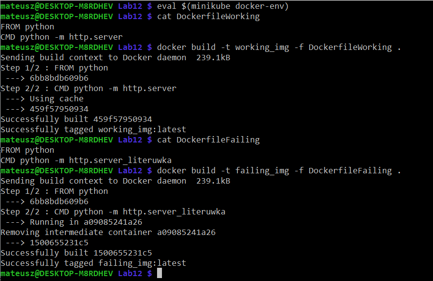

Należy również dodać następującą zmianę, aby nie próbować pobierać obrazów tylko używać lokalnych.
``` diff
@@ -16,6 +16,7 @@
     spec:
       containers:
       - name: nginx
+        imagePullPolicy: Never
         image: nginx
         ports:
         - containerPort: 80
```

Uruchomienie nie działającego obrazu

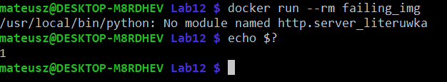

## Zmiany w wdrożeniu

Zwiększenie ilości replik

``` diff
@@ -5,7 +5,7 @@
   labels:
     app: nginx
 spec:
-  replicas: 4
+  replicas: 8
   selector:
     matchLabels:
       app: nginx
```

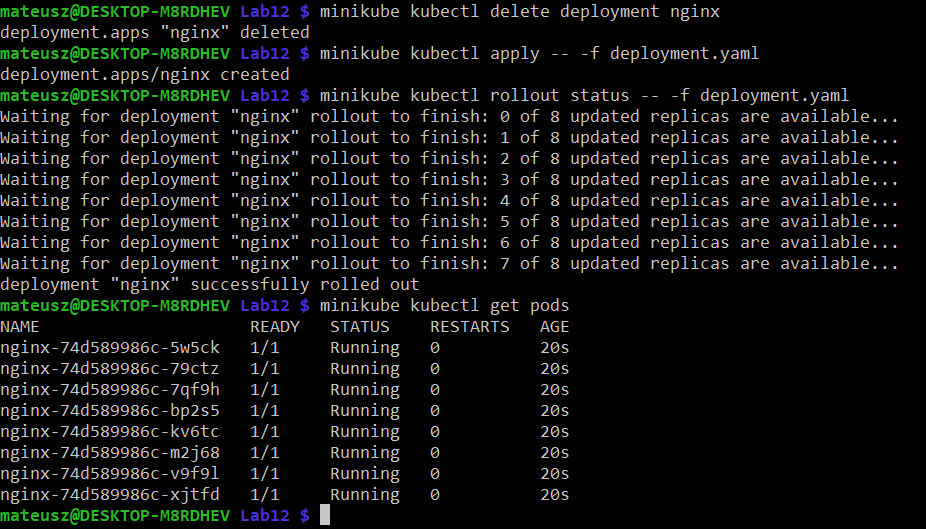

Ustawienie ilości replik na równą 1

``` diff
@@ -5,7 +5,7 @@
   labels:
     app: nginx
 spec:
-  replicas: 8
+  replicas: 1
   selector:
     matchLabels:
       app: nginx
```

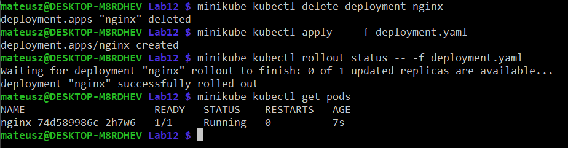

Ustawienie ilości replik na równą 0

``` diff
@@ -5,7 +5,7 @@
   labels:
     app: nginx
 spec:
-  replicas: 1
+  replicas: 0
   selector:
     matchLabels:
       app: nginx
```

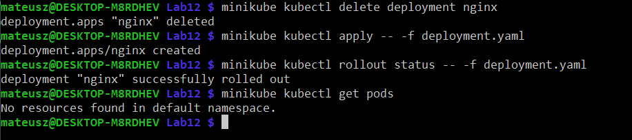

Zmiana obrazu:

``` diff
@@ -17,6 +17,6 @@
       containers:
       - name: nginx
         imagePullPolicy: Never
-        image: nginx
+        image: working_img
         ports:
         - containerPort: 80
```

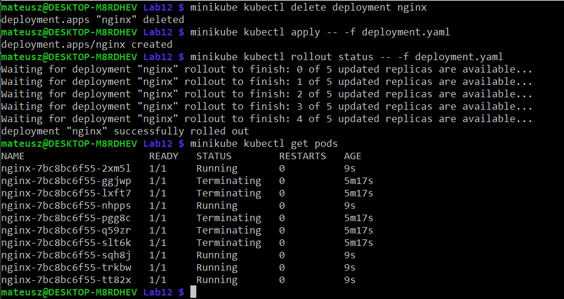

Kolejna zmiana obrazu:

``` diff
@@ -17,6 +17,6 @@
       containers:
       - name: nginx
         imagePullPolicy: Never
-        image: working_img
+        image: failing_img
         ports:
         - containerPort: 80
```

Na tym zdjęciu widać jak Kubernetes próbuje postawić program na nowo, tak aby posiadać 5 działających replik natomiast żadna z tych operacji się nie udaje ze względu na fakt, iż zawsze ta operacja będzie kończyć się niepowodzeniem.

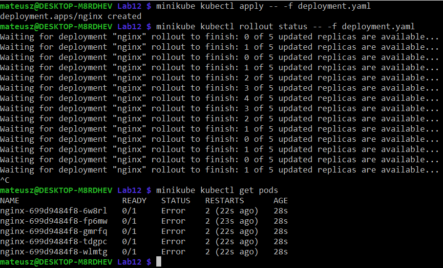

## Kontrola wdrożenia

Do ułatwienia operacji wdrożenia utworzono skrypt, który wykonywał wszystkie operacje pokazywane wcześniej po kolei.
Jako sprawdzenie czy "rollout" się udał użyto komendy `timeout`, która zwróci błąd jeżeli komenda wpisana do niej nie zakończy swojego działania w określonym czasie.
Czas ustalono na 30 sekund.
Dla ułatwienia rozumienia tego czy wdrożenie się udało wykorzystano kolory do oznaczenia na zielono pomyślnego wdrożenia i na czerwono wdrożenia nieudanego. 

``` bash
#!/bin/bash

minikube kubectl delete deployment nginx
minikube kubectl apply -- -f deployment.yaml
timeout 30 minikube kubectl rollout status -- -f deployment.yaml
if [ $? -eq 0 ]
then
    echo -e "\033[32m Successful deployment \033[m"
else
    echo -e "\033[31m ERROR! Deployment failed \033[m"
fi
```

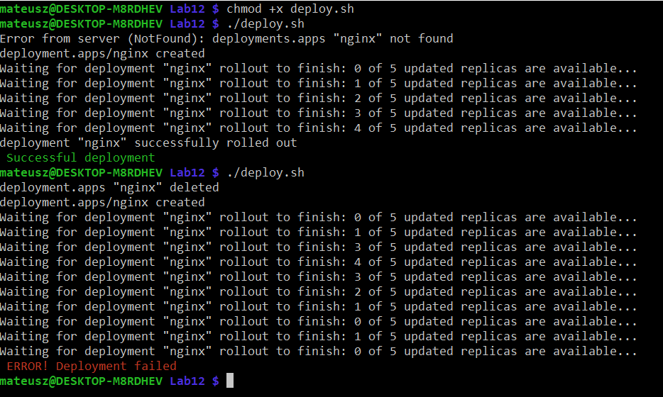

## Strategie wdrożenia

### Recreate

W tej strategii stara wersja jest ubijana i w jej miejsce wdrażana jest nowa.

``` yaml
strategy:
    type: Recreate
```

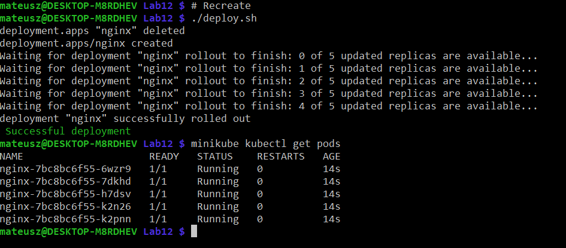

### Rolling Update

W tej strategii progresywanie pody są wyłączane i włączane jeszcze raz.
Dla tej strategii definiujemy również zmienne, które definują to jak agresywanie mają być wyłączane pody.
Zdefiniowano, że co najmniej 25% podów może być dodane jednoczenie oraz, że podczas wdrożenia 25% z nich może być niedostępnych.

``` yaml
strategy:
    type: RollingUpdate
    rollingUpdate:
        maxSurge: 25%
        maxUnavailable: 25% 
```

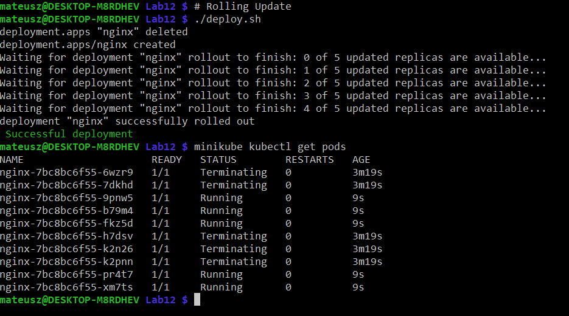

### Canary Deployment workload

W tej strategii wdrażamy dwie rzeczy obok siebie w różnych wersjach.
Jedną w wersji nowej a drugą w wersji produkcyjnej - stabilnej.