# Rafał Olech - Sprawozdanie z laboratorium 1

## Cel ćwiczeń laboratoryjnych:

    Celem ćwiczeń było zapoznanie się z podstawową obsługą i działaniem środowiska GitHub. Utworzenie własnej gałęzi w repozytorium i połączenie się z nią za pomocą SSH.

## Wykonanie ćwiczenia:

1. Instalacja klienta Git oraz obsługa kluczy SSH.

 * Instalacja klienta Git komendą `sudo apt-get install git` :

    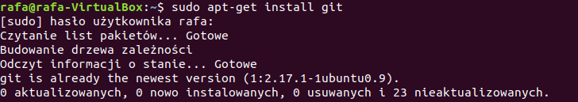

 * Sprawdzenie czy poprawnie zainstalowano Git'a za pomocą polecenia `git --version` :

     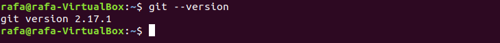

 * Instalacja SSH poleceniem `sudo apt-get install openssh-server` :

     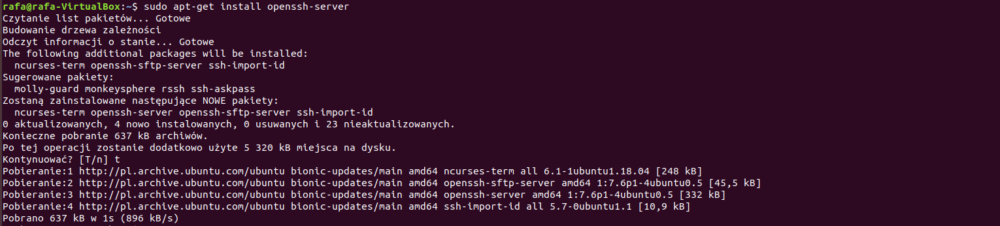

2. Sklonowanie repozytorium za pomocą HTTPS komendą `git clone https://github.com/InzynieriaOprogramowaniaAGH/MDO2022_S` :

    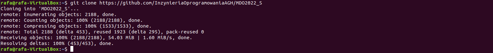

3. Sklonowanie repozytorium za pomocą SSH :

 * Wygenerowanie pary kluczy SSH. Został utworzony klucz publiczny oraz klucz prywatny zakodowany hasłem :

    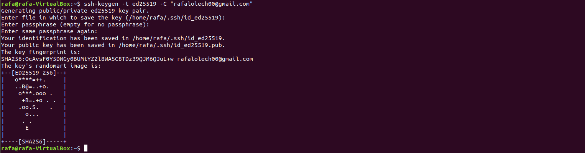

 * Wyświetlenie klucza publicznego :

    

 * Powiązanie klucza SSH z własnym kontem na GitHub :

    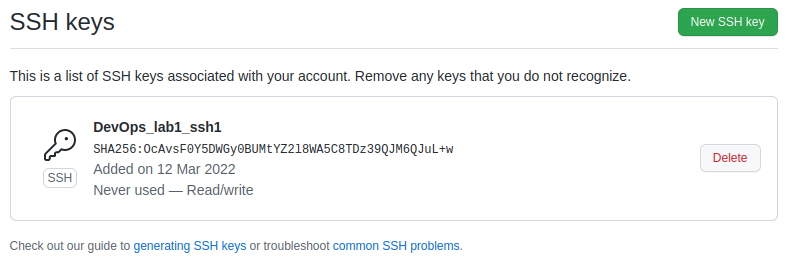

 * Sklonowanie repozytorium wykorzystując SSH poleceniem `git clone git@github.com:InzynieriaOprogramowaniaAGH/MDO2022_S.git` :

    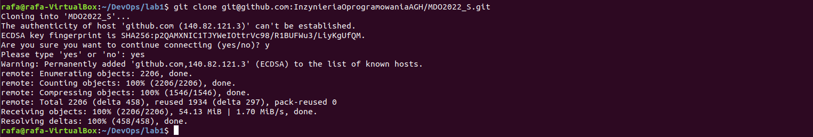

4. Przełączenie się na gałąź swojej grupy :

    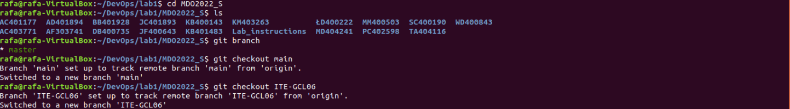

 * Sprawdzenie czy przełączenie na gałąź grupy przeszło pomyślnie za pomocą polecenia `git branch` :

    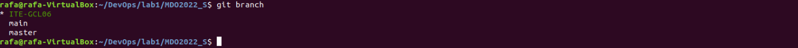

5. Utworzenie własnej gałęzi poleceniem `git checkout -b RO400876` o nazwie składającej się z inicjałów oraz numeru indeksu :

    

 * Sprawdzenie czy utworzenie własnej gałęzi przeszło pomyślnie za pomocą polecenia `git branch` :

    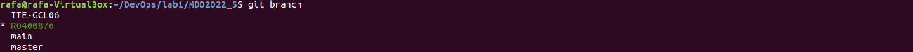

6. Praca na nowej gałęzi :

 * Przejście do katalogu właściwego dla grupy, i utworzenie w nim za pomocą `mkdir RO400876`katalogu o nazwie takiej samej jak powyżej czyli składającej się z inicjałów oraz numeru indeksu :

    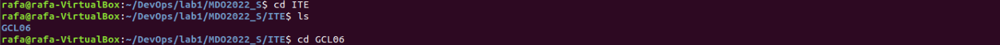

 * W nowym katalogu utworzenie katalogu o nazwie lab01 poleceniem `mkdir lab01` :

    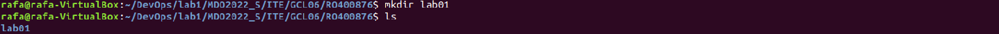

 * Utworzenie pliku ze sprawozdaniem w katalogu lab01 poleceniem `code Rafał_Olech_sprawozdanie_1.md` :

    

 * Tworzenie sprawozdania w aplikacji Visual Studio Code.
 
    

