# Rafal Olech - Sprawozdanie z laboratorium 3

## Cel cwiczen laboratoryjnych:

Celem cwiczen byla praca na dowolnie znalezionym repozytorium z otwarta licencja. Celem bylo sklonowanie repozytorium, zbudowanie programu oraz uruchomienie testow jednostkowych dolaczonych do repozytorium.

## Wykonanie cwiczenia:

1. Znalezienie repozytorium dysponujujacego otwarta licencja i zawierajacego testy. Link do repozytorium:
https://github.com/typicode/json-server

2. Sklonowanie repozytorium (SSH) poleceniem `git clone git@github.com:typicode/json-server.git`:

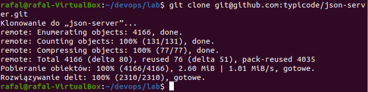

3. Aby poprawnie uruchomic program potrzebne jest doinstalowanie potrzebnych nardzeci i zaleznosci za pomoca `npm install`:

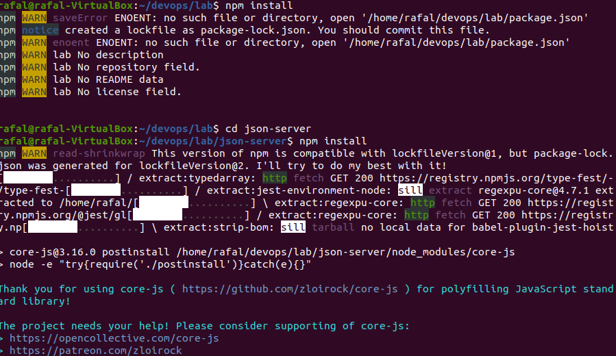

4. Za pomoca polecenia `npm run build` zbudowanie programu:

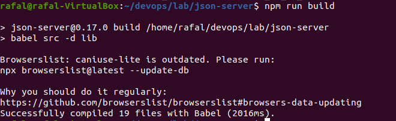

5. Uruchomienie testow za pomoca `npm test`:

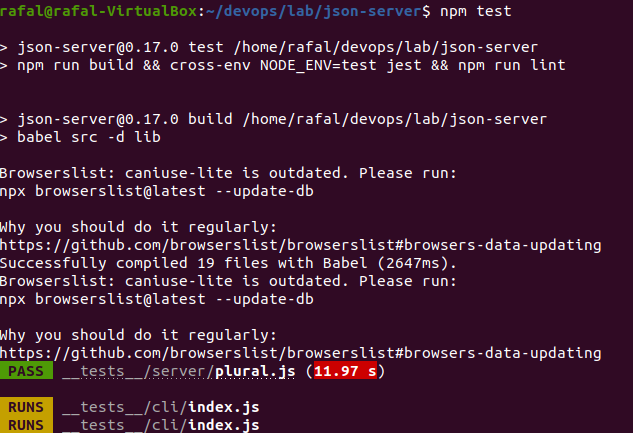

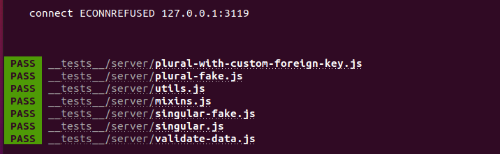

6. Pobranie obrazu ubuntu poleceniem `sudo docker pull ubuntu`:


7. Utworzenie wlasnego kontenera poleceniem `sudo docker run --name rafal_contener -it ubuntu`:


8. Sklonowanie repozytorium (HTTPS) poleceniem `git clone https://github.com/typicode/json-server.git`:

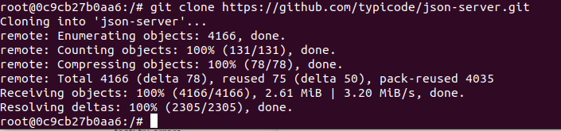

9. Pobranie pakietu npm poleceniem `apt-get install npm`:

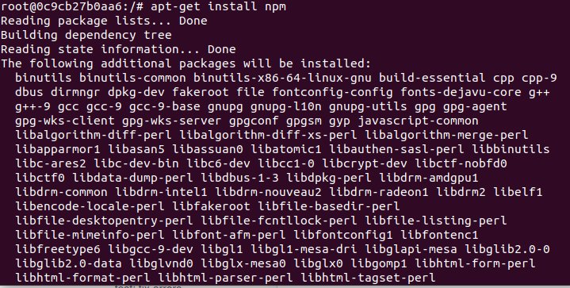

10. Po pobraniu pakietu npm instalacja wymaganych zaleznosci poleceniem `npm install`:

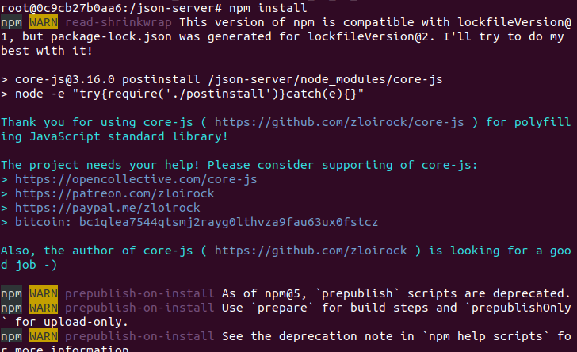

11. Zbudowanie programu poleceniem `npm run build`:

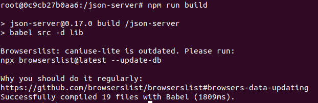

12. Uruchomienie testow programu poleceniem `npm test`:

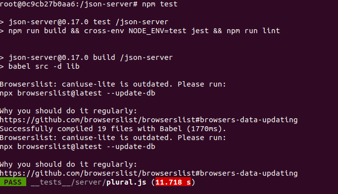

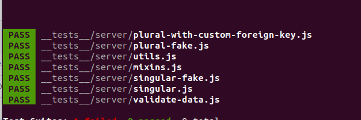

13. Utworzenie dwoch plikow Dockerfile automatyzujacych powyzsze kroki.

* Utworzenie pliku Dockerfile, ktory przeprowadza wszystkie kroki az do builda:

```
FROM node:latest
RUN git clone https://github.com/typicode/json-server.git
WORKDIR json-server
RUN npm install
RUN npm run build
```

* Utworzenie pliku Dockerfile, ktory przeprowadza testy:

```
FROM ro_build:latest
WORKDIR json-server
RUN npm test
```

14. Wykazanie, ze kontenery wdrazaja sie i pracuja poprawnie:

* Przeprowadzenie budowania programu za pomoca utworzonego Dockerfilea poleceniem `sudo docker build . -f RO_Dockerfile_build -t ro_build`:

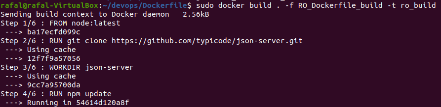

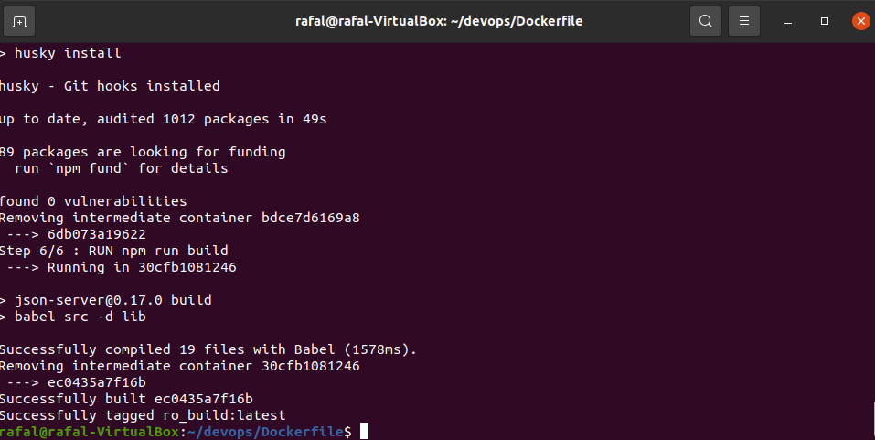

* Przeprowadzenie testow za pomoca utworzonego Dockerfilea poleceniem `sudo docker build . -f RO_Dockerfile_test -t ro_test`:


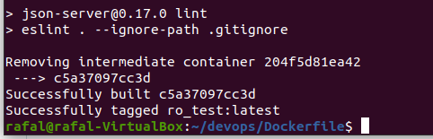

15. Wyswietlenie aktualnych obrazow poleceniem 'sudo docker images':


16. Uruchomienie nowo utworzonego obrazu poleceniem `sudo docker run -it --name ro_build ro_build`:

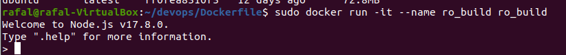

