# Rafał Olech - Sprawozdanie z laboratorium 4

## Cel ćwiczeń laboratoryjnych:

Celem ćwiczeń laboratoryjnych była dalsza praca z środowiskiem Docker i poznanie dodatkowej terminologi w konteneryzacji. Druga część ćwiczenia dotyczyła instalacji Jenkinsa.

## Wykonanie ćwiczenia:

1. Utworzenie woluminu wejściowego (volume_input) oraz woluminu wyjściowego (volume_output) poleceniem `sudo docker volume create`:

2. Sprawdzenie czy woluminy zostały stworzone poprawnie wypisując wszystkie woluminy komendą `sudo docker volume ls`:

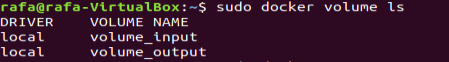

3. Wyświetlenie informacji o utworzonych woluminach za pomocą polecenia `sudo docker inpect`:

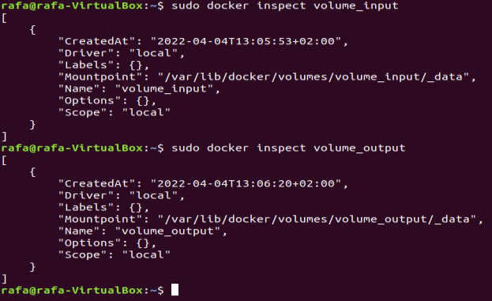

4. Utworzenie i uruchomienie kontenera z utworzonymi wcześniej woluminami:

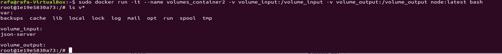

5. Sklonowanie repozytorium z poprzednich ćwiczeń na wolumin wejściowy. Link do repozytorium https://github.com/typicode/json-server:

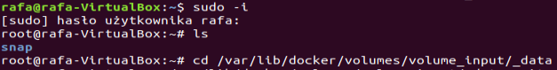
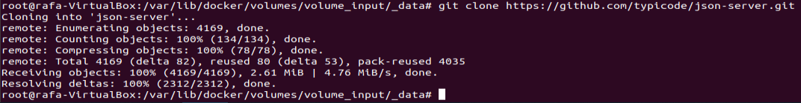

6. Skopiowanie repozytorium z wolumina do kontenera poleceniem `cp volumin_input/json-server/ json-server -r`:

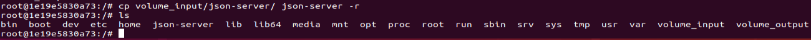

7. Instalacja niezbędnych zależności poleceniem `npm install`:

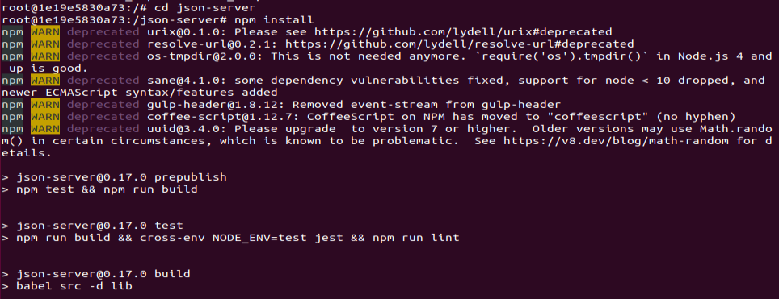

8. Zbudowanie programu w kontenerze poleceniem `npm run build`:

9. Zapisanie na woluminie wyjściowym powstałych przy bududowaniu plików poleceniem `cp -r json-server /volume_output/`:

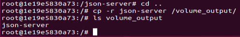

10. Uruchomienie wewnątrz kontenera serwera iperf3:

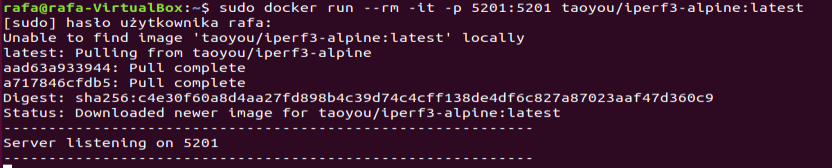

11. Odczytanie IP kontenera i hosta:

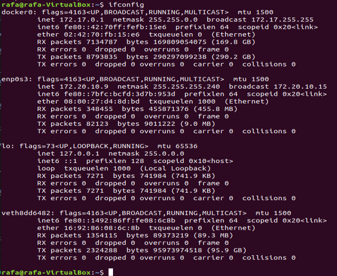

12. Połączenie z serwerem z drugiego kontenera:

Drugi kontener:

Serwer:
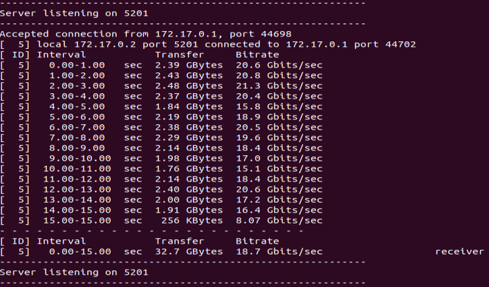

13. Połączenie z serwerem z hosta:

Host:
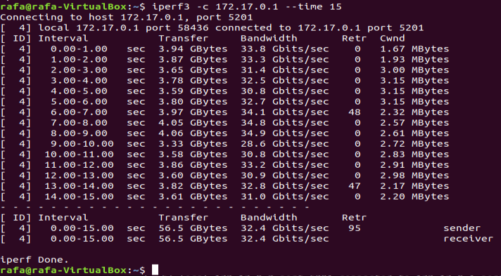

Serwer:
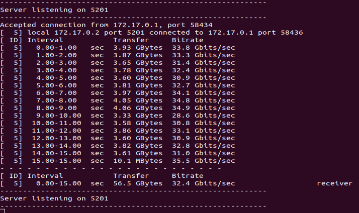

14. Połączenie z serwerem spoza hosta:

Windows:
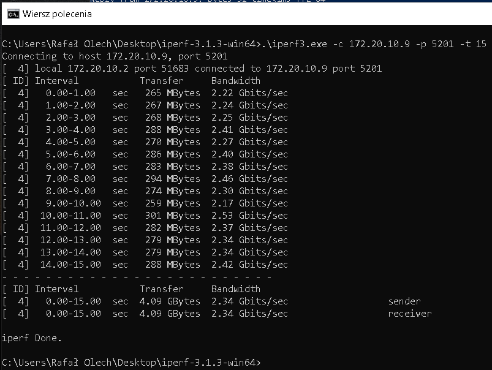

Serwer:
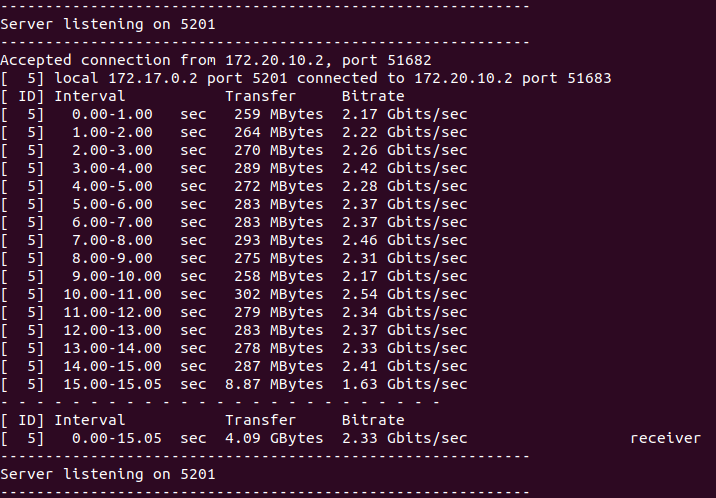

15. Podsumowanie przepustowości komunikacji:

Analizując uzyskane wartości przepustowości komunikacji można zauważyć, że najszybsze łącze występuje pomiędzy kontenerem a hostem, a przepustowość wynosi 32,4 Gbits/sec. Nieco niższą przepustowość można odczytać w komunikacji pomiędzy dwoma kontenerami i wynosi ona 18,7 Gbits/sec. Najniższą przepustowość, a więc najwolniejsze łącze występuje pomiędzy serwerem a windowsem i wynosi 2,34 Gbits/sec.

16. Utworzenie sieci mostkowej w Dockerze poleceniem `sudo docker network create jenkins`: 

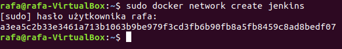

17. Pobranie i uruchomienie obrazu docker:dind:

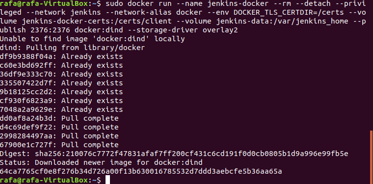
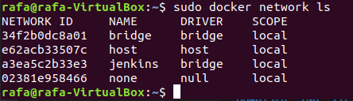

18. Wyświetlenie aktualnie działających kontenerów poleceniem `sudo docker ps`:

19. Zbudowanie obrazu z pliku Dockerfile poleceniem `sudo docker build . -f jenkins_Dockerfile -t myjenkins-blueocean:2.332.1-1`:

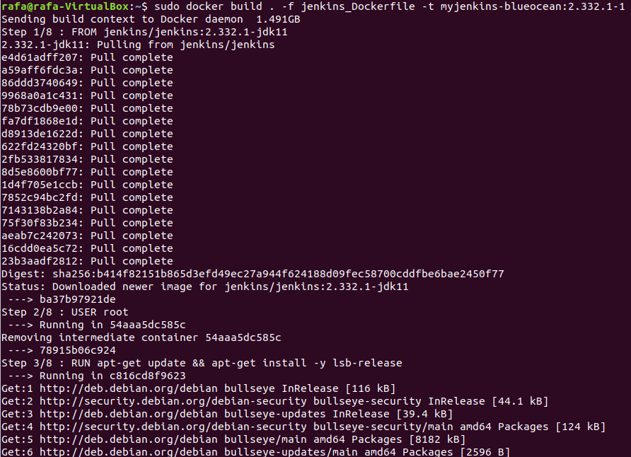

20. Uruchomienie obrazu jako kontener w Dockerze:

21. Odblokowywanie Jenkinsa:

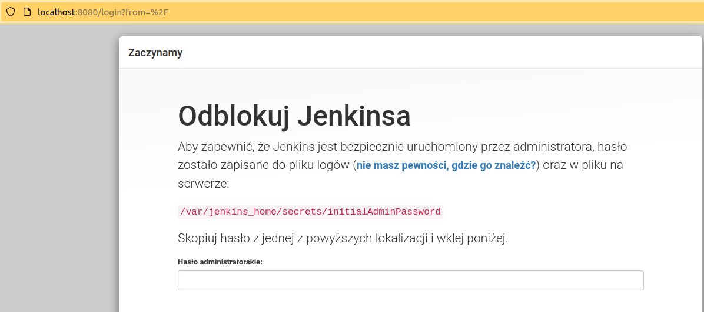

22. Odczytanie hasła potrzebnego do odblokowania Jenkinsa:

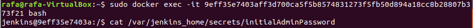

23. Po zainstalowaniu dodatkowych wtyczek utworzenie pierwszego administratora: 

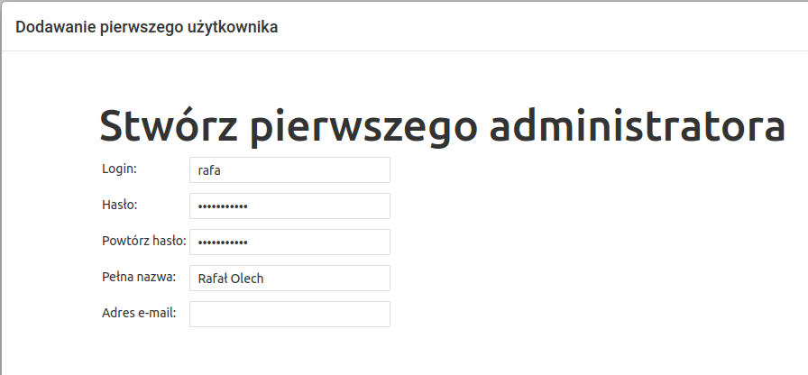

24. Potwierdzenie zakończenie konfiguracji Jenkinsa:

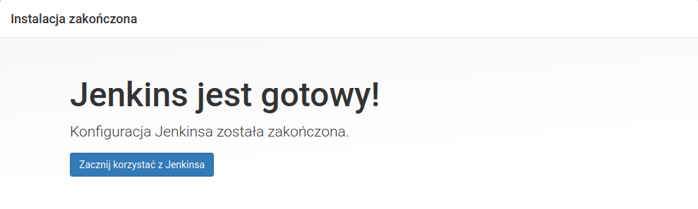

25. Panel startowy dla zalogowanego użytkownika:

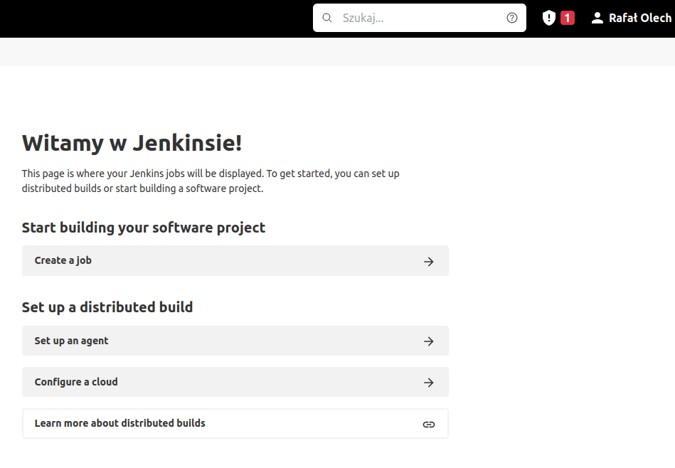

