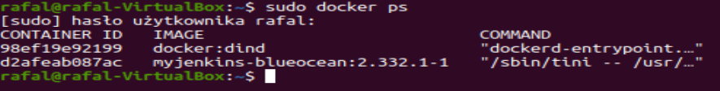
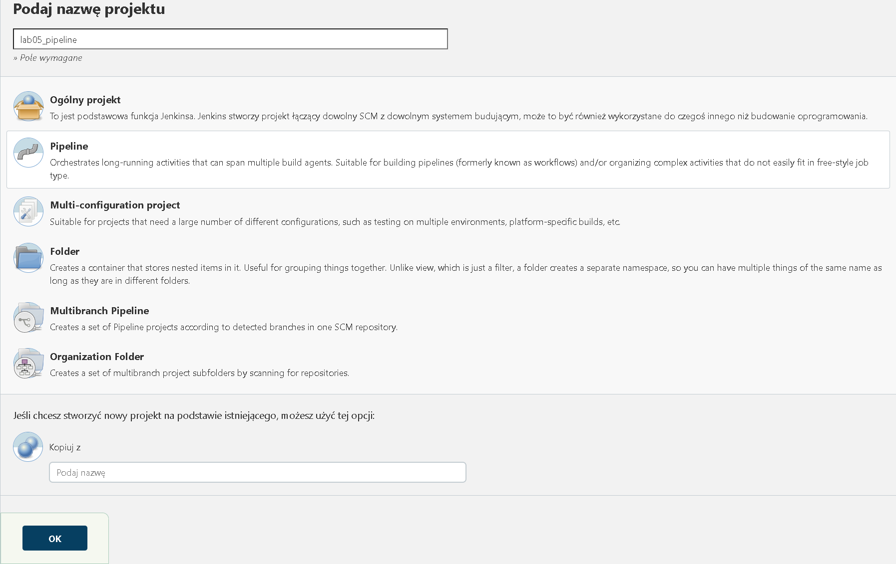
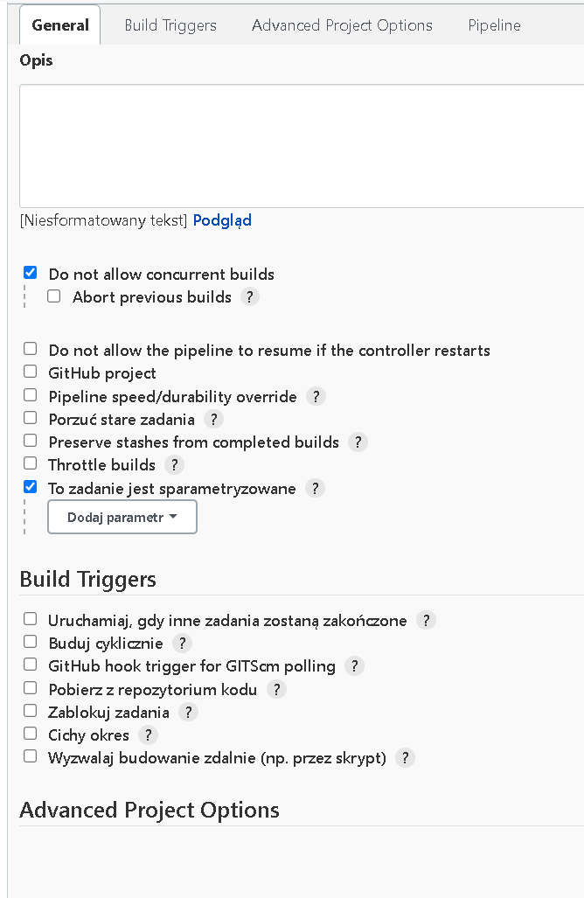
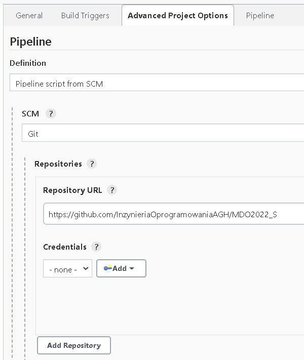
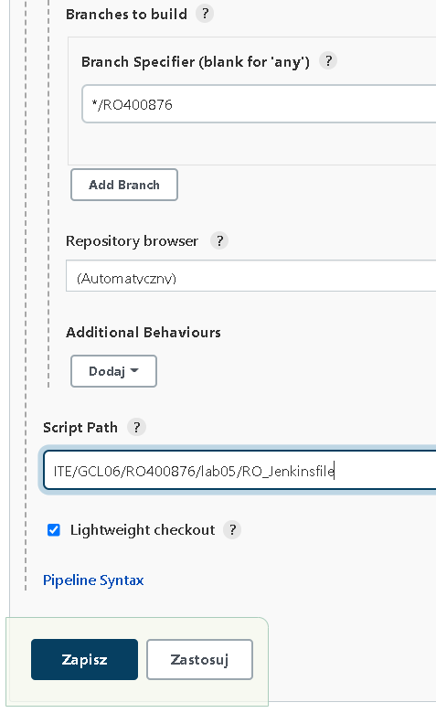

# Rafał Olech - Sprawozdanie z laboratorium 5

## Cel i opis projektu:

Celem projektu było utworzenie pipeline'u za pomocą serwera Jenkins. Zadaniem utworzonego pipeline'u było wykonanie wszystkiech czynności przeprowadzonych na wcześniejszych laboratoriach ale w sposób zautomatyzowany. Pipeline ma na celu zbudownie, testowanie, wdrożenie oraz opublikowanie wybranego projektu. Jako projekt wzięty został program z open sourcowego repozytorium, który znajduję się pod następującym linkiem: https://github.com/RafalOlech00/cytoscape.js.  

## Wykonanie ćwiczenia:

### 1. Przygotowanie kontenerów.

Przed rozpoczęciem pracy z Jenkinsem należy przygotować kontenery, potrzebne do wykonania projektu. Potrzebne są dwa kontenery: kontener z Jenkinsem, który został utworzony pod nazwą jenkins-blueocean oraz kontener z obrazem DIND o nazwie jenkins_Dockerfile.
Szczegółowa instrukcja jak uruchomić wyżej wspomniane dockerowe kontenery znajduję na moim githubie w sprawozdaniu do lab04 znajdującym się pod linkiem: https://github.com/InzynieriaOprogramowaniaAGH/MDO2022_S/blob/RO400876/ITE/GCL06/RO400876/lab04/sprawozdanie.md

Aby sprawdzić czy uruchomienie kontenerów przebiegło pomyślnie należy skorzystać z komendy `sudo docker ps`, za pomocą której można zobaczyć aktualnie działające kontenery. 

### 2. Utworzenie projektu w Jenkinsie.

Jeżeli posiadamy działające kontenery, kolejnym krokiem jest zalogowanie się w Jenkinsie i utworzenie nowego projektu. Jako typ projektu należy wybrać pipeline, nadać nazwę projektu, a następnie zatwierdzić.

Po utworzeniu projektu należy skonfigurować pipeline w sposób pokazany poniżej.

Zostało dodane repozytorium wraz z branchem, z którego będą uruchamiane dockerfile.

Po ukończeniu konfiguracji pipline ukaże się poniższy ekran startowy utworzonego projektu.

