# Rafał Olech - Sprawozdanie z laboratorium 11

## Cel i opis projektu:

Celem ćwiczeń było zapoznanie się z platformą Kubernetes, za pomocą której został wdrożony projekt w kontenerze. 


## Wykonanie ćwiczenia:

### 1. Instalacja Kubernetesa


Aby zainstalować `minikube` na linuxie należy użyć poniższych poleceń, które znajdują się w dokumentacji minikube https://minikube.sigs.k8s.io/docs/start/

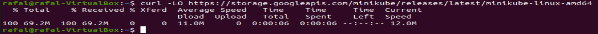


Po instalacji nalaży uruchomić minikube poleceniem `minikube start`. Aby minikube się uruchomił należy pamiętać aby wirtualna maszyna, na której jest uruchamiany miała przydzielone conajmniej 2 rdzenie procesora. Jest to niezbędny wymóg sprzętowy. 

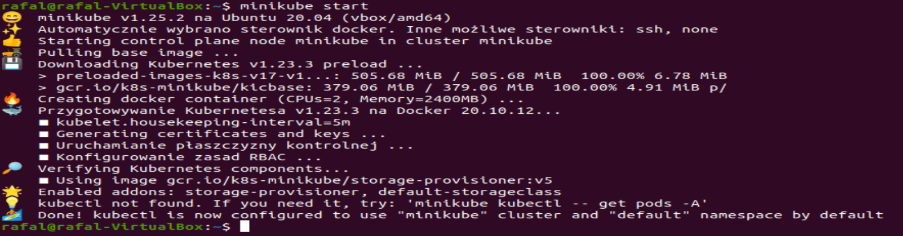


Poleceniem `alias kubectl="minikube kubectl --"` zostaje dodane polecenie kubectl do konfiguracji powłoki:
 
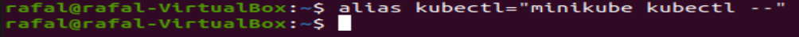


Jeżeli minikube został poprawnie zainstalowany i uruchomiony można za pomocą polecenia `minikube dashboard` uruchomić `dashboard`:

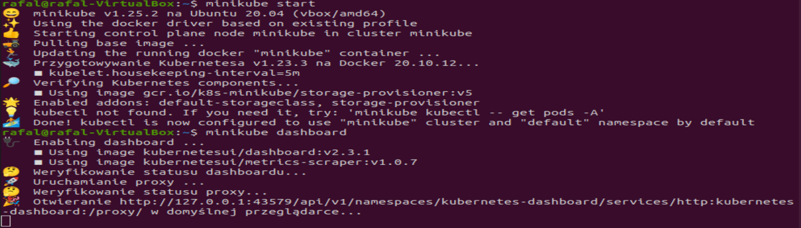


Po uruchomieniu `dashboarda` w terminalu samoczynnie zostaje otworzone okno `Kubernetes Dashboard` w przeglądarce. Narazie nasz Kuberneres jest pusty:


### 2. Uruchomienie aplikacji w kontenerze.


Utworzenie i uruchomienie kontenera o nazwie `mynginx1` z obrazem `nginx`. Ponieważ wybrana przeze mnie aplikacja używana do jenkinsa pracowała w kontenerze ale nie wyprowadzała portów, zastąpiłem ją aplikacją `nginx`:

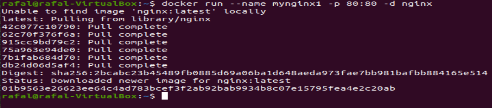


Aby wykazać, że wybrana aplikacja pracuje jako kontener, za pomocą `docker ps` wyświetlam aktualnie działające kontenery:

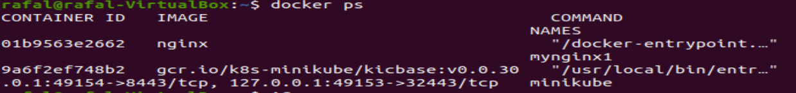


Aby przetestować czy kontener z aplikacją działa poprawnie w przeglądarce uruchamiam `localhost`. Wyświetlony został interface początkowy do nginxa:

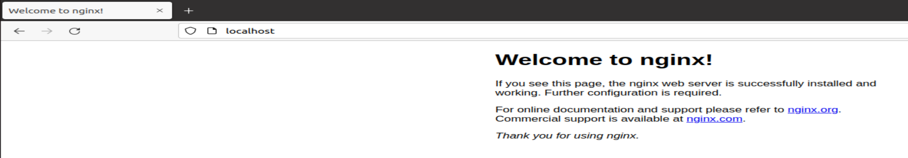


### 3. Wyprowadzenie portu


Kontener uruchomiony w minikubie zostanie automatycznie ubrany w pod poleceniem `minikube kubectl run -- mynginx1 --image=nginx --port=80 --labels app=mynginx1`:

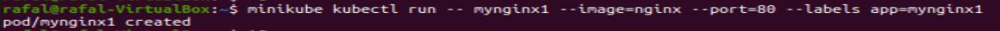


Aby wykazać, że `pod` działa wyświetlam je w terminalu poleceniem `kubectl get pods`:

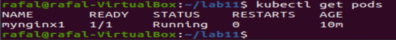


Działające pody można sprawdzić także wyświetlając je w Dashboard:

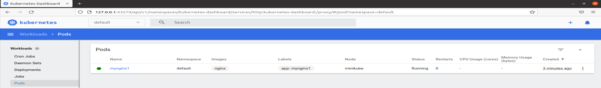


Za pomocą polecenia `kubectl port-forward mynginx1 2222:80` został wyprowadzony port:

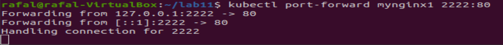


Następnie przetestowano działanie aplikacji wpisując w przeglądarce `localhost:2222`:


### 4. Utworzenie pliku wdrożenia:


Utworzenie pliku `deploy.yaml`, który jest plikiem wdrożenia:

Zawartość pliku `deploy.yaml`:

```
apiVersion: apps/v1
kind: Deployment
metadata:
  name: nginx-deploy
  labels:
    app: mynginx1
spec:
  replicas: 3
  selector:
    matchLabels:
      app: mynginx1
  template:
    metadata:
      labels:
        app: mynginx1
    spec:
      containers:
      - name: mynginx1
        image: nginx
        imagePullPolicy: Never
        ports:
        - containerPort: 2222
```


Uruchomienie pliku wdrożenia poleceniem `kubectl apply -f deploy.yaml`:

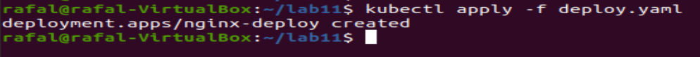


Aby sprawdzić poprawność działania powyższego polecenia korzystam z polecenia `kubectl get pods -o wide` a także wyświetlam zawartość dashboarda:

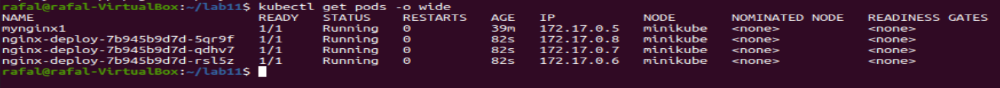

