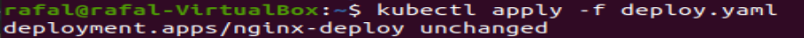
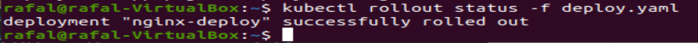

# Rafał Olech - Sprawozdanie z laboratorium 12

## Cel i opis projektu:

Celem ćwiczeń była dalsza praca z kubernetesem. 


## Wykonanie ćwiczenia:

### 1. Konwersja wdrożenia ręcznego na wdrożenie deklaratywne YAML.

* Zmiana liczby replik na 4.

Zawartość pliku `deploy.yaml`:

```
apiVersion: apps/v1
kind: Deployment
metadata:
  name: nginx-deploy
  labels:
    app: mynginx1
spec:
  replicas: 4
  selector:
    matchLabels:
      app: mynginx1
  template:
    metadata:
      labels:
        app: mynginx1
    spec:
      containers:
      - name: mynginx1
        image: nginx
        imagePullPolicy: Never
        ports:
        - containerPort: 2222
```

* Wdrożenie za pomocą polecenia `kubectl apply -f deploy.yaml`:




* Zbadanie stanu kubectl poleceniem `kubectl rollout status -f deploy.yaml`:



