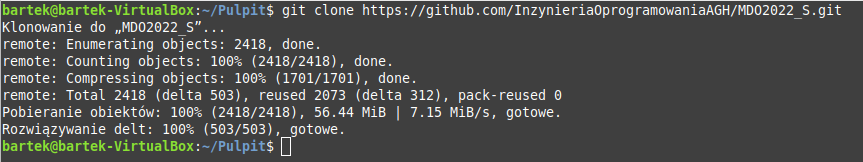
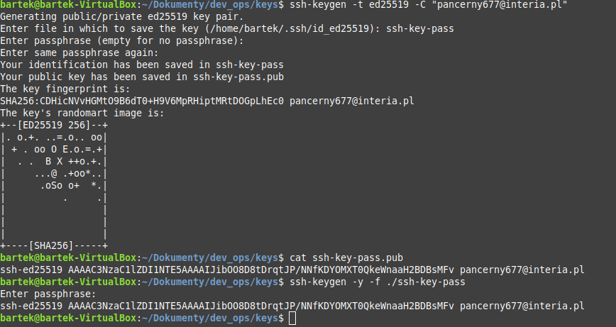
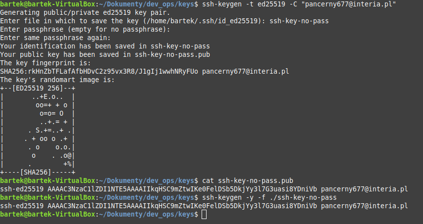
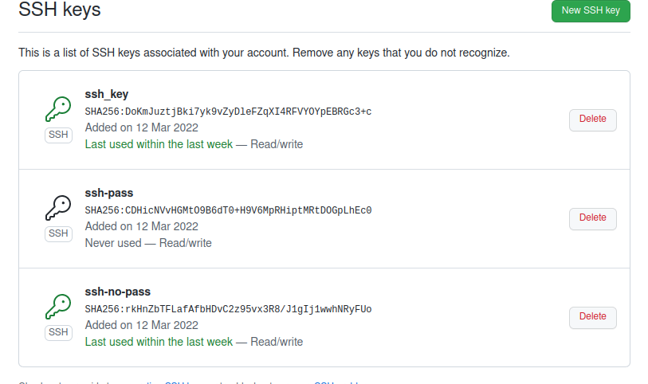
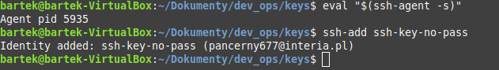
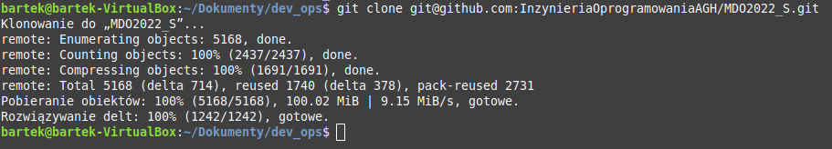
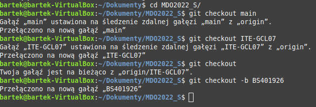
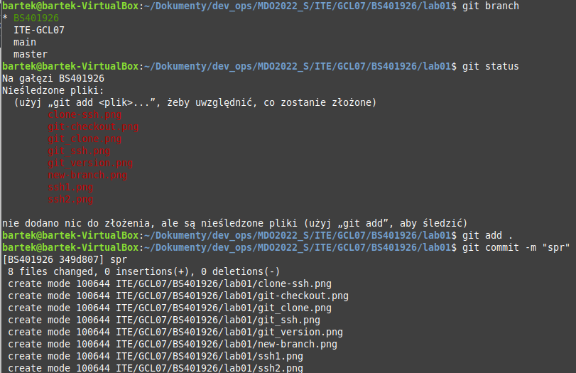
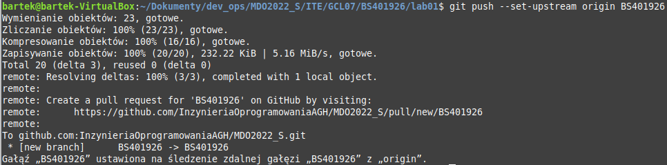

# Devops - Laboratorium nr 1

Wykonanie laboratorium:
- sprawdzenie wersji gita zainstalowanego poleceniem sudo apt install git oraz obsługi ssh

- sklonowanie repozytorium za pomocą HTTPS

- utworzenie dwóch kluczy SSH
* z hasłem

* bez hasła

- klucze na githubie

- polecenie eval do używania ssh

- sklonowanie repozytorium za pomocą SSH

- przełączenie się na maina, na gałąź swojej grupy i utworzenie własnej (-b od razu się na nią przełączyłem)

- utworzenie nowych folderów oraz utworzenie commita i wysłanie zmian

Sprawozdanie zaktualizowałemi i wystawiłem pull requesta

