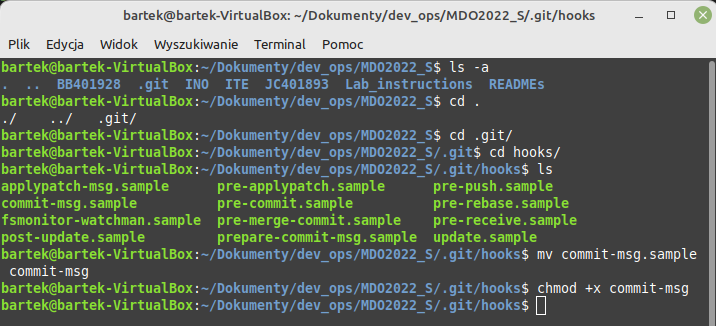
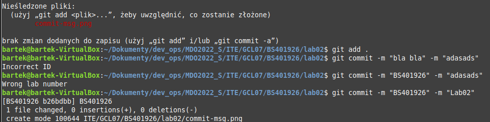
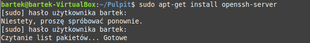
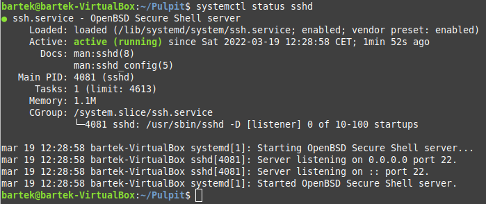
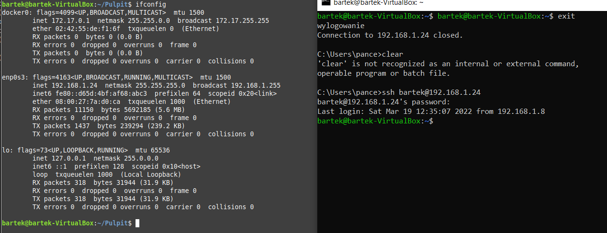
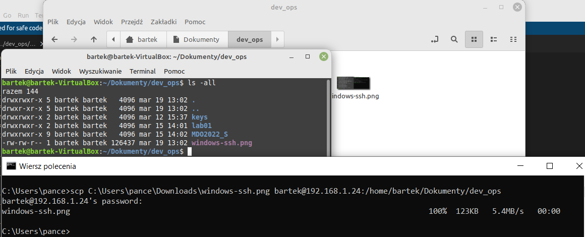
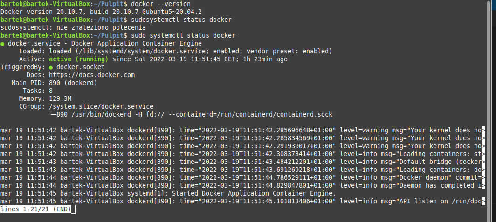
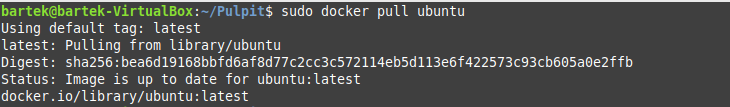
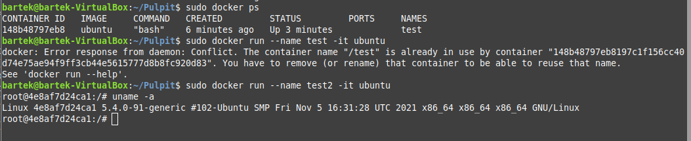
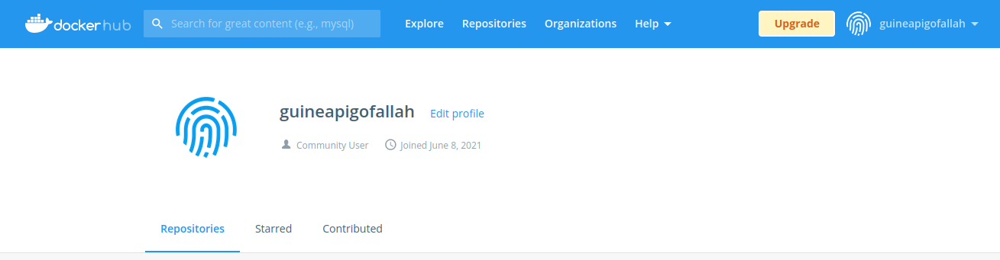

# Devops - Laboratorium nr 2

## Wykonanie laboratorium:

**1. Git-hook**

a) odnalezienie folderu z hookami, modyfikacja commit-msg.sample, nadanie mu odpowiednich uprawnień i usunięcie jego rozszerzenia



b) sprawdzenie poprawności działania



**Kod Hooka napisanego w pythonie**
```
#!/usr/bin/python3.9
import sys

filePath = sys.argv[1]
fName = open(filePath, 'r')
message = fName.read()
title = message.split('\n')[0]
content = message.split('\n')[2]

if title != 'BS401926':
	print('Incorrect ID')
	exit(1)
if not(content.find("2") != -1):
	print("Wrong lab number")
	exit(1)
else:
	exit(0)
```

**2. Środowisko dockerowe**

a) instalacje ssh



b) zapewnienie dostępu do maszyny wirtualnej przez zdalny terminal



c) połączenie się z Windowsa przez ssh z maszyną wirtualną



d) przesłanie pliku z Windowsa na Minta



**3. Docker**

a) wersja dockera i uruchomienie usługi



b) spullowanie obrazu ubuntu 



c) uruchomienie kontenera stworzonego poleceniem start oraz wyświetlenie wersji obrazu



d) zalogowanie się na konto na Docker Hubie




