# Devops - Laboratorium nr 3

## Wykonanie laboratorium:

**1. Repozytorium** 

a) link do repozytorium: https://github.com/nexe/nexe.git

b) pobranie obrazu

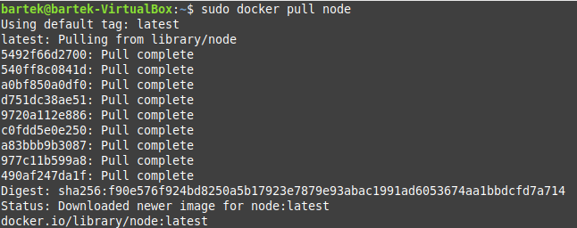

c) uruchomienie kontenera i podłączenie TTY

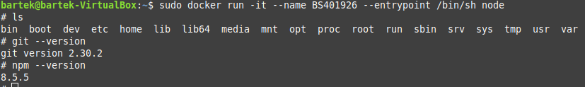

d) sklonowanie repozytorium

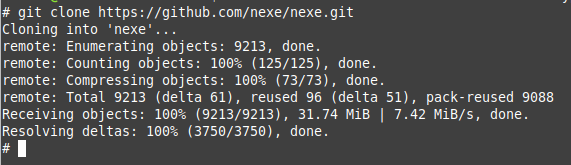

e) uruchomienie buildu

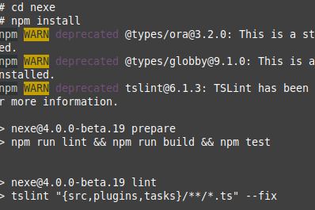

f) uruchomienie testów

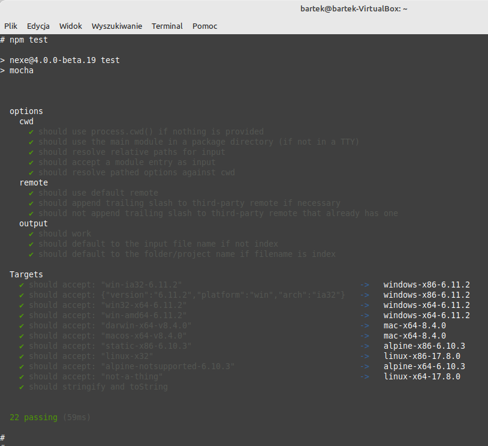

**2. Dockerfile** 

a) dockerfile przeprowadzający wszystkie kroki do builda

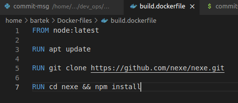

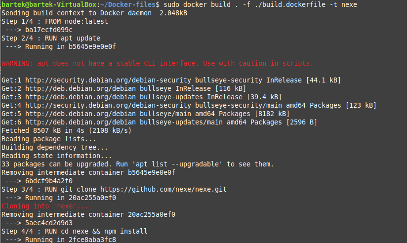

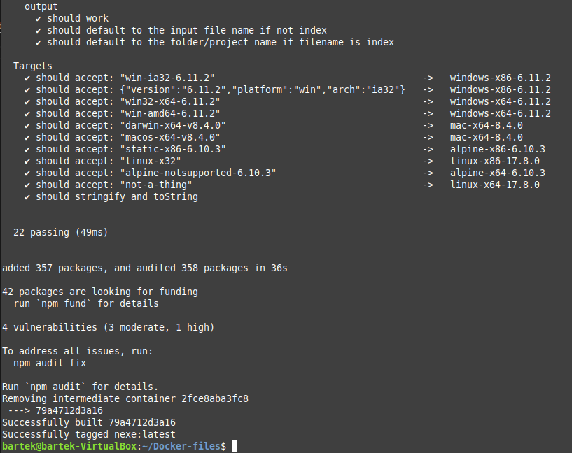

b) dockerfile bazujący na pierwszym i wykonujący testy

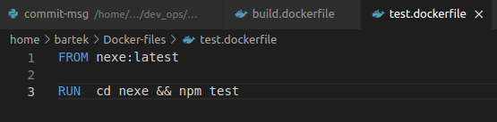

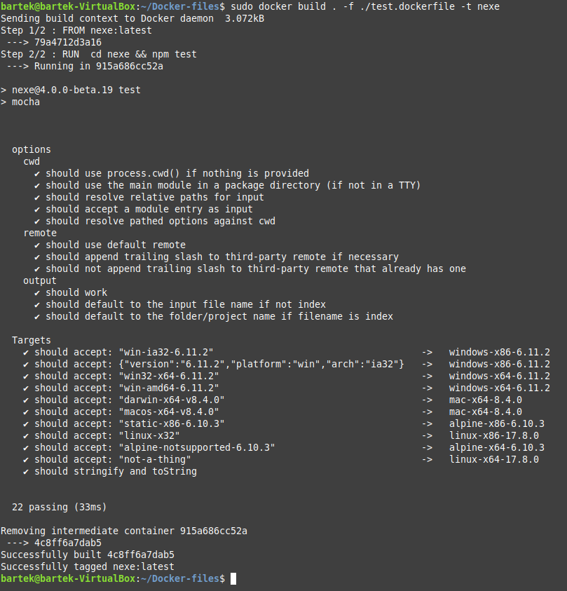

c) docker images

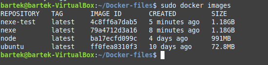

**3. Wykazanie poprawności**

a) stworzenie kontenera na bazie stworzonych obrazów

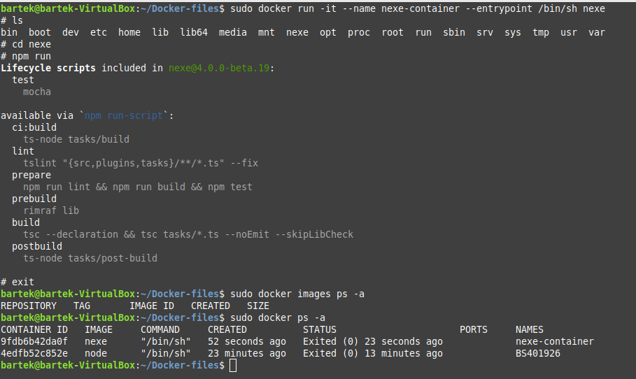

**4. Pytania**

a) obraz dockera to szablon/wzorzec używany do zbudowania kontenera. Obrazy są przechowywane lokalnie lub w zdalnym repozytorium. Jeden obraz może być użyty do utworzenia wielu kontenerów. Kontener zaś jest to utworzone odseparowane środowisko dla danej aplikacji, zbudowane na podstawie obrazu. Można go porównać to instancji obrazu.

b) w kontenerze pracuje odizolowany od systemu obraz

