# Devops - Laboratorium nr 4

## Wykonanie laboratorium:

**1. Zachowanie stanu** 

a) przygotowanie dwóch woluminów

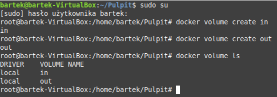

b) uruchomienie kontenera

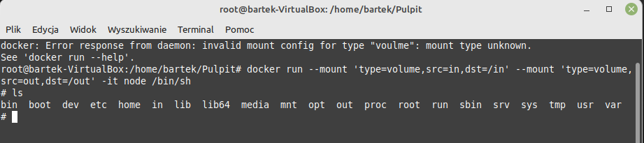

c) szczegóły wolumina

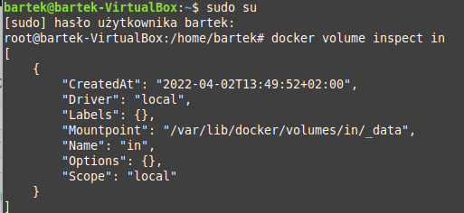

d) klonowanie repozytorium na wolumin wejściowy

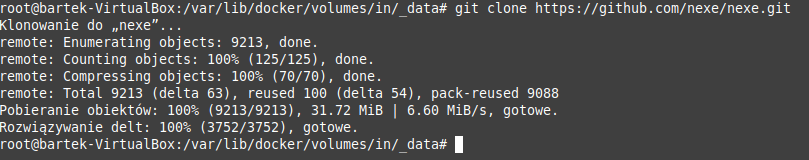

e) pokazanie repozytorium w kontenerze

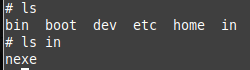

f) uruchomienie buildu w kontenerze

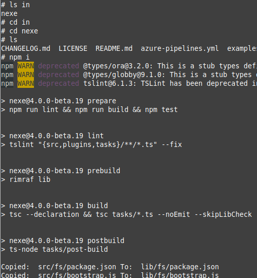

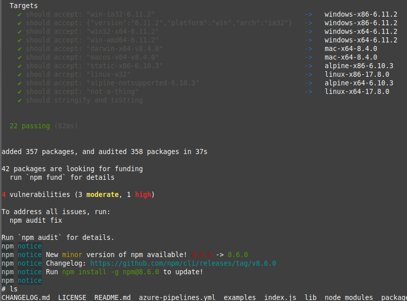

g) kopiowanie z woluminu wejściowego do wyjściowego

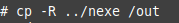

h) sprawdzenie instnienia programu

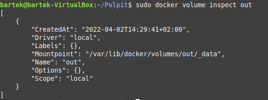

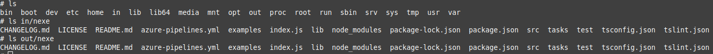

**2. Eksponowanie portu** 

* **Przed wykonaniem ćwiczenia należało poleceniem każdorazowo zainstalować iperf3 poleceniem apt install iperf3 oraz net-tools poleceniem apt install net-tools w celu sprawdzenia adresu kontenerów**

a) sprawdzenie adresów ip

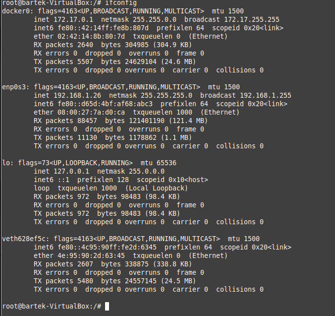

b) połączenie kontener-kontener

c) połączenie host-kontener

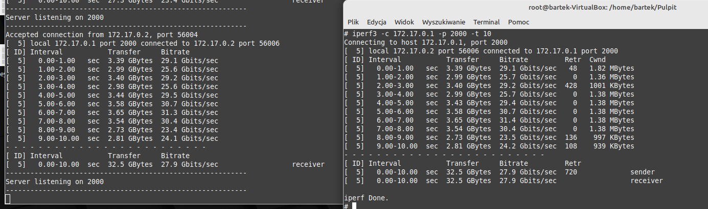

d) pobranie iperf3 i połączenie host-windows 

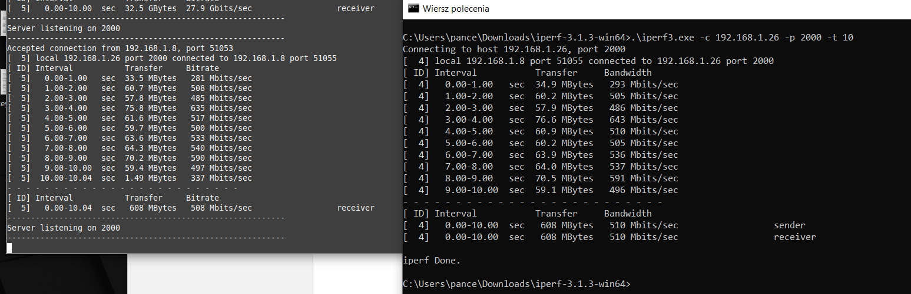

e) zestawienie przepustowości

|                  | kontener - kontener    | host - kontener     | maszyna spoza hosta - kontener   |
| :--------------: | :--------------------: | :-----------------: | :------------------------------: |
| Interval \[sec\] | Birate \[Gbit/sec\]    | Birate \[Gbit/sec\] | Birate \[Mbit/sec\]              |
| 0.00-1.00        | 29.1                   | 42.5                | 281                              |
| 1.00-2.00        | 25.6                   | 42.3                | 508                              |
| 2.00-3.00        | 29.2                   | 41.1                | 485                              |
| 3.00-4.00        | 25.6                   | 40.2                | 635                              |
| 4.00-5.00        | 29.5                   | 42.3                | 517                              |
| 5.00-6.00        | 30.7                   | 42.1                | 500                              |
| 6.00-7.00        | 31.3                   | 33.3                | 533                              |
| 7.00-8.00        | 30.4                   | 41.2                | 540                              |
| 8.00-9.00        | 23.4                   | 39.7                | 590                              |
| 9.00-10.00       | 24.1                   | 42.9                | 497                              |
| <strong>Średni bitrate</strong> | <strong>27.89</strong>                   | <strong>40.76</strong>                | <strong>508.6 </strong>                     |

* Możemy zaobserwować, że najszybszym połączeniem jest połączenie hosta z kontenerem, co wynika z bezpośredniego połączenia między nimi. Kolejnym połączeniem jest kontener - kontener. Ostatnie połączenie jest najwolniejsze, co jest spowodowane długą trasą pakietu.

**3. Instalacja Jenkinsa**

a) tworzenie sieci mostkowanej, dwóch woluminów i konteneru dla obrazu docker:dind

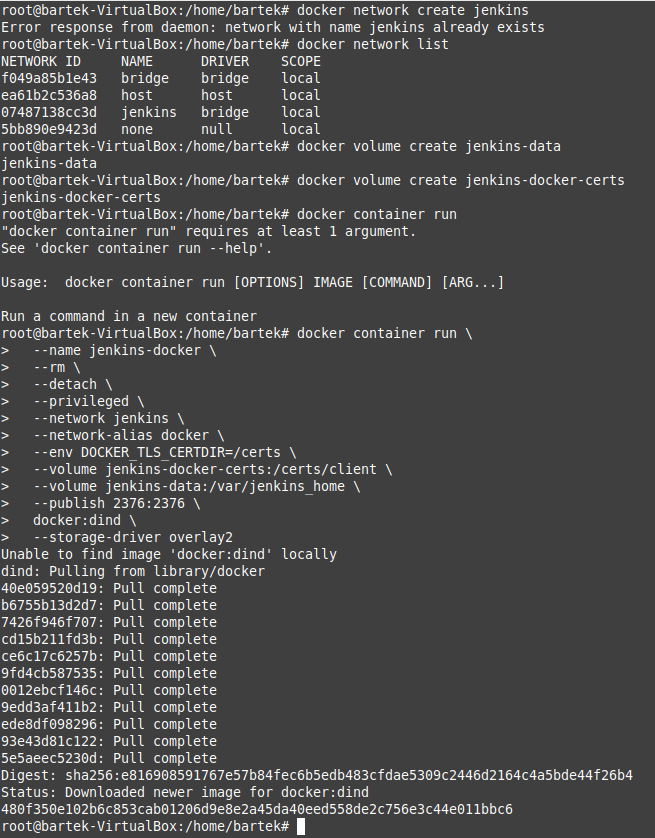

b) kontener dla blueocean

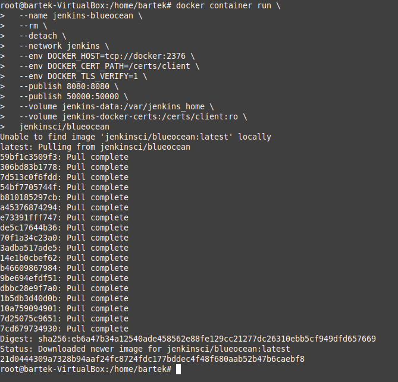

c) ps kontenerów

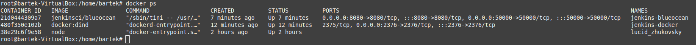

d) sprawdzenie hasła do jenkinsa

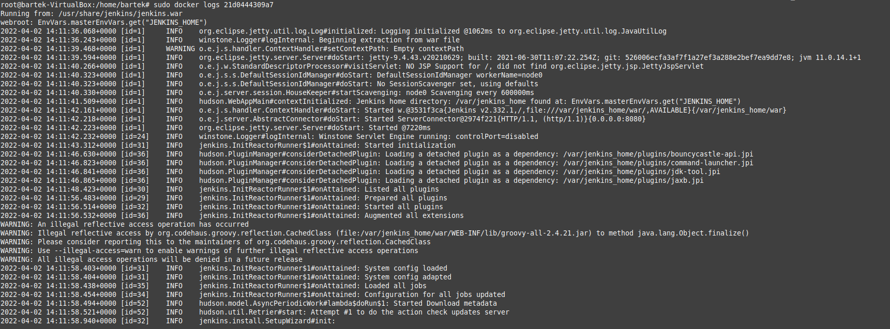

e) logowanie

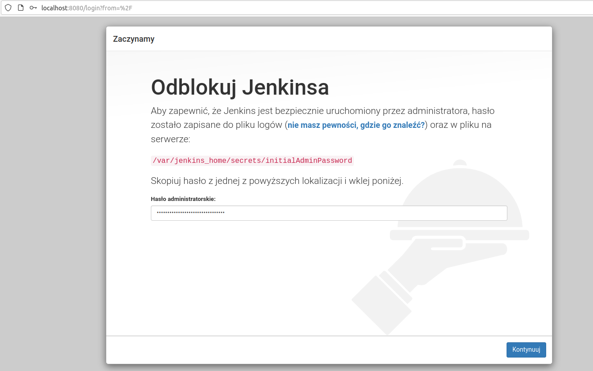

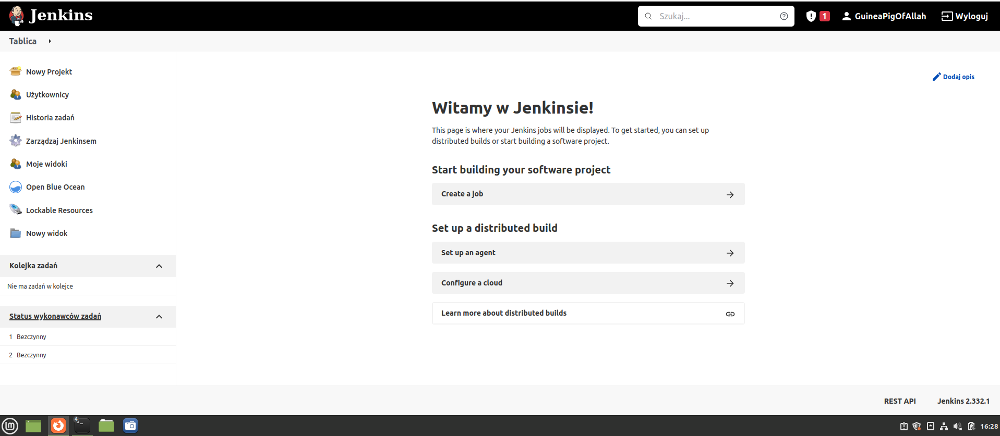

 

