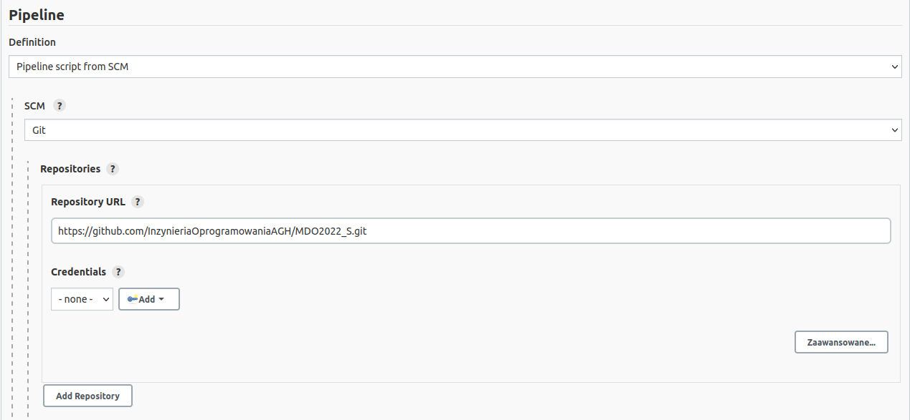
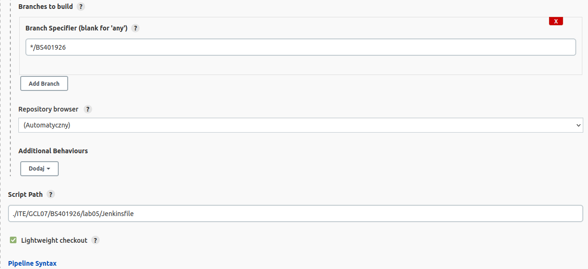
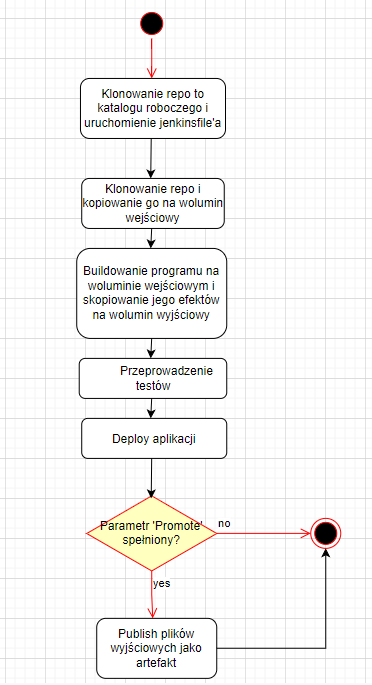
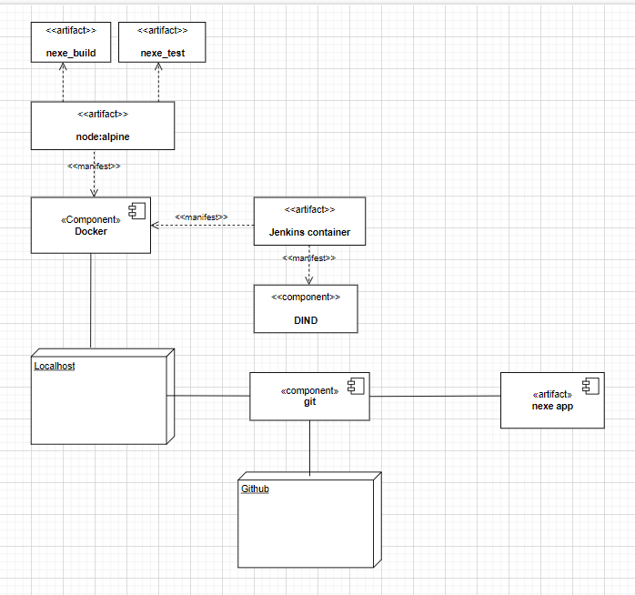

| Imię i nazwisko | Grupa dziekańska | Data wykonania | Grupa zajęciowa |
| ----------- | ----------- | ----------- | ----------- |
| Bartłomiej Strzelczyk | 07 | 15.05.2022r | 09 |

# Pipeline - projekt


## Wstęp

Celem projektu było przygotowanie pipeline'a, którego zadaniem było przeprowadzanie buildu, testów, deploya i publisha programu z poprzednich laboratoriów.

## Technologia

W projekcie wykorzystałem program nexe - framework node.js.

## Link do repozytorium

https://github.com/nexe/nexe.git

## Przygotowanie pipeline'a

W celu utworzenia pipeline'a należy podać link do repozytorium oraz dodać nazwę brancha i ścieżkę do Jenkinsfile'a





## Budowa pipeline'a

- **```Stage Clone```**

W etapie Clone na wolumin wejściowy in_vol klonowane jest z githuba repozytorium aplikacji nexe. Tworzony jest wolumin wejściowy oraz kontener przejściowy. Sprawdzane jest istnienie owego kontenera - zwraca true, gdy nie istnieje. Następnie na wolumin wejściowy klonowane jest repozytorium, kopiowane do folderu z danymi voluminu komenda cp i usuwanie tymczasowego kontenera.

- **```Stage Build```**

W etapie Build tworzony jest wolumin wyjściowy out_vol, uruchamiany kontener z obrazem na podstawie dockerfile'a docker-build. Korzystam tutaj z obrazu node:alpine, ponieważ potrzebuje mniej pamięci i oferuje lepszą wydajność. Za pomocą komendy npm i budowany jest program na woluminie wejściowym i kopiuję na wolumin wyjściowy.

- **```Stage Test```**

W etapie Test uruchamiane są wbudowane w repozytorium testy aplikacji. Uruchamiany jest kontener wykorzystujący obraz na podstawie docker-test. Podpinany jest wolumin wejściowy i wykonywane jest polecenie npm test.

- **```Stage Deploy```**

W etapie Deploy uruchamiana jest aplikacja w celu sprawdzenia jej działania przed publikacją. Uruchamiany jest tymczasowy kontener, podpinany wolumin wyjściowy i za pomocą polecenia run uruchamiana jest aplikacja. Następnie sprawdzany jest exit code i usuwany kontener.

- **```Stage Publish```**

W etapie Publish jest tworzony jest katalog artifacts w kontenerze i publikowany program. W tym celu podpinany jest nowy agent a podstawie obrazu node:alpine z uprawnieniami root'a oraz usuwane są wszystkie pliki z katalogu artifacts. Następnie ustawiana jest wersja programu i używane polecenie npm pack do kompresji aplikacji. Na sam koniec jest archiwizowany artefakt.
Parametry Version i Promote odpowiadają kolejno za nadanie numeru wersji aplikacji i sprawdzenie, czy etap zostanie wykonany.

## Budowa pipeline'a

Działanie pipeline'a

[pipeline](pipeline.png)

# Diagram aktywności



# Diagram wdrożeniowy



## Logi

<a href="./logs.txt">ogs.txt</a>


