# Sprawozdanie z laboratorium 9 
 
## Wykonanie laboratorium 

**1. Przygotowanie systemu pod uruchomienie**
a) Wybranie minimalnej instalacji

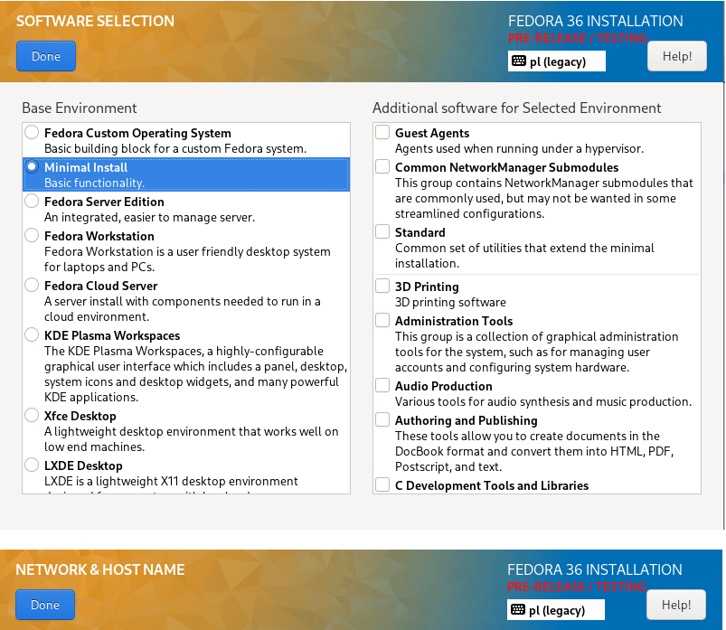

b) stworzenie partycji

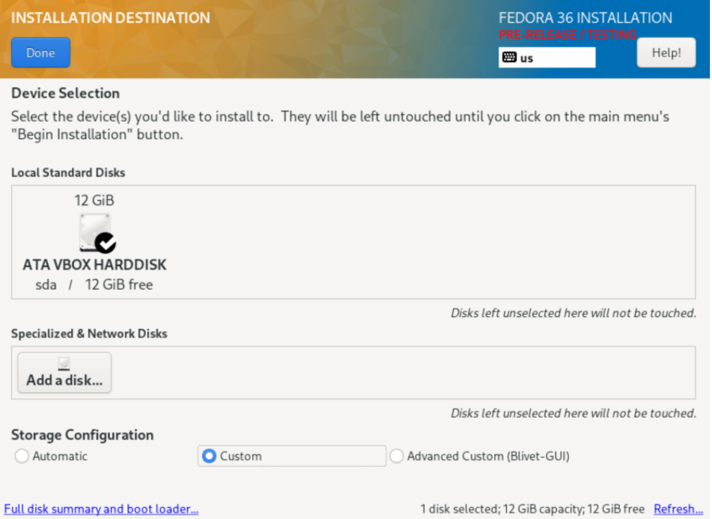
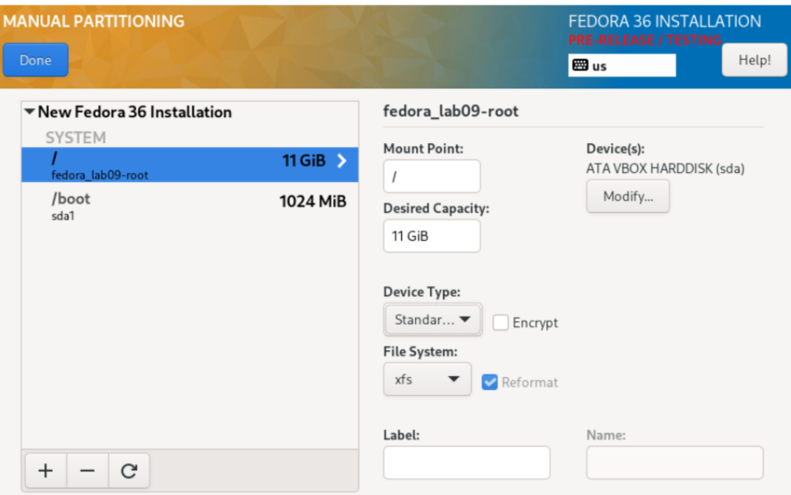

c) uaktywnienie root'a

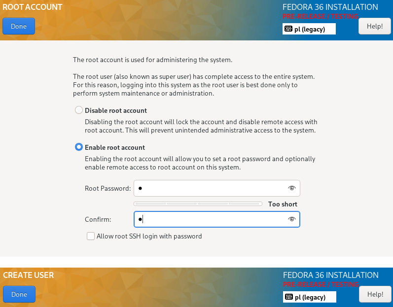

Instalacja została przeprowadzona pomyślnie, w jej wyniku stworzony został plik anaconda-ks.cfg, zawierający informację dla instalatora automatycznego

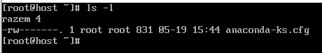

Druga maszyna jest serwerem plików dla nexe

**2. Instalacja serwera i wget'a**

a) instalacja httpd

b) zainstalowano httpd

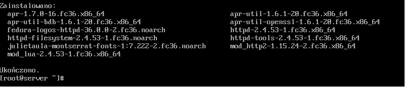

c) dodano wyjątki do zapory

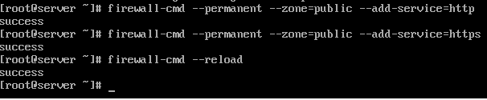

d) uruchomiono httpd

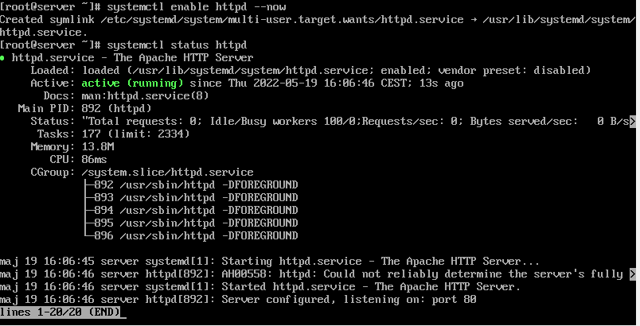

e) z pomocą  winSCP utworzono folder z artefaktem

f) na hoście zainstalowano wget

g) pobrano nexe na hosta

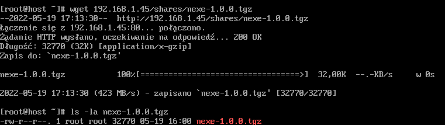

**3. Instalacja nienadzorowana**

Należało edytować plik anaconda-ks.cfg i wysłać go na githuba; poniżej zamieszczam zmiany w kodzie

a) zmiana typu instalacji i dodanie informacji o repo

b) dodanie zależności do pobrania

c) sekcja post do pobrania nexe

Stworzenie nowej maszyny

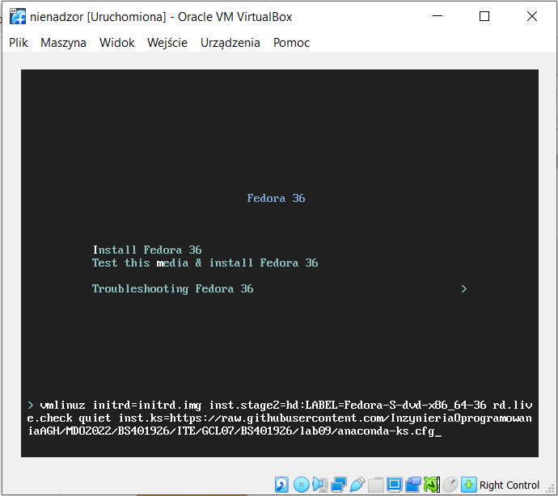

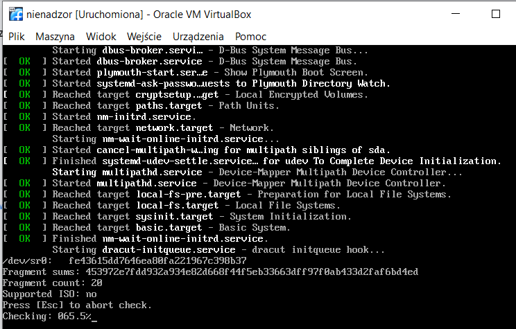

