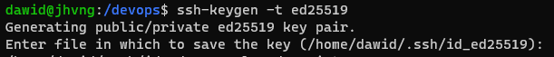
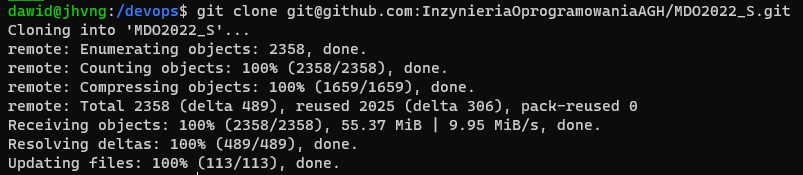
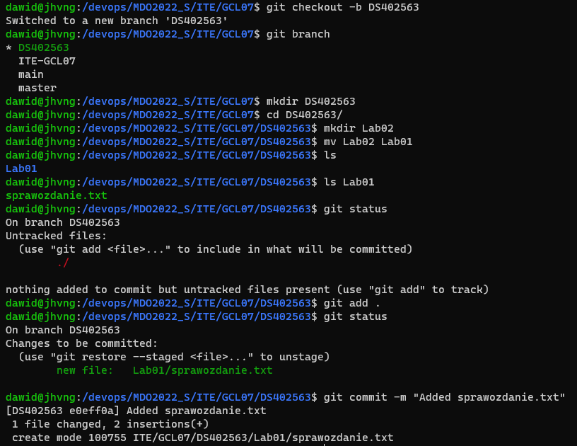
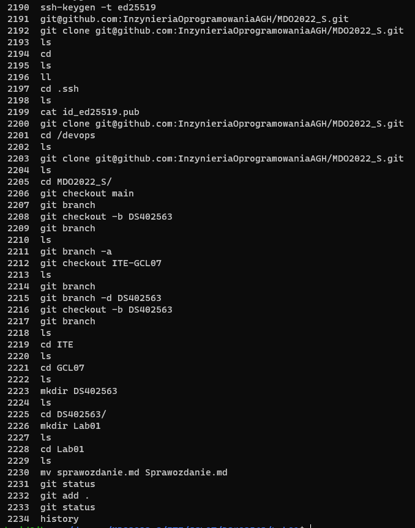

# Sprawodzanie Lab01, Dawid Skorupa

Komendy, które zostały wykorzystane podczas interkacji z repozytorium:
1. git  
 sprawdzenie czy klient został zainstalowany prawidłowo
2. git clone  
 sklonowanie repozytorium  
3. git checkout -b  
 utworzenie brancha i przełączenie się na niego  
4. git status  
 sprawdzenie stanu repozytorium  
5. git add  
 dodanie zmian do staging area  
6. git commit -m  
 scommitowanie zmian wraz z dodaniem commit message -m  
7. git branch  
 wypisanie istniejących branchy

Kroki przestawione w postaci zrzutów ekranu:

* Wygenerowanie kluczy SSH (typ: ed25519) i umieszczenie ich w GitHub'ie.

  

* Sklonowanie zdalnego repozytorium

  

* Utworzenie odpowiedniej gałęzi, a następnie wprowadzanie do niej zmian

  

Historia poleceń

  